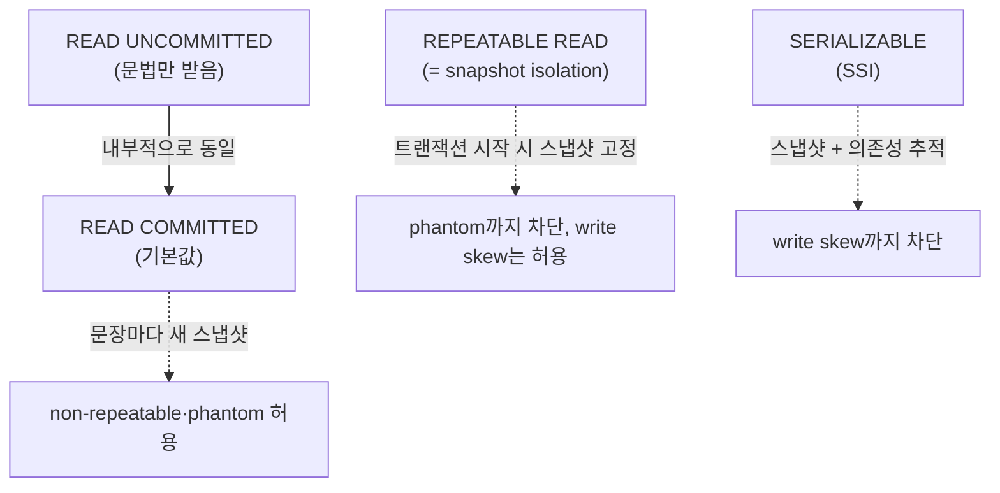

## "테스트는 다 통과했는데 운영에서만 잔고가 마이너스가 됐다"

`SELECT balance` 로 잔고를 읽고, 충분하면 `UPDATE balance = balance - 100` 으로 차감하는 출금 코드. 단위 테스트도, 통합 테스트도 다 초록불이었습니다. 그런데 운영에서 동일 계좌로 결제가 **동시에** 두 건 들어온 어느 순간, 잔고가 음수가 됩니다. 두 요청이 모두 "잔고 100, 충분함"을 읽고 각자 100을 빼버린 겁니다.

이건 버그가 아니라 **격리(isolation)에 대한 오해**입니다. 트랜잭션을 `BEGIN`/`COMMIT` 으로 감쌌다고 해서 동시 실행이 마법처럼 직렬화되는 게 아닙니다. 어떤 격리 수준에서 도느냐에 따라, DB는 동시성을 위해 **특정 이상현상(anomaly)을 의도적으로 허용**합니다. [앞 글의 ACID]()에서 "격리는 동시성 제어가 담당한다"고만 했던 그 "I"를, 이 글에서 끝까지 분해합니다. 이상현상이 정확히 무엇이고, SQL 표준 4단계가 각각 무엇을 막으며, **PostgreSQL은 실제로 어떻게 다르게 동작하는지**까지.

## 이상현상 도감 — 무엇이, 언제 새는가

이상현상은 "혼자 돌면 안 생기는데 동시에 돌면 생기는 잘못된 결과"입니다. 두 트랜잭션 T1, T2의 명령이 시간순으로 엇갈릴 때 발생하죠. 다섯 가지를 정의와 SQL로 못 박습니다.

### 1) Dirty Read — 커밋도 안 된 값을 읽는다

T2가 **아직 커밋하지 않은** T1의 변경을 읽는 것. T1이 롤백되면 T2는 존재한 적 없는 값을 본 셈입니다.

```sql
-- T1                                  -- T2
BEGIN;
UPDATE accounts SET balance=0
  WHERE id=1;       -- 아직 COMMIT 안 함
                                        BEGIN;
                                        SELECT balance FROM accounts
                                          WHERE id=1;   -- 0을 읽음 (dirty!)
ROLLBACK;           -- 사실 0이 아니었다
```

### 2) Non-repeatable Read — 같은 행을 두 번 읽었는데 값이 다르다

한 트랜잭션 안에서 **같은 행**을 두 번 읽었는데, 그 사이 다른 트랜잭션이 그 행을 커밋해 값이 바뀐 것. "읽기의 반복 가능성"이 깨집니다.

```sql
-- T1                                  -- T2
BEGIN;
SELECT balance FROM accounts WHERE id=1;  -- 100
                                        BEGIN;
                                        UPDATE accounts SET balance=200
                                          WHERE id=1;
                                        COMMIT;
SELECT balance FROM accounts WHERE id=1;  -- 200 (같은 행인데 달라짐!)
COMMIT;
```

### 3) Phantom Read — 같은 조건으로 다시 세었더니 행 수가 다르다

같은 **검색 조건**(`WHERE`)으로 두 번 조회했는데, 그 사이 다른 트랜잭션이 **새 행을 삽입/삭제**해 결과 집합의 멤버가 달라진 것. non-repeatable이 "기존 행의 값"이라면 phantom은 "행의 출현/소멸"입니다.

```sql
-- T1                                  -- T2
BEGIN;
SELECT count(*) FROM orders
  WHERE amount > 1000;            -- 3건
                                        BEGIN;
                                        INSERT INTO orders(amount) VALUES(5000);
                                        COMMIT;
SELECT count(*) FROM orders
  WHERE amount > 1000;            -- 4건 (유령 행이 나타남!)
COMMIT;
```

### 4) Lost Update — 내 갱신이 통째로 덮여 사라진다

두 트랜잭션이 같은 행을 **읽고-수정-쓰기**(read-modify-write) 할 때, 나중에 쓴 쪽이 먼저 쓴 쪽의 변경을 덮어써 한쪽 갱신이 증발하는 것. 도입부의 잔고 차감이 바로 이 케이스입니다.

```sql
-- T1                                  -- T2
BEGIN;                                  BEGIN;
SELECT balance FROM accounts
  WHERE id=1;                     -- 100
                                        SELECT balance FROM accounts
                                          WHERE id=1;   -- 100 (둘 다 100을 봄)
UPDATE accounts SET balance=100-100
  WHERE id=1;                     -- 0
COMMIT;
                                        UPDATE accounts SET balance=100-100
                                          WHERE id=1;   -- 0 (T1의 차감을 덮음)
                                        COMMIT;
-- 두 번 출금했는데 잔고는 0. 한 번의 차감이 사라졌다.
```

### 5) Write Skew — 각자 본 조건은 맞았는데, 합쳐 놓으니 위반이다

가장 교묘합니다. 두 트랜잭션이 **서로 다른 행**을 쓰지만, 둘 다 같은 **불변식(invariant)**을 읽고 판단합니다. 각자는 정당하지만 동시에 커밋되면 불변식이 깨집니다. 고전 예: "당직 의사는 항상 1명 이상이어야 한다."

```sql
-- 불변식: on_call = true 인 의사가 최소 1명
-- 현재 Alice, Bob 둘 다 on_call=true
-- T1 (Alice가 빠지려 함)                 -- T2 (Bob이 빠지려 함)
BEGIN;                                  BEGIN;
SELECT count(*) FROM doctors
  WHERE on_call;                  -- 2명, 나 말고도 있으니 OK
                                        SELECT count(*) FROM doctors
                                          WHERE on_call;   -- 2명, OK
UPDATE doctors SET on_call=false
  WHERE name='Alice';
                                        UPDATE doctors SET on_call=false
                                          WHERE name='Bob';
COMMIT;                                 COMMIT;
-- 결과: on_call 의사 0명. 불변식 붕괴. 둘 다 "다른 행"을 썼다.
```

write skew는 lost update와 다릅니다. lost update는 **같은 행**을 덮는 것이고, write skew는 **다른 행**을 쓰되 공유된 조건을 어기는 것입니다. 그래서 행 단위 락이나 단순 버전 체크로는 못 막습니다.

## SQL 표준 4단계 — 무엇을 막기로 약속하나

SQL 표준(ANSI/ISO)은 격리 수준을 "**무엇을 허용하는가**"로 정의합니다. 강한 격리일수록 더 많은 이상현상을 막지만, 동시성은 떨어집니다.

| 격리 수준 | Dirty Read | Non-repeatable | Phantom |
|---|---|---|---|
| READ UNCOMMITTED | 허용 | 허용 | 허용 |
| READ COMMITTED | 차단 | 허용 | 허용 |
| REPEATABLE READ | 차단 | 차단 | 허용 |
| SERIALIZABLE | 차단 | 차단 | 차단 |

여기서 중요한 함정이 셋 있습니다. **첫째**, 이 표는 "이 이상현상까지만 막으면 표준 준수"라는 **최소 보장선**이지, "딱 이만큼만 막아라"가 아닙니다. 구현체가 더 강하게 막아도 됩니다(뒤에서 PG가 그렇습니다). **둘째**, 표준의 정의는 lost update와 write skew를 명시적으로 다루지 않습니다 — 이 둘은 표준 정의의 사각지대이고, 실제 구현이 어떻게 동작하느냐로 갈립니다. **셋째**, 같은 이름의 격리 수준이라도 DBMS마다 실제 구현이 천차만별입니다. Oracle의 SERIALIZABLE은 사실 snapshot isolation이고, MySQL InnoDB의 REPEATABLE READ는 PG와 또 다릅니다.

## 그래서 PostgreSQL은 실제로 어떻게 도나

PostgreSQL은 표준 4단계를 모두 **문법적으로 받아주지만**, 내부적으로는 [MVCC]() 기반 스냅샷으로 동작하기 때문에 실제 동작이 표준 표보다 **더 강합니다**. 핵심을 먼저 못 박습니다.



### READ UNCOMMITTED = READ COMMITTED

PG에는 dirty read가 **존재하지 않습니다.** MVCC는 커밋되지 않은 튜플 버전을 애초에 다른 트랜잭션에게 보여주지 않기 때문입니다(`xmin` 이 아직 진행 중인 트랜잭션의 튜플은 보이지 않음). 그래서 `READ UNCOMMITTED` 를 지정해도 PG는 조용히 `READ COMMITTED` 처럼 동작합니다. 표준이 허용하는 dirty read를, PG는 구현상 못 만들어냅니다.

### READ COMMITTED (기본값) — 문장마다 새 스냅샷

PG의 기본 격리 수준입니다. 핵심은 **스냅샷의 생명주기**입니다. READ COMMITTED에서는 **각 SQL 문장이 시작될 때마다 새 스냅샷**을 뜹니다. 그래서 한 문장 안에서는 일관되지만, 트랜잭션 안에서 같은 문장을 두 번 실행하면 그 사이 커밋된 변경이 보입니다 → non-repeatable·phantom이 그대로 허용됩니다. lost update도 막지 않습니다(단, 같은 행을 동시에 UPDATE하면 뒤 트랜잭션이 **블록**됐다가, 앞이 커밋되면 갱신된 행 위에서 재평가합니다 — 이걸 `EPQ`, EvalPlanQual이라 부릅니다).

### REPEATABLE READ — snapshot isolation, phantom까지 막는다

PG의 REPEATABLE READ는 표준이 요구하는 것보다 강합니다. **트랜잭션 시작 시점에 스냅샷을 한 번 뜨고 끝까지 고정**합니다(snapshot isolation). 그 시점 이후에 다른 트랜잭션이 커밋한 건 INSERT든 UPDATE든 DELETE든 **하나도 보이지 않습니다.** 그래서 non-repeatable read뿐 아니라 **phantom read까지 차단**됩니다 — 표준 표에서 RR이 phantom을 허용한다고 한 것과 다릅니다.

대신 쓰기가 충돌하면 즉시 실패시킵니다. 내가 읽은(스냅샷 기준) 행을 다른 트랜잭션이 먼저 커밋해 바꿔놨다면, 내 UPDATE는 다음 에러로 abort됩니다.

```text
ERROR: could not serialize access due to concurrent update
```

이 방식으로 lost update는 RR에서 **차단**됩니다(first-committer-wins). 하지만 write skew는 **여전히 통과**합니다 — 두 트랜잭션이 서로 다른 행을 쓰면 쓰기 충돌이 없으니까요.

### SERIALIZABLE — SSI로 write skew까지

write skew마저 막으려면 `SERIALIZABLE` 이 필요합니다. PG의 SERIALIZABLE은 락이 아니라 **SSI(Serializable Snapshot Isolation)** 입니다. snapshot isolation 위에서 트랜잭션 간 **읽기-쓰기 의존성(rw-dependency)** 을 추적하다가, 직렬 실행으로는 설명할 수 없는 위험한 패턴(dangerous structure: 두 개의 연속된 rw-antidependency가 사이클을 이룸)을 감지하면 한쪽을 abort시킵니다.

```text
ERROR: could not serialize access due to read/write dependencies among transactions
HINT:  The transaction might succeed if retried.
```

그래서 SERIALIZABLE을 쓸 땐 **재시도 로직이 필수**입니다. 위 HINT가 말하듯, abort된 트랜잭션은 그냥 다시 돌리면 대개 성공합니다. SSI는 비관적 락보다 동시성이 좋지만(읽기를 막지 않음), 충돌이 잦으면 abort/재시도 비용이 커지므로 핫스팟 테이블에선 주의해야 합니다.

## 이상현상이 새는 그 순간 — 두 트랜잭션 타임라인

말로는 헷갈리니, **non-repeatable read가 READ COMMITTED에서 발생하는 순간**을 단계별로 따라갑니다. 왼쪽 T1은 같은 행을 두 번 읽고, 중간에 T2가 끼어들어 커밋합니다. T1의 두 번째 읽기 값이 첫 번째와 달라지는 순간(빨간 깜빡임)이 이상현상이 "새는" 지점입니다.

<div class="iso-timeline" markdown="0">
<style>
.iso-timeline{margin:1.4rem 0;overflow-x:auto}
.iso-timeline svg{width:100%;max-width:720px;height:auto;display:block;margin:0 auto;font-family:inherit}
.iso-timeline .lbl{fill:currentColor;font-size:12px;font-weight:700}
.iso-timeline .op{fill:currentColor;font-size:10.5px}
.iso-timeline .axis{stroke:currentColor;stroke-width:1.4;opacity:.3}
.iso-timeline .s1{opacity:0;animation:isostep 9s ease-in-out infinite}
.iso-timeline .s2{opacity:0;animation:isostep 9s ease-in-out infinite;animation-delay:1.6s}
.iso-timeline .s3{opacity:0;animation:isostep 9s ease-in-out infinite;animation-delay:3.2s}
.iso-timeline .s4{opacity:0;animation:isostep 9s ease-in-out infinite;animation-delay:4.8s}
.iso-timeline .s5{opacity:0;animation:isostep 9s ease-in-out infinite;animation-delay:6.4s}
.iso-timeline .t1{fill:#1971c2}
.iso-timeline .t2{fill:#f08c00}
.iso-timeline .dot{r:5}
.iso-timeline .anom{fill:#e03131;opacity:0;animation:isoanom 9s ease-in-out infinite;animation-delay:6.4s}
.iso-timeline .anomtx{fill:#e03131;font-size:11px;font-weight:700;opacity:0;animation:isoanom 9s ease-in-out infinite;animation-delay:6.4s}
@keyframes isostep{0%,4%{opacity:0}10%,100%{opacity:1}}
@keyframes isoanom{0%,4%{opacity:0}10%{opacity:1}18%{opacity:.3}26%{opacity:1}34%{opacity:.3}42%,100%{opacity:1}}
</style>
<svg viewBox="0 0 700 280" role="img" aria-label="READ COMMITTED에서 T1이 같은 행을 두 번 읽는 사이 T2가 커밋해 값이 달라지는 non-repeatable read 발생 순간을 단계별로 보여주는 애니메이션">
  <text class="lbl t1" x="20" y="26">T1 (READ COMMITTED)</text>
  <text class="lbl t2" x="430" y="26">T2</text>
  <line class="axis" x1="60" y1="40" x2="60" y2="250"/>
  <line class="axis" x1="470" y1="40" x2="470" y2="250"/>

  <g class="s1">
    <circle class="dot t1" cx="60" cy="64"/>
    <text class="op t1" x="74" y="68">SELECT balance WHERE id=1  →  100</text>
  </g>
  <g class="s2">
    <circle class="dot t2" cx="470" cy="104"/>
    <text class="op t2" x="484" y="108">BEGIN</text>
  </g>
  <g class="s3">
    <circle class="dot t2" cx="470" cy="134"/>
    <text class="op t2" x="484" y="138">UPDATE balance=200 WHERE id=1</text>
  </g>
  <g class="s4">
    <circle class="dot t2" cx="470" cy="164"/>
    <text class="op t2" x="484" y="168">COMMIT  ← 변경이 공개됨</text>
  </g>
  <g class="s5">
    <circle class="dot t1 anom" cx="60" cy="204"/>
    <text class="op t1 anom" x="74" y="208">SELECT balance WHERE id=1  →  </text>
    <text class="anomtx" x="305" y="208">200  (같은 행인데 달라짐!)</text>
  </g>
  <text class="op anomtx" x="60" y="244">↑ 두 번째 SELECT가 새 스냅샷을 떠 T2의 커밋을 본다 = non-repeatable read</text>
</svg>
</div>

이제 **같은 시나리오를 REPEATABLE READ로 바꾸면** 무엇이 달라지는지 봅니다. 차이는 단 하나, **스냅샷을 언제 뜨느냐**입니다. RR은 트랜잭션 시작 시점에 스냅샷을 고정하므로, 그 이후 T2가 무엇을 커밋하든 T1에게는 보이지 않습니다. 아래에서 T1의 두 번째 읽기가 첫 번째와 **같은 값(초록)** 으로 유지되는 것을 보세요.

<div class="iso-snap" markdown="0">
<style>
.iso-snap{margin:1.4rem 0;overflow-x:auto}
.iso-snap svg{width:100%;max-width:720px;height:auto;display:block;margin:0 auto;font-family:inherit}
.iso-snap .lbl{fill:currentColor;font-size:12px;font-weight:700}
.iso-snap .op{fill:currentColor;font-size:10.5px}
.iso-snap .axis{stroke:currentColor;stroke-width:1.4;opacity:.3}
.iso-snap .t1{fill:#1971c2}
.iso-snap .t2{fill:#f08c00}
.iso-snap .ok{fill:#2f9e44}
.iso-snap .dot{r:5}
.iso-snap .snapbox{fill:#2f9e44;opacity:0;animation:isosnapbox 9s ease-in-out infinite;animation-delay:.4s}
.iso-snap .snaptx{fill:#2f9e44;font-size:10px;font-weight:700;opacity:0;animation:isosnapbox 9s ease-in-out infinite;animation-delay:.4s}
.iso-snap .veil{fill:#f08c00;opacity:0;animation:isoveil 9s ease-in-out infinite;animation-delay:4.6s}
.iso-snap .st1{opacity:0;animation:isofade 9s ease-in-out infinite;animation-delay:.4s}
.iso-snap .st2{opacity:0;animation:isofade 9s ease-in-out infinite;animation-delay:2.6s}
.iso-snap .st3{opacity:0;animation:isofade 9s ease-in-out infinite;animation-delay:4.0s}
.iso-snap .st4{opacity:0;animation:isofade 9s ease-in-out infinite;animation-delay:6.2s}
@keyframes isofade{0%,4%{opacity:0}10%,100%{opacity:1}}
@keyframes isosnapbox{0%,2%{opacity:0}8%,100%{opacity:.16}}
@keyframes isoveil{0%,4%{opacity:0}10%,100%{opacity:.5}}
</style>
<svg viewBox="0 0 700 290" role="img" aria-label="REPEATABLE READ에서 T1이 시작 시점 스냅샷을 고정해 T2가 커밋한 변경을 보지 못하고 두 번 모두 같은 값을 읽는 모습을 보여주는 애니메이션">
  <text class="lbl t1" x="20" y="26">T1 (REPEATABLE READ)</text>
  <text class="lbl t2" x="430" y="26">T2</text>
  <line class="axis" x1="60" y1="40" x2="60" y2="262"/>
  <line class="axis" x1="470" y1="40" x2="470" y2="262"/>

  <rect class="snapbox" x="34" y="48" width="360" height="200" rx="6"/>
  <text class="snaptx" x="44" y="62">📷 BEGIN 시점 스냅샷 고정 — 이 안에서는 세상이 멈춰 있다</text>

  <g class="st1">
    <circle class="dot t1" cx="60" cy="92"/>
    <text class="op t1" x="74" y="96">SELECT balance WHERE id=1  →  100</text>
  </g>
  <g class="st2">
    <circle class="dot t2" cx="470" cy="132"/>
    <text class="op t2" x="484" y="136">UPDATE balance=200; COMMIT</text>
  </g>
  <g class="st3">
    <rect class="veil" x="430" y="148" width="250" height="22" rx="4"/>
    <text class="op" x="484" y="164" fill="#fff">T1의 스냅샷 밖 → T1에게 안 보임</text>
  </g>
  <g class="st4">
    <circle class="dot t1 ok" cx="60" cy="216"/>
    <text class="op ok" x="74" y="220">SELECT balance WHERE id=1  →  100  (그대로!)</text>
  </g>
  <text class="op t1" x="60" y="256">↑ 스냅샷을 시작 때 한 번만 떠 고정 → 반복 읽기·phantom 모두 차단</text>
</svg>
</div>

두 애니메이션의 차이는 사실상 한 줄입니다. READ COMMITTED는 **문장마다** 스냅샷을 갱신하고, REPEATABLE READ는 **트랜잭션 시작 때 한 번** 떠서 고정한다는 것. MVCC의 가시성 판정이 어떤 스냅샷을 기준으로 도느냐가 격리 수준의 실체이며, 그 내부 메커니즘(`xmin`/`xmax`, 스냅샷의 `xmin`·`xmax`·`xip_list`)은 [다음 글의 MVCC 내부]()에서 해부합니다.

## 프로덕션에서 — 무엇을 골라 쓰나

이상현상을 안다고 무조건 SERIALIZABLE을 쓰면 안 됩니다. 대부분의 OLTP는 READ COMMITTED로 충분하고, 위험 지점만 콕 집어 방어하는 게 정석입니다.

- **lost update(잔고 차감 등)**: 굳이 격리 수준을 올리지 말고 **원자적 쓰기**로 바꾸세요. `UPDATE accounts SET balance = balance - 100 WHERE id=1 AND balance >= 100` 처럼 읽기-수정을 한 문장으로 합치거나, `SELECT ... FOR UPDATE` 로 행을 미리 잠급니다(→ [락 글]()). 애플리케이션이 읽은 값을 빼서 다시 쓰는 패턴이 가장 위험합니다.
- **write skew**: 행 락으로는 못 막습니다. `SERIALIZABLE` 로 올리거나, 불변식을 강제하는 **실체화된 충돌 대상**을 만드세요(예: 당직 카운트를 별도 행으로 두고 그 행을 `FOR UPDATE`, 혹은 `EXCLUDE` 제약).
- **현재 격리 수준 확인·설정**:

```sql
SHOW transaction_isolation;            -- 현재 세션 기본값 (보통 read committed)
SET TRANSACTION ISOLATION LEVEL REPEATABLE READ;   -- 트랜잭션 단위
-- 또는 BEGIN 시점에
BEGIN ISOLATION LEVEL SERIALIZABLE;
```

- **직렬화 실패 모니터링**: SERIALIZABLE/RR 도입 시 `could not serialize access` 에러율을 추적하세요. `pg_stat_database` 와 애플리케이션 재시도 카운터로 abort 빈도를 보고, 너무 잦으면 트랜잭션을 짧게 쪼개거나 충돌 핫스팟을 분산합니다.
- **`SELECT FOR UPDATE` 의 함정**: 명시적 락은 lost update를 막지만 데드락을 부를 수 있습니다. 락 획득 순서를 항상 같게 하세요(→ [락·데드락 글]()).

## 면접/리뷰 단골 질문

- **Q. non-repeatable read와 phantom read의 차이는?** → 전자는 "이미 읽은 **기존 행**의 값이 바뀌는 것", 후자는 같은 조건으로 다시 조회했을 때 "**행이 새로 나타나거나 사라지는 것**". 전자는 UPDATE, 후자는 INSERT/DELETE가 원인.
- **Q. PostgreSQL에 dirty read가 있나?** → 없다. MVCC가 미커밋 튜플 버전을 다른 트랜잭션에 노출하지 않아, `READ UNCOMMITTED` 를 지정해도 `READ COMMITTED` 처럼 동작한다.
- **Q. PG의 REPEATABLE READ는 표준과 어떻게 다른가?** → 표준은 RR에서 phantom을 허용하지만, PG의 RR은 snapshot isolation이라 트랜잭션 시작 스냅샷을 고정해 **phantom까지 차단**한다. 다만 write skew는 막지 못한다.
- **Q. lost update와 write skew의 차이는?** → lost update는 **같은 행**을 두 트랜잭션이 덮어써 한쪽 갱신이 사라지는 것(PG RR에서 차단). write skew는 **서로 다른 행**을 쓰되 공유 불변식을 어기는 것으로, SERIALIZABLE(SSI)이라야 막힌다.
- **Q. PG의 SERIALIZABLE은 락 기반인가?** → 아니다. SSI(Serializable Snapshot Isolation)로, 읽기를 막지 않고 트랜잭션 간 rw-의존성을 추적해 위험한 사이클이 보이면 한쪽을 abort한다. 그래서 **재시도 로직이 필수**다.
- **Q. 그럼 항상 SERIALIZABLE을 쓰면 안 되나?** → 충돌이 잦은 핫스팟에선 abort/재시도 비용이 커진다. 보통은 READ COMMITTED를 쓰고, lost update는 원자적 UPDATE나 `FOR UPDATE` 로, write skew 위험 지점만 SERIALIZABLE로 좁혀 방어하는 게 실전적이다.

## 정리

- 이상현상은 동시 트랜잭션이 엇갈릴 때 새는 잘못된 결과: **dirty read · non-repeatable read · phantom · lost update · write skew**.
- SQL 표준 4단계(RU/RC/RR/SER)는 "무엇을 막는가"의 **최소 보장선**이며, lost update·write skew는 표준 정의의 사각지대다.
- PostgreSQL은 MVCC라서 표준보다 강하다: **RU=RC**(dirty read 자체가 불가능), **RR=snapshot isolation**(phantom까지 차단·lost update는 first-committer-wins로 abort).
- write skew는 행 락·버전 체크로 못 막고 **SERIALIZABLE(SSI)** 이 필요하며, SSI는 abort를 던지므로 **재시도가 필수**다.
- 실전 원칙: 기본은 READ COMMITTED, lost update는 **원자적 쓰기/FOR UPDATE**, write skew 위험만 SERIALIZABLE로 좁혀 방어.

> 다음 글: 격리 수준의 실체였던 "스냅샷"과 "가시성"을 끝까지 해부합니다 — [MVCC 내부: 읽기가 쓰기를 막지 않는 마법의 정체]()로 이어집니다. 쓰기-쓰기 충돌을 다루는 [잠금·데드락]()도 함께 보세요.
