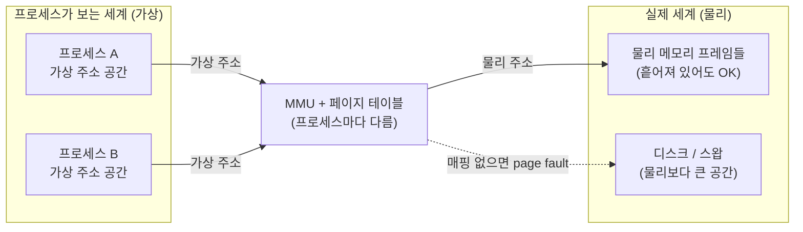

## "같은 주소인데 왜 안 싸우나"

방금 띄운 두 프로세스의 메모리 맵을 까보면 둘 다 똑같은 주소를 씁니다.

```bash
$ cat /proc/$(pgrep -n bash)/maps | head -1
55a3c1000000-55a3c1021000 r--p ...   # bash A
$ # 다른 터미널에서 또 다른 bash
55a3c1000000-55a3c1021000 r--p ...   # bash B — 어? 같은 주소다
```

두 프로그램이 **글자 그대로 똑같은 주소**에 코드를 올려놓고도 서로의 데이터를 한 바이트도 망가뜨리지 않습니다. C로 짠 코드가 `0x400000`을 가리켜도, 수백 개 프로세스가 동시에 `0x400000`을 써도 평화롭습니다. 어떻게?

답은 **그 주소들이 진짜 주소가 아니기 때문**입니다. 프로세스가 보는 모든 주소는 **가상 주소(virtual address)**이고, 각 프로세스는 자기만의 가상 주소 공간이라는 **환상** 속에 삽니다. 이 글은 그 환상을 만드는 장치 — 가상 메모리와 MMU — 가 **무슨 문제를 풀려고 태어났고**, 가상 주소 하나가 실제 D램 칸으로 어떻게 번역되는지를 끝까지 따라갑니다. [1편]()에서 OS의 3대 역할로 꼽은 "추상화·보호"가 메모리에서 어떻게 구현되는지가 바로 이 이야기입니다.

## 가상 메모리가 없던 시절의 지옥

옛날엔 프로그램이 보는 주소가 곧 물리 D램 주소였습니다(물리 주소 지정). 이 모델은 세 가지가 동시에 무너집니다.

- **보호 불가**: 프로그램 A가 포인터를 잘못 써 주소 `0x8000`에 쓰면, 거기 올라가 있던 프로그램 B(혹은 OS!)가 그대로 박살납니다. 격리할 방법이 없습니다.
- **재배치 지옥**: B를 메모리 어디에 올릴지 적재 시점에야 정해집니다. 그런데 코드 안의 모든 주소가 절대 주소라면, 적재 위치가 바뀔 때마다 주소를 전부 고쳐야 합니다.
- **단편화와 용량 한계**: 64MB 물리 메모리에 100MB 프로그램은 못 올립니다. 여러 프로그램이 들고 나면 빈 공간이 잘게 쪼개져(외부 단편화), 합치면 충분한데도 연속 공간이 없어 적재가 실패합니다.

가상 메모리는 이 셋을 **한 방의 간접 참조(indirection)**로 해결합니다. "모든 문제는 한 겹의 간접 참조로 풀 수 있다"는 전산학 격언의 가장 우아한 사례입니다.

> **핵심 아이디어 — "주소에 번역 계층을 끼운다."** 프로세스는 가상 주소만 본다. CPU가 메모리에 접근할 때마다 **MMU(Memory Management Unit)**라는 하드웨어가 가상 주소를 실제 물리 주소로 그 자리에서 번역한다. 각 프로세스마다 번역표가 다르므로, **같은 가상 주소라도 서로 다른 물리 칸**을 가리킨다 → 자동 격리. 번역표는 OS(커널)만 고칠 수 있으므로 → 자동 보호.

## 같은 가상 주소, 다른 물리 프레임

번역 계층이 격리를 만드는 장면을 먼저 눈으로 봅시다. 프로세스 A와 B가 **똑같은 가상 주소** `0x401000`에 접근합니다. 하지만 각자의 번역표(페이지 테이블)가 다르기 때문에, MMU는 A의 접근은 물리 프레임 ⑦로, B의 접근은 물리 프레임 ②로 보냅니다. 둘은 **영원히 만나지 않습니다.**

<div class="vm-iso" markdown="0">
<style>
.vm-iso{margin:1.4rem 0;overflow-x:auto}
.vm-iso svg{width:100%;max-width:720px;height:auto;display:block;margin:0 auto;font-family:inherit}
.vm-iso .bx{fill:none;stroke:currentColor;stroke-width:1.4;opacity:.5}
.vm-iso .lbl{fill:currentColor;font-size:12px;font-weight:600}
.vm-iso .sub{fill:currentColor;font-size:10px;opacity:.6}
.vm-iso .mmu{fill:currentColor;opacity:.08;stroke:currentColor;stroke-width:1.4}
.vm-iso .pa{fill:#1971c2}.vm-iso .pb{fill:#f08c00}
.vm-iso .frА{fill:#1971c2;opacity:0;animation:vmfra 6s ease-in-out infinite}
.vm-iso .frB{fill:#f08c00;opacity:0;animation:vmfrb 6s ease-in-out infinite}
@keyframes vmfra{0%,8%{opacity:0}20%,45%{opacity:.85}55%,100%{opacity:0}}
@keyframes vmfrb{0%,53%{opacity:0}65%,90%{opacity:.85}100%{opacity:0}}
.vm-iso .tokA{fill:#1971c2;offset-path:path('M 150,70 L 300,70 L 300,150 L 560,150 L 560,96');animation:vmtokA 6s ease-in-out infinite}
.vm-iso .tokB{fill:#f08c00;offset-path:path('M 150,250 L 300,250 L 300,150 L 560,150 L 560,236');animation:vmtokB 6s ease-in-out infinite}
@keyframes vmtokA{0%{offset-distance:0%;opacity:0}5%{opacity:1}45%{offset-distance:100%;opacity:1}50%{opacity:0}100%{opacity:0}}
@keyframes vmtokB{0%,50%{opacity:0}50.01%{offset-distance:0%;opacity:1}95%{offset-distance:100%;opacity:1}100%{opacity:0}}
</style>
<svg viewBox="0 0 720 300" role="img" aria-label="프로세스 A와 B가 동일한 가상 주소에 접근해도 MMU가 서로 다른 물리 프레임으로 번역해 격리되는 애니메이션">
  <text class="lbl" x="20" y="20">프로세스 A (가상)</text>
  <rect class="bx" x="20" y="54" width="130" height="32" rx="5"/>
  <text class="sub" x="85" y="74" text-anchor="middle">vaddr 0x401000</text>
  <text class="lbl" x="20" y="300">프로세스 B (가상)</text>
  <rect class="bx" x="20" y="234" width="130" height="32" rx="5"/>
  <text class="sub" x="85" y="254" text-anchor="middle">vaddr 0x401000</text>

  <rect class="mmu" x="270" y="120" width="80" height="60" rx="10"/>
  <text class="lbl" x="310" y="115" text-anchor="middle">MMU</text>
  <text class="sub" x="310" y="155" text-anchor="middle">+ 페이지</text>
  <text class="sub" x="310" y="168" text-anchor="middle">테이블</text>

  <text class="lbl" x="560" y="20" text-anchor="middle">물리 메모리 (프레임)</text>
  <rect class="bx" x="500" y="40" width="120" height="28" rx="4"/><text class="sub" x="560" y="59" text-anchor="middle">프레임 ②</text>
  <rect class="frB" x="500" y="40" width="120" height="28" rx="4"/>
  <rect class="bx" x="500" y="84" width="120" height="28" rx="4"/><text class="sub" x="560" y="103" text-anchor="middle">프레임 ⑦</text>
  <rect class="frА" x="500" y="84" width="120" height="28" rx="4"/>
  <rect class="bx" x="500" y="128" width="120" height="28" rx="4"/><text class="sub" x="560" y="147" text-anchor="middle">프레임 ⑪</text>
  <rect class="bx" x="500" y="172" width="120" height="28" rx="4"/><text class="sub" x="560" y="191" text-anchor="middle">프레임 ④</text>
  <rect class="bx" x="500" y="216" width="120" height="28" rx="4"/><text class="sub" x="560" y="235" text-anchor="middle">프레임 ⑨</text>
  <circle class="tokA" r="6"/>
  <circle class="tokB" r="6"/>
  <text class="sub" x="310" y="285" text-anchor="middle">같은 가상 주소 → 프로세스마다 다른 번역 → 다른 물리 프레임</text>
</svg>
</div>

이 한 장면이 프로세스 격리의 하드웨어적 뿌리입니다. A가 아무리 포인터를 헤집어도 A의 페이지 테이블에 매핑된 프레임 바깥은 **물리적으로 닿을 수 없습니다**. 매핑되지 않은 가상 주소를 건드리면 MMU가 폴트를 일으키고 — 그게 우리가 사랑하는 **세그멘테이션 폴트**입니다. 보호가 소프트웨어 규칙이 아니라 하드웨어 능력으로 강제된다는 점이 핵심입니다.

## 페이지와 프레임 — 왜 통째로가 아니라 조각으로

가상 주소 공간 전체를 물리 어딘가에 통째로 매핑하면 옛날의 외부 단편화가 그대로 돌아옵니다. 그래서 가상 메모리는 주소 공간을 **고정 크기 조각**으로 자릅니다.

- **페이지(page)**: 가상 주소 공간을 자른 고정 크기 조각(보통 4KB).
- **프레임(frame)**: 물리 메모리를 같은 크기로 자른 칸.
- 매핑은 **페이지 → 프레임** 단위로 이뤄집니다. 연속된 가상 페이지가 물리에서는 흩어진 프레임에 들어가도 됩니다.

조각이 모두 같은 크기라 **외부 단편화가 사라집니다** — 빈 프레임은 어느 페이지에든 끼워 맞춰집니다(대신 페이지 안쪽에 남는 내부 단편화는 약간 생깁니다). 그리고 "흩어진 물리 프레임을 연속처럼 보이게" 만드는 일이 바로 번역의 임무입니다.

## 가상 주소 한 개가 번역되는 순간

그럼 번역은 구체적으로 어떻게 일어날까요? 핵심 통찰은 **가상 주소를 두 부분으로 쪼갠다**는 것입니다.

- **상위 비트 = VPN(가상 페이지 번호)**: "몇 번째 페이지냐". 이것만 물리 프레임 번호(PFN)로 번역됩니다.
- **하위 비트 = 오프셋(offset)**: "페이지 안에서 몇 바이트째냐". 페이지와 프레임 크기가 같으므로 **그대로 통과**합니다.

아래에서 가상 주소가 `[ VPN | offset ]`으로 갈라지고, VPN만 페이지 테이블을 거쳐 PFN으로 바뀐 뒤, 오프셋과 다시 합쳐져 물리 주소가 조립됩니다.

<div class="vm-split" markdown="0">
<style>
.vm-split{margin:1.4rem 0;overflow-x:auto}
.vm-split svg{width:100%;max-width:720px;height:auto;display:block;margin:0 auto;font-family:inherit}
.vm-split .bx{fill:none;stroke:currentColor;stroke-width:1.4}
.vm-split .lbl{fill:currentColor;font-size:11px;font-weight:600}
.vm-split .sub{fill:currentColor;font-size:10px;opacity:.6}
.vm-split .vpn{fill:#1971c2;opacity:.85}
.vm-split .off{fill:#2f9e44;opacity:.85}
.vm-split .pfn{fill:#f08c00;opacity:.85}
.vm-split .mono{font-family:ui-monospace,monospace;font-size:12px;fill:#fff}
.vm-split .step{opacity:0}
.vm-split .s1{animation:vms 6s ease-in-out infinite}
.vm-split .s2{animation:vms 6s ease-in-out infinite}
.vm-split .s3{animation:vms 6s ease-in-out infinite}
@keyframes vms{0%{opacity:0}100%{opacity:1}}
.vm-split .a1{animation:vmstep 6s ease-in-out infinite}
.vm-split .a2{animation:vmstep 6s ease-in-out infinite}
.vm-split .a3{animation:vmstep 6s ease-in-out infinite}
@keyframes vmstep{0%{opacity:0}100%{opacity:1}}
.vm-split .pt{fill:#f08c00;opacity:0;animation:vmpt 6s ease-in-out infinite}
@keyframes vmpt{0%,30%{opacity:0}45%,100%{opacity:.85}}
.vm-split .arr{stroke:#f08c00;stroke-width:1.6;fill:none;opacity:0;animation:vmarr 6s ease-in-out infinite}
@keyframes vmarr{0%,30%{opacity:0}45%,90%{opacity:.7}100%{opacity:0}}
.vm-split .pfnout{fill:#f08c00;opacity:0;animation:vmout 6s ease-in-out infinite}
@keyframes vmout{0%,55%{opacity:0}70%,100%{opacity:.85}}
</style>
<svg viewBox="0 0 720 290" role="img" aria-label="가상 주소를 VPN과 오프셋으로 분해하고 VPN만 페이지 테이블로 번역해 물리 주소를 조립하는 애니메이션">
  <text class="lbl" x="20" y="40">가상 주소 (48비트)</text>
  <rect class="vpn" x="20" y="52" width="200" height="34" rx="4"/>
  <text class="mono" x="120" y="74" text-anchor="middle">VPN 0x401</text>
  <rect class="off" x="222" y="52" width="120" height="34" rx="4"/>
  <text class="mono" x="282" y="74" text-anchor="middle">offset 0x1A4</text>
  <text class="sub" x="120" y="102" text-anchor="middle">"몇 번째 페이지"</text>
  <text class="sub" x="282" y="102" text-anchor="middle">"페이지 안 위치"</text>

  <rect class="bx" x="300" y="135" width="160" height="70" rx="8" style="opacity:.5"/>
  <text class="lbl" x="380" y="128" text-anchor="middle">페이지 테이블</text>
  <text class="sub" x="380" y="160" text-anchor="middle">VPN 0x401 →</text>
  <rect class="pt" x="340" y="170" width="80" height="24" rx="4"/>
  <text class="mono step s2" x="380" y="187" text-anchor="middle">PFN 0x7</text>
  <path class="arr" d="M 120,86 C 120,150 240,170 338,182"/>

  <text class="lbl" x="500" y="40">물리 주소</text>
  <rect class="pfnout" x="500" y="52" width="120" height="34" rx="4"/>
  <text class="mono step s3" x="560" y="74" text-anchor="middle">PFN 0x7</text>
  <rect class="off" x="622" y="52" width="80" height="34" rx="4"/>
  <text class="mono" x="662" y="74" text-anchor="middle">0x1A4</text>
  <path class="arr" d="M 420,182 C 520,160 560,120 560,90"/>
  <path d="M 342,69 C 420,69 430,69 498,69" stroke="#2f9e44" stroke-width="1.6" fill="none" opacity=".6" stroke-dasharray="4 3"/>
  <text class="sub" x="430" y="240" text-anchor="middle">VPN만 번역되고, offset은 그대로 통과 → [ PFN | offset ] = 물리 주소</text>
  <text class="sub" x="430" y="262" text-anchor="middle">(다단계 페이지 테이블·TLB의 세부는 다음 글에서)</text>
</svg>
</div>

여기서 두 가지가 중요합니다. **(1)** offset이 그대로 통과하므로 페이지 크기가 곧 offset 비트 수를 정합니다(4KB = 2¹² → offset 12비트). **(2)** 번역표(페이지 테이블)는 프로세스마다 다르고, [컨텍스트 스위치]() 때 CPU의 페이지 테이블 베이스 레지스터(x86의 CR3)를 갈아끼우는 것만으로 **주소 공간 전체가 통째로 바뀝니다.** "프로세스를 바꾼다"의 메모리 측면 실체가 바로 이 레지스터 한 줄 교체입니다.

> **현실 체크 — "메모리를 1GB 잡았는데 왜 RSS는 10MB?"** `malloc`이나 `mmap`으로 거대한 가상 공간을 확보해도, 가상 주소가 **실제 물리 프레임에 매핑되는 건 처음 건드릴 때**입니다(디맨드 페이징). 그래서 `ps`의 **VSZ(가상 크기)**는 거대해도 **RSS(실제 점유 물리 메모리)**는 작을 수 있습니다. 모니터링에서 둘을 혼동하면 "메모리 누수 아닌데 누수로 오진"하기 십상입니다. 이 lazy 매핑의 메커니즘이 12편(페이지 폴트·디맨드 페이징)의 주제입니다.

## 한 장으로 보는 가상 메모리



가상 메모리가 한 번에 주는 것: ① **격리/보호**(프로세스마다 다른 번역), ② **"내 전용 연속 공간" 환상**(흩어진 프레임을 연속처럼), ③ **물리보다 큰 주소 공간**(안 쓰는 페이지는 디스크/스왑으로), ④ **재배치 자유**(코드의 가상 주소는 고정, 물리 위치는 OS 마음대로), ⑤ **공유**(같은 라이브러리 프레임을 여러 프로세스가 공유 매핑 — 메모리 절약).

## 직접 들여다보기

```bash
# 프로세스의 가상 주소 공간 전체 지도 — 각 줄이 하나의 매핑(VMA)
cat /proc/$(pgrep -n bash)/maps
#   address           perms  ...  pathname
#   55a3...000-...021  r-xp        /usr/bin/bash   ← 코드(읽기+실행)
#   7f..             rw-p        [heap]          ← 힙
#   7ff..            rw-p        [stack]         ← 스택

# 사람이 보기 좋은 요약 + 물리 점유(RSS)까지
pmap -x $(pgrep -n bash)

# 가상(VSZ) vs 실제 물리(RSS) — 이 둘의 차이가 lazy 매핑의 증거
ps -o pid,vsz,rss,comm -p $(pgrep -n bash)

# 매핑별 상세: 실제 물리 점유, 공유/전용, huge page 등
grep -A3 '\[heap\]' /proc/$(pgrep -n bash)/smaps
```

`maps`의 각 줄(커널 용어로 VMA, virtual memory area)이 "이 가상 구간을 이런 권한으로 어디에 매핑했다"는 한 항목입니다. 세그폴트가 났을 때 폴트 주소가 어느 VMA에도 안 들어가면 → 잘못된 접근, 들어가는데 권한이 안 맞으면(읽기 전용에 쓰기) → 보호 위반. 디버깅의 출발점이 바로 이 지도입니다.

## 면접/리뷰 단골 질문

- **Q. 가상 메모리가 푸는 문제는?** → 보호/격리(프로세스마다 다른 번역), 재배치 자유, 외부 단편화 제거(페이지 단위), 물리보다 큰 주소 공간, 라이브러리 공유. 한 겹의 주소 간접 참조로 전부 해결한다.
- **Q. 가상 주소가 물리 주소로 바뀌는 과정은?** → 가상 주소를 VPN+offset으로 분해 → VPN을 페이지 테이블로 PFN으로 번역 → offset은 그대로 → [PFN|offset]이 물리 주소. 이 번역을 MMU 하드웨어가 매 접근마다 수행한다.
- **Q. 두 프로세스가 같은 가상 주소를 써도 안 겹치는 이유는?** → 페이지 테이블이 프로세스마다 달라 같은 가상 주소가 다른 프레임으로 번역되기 때문. 컨텍스트 스위치 때 CR3(페이지 테이블 베이스)를 교체하면 주소 공간이 통째로 바뀐다.
- **Q. VSZ와 RSS의 차이는?** → VSZ는 확보한 가상 주소 공간 크기, RSS는 실제로 물리 프레임에 올라온 양. 디맨드 페이징 때문에 VSZ ≫ RSS가 정상이다.
- **Q. 페이지와 프레임의 차이는?** → 페이지는 가상 주소 공간의 고정 크기 조각, 프레임은 물리 메모리의 같은 크기 칸. 매핑은 페이지→프레임 단위.

## 정리

- 프로세스가 보는 모든 주소는 **가상 주소**다. MMU가 매 접근마다 물리 주소로 번역한다.
- 번역표(페이지 테이블)가 프로세스마다 달라 **같은 가상 주소도 다른 물리 프레임** → 격리/보호가 하드웨어로 강제된다(세그폴트의 정체).
- 주소 공간을 **페이지**(가상)/**프레임**(물리)으로 잘라 외부 단편화를 없애고, 흩어진 프레임을 연속처럼 보이게 한다.
- 번역의 핵심: 가상 주소 = **VPN + offset**. VPN만 번역되고 offset은 통과한다.
- 매핑은 lazy하다 → **VSZ(가상) ≫ RSS(물리)**가 정상. 이 게으름의 메커니즘이 다음 글들의 주제다.

> 다음 글: 48비트 주소 공간의 페이지 테이블을 통째로 둘 수 없는 이유와, 매 접근마다 번역하면 느려지는 문제를 푸는 캐시 — **[페이징·다단계 페이지 테이블·TLB]()**로 이어집니다. 가상 주소 공간의 전체 레이아웃이 궁금하면 [3편 프로세스]()를 함께 보세요.
