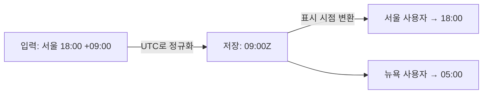

## 들어가며

어느 주, 날짜·시간 처리를 다뤘다. 시간은 "그냥 저장하면 되는" 값처럼 보이지만, **서버가 어디 있고 사용자가 어디 있느냐**에 따라 같은 순간이 다른 숫자로 표현된다. 여기서 규칙을 안 세우면, 같은 주문 시각이 화면마다 다르게 보이고 정렬이 꼬인다. 원칙은 단순하다. **저장은 UTC, 표시는 로컬.**

## 핵심 개념: 시각(instant)과 표현(representation)은 다르다

세상엔 단 하나의 **순간(instant)**이 있지만, 그걸 적는 방식은 지역마다 다르다. 서울의 `2023-06-25 18:00`과 UTC의 `2023-06-25 09:00`은 **같은 순간**이다. 데이터로 다뤄야 하는 건 "순간"이지 "어느 지역의 벽시계 표현"이 아니다.

그래서 표준은 이렇다.

- **저장 = UTC (절대 시각).** 지역 정보가 섞이지 않은 단일 기준. 정렬·비교·계산이 모두 모호함 없이 된다.
- **표시 = 사용자 로컬로 변환.** 보여줄 때만 사용자의 타임존을 입혀 벽시계 시각으로 바꾼다.



DB에는 한 값(`09:00Z`)만 있고, 보는 사람의 타임존에 따라 다르게 그려진다. 진실은 하나, 표현은 여럿이다.

## 왜 로컬 저장이 위험한가

로컬 시각을 그대로 저장하면 **DST(서머타임)와 오프셋 변경**에서 무너진다. DST가 적용되는 지역은 1년에 두 번, 같은 벽시계 시각이 두 번 존재하거나(가을) 아예 존재하지 않는(봄) 구간이 생긴다. 오프셋 정보 없는 로컬 시각만으로는 "그 09:30이 DST 전인지 후인지" 복원할 수 없다. UTC는 이런 모호함이 없다.

## 코드 예시: 타입 선택이 핵심

Java에서 타입 선택이 곧 의미 선택이다.

```java
// ❌ LocalDateTime — 타임존 정보가 없다. "어느 지역의 18:00"인지 모른다.
private LocalDateTime createdAt;

// ✅ Instant — 타임존 없는 절대 시각(UTC 기준 에폭). 저장용으로 최적.
private Instant createdAt;
```

```java
// 저장: 입력이 어느 존이든 절대 시각으로 정규화
Instant createdAt = zonedInput.toInstant();   // 예: 2023-06-25T09:00:00Z

// 표시: 사용자 타임존을 입혀 벽시계 시각으로
ZonedDateTime shown = createdAt.atZone(ZoneId.of("Asia/Seoul"));
// → 2023-06-25T18:00+09:00[Asia/Seoul]
```

DB 컬럼은 타임존을 보존하는 타입(예: `TIMESTAMP`)을 쓰되, **드라이버·세션 타임존 설정**까지 일치시켜야 변환이 어긋나지 않는다.

## 운영 함정

**함정 1 — DB 세션 타임존이 숨은 변수.** JDBC 드라이버나 DB 세션 타임존이 서버 OS 타임존을 따라가면, 같은 `Instant`가 환경마다 다른 값으로 읽힌다. 애플리케이션·DB·드라이버의 타임존을 **명시적으로 UTC로 고정**해 "어딘가가 알아서 변환하는" 일을 없앤다.

**함정 2 — `now()`의 출처가 제각각.** 애플리케이션 `Instant.now()`와 DB `NOW()`가 다른 타임존 기준이면 같은 행의 두 시각이 9시간 어긋난다. 시각의 출처(애플리케이션 vs DB)를 한쪽으로 통일한다.

## 핵심 요약

- 시각은 **순간(UTC)**으로 저장하고 표시할 때만 로컬로 변환한다. 진실은 하나, 표현은 여럿.
- 저장용 타입은 타임존 모호성이 없는 `Instant`. `LocalDateTime`은 "어느 지역"이 빠져 저장에 부적합.
- 면접 한 줄 — **"왜 UTC로 저장?"** → 단일 절대 기준이라 정렬·비교가 모호하지 않고, DST·오프셋 변경으로 인한 복원 불가 문제가 없기 때문이다.
