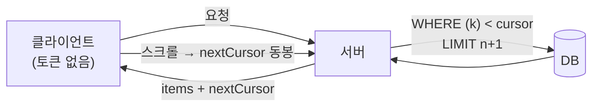

무한 스크롤 목록을 만들 때 가장 흔한 실수는 화면이 스크롤될 때마다 `LIMIT ? OFFSET ?`을 늘려 던지는 것이다. 처음엔 잘 돈다. 그러다 페이지가 깊어지고 데이터가 들어오면, 같은 행이 두 번 보이거나 어떤 행이 통째로 사라지고, 쿼리는 점점 느려진다. 무한 스크롤의 본질은 "어디까지 봤는지"를 페이지 번호가 아니라 **데이터 자체로 기억하는 것**이다. 그 도구가 커서 페이지네이션이다.

## 왜 offset은 깊어질수록 느린가

`OFFSET 100000 LIMIT 20`은 "10만 개를 읽어서 버리고, 그다음 20개를 달라"는 뜻이다. DB는 건너뛸 행을 *세어가며 실제로 읽어야* 한다. 인덱스를 타더라도 offset만큼의 엔트리를 스캔해 폐기하므로 비용은 offset에 비례해 커진다. 더 치명적인 건 **불안정성**이다. 1페이지를 본 사이 새 글이 맨 앞에 삽입되면, 모든 행이 한 칸씩 밀린다. offset 20부터 다시 읽으면 직전 페이지 마지막 행을 또 본다(중복). 거꾸로 삭제가 일어나면 행이 건너뛰어진다(누락).

## 커서: 위치가 아니라 좌표를 기억한다

커서 방식은 페이지 번호 대신 **마지막으로 본 행의 정렬 좌표**를 다음 요청에 실어 보낸다. 쿼리는 offset 없이 그 좌표 *이후*만 조건으로 걸러 읽는다.

```sql
-- created_at DESC 정렬, 마지막으로 본 행이 (2023-07-01 09:00, id=5821) 였다면
SELECT id, title, created_at
FROM   posts
WHERE  (created_at, id) < ('2023-07-01 09:00:00', 5821)
ORDER  BY created_at DESC, id DESC
LIMIT  20;
```

핵심은 `(created_at, id)` **튜플 비교**다. `created_at` 하나만으로는 같은 시각의 행이 여러 개일 때 경계가 모호해 중복·누락이 생긴다. 그래서 항상 **유일한 타이브레이커(보통 PK)** 를 정렬키 끝에 붙여 커서가 단 하나의 행을 가리키게 만든다. `(created_at DESC, id DESC)` 복합 인덱스가 있으면 DB는 인덱스의 한 지점으로 **곧장 점프**해 거기서부터 20개만 읽는다. offset이 없으니 비용은 페이지 깊이와 무관하게 일정하다.

## 불투명 토큰으로 감싼다

커서의 raw 값(타임스탬프 + id)을 그대로 클라이언트에 노출하면 두 가지 문제가 생긴다. 내부 정렬 구조가 새어 나가고, 클라이언트가 값을 임의로 조작할 수 있다. 그래서 커서를 **불투명 토큰(opaque token)** 으로 감싼다. 서버만 해석하는 인코딩된 문자열로 만들어, 클라이언트는 "받은 토큰을 그대로 다음 요청에 돌려준다"는 계약만 안다.

```java
public record Cursor(Instant createdAt, long id) {
    String encode() {
        String raw = createdAt.toEpochMilli() + ":" + id;
        return Base64.getUrlEncoder().withoutPadding()
                     .encodeToString(raw.getBytes(UTF_8));
    }
    static Cursor decode(String token) {
        String raw = new String(Base64.getUrlDecoder().decode(token), UTF_8);
        String[] p = raw.split(":");
        return new Cursor(Instant.ofEpochMilli(Long.parseLong(p[0])),
                          Long.parseLong(p[1]));
    }
}

// 응답
public record Page<T>(List<T> items, String nextCursor, boolean hasNext) {}
```

마지막 행에서 다음 커서를 만들 때 한 가지 트릭이 있다. **`LIMIT 21`로 한 개 더 읽어** 21개가 오면 `hasNext = true`로 두고 21번째는 버린다. 별도의 count 쿼리 없이 "다음 페이지 존재 여부"를 알 수 있다.



## 운영 함정

**정렬키를 바꾸면 커서가 깨진다.** 커서는 특정 `ORDER BY`에 묶여 있다. 정렬 기준을 "최신순"에서 "인기순"으로 토글하면 기존 커서는 무의미하다. 정렬이 바뀌면 커서를 버리고 처음부터 다시 시작해야 하며, 가능하면 토큰 안에 정렬 종류도 함께 인코딩해 서버에서 검증하라.

**커서는 점프를 못 한다.** offset은 "37페이지로 이동"이 가능하지만 커서는 순차 전진만 한다. 무한 스크롤·피드엔 완벽하지만, 사용자가 페이지 번호를 직접 누르는 관리자 테이블엔 맞지 않는다. UX 패턴에 맞춰 선택하라.

## 핵심 요약

- offset은 깊이에 비례해 느려지고, 삽입/삭제 시 중복·누락이 생긴다.
- 커서는 `(정렬키, 유일키)` 튜플 비교 + 복합 인덱스로 일정한 비용에 안정적으로 다음 구간을 읽는다.
- raw 커서는 불투명 토큰으로 감싸 노출과 조작을 막는다. `LIMIT n+1`로 `hasNext`를 공짜로 얻는다.

**면접 한 줄 Q&A.** "왜 커서에 PK를 붙이나?" → 정렬키만으로는 동일값 행의 경계가 모호해 중복·누락이 발생한다. 유일한 타이브레이커를 붙여야 커서가 정확히 한 행을 가리킨다.
