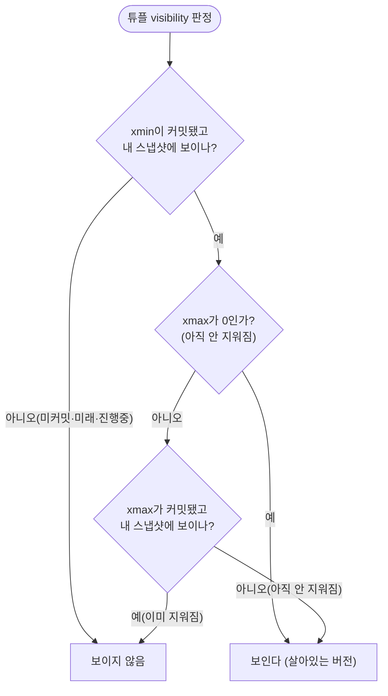
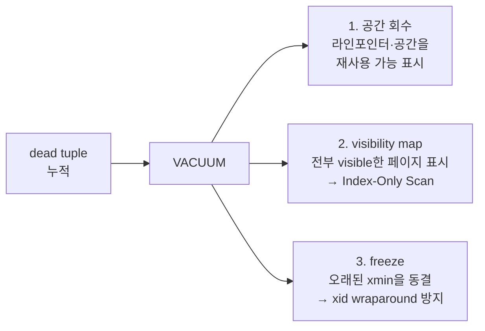

## "분명 한 줄만 UPDATE 했는데 테이블이 계속 뚱뚱해진다"

운영 중인 PostgreSQL에서 흔히 마주치는 장면입니다. `users` 테이블에 행은 100만 건 그대로인데, `\dt+`로 보면 물리 크기가 며칠 만에 2배, 3배로 부풀어 있습니다. 같은 행을 반복 UPDATE 하는 카운터·세션·큐 테이블일수록 심합니다. 인덱스도 같이 뚱뚱해지고, 그러자 캐시 적중률이 떨어지고, 쿼리가 느려집니다.

원인을 한 단어로 줄이면 **MVCC**입니다. 그리고 그게 바로 [앞 글]()에서 "PostgreSQL은 읽기가 쓰기를 막지 않는다"고 했던 그 메커니즘의 청구서이기도 합니다. 공짜 점심은 없습니다. 이 글은 MVCC가 **무엇을 대가로** 그 동시성을 사는지 — UPDATE가 디스크에서 실제로 무슨 일을 벌이는지, 누가 어떤 버전을 보게 되는지, 그리고 그 부산물(dead tuple)을 누가 치우는지 — 를 PG 힙 튜플 수준까지 내려가서 따라갑니다.

## MVCC의 한 줄 요약: 덮어쓰지 않는다

전통적인 잠금 기반 DB는 쓰기 트랜잭션이 행을 잠그고, 읽기 트랜잭션은 그 잠금이 풀릴 때까지 기다립니다. 읽기-쓰기가 서로를 막죠. MVCC(Multi-Version Concurrency Control)의 발상은 정반대입니다.

> **데이터를 제자리에서 고치지 않는다. 새 버전을 따로 만들고, 각 트랜잭션은 자기 시점에 맞는 버전을 본다.**

읽는 쪽은 항상 "내가 시작한 시점에 확정돼 있던 버전"을 보면 되므로 쓰기를 기다릴 필요가 없고, 쓰는 쪽은 새 버전을 만들 뿐이니 읽기를 막지 않습니다. 읽기-쓰기 충돌이 구조적으로 사라집니다. 대신 **한 논리적 행에 여러 물리적 버전**이 공존하게 되고, 누가 어떤 버전을 보는지 판정하는 규칙(visibility)과, 아무도 안 보게 된 버전을 청소하는 일(VACUUM)이 필요해집니다.

## 튜플 헤더: xmin과 xmax가 모든 것을 결정한다

[저장 구조 글]()에서 본 힙 튜플 헤더(`HeapTupleHeader`)를 다시 꺼냅니다. MVCC의 핵심은 모든 튜플이 들고 다니는 두 개의 트랜잭션 ID입니다.

| 필드 | 의미 |
|---|---|
| `t_xmin` | 이 튜플 버전을 **생성한** 트랜잭션 ID (INSERT/UPDATE) |
| `t_xmax` | 이 튜플 버전을 **삭제·갱신해 무효화한** 트랜잭션 ID (없으면 0) |
| `t_ctid` | 이 행의 **다음(최신) 버전**을 가리키는 포인터 `(페이지번호, 라인포인터)` |
| `t_infomask` | 커밋/abort 힌트 비트(`HEAP_XMIN_COMMITTED` 등), HOT/freeze 플래그 |

규칙은 단순합니다. 한 버전은 **`xmin`이 커밋된 시점부터 `xmax`가 커밋되기 직전까지** 살아 있습니다.

- `INSERT`: `xmin = 내 xid`, `xmax = 0` 인 새 튜플을 만든다.
- `DELETE`: 행을 지우지 않고, 해당 튜플의 `xmax = 내 xid`로 **마킹만** 한다.
- `UPDATE`: **DELETE + INSERT**다. 옛 버전의 `xmax = 내 xid`를 찍고, 새 값으로 새 튜플(`xmin = 내 xid`)을 같은 힙(또는 같은 페이지)에 삽입한다. 옛 튜플의 `t_ctid`는 새 튜플을 가리키게 해서 **버전 체인**을 잇는다.

여기서 가장 반직관적인 사실: **UPDATE는 제자리 수정이 아니다.** 한 줄을 한 번 UPDATE 할 때마다 새 튜플이 하나 생기고, 옛 튜플은 죽은 채로(dead) 디스크에 남습니다. 그게 서두의 "테이블이 뚱뚱해지는" 정체입니다.

```sql
-- 숨은 시스템 컬럼으로 직접 확인할 수 있다
SELECT ctid, xmin, xmax, * FROM accounts WHERE id = 1;
-- ctid  | xmin | xmax | id | balance
-- (0,1) | 712  | 0    | 1  | 100      ← 현재 살아있는 버전
```

## UPDATE 한 번에 버전 체인이 자란다

같은 행을 두 번 UPDATE 하면 디스크에는 세 개의 물리 버전이 ctid로 사슬처럼 연결된 채 남습니다. 아래 애니메이션은 한 행이 UPDATE 될 때마다 새 버전이 삽입되고 옛 버전에 `xmax`가 찍히며, **두 트랜잭션의 서로 다른 스냅샷이 각자 다른 버전을 보는** 모습입니다.

<div class="mvcc-chain" markdown="0">
<style>
.mvcc-chain{margin:1.4rem 0;overflow-x:auto}
.mvcc-chain svg{width:100%;max-width:720px;height:auto;display:block;margin:0 auto;font-family:inherit}
.mvcc-chain .lbl{fill:currentColor;font-size:12px;font-weight:600}
.mvcc-chain .sub{fill:currentColor;font-size:9.5px;opacity:.6}
.mvcc-chain .ver{stroke:currentColor;stroke-width:1.4;rx:3}
.mvcc-chain .live{fill:#2f9e44}
.mvcc-chain .dead{fill:#e03131}
.mvcc-chain .vtxt{fill:#fff;font-size:9.5px;font-weight:600}
.mvcc-chain .ptr{stroke:currentColor;stroke-width:1.4;fill:none;opacity:.45;marker-end:url(#mvccarr)}
.mvcc-chain .snap{stroke-width:1.6;fill:none}
.mvcc-chain .sA{stroke:#1971c2}
.mvcc-chain .sB{stroke:#9c36b5}
.mvcc-chain .stxt{font-size:10px;font-weight:600}
.mvcc-chain .stA{fill:#1971c2}
.mvcc-chain .stB{fill:#9c36b5}
/* 버전 2: 1.5s 후 등장, 버전1을 dead로 */
.mvcc-chain .v2,.mvcc-chain .v2t{opacity:0;animation:mvccV2 9s ease-in-out infinite}
.mvcc-chain .p12{opacity:0;animation:mvccV2 9s ease-in-out infinite}
.mvcc-chain .v1dead{opacity:0;animation:mvccV1dead 9s ease-in-out infinite}
/* 버전 3: 4.5s 후 등장, 버전2를 dead로 */
.mvcc-chain .v3,.mvcc-chain .v3t{opacity:0;animation:mvccV3 9s ease-in-out infinite}
.mvcc-chain .p23{opacity:0;animation:mvccV3 9s ease-in-out infinite}
.mvcc-chain .v2dead{opacity:0;animation:mvccV2dead 9s ease-in-out infinite}
/* 스냅샷 B 포인터: 버전2 등장 후 버전2를 가리킴 */
.mvcc-chain .snapB{animation:mvccSnapB 9s ease-in-out infinite}
@keyframes mvccV2{0%,15%{opacity:0}22%,100%{opacity:1}}
@keyframes mvccV1dead{0%,15%{opacity:0}22%,100%{opacity:1}}
@keyframes mvccV3{0%,48%{opacity:0}55%,100%{opacity:1}}
@keyframes mvccV2dead{0%,48%{opacity:0}55%,100%{opacity:1}}
@keyframes mvccSnapB{0%,15%{transform:translateX(0)}22%,47%{transform:translateX(140px)}55%,100%{transform:translateX(140px)}}
</style>
<svg viewBox="0 0 700 300" role="img" aria-label="한 행이 UPDATE될 때마다 새 버전 튜플이 삽입되고 옛 버전에 xmax가 찍히며 버전 체인이 자라고, 트랜잭션 A의 옛 스냅샷과 트랜잭션 B의 새 스냅샷이 서로 다른 버전을 보는 MVCC 애니메이션">
  <defs>
    <marker id="mvccarr" markerWidth="9" markerHeight="9" refX="7" refY="3" orient="auto">
      <path d="M0,0 L7,3 L0,6 Z" fill="currentColor" opacity="0.5"/>
    </marker>
  </defs>
  <text class="lbl" x="20" y="30">힙(heap) 안의 버전 체인 — 한 논리적 행, 여러 물리 버전</text>

  <!-- 버전 1 : (0,1) xmin=100 -->
  <rect class="ver live v1live" x="40" y="70" width="150" height="50"/>
  <rect class="ver dead v1dead" x="40" y="70" width="150" height="50"/>
  <text class="vtxt" x="115" y="90" text-anchor="middle">ctid (0,1)</text>
  <text class="vtxt" x="115" y="106" text-anchor="middle">xmin=100 xmax=0</text>
  <text class="vtxt v1dead" x="115" y="106" text-anchor="middle">xmin=100 xmax=200</text>

  <!-- 버전 2 : (0,2) xmin=200 -->
  <rect class="ver live v2" x="270" y="70" width="150" height="50"/>
  <rect class="ver dead v2dead" x="270" y="70" width="150" height="50"/>
  <text class="vtxt v2t" x="345" y="90" text-anchor="middle">ctid (0,2)</text>
  <text class="vtxt v2t" x="345" y="106" text-anchor="middle">xmin=200 xmax=0</text>
  <text class="vtxt v2dead" x="345" y="106" text-anchor="middle">xmin=200 xmax=300</text>

  <!-- 버전 3 : (0,3) xmin=300 -->
  <rect class="ver live v3" x="500" y="70" width="150" height="50"/>
  <text class="vtxt v3t" x="575" y="90" text-anchor="middle">ctid (0,3)</text>
  <text class="vtxt v3t" x="575" y="106" text-anchor="middle">xmin=300 xmax=0</text>

  <!-- ctid 포인터(버전 체인) -->
  <path class="ptr p12" d="M 190,95 L 268,95"/>
  <path class="ptr p23" d="M 420,95 L 498,95"/>
  <text class="sub" x="345" y="142" text-anchor="middle">t_ctid가 다음 버전을 가리켜 사슬을 잇는다 →</text>

  <!-- 스냅샷 A: txid 150에 시작, 버전1만 봄 (고정) -->
  <path class="snap sA" d="M 115,200 L 115,124"/>
  <circle cx="115" cy="200" r="5" fill="#1971c2"/>
  <text class="stxt stA" x="115" y="222" text-anchor="middle">트랜잭션 A</text>
  <text class="sub" x="115" y="238" text-anchor="middle">txid 150 스냅샷</text>
  <text class="sub" x="115" y="252" text-anchor="middle">→ 버전1을 본다</text>

  <!-- 스냅샷 B: 이동하며 최신을 봄 -->
  <g class="snapB">
    <path class="snap sB" d="M 115,200 L 115,124"/>
    <circle cx="115" cy="200" r="5" fill="#9c36b5"/>
    <text class="stxt stB" x="115" y="280" text-anchor="middle">트랜잭션 B</text>
    <text class="sub" x="115" y="294" text-anchor="middle">나중 스냅샷 → 최신 버전을 본다</text>
  </g>
</svg>
</div>

`UPDATE accounts SET balance=... WHERE id=1`을 두 번 실행한 결과가 위 그림입니다. txid 150에서 트랜잭션을 열어 둔 A는 그 후에 일어난 갱신(200, 300)을 **자기 스냅샷 기준으로 아직 일어나지 않은 일**로 취급해 끝까지 버전1(잔액 100)을 봅니다. 그동안 나중에 시작한 B는 최신 버전을 봅니다. 같은 행을 둘이 동시에 읽지만 서로 다른 값을 보고, 누구도 막히지 않습니다 — 이것이 [스냅샷 격리]()의 물리적 실체입니다.

## Visibility 판정: 스냅샷이 답을 정한다

그러면 "이 튜플이 나에게 보이는가?"는 어떻게 판정할까요. 트랜잭션은 시작 시점(`READ COMMITTED`는 매 문장마다)에 **스냅샷**을 찍습니다. 스냅샷은 세 가지로 구성됩니다.

- `xmin` — 이 값보다 작은 xid는 **이미 끝났다**(완료)고 본다.
- `xmax` — 이 값 이상의 xid는 **아직 시작도 안 했다**(미래)고 본다.
- `xip[]` — `xmin`과 `xmax` 사이에서 **그 순간 진행 중**이던 트랜잭션 목록.

`pg_current_snapshot()`이 `100:300:150,170` 같은 형태로 보여주는 게 이것입니다. 한 튜플이 보이려면 대략 다음을 통과해야 합니다.



즉 "xmin은 보이는데 xmax는 아직 안 보이는" 버전만이 나에게 살아 있습니다. 그래서 같은 물리 튜플이라도 트랜잭션마다 다르게 보입니다. `t_infomask`의 `HEAP_XMIN_COMMITTED`/`HEAP_XMAX_COMMITTED` **힌트 비트**는 이 판정에서 매번 `pg_xact`(구 clog)를 뒤지지 않도록 첫 판정 결과를 튜플에 캐싱해 두는 최적화입니다. 그래서 평범한 SELECT가 튜플의 힌트 비트를 갱신하며 페이지를 dirty로 만들 수 있습니다("읽기인데 왜 쓰기가?"의 한 원인).

## HOT update: 인덱스를 살려두는 지름길

UPDATE가 매번 새 튜플을 만든다면 **인덱스 엔트리도 매번 새로 만들어야** 할까요? 인덱스는 [B-Tree 글]()에서 봤듯 `key → ctid`를 저장합니다. 새 버전은 새 ctid를 가지니, 원칙대로면 그 행을 가리키는 모든 인덱스에 새 엔트리를 추가해야 합니다 — 인덱스 5개면 UPDATE 한 번에 인덱스 쓰기 5번.

PostgreSQL은 **HOT(Heap-Only Tuple) update**로 이걸 피합니다. 두 조건이면 인덱스를 건드리지 않습니다.

1. 갱신된 컬럼이 **어떤 인덱스에도 포함되지 않을 것**.
2. 새 버전이 **같은 페이지 안**에 들어갈 자리가 있을 것.

이때 인덱스는 옛 ctid(0,1)를 계속 가리키고, 페이지 안에서 (0,1)→(0,2)로 이어지는 **HOT 체인**을 따라가 최신 버전을 찾습니다. 인덱스 쓰기 0번, WAL도 절약. 이 "같은 페이지 안 자리"를 일부러 비워두기 위해 [`FILLFACTOR`]()(기본 100, 자주 갱신되는 테이블은 80~90으로)를 낮춥니다. HOT 적중률은 `pg_stat_user_tables.n_tup_hot_upd`로 확인합니다.

```sql
SELECT relname, n_tup_upd, n_tup_hot_upd,
       round(100.0*n_tup_hot_upd/NULLIF(n_tup_upd,0),1) AS hot_pct
FROM pg_stat_user_tables ORDER BY n_tup_upd DESC LIMIT 5;
```

## 청소부 VACUUM: dead tuple을 어떻게 치우나

이제 청구서를 갚을 차례입니다. 더 이상 **어떤 스냅샷에도 보이지 않게 된** dead tuple은 공간을 차지한 채 남아 있습니다. 이걸 회수하는 게 `VACUUM`이고, 세 가지 일을 합니다.



**1) 공간 회수**: dead 튜플이 차지하던 공간과 라인 포인터를 재사용 가능으로 표시합니다. 주의 — 일반 `VACUUM`은 **테이블 크기를 OS에 돌려주지 않습니다**. 빈 공간을 테이블 내부에서 재사용할 뿐이라, `\dt+`의 크기는 그대로일 수 있습니다(파일 끝의 완전 빈 페이지만 truncate). 물리 축소가 필요하면 `VACUUM FULL`(전체 재작성, **ACCESS EXCLUSIVE 락**, 운영 중 위험)이나 `pg_repack`을 씁니다.

**2) visibility map(VM)**: "이 페이지의 모든 튜플이 모든 트랜잭션에 visible하다"를 페이지별 비트로 기록합니다. 이 비트가 켜진 페이지는 [Index-Only Scan]()에서 힙을 안 읽고 인덱스만으로 답할 수 있습니다. VACUUM이 안 돌면 VM이 갱신 안 돼 Index-Only Scan이 자꾸 힙을 다시 읽습니다.

**3) freeze (xid wraparound 방지)**: 트랜잭션 ID는 32비트라 약 21억(2^31)을 한 바퀴 돌면 재사용됩니다. 그러면 아주 오래된 튜플의 `xmin`이 갑자기 "미래"로 보여 데이터가 사라지는 재앙이 생깁니다. VACUUM은 충분히 오래돼 모두에게 보이는 튜플의 xmin을 **frozen**으로 표시(`infomask`에 `HEAP_XMIN_FROZEN`)해 영구히 visible로 못박습니다. `autovacuum_freeze_max_age`(기본 2억)에 도달하면 강제 anti-wraparound vacuum이 돌고, 더 방치하면 PG는 쓰기를 거부하며 단일 사용자 모드 복구를 요구합니다. ([WAL 글]()에서 다룬 freeze 레코드가 여기 기록됩니다.)

**autovacuum**은 이 모든 걸 백그라운드에서 자동 수행합니다. 트리거 공식은 대략 `dead tuple > autovacuum_vacuum_threshold(50) + autovacuum_vacuum_scale_factor(0.2) × 행수`. 큰 테이블(0.2 × 1억 = 2천만 dead)에서는 임계치가 너무 커서 autovacuum이 늦게 도니, 큰 테이블엔 `ALTER TABLE ... SET (autovacuum_vacuum_scale_factor=0.02)`로 낮춰주는 게 정석입니다.

아래 애니메이션은 dead 튜플(빨강)이 섞인 페이지를 VACUUM이 훑고 지나가며 회수 가능 공간으로 비우고(회색), 모두 visible해진 페이지에 visibility map 비트가 켜지는 과정입니다.

<div class="mvcc-vac" markdown="0">
<style>
.mvcc-vac{margin:1.4rem 0;overflow-x:auto}
.mvcc-vac svg{width:100%;max-width:720px;height:auto;display:block;margin:0 auto;font-family:inherit}
.mvcc-vac .lbl{fill:currentColor;font-size:12px;font-weight:600}
.mvcc-vac .sub{fill:currentColor;font-size:9.5px;opacity:.6}
.mvcc-vac .cell{stroke:currentColor;stroke-width:1.2}
.mvcc-vac .live{fill:#2f9e44}
.mvcc-vac .dead{fill:#e03131}
.mvcc-vac .free{fill:currentColor;opacity:.18}
/* dead 셀들이 차례로 free로 바뀜 (broom이 지나가며) */
.mvcc-vac .d1{animation:mvccD1 7s ease-in-out infinite}
.mvcc-vac .d2{animation:mvccD2 7s ease-in-out infinite}
.mvcc-vac .d3{animation:mvccD3 7s ease-in-out infinite}
@keyframes mvccD1{0%,18%{fill:#e03131}28%,100%{fill:currentColor;opacity:.18}}
@keyframes mvccD2{0%,32%{fill:#e03131}42%,100%{fill:currentColor;opacity:.18}}
@keyframes mvccD3{0%,46%{fill:#e03131}56%,100%{fill:currentColor;opacity:.18}}
/* VACUUM 빗자루가 왼→오 이동 */
.mvcc-vac .broom{animation:mvccBroom 7s ease-in-out infinite}
@keyframes mvccBroom{0%{transform:translateX(0);opacity:0}6%{opacity:1}12%{transform:translateX(40px)}26%{transform:translateX(160px)}40%{transform:translateX(280px)}54%{transform:translateX(400px);opacity:1}62%,100%{transform:translateX(440px);opacity:0}}
/* visibility map 비트: 청소 끝난 뒤 켜짐 */
.mvcc-vac .vm{fill:#1971c2;opacity:0;animation:mvccVM 7s ease-in-out infinite}
.mvcc-vac .vmtxt{fill:#1971c2;font-size:9.5px;font-weight:600;opacity:0;animation:mvccVM 7s ease-in-out infinite}
@keyframes mvccVM{0%,62%{opacity:0}70%,100%{opacity:1}}
</style>
<svg viewBox="0 0 700 200" role="img" aria-label="VACUUM이 페이지를 훑으며 dead 튜플을 재사용 가능 공간으로 회수하고, 모두 visible해진 페이지에 visibility map 비트를 켜는 과정 애니메이션">
  <text class="lbl" x="20" y="28">힙 페이지 (8KB) — 초록=live, 빨강=dead, 회색=재사용 가능</text>
  <!-- 8개 셀: live/dead 섞임 -->
  <rect class="cell live" x="40"  y="50" width="70" height="40"/>
  <rect class="cell dead d1" x="120" y="50" width="70" height="40"/>
  <rect class="cell live" x="200" y="50" width="70" height="40"/>
  <rect class="cell dead d2" x="280" y="50" width="70" height="40"/>
  <rect class="cell dead d3" x="360" y="50" width="70" height="40"/>
  <rect class="cell live" x="440" y="50" width="70" height="40"/>
  <!-- 빗자루(VACUUM 진행 위치) -->
  <g class="broom">
    <line x1="40" y1="44" x2="40" y2="96" stroke="#f08c00" stroke-width="3"/>
    <text class="sub" x="40" y="112" text-anchor="middle" fill="#f08c00">VACUUM</text>
  </g>
  <!-- visibility map 비트 -->
  <rect class="vm" x="40" y="140" width="470" height="22" rx="3"/>
  <text class="vmtxt" x="275" y="155" text-anchor="middle">visibility map: all-visible ✓ → Index-Only Scan 가능</text>
  <text class="sub" x="40" y="186">일반 VACUUM은 공간을 페이지 내부에서 재사용할 뿐, 파일을 OS에 돌려주진 않는다(끝 빈 페이지만 truncate)</text>
</svg>
</div>

## 블로트 진단: 뚱뚱함을 숫자로 보기

서두의 증상으로 돌아갑니다. 블로트(bloat)는 "살아있는 데이터에 비해 물리 크기가 과하게 큰" 상태입니다. 진단 순서는 이렇습니다.

```sql
-- 1) dead tuple과 마지막 (auto)vacuum 시각 확인
SELECT relname, n_live_tup, n_dead_tup,
       round(100.0*n_dead_tup/NULLIF(n_live_tup+n_dead_tup,0),1) AS dead_pct,
       last_autovacuum, autovacuum_count
FROM pg_stat_user_tables
ORDER BY n_dead_tup DESC LIMIT 10;

-- 2) wraparound까지 여유 (age가 클수록 위험)
SELECT relname, age(relfrozenxid) AS xid_age
FROM pg_class WHERE relkind='r' ORDER BY xid_age DESC LIMIT 10;
```

`dead_pct`가 높고 `last_autovacuum`이 오래됐다면 autovacuum이 못 따라가는 것 — 흔한 원인은 (a) 위의 scale_factor가 너무 큼, (b) **long-running 트랜잭션**이 오래된 스냅샷을 잡고 있어 dead tuple을 회수 못 함(VACUUM은 "가장 오래된 살아있는 스냅샷"보다 옛 버전만 회수 가능), (c) replication slot/standby가 옛 xmin을 붙잡음. (b)는 `pg_stat_activity`에서 `state='idle in transaction'`인 오래된 세션을 찾아 잡습니다.

```sql
SELECT pid, age(backend_xid) , age(backend_xmin), state, query
FROM pg_stat_activity
WHERE state <> 'idle' OR backend_xmin IS NOT NULL
ORDER BY age(backend_xmin) DESC NULLS LAST LIMIT 5;
```

즉 **"VACUUM이 도는데도 안 줄어든다"의 대부분은 오래된 스냅샷 때문**입니다. dead tuple은 누가 안 봐야 회수되는데, 누군가 옛 트랜잭션을 열어둔 채 방치하면 그 시점 이후의 모든 dead tuple이 회수 대상에서 빠집니다. 자세한 bloat 재구성(`REINDEX CONCURRENTLY`, `pg_repack`) 운영은 [운영 글]()에서 다룹니다.

## 면접/리뷰 단골 질문

- **Q. PostgreSQL UPDATE는 제자리 수정인가?** → 아니다. DELETE+INSERT다. 옛 튜플에 `xmax`를 찍고 새 튜플(`xmin`=내 xid)을 삽입한 뒤 `t_ctid`로 버전 체인을 잇는다. 그래서 dead tuple이 쌓인다.
- **Q. 읽기가 쓰기를 안 막는 이유는?** → 읽기는 스냅샷 기준으로 "이미 확정된 버전"을 보면 되고, 쓰기는 새 버전을 만들 뿐이라 서로의 자원을 두고 경합하지 않는다. (쓰기-쓰기 충돌은 여전히 락 필요 → [다음 글]())
- **Q. visibility는 무엇으로 판정하나?** → 튜플의 `xmin`/`xmax`와 내 스냅샷(`xmin:xmax:xip[]`)을 비교. "xmin은 커밋·visible인데 xmax는 0이거나 아직 미visible"인 버전만 보인다. `infomask` 힌트 비트로 clog 조회를 캐싱한다.
- **Q. HOT update가 무엇이고 왜 좋은가?** → 인덱스에 없는 컬럼만 바꾸고 같은 페이지에 자리가 있으면, 인덱스 엔트리를 새로 안 만들고 페이지 내 HOT 체인으로 연결. 인덱스/WAL 쓰기를 아낀다. FILLFACTOR로 자리를 비워 적중률을 높인다.
- **Q. VACUUM이 하는 세 가지는?** → 공간 회수(재사용 표시), visibility map 갱신(Index-Only Scan용), freeze(xid wraparound 방지). 일반 VACUUM은 디스크를 OS에 거의 안 돌려준다.
- **Q. VACUUM을 도는데 bloat가 안 줄어든다. 왜?** → 오래된 long-running 트랜잭션·idle in transaction·replication slot이 옛 스냅샷(xmin)을 잡고 있어 그 이후 dead tuple을 회수할 수 없다. `pg_stat_activity`의 `backend_xmin`을 본다.

## 정리

- MVCC는 **덮어쓰지 않는다**. UPDATE=새 버전 삽입 + 옛 버전 `xmax` 마킹, ctid로 이은 버전 체인. 그 대가가 dead tuple이다.
- visibility는 튜플의 **xmin/xmax 와 트랜잭션 스냅샷**(xmin:xmax:xip)으로 판정 — 그래서 읽기가 쓰기를 막지 않는다.
- **HOT update**는 인덱스 미포함 컬럼 + 같은 페이지 자리일 때 인덱스 갱신을 회피한다. FILLFACTOR로 적중률을 높인다.
- **VACUUM**은 공간 회수 + visibility map + freeze(wraparound 방지)를 한다. autovacuum이 자동 수행하되 큰 테이블은 scale_factor를 낮춰야 한다.
- **블로트**의 핵심 진단은 `n_dead_tup`과 `backend_xmin` — 회수가 안 되면 십중팔구 **오래된 스냅샷**이 범인이다.

> 다음 글: 읽기-쓰기는 MVCC가 풀었지만 **쓰기-쓰기**는 여전히 잠금이 필요합니다. 행 락·2PL·그리고 [데드락은 왜 생기나]()로 이어집니다.
