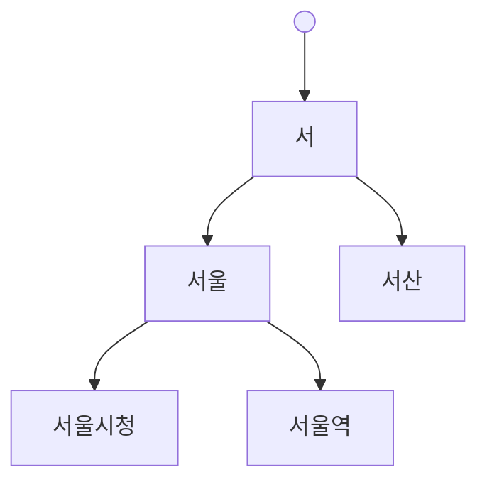

검색창에 글자를 칠 때마다 후보가 따라붙는 자동완성은 사용자에겐 마법처럼 보이지만, 백엔드 관점에선 **"타이핑 한 번마다 날아오는 요청을 어떻게 수십 밀리초 안에 받아내는가"** 라는 지연(latency) 문제다. 일반 검색은 1초가 허용되어도 자동완성이 1초면 쓸모가 없다. 사용자는 이미 다음 글자를 쳤기 때문이다.

## 왜 LIKE '%키워드%'는 자동완성에 못 쓰는가

가장 먼저 떠오르는 `WHERE name LIKE '서울%'`는 **접두(prefix) 매칭**이라 그나마 인덱스를 탈 수 있다. B-Tree 인덱스는 정렬되어 있어 "서울"로 시작하는 구간을 범위 스캔으로 찾는다. 하지만 `LIKE '%서울%'`처럼 **앞에 와일드카드**가 붙으면 정렬 순서가 무의미해져 인덱스를 못 타고 풀스캔이 된다. 자동완성을 "중간 어디든 매칭"으로 만들면 데이터가 늘수록 급격히 느려진다.

## 트라이: 접두를 공유하는 트리

대규모·고빈도 접두 검색의 정석은 **트라이(trie, 접두사 트리)** 다. 각 노드가 한 글자를 나타내고, 같은 접두를 가진 단어들이 경로를 공유한다. "서울"을 입력하면 루트에서 ㅅ→ㅓ→ㅇ→ㅜ→ㄹ 경로를 따라 내려가, 그 서브트리 아래 매달린 모든 완성어를 모은다.



조회 비용은 데이터 개수 N이 아니라 **입력한 접두 길이 L** 에 비례한다. 즉 O(L). 단어가 100만 개든 1000만 개든, "서울"이라는 두 글자를 따라 내려가는 비용은 같다. 이것이 자동완성이 즉각 응답하는 근본 원리다. 보통 각 노드에 인기도·빈도를 저장해, 서브트리에서 상위 K개만 골라 정렬해 반환한다.

한글처럼 자모 단위로 더 잘게 쪼개거나(초성 검색), 오타·부분 일치까지 다루려면 **n-gram** 색인을 함께 쓴다. "서울역"을 2-gram으로 쪼개면 "서울","울역" 토큰이 되고, 각 토큰에 역색인을 걸어 부분 일치를 빠르게 찾는다. 트라이는 깔끔한 접두에, n-gram은 부분·오타 허용에 강하다.

## 지연을 잡는 3종 세트

알고리즘만큼 중요한 게 **요청을 줄이고 응답을 작게 유지하는 것**이다.

```java
@GetMapping("/suggest")
public List<String> suggest(@RequestParam String q) {
    String prefix = q.strip();
    if (prefix.length() < 2) return List.of();   // 1글자는 후보 폭발 → 무시
    return cache.get(prefix, () ->
        trie.findTopK(prefix, 10));              // 결과 수 제한 + 캐싱
}
```

- **디바운스(클라이언트):** 키 입력마다 보내지 않고, 타이핑이 잠깐(예: 150ms) 멈추면 그때 한 번 보낸다. 빠르게 치는 사용자의 중간 요청을 대부분 없앤다.
- **결과 수 제한:** 사용자는 상위 10개면 충분하다. 전부 반환하지 않는다. 응답이 작아야 직렬화·전송도 빠르다.
- **캐싱:** 인기 접두("서","서울")는 수많은 사용자가 동일하게 친다. 결과를 짧은 TTL로 캐시하면 매번 트라이를 타지 않는다.

## 운영 함정

**짧은 접두의 후보 폭발.** "ㅅ" 한 글자는 수십만 후보를 매칭한다. 최소 입력 길이(2~3자)를 강제하고, 그래도 넓은 접두는 인기도 상위 K로 강하게 잘라야 한다. 자르지 않으면 트라이 조회는 빨라도 직렬화·네트워크에서 무너진다.

**인덱스 갱신 지연.** 트라이·역색인은 메모리에 떠 있는 보조 구조라, 원본 데이터가 바뀌어도 자동 갱신되지 않는다. 신규 항목이 자동완성에 안 뜨는 사고가 흔하다. 변경 이벤트로 색인을 갱신하거나, 주기적 재빌드 + 허용 가능한 신선도(staleness)를 명시적으로 합의하라.

## 핵심 요약

- `LIKE '%x%'`는 인덱스를 못 타니 자동완성엔 부적합하다. 접두 검색은 트라이로 O(접두 길이)에 푼다.
- 트라이는 접두 공유, n-gram은 부분·오타 매칭에 강하다. 보통 함께 쓴다.
- 디바운스·결과 수 제한·캐싱이 알고리즘만큼 지연을 좌우한다. 색인 신선도는 별도로 관리한다.

**면접 한 줄 Q&A.** "트라이 조회가 데이터 양과 무관한 이유는?" → 비용이 전체 단어 수 N이 아니라 입력한 접두 길이 L에 비례하기 때문이다(O(L)).
