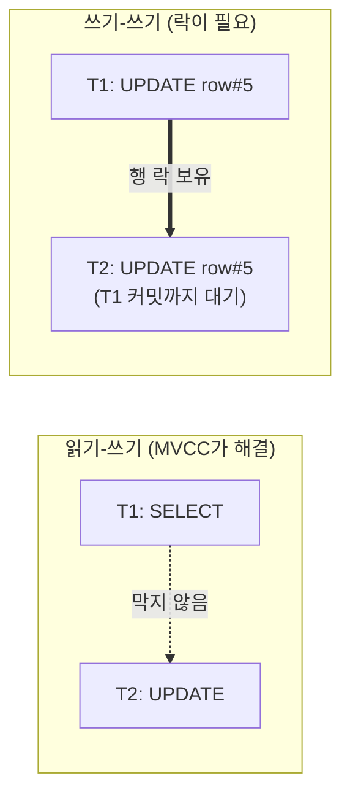
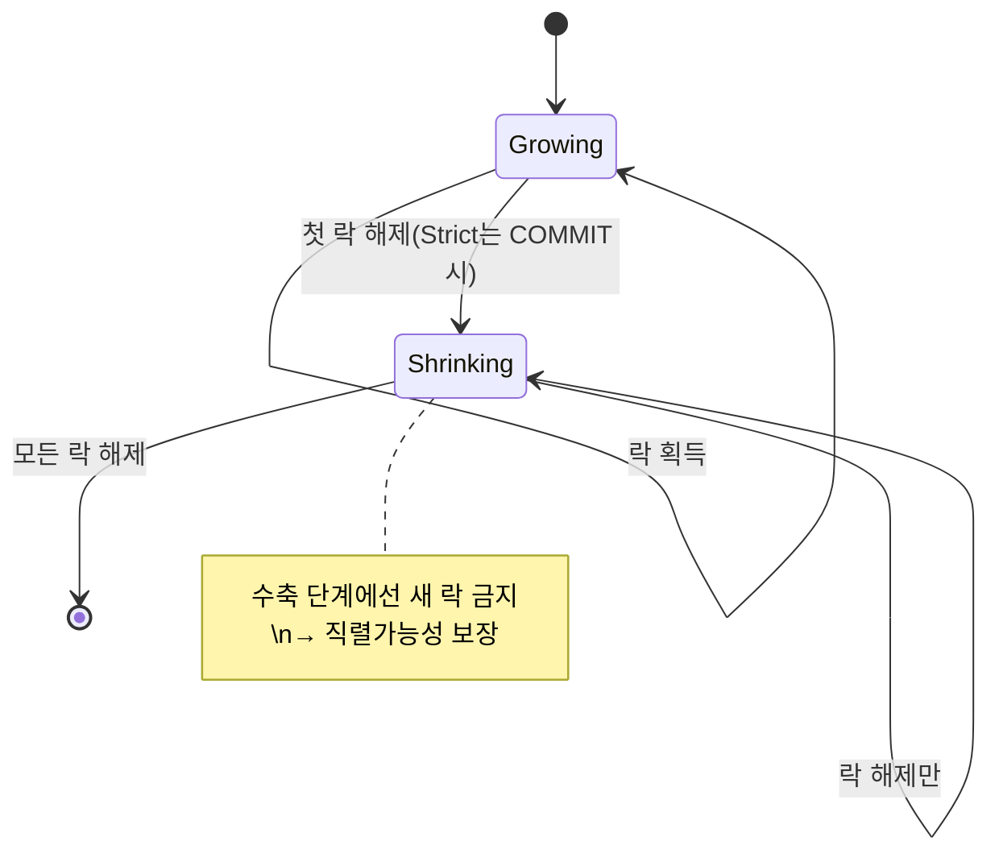
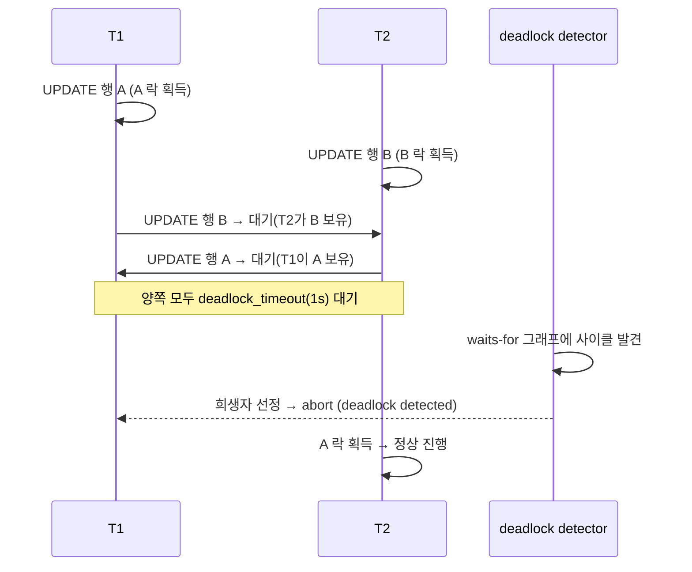

## "분명 MVCC라 읽기는 안 막힌다며 — 근데 왜 멈췄지?"

장바구니에서 재고를 차감하는 코드를 짰습니다. `SELECT stock FROM items WHERE id=1`로 읽고, 앱에서 `stock-1`을 계산해 `UPDATE items SET stock=... WHERE id=1`로 씁니다. 평소엔 멀쩡한데, 이벤트 때 동시 주문이 몰리자 **재고가 음수**가 되거나 **두 주문이 같은 재고를 깎아** 하나가 공짜로 새어 나갑니다. 또 어떤 날은 잘 돌던 배치가 갑자기 `ERROR: deadlock detected`를 뱉고 한쪽 트랜잭션이 통째로 죽습니다.

[앞 글(MVCC 내부)]()에서 봤듯 PostgreSQL의 MVCC는 **읽기가 쓰기를 막지 않고, 쓰기가 읽기를 막지 않습니다**. 각자 자기 스냅샷에서 적절한 버전을 보니까요. 그런데 그게 만능이라면 위 증상은 왜 생길까요? 답은 단순합니다. **MVCC는 읽기-쓰기 충돌만 해결**합니다. **쓰기-쓰기 충돌**(같은 행을 둘이 동시에 바꾸려는 것)은 버전으로 해결할 수 없습니다 — 누군가는 기다려야 하고, 그 "기다리게 하는 장치"가 바로 **락(lock)**입니다.

## MVCC가 끝내지 못한 일: 쓰기-쓰기 충돌

같은 행을 두 트랜잭션이 동시에 `UPDATE`하면 어떻게 될까요. MVCC는 UPDATE를 "새 버전 튜플 삽입 + 옛 버전 `xmax` 마킹"으로 처리한다고 했습니다. 두 트랜잭션이 동시에 새 버전을 만들면 버전 체인이 갈라져(fork) 일관성이 깨집니다. PostgreSQL은 이를 **행 단위 쓰기 락**으로 막습니다.

먼저 UPDATE를 시작한 T1이 그 튜플에 대한 **배타적 행 락**을 잡습니다. 나중에 같은 행을 UPDATE하려는 T2는 T1이 커밋/롤백할 때까지 **블록(대기)**됩니다. T1이 커밋하면 T2는 깨어나 갱신된 최신 버전을 다시 확인(EvalPlanQual)하고 그 위에서 자신의 UPDATE를 적용합니다. 즉 같은 행에 대한 쓰기는 **직렬화**됩니다.



핵심은 **읽기는 여전히 안 막힌다**는 것입니다. T2가 UPDATE를 기다리는 동안에도 T3의 `SELECT`는 옛 버전을 즉시 읽습니다. 락은 "쓰기 경합"이 있는 좁은 지점에만 걸립니다. 이것이 PostgreSQL이 높은 동시성을 내는 비결입니다.

## 행 수준 락의 네 가지 모드

행 락이라고 다 같지 않습니다. PostgreSQL은 행마다 네 가지 강도를 구분합니다. 강한 순서대로:

| 락 모드 | 획득 구문 | 막는 것 | 용도 |
|---|---|---|---|
| `FOR UPDATE` | `SELECT ... FOR UPDATE` | 다른 쓰기 + 모든 행 락 | "이 행을 곧 수정/삭제" 선점 |
| `FOR NO KEY UPDATE` | (키 외 컬럼 `UPDATE` 시 암묵) | FOR UPDATE 등 | 키 안 바꾸는 일반 UPDATE |
| `FOR SHARE` | `SELECT ... FOR SHARE` | 행 수정·삭제 | "내가 보는 동안 바뀌지 마" |
| `FOR KEY SHARE` | (FK 검사 시 암묵) | 키 변경·삭제만 | 외래키 무결성 보장 |

여기서 비-직관적인 핵심 하나. `FOR KEY SHARE`와 `FOR NO KEY UPDATE`는 **서로 충돌하지 않습니다**. 그래서 부모 행을 참조하는 자식 행을 INSERT(부모에 `FOR KEY SHARE`)하는 동안, 다른 트랜잭션이 그 부모의 비-키 컬럼을 UPDATE(`FOR NO KEY UPDATE`)할 수 있습니다. 키만 안 건드리면 FK 무결성은 깨지지 않으니까요. PostgreSQL 9.3에서 이 세분화가 들어오기 전엔 FK 검사가 `FOR SHARE`를 잡아 **참조만 해도 부모 UPDATE가 줄줄이 막히는** 악명 높은 경합이 있었습니다.

행 락은 메모리의 락 테이블이 아니라 **튜플 헤더의 `t_infomask`/`xmax`에 기록**됩니다(`HEAP_XMAX_KEYSHR_LOCK` 등 비트 + `xmax`에 락커 xid). 그래서 잠긴 행 수가 수백만이어도 메모리를 안 먹습니다. 단, 여러 트랜잭션이 한 행을 동시에 공유 락으로 잡으면 그 명단을 따로 둘 곳이 필요한데, 이게 **multixact**입니다(`pg_multixact`). multixact가 폭증하면 wraparound 위험과 함께 VACUUM 부하가 늘어, FK가 많은 스키마에서 의외의 운영 이슈가 됩니다.

### 튜플 락(tuple lock)이라는 숨은 단계

여러 트랜잭션이 같은 행의 락을 동시에 기다리면, 깨어날 때 **순서**가 필요합니다. PostgreSQL은 "지금 이 행에 대한 대기 권리"를 나타내는 보조 락인 **튜플 락**을 둡니다. `pg_locks`에서 `locktype = 'tuple'`로 보이며, 보통 행 락을 잡기 직전 잠깐 거치는 단계라 평소엔 안 보이지만, 한 행에 경합이 극심하면(인기 상품 재고 같은) 이 튜플 락 대기가 길어집니다.

## 테이블 수준 락과 모드 충돌 매트릭스

행 락 위에 **테이블 락**이 있습니다. 대부분 자동으로 잡힙니다 — `SELECT`는 `ACCESS SHARE`, `INSERT/UPDATE/DELETE`는 `ROW EXCLUSIVE`, `CREATE INDEX`는 `SHARE`, `ALTER TABLE`/`DROP`/`TRUNCATE`/`VACUUM FULL`은 `ACCESS EXCLUSIVE`. 8가지 모드의 충돌 여부가 모든 DDL 경합의 근본입니다.

| 보유 ↓ / 요청 → | ACCESS SHARE | ROW EXCL | SHARE | ACCESS EXCL |
|---|:---:|:---:|:---:|:---:|
| ACCESS SHARE (SELECT) | OK | OK | OK | **충돌** |
| ROW EXCLUSIVE (DML) | OK | OK | **충돌** | **충돌** |
| SHARE (CREATE INDEX) | OK | **충돌** | OK | **충돌** |
| ACCESS EXCLUSIVE (ALTER) | **충돌** | **충돌** | **충돌** | **충돌** |

실무에서 가장 자주 데이는 곳: `ALTER TABLE`은 `ACCESS EXCLUSIVE`를 요구하므로 **단 하나의 `SELECT`라도 진행 중이면** 대기에 들어가고, 그 뒤에 도착하는 모든 쿼리가 그 `ALTER` 뒤에 줄을 섭니다. 결과는 짧은 DDL 하나가 **전체 서비스를 정지**시키는 락 큐 폭탄입니다. 그래서 마이그레이션엔 반드시 `lock_timeout`을 짧게 걸어 "못 잡으면 빨리 포기하고 재시도"하게 만듭니다.

```sql
SET lock_timeout = '3s';            -- 락 못 잡으면 3초 후 에러
ALTER TABLE orders ADD COLUMN memo text;  -- 짧고 안전하게
```

### 권고 락(advisory lock): DB를 분산 뮤텍스로

행·테이블과 무관하게, 애플리케이션이 의미를 정하는 **권고 락**도 있습니다. `pg_advisory_lock(key)` — DB 어디에도 묶이지 않은 순수한 64비트 키 뮤텍스입니다. "이 배치는 동시에 한 인스턴스만" 같은 분산 잠금을 별도 Redis 없이 구현할 때 씁니다. 세션 스코프(`pg_advisory_lock`)와 트랜잭션 스코프(`pg_advisory_xact_lock`, 커밋 시 자동 해제)가 있어, 보통 자동 해제되는 후자가 누수 위험이 적어 안전합니다.

## 2PL: "락을 언제 푸느냐"가 직렬가능성을 만든다

락을 잡는 것보다 **언제 푸느냐**가 더 중요합니다. **2단계 잠금(Two-Phase Locking, 2PL)**의 규칙은 단순합니다.

1. **확장 단계(growing)**: 락을 획득하기만 한다.
2. **수축 단계(shrinking)**: 한 번 락을 풀기 시작하면, 그 뒤로는 새 락을 절대 잡지 않는다.

이 "한 번 풀면 더 안 잡는다"는 규칙이 **직렬가능성(serializability)**을 보장합니다 — 동시에 실행했지만 결과가 "어떤 순차 실행"과 동일함이 증명됩니다. 특히 **엄격한 2PL(Strict 2PL)**은 모든 쓰기 락을 **커밋/롤백 시점까지** 쥐고 있다가 한꺼번에 풉니다. PostgreSQL의 행 쓰기 락이 정확히 이 방식이라, 트랜잭션이 끝나기 전엔 잡은 행 락이 풀리지 않습니다.



다만 PostgreSQL의 기본 격리에서 일반 `SELECT`는 락이 아니라 MVCC 스냅샷으로 읽으므로, 순수 2PL을 모든 읽기에 적용하진 않습니다. 진짜 직렬성이 필요하면 `SERIALIZABLE` 격리(SSI)를 쓰거나, 명시적 `SELECT FOR UPDATE/SHARE`로 읽기에도 락을 걸어 2PL 효과를 냅니다.

## 데드락은 왜 생기나 — 그리고 PostgreSQL은 어떻게 푸나

2PL을 지키면 직렬가능성은 얻지만, **데드락**이라는 부작용이 따라옵니다. 서로가 상대가 쥔 락을 기다리며 영원히 멈추는 상태입니다. 전형적인 형성 과정: T1은 행 A를 잡고 B를 원하고, T2는 행 B를 잡고 A를 원합니다 — **락 획득 순서가 엇갈린** 순간 사이클이 닫힙니다.

<div class="lock-cycle" markdown="0">
<style>
.lock-cycle{margin:1.4rem 0;overflow-x:auto}
.lock-cycle svg{width:100%;max-width:680px;height:auto;display:block;margin:0 auto;font-family:inherit}
.lock-cycle .lbl{fill:currentColor;font-size:13px;font-weight:700}
.lock-cycle .sub{fill:currentColor;font-size:10.5px;opacity:.6}
.lock-cycle .row{stroke:currentColor;stroke-width:1.4;fill:none;opacity:.45}
.lock-cycle .txn{stroke:currentColor;stroke-width:1.6;fill:none;opacity:.7}
.lock-cycle .hold{stroke:#2f9e44;stroke-width:2.4;fill:none;opacity:0;animation:lcHold 7s ease-in-out infinite}
.lock-cycle .h1{animation-delay:0s}
.lock-cycle .h2{animation-delay:1.4s}
.lock-cycle .wait{stroke:#f08c00;stroke-width:2.2;fill:none;stroke-dasharray:5 4;opacity:0;animation:lcWait 7s ease-in-out infinite}
.lock-cycle .w1{animation-delay:2.8s}
.lock-cycle .w2{animation-delay:3.6s}
.lock-cycle .cyc{stroke:#e03131;stroke-width:2.6;fill:none;opacity:0;animation:lcCyc 7s ease-in-out infinite}
.lock-cycle .victim{fill:#e03131;opacity:0;animation:lcVic 7s ease-in-out infinite}
.lock-cycle .arrow{fill:#f08c00;opacity:0;animation:lcWait 7s ease-in-out infinite}
.lock-cycle .a1{animation-delay:2.8s}
.lock-cycle .a2{animation-delay:3.6s}
@keyframes lcHold{0%,8%{opacity:0}14%,82%{opacity:.9}92%,100%{opacity:0}}
@keyframes lcWait{0%,40%{opacity:0}48%,82%{opacity:.85}92%,100%{opacity:0}}
@keyframes lcCyc{0%,68%{opacity:0}74%,82%{opacity:.95}92%,100%{opacity:0}}
@keyframes lcVic{0%,84%{opacity:0}88%,96%{opacity:.9}100%{opacity:0}}
</style>
<svg viewBox="0 0 680 320" role="img" aria-label="두 트랜잭션이 서로의 행 락을 기다리며 대기 그래프에 사이클이 닫혀 데드락이 형성되고, 검출기가 한쪽을 희생자로 abort하는 애니메이션">
  <!-- transactions -->
  <ellipse class="txn" cx="120" cy="80" rx="70" ry="34"/>
  <text class="lbl" x="120" y="78" text-anchor="middle">T1</text>
  <text class="sub" x="120" y="96" text-anchor="middle">A 잡고 → B 원함</text>
  <ellipse class="txn" cx="560" cy="80" rx="70" ry="34"/>
  <text class="lbl" x="560" y="78" text-anchor="middle">T2</text>
  <text class="sub" x="560" y="96" text-anchor="middle">B 잡고 → A 원함</text>
  <!-- rows -->
  <rect class="row" x="70" y="220" width="100" height="44" rx="5"/>
  <text class="lbl" x="120" y="247" text-anchor="middle">행 A</text>
  <rect class="row" x="510" y="220" width="100" height="44" rx="5"/>
  <text class="lbl" x="560" y="247" text-anchor="middle">행 B</text>
  <!-- holds (green) -->
  <path class="hold h1" d="M 120,114 L 120,220" marker-end="url(#lcgreen)"/>
  <path class="hold h2" d="M 560,114 L 560,220" marker-end="url(#lcgreen)"/>
  <text class="sub" x="92" y="170" text-anchor="end" fill="#2f9e44" opacity=".9">①T1이 A 락</text>
  <text class="sub" x="588" y="170" text-anchor="start" fill="#2f9e44" opacity=".9">②T2가 B 락</text>
  <!-- waits (orange, dashed) -->
  <path class="wait w1" d="M 175,90 L 505,90"/>
  <polygon class="arrow a1" points="505,90 491,83 491,97"/>
  <path class="wait w2" d="M 505,70 L 175,70"/>
  <polygon class="arrow a2" points="175,70 189,63 189,77"/>
  <text class="sub" x="340" y="58" text-anchor="middle" fill="#f08c00">③ 서로의 락을 대기 → 대기 그래프</text>
  <!-- deadlock cycle highlight -->
  <ellipse class="cyc" cx="340" cy="80" rx="300" ry="60"/>
  <text class="lbl" x="340" y="150" text-anchor="middle" fill="#e03131" class="cyc">④ 사이클 탐지 = 데드락</text>
  <!-- victim -->
  <rect class="victim" x="52" y="44" width="136" height="72" rx="36"/>
  <text class="lbl" x="120" y="300" text-anchor="middle" fill="#e03131" class="victim">⑤ T1을 희생자로 abort</text>
  <defs>
    <marker id="lcgreen" markerWidth="8" markerHeight="8" refX="6" refY="4" orient="auto"><polygon points="0,0 8,4 0,8" fill="#2f9e44"/></marker>
  </defs>
</svg>
</div>

PostgreSQL은 데드락을 **예방하지 않습니다**(락 순서를 강제하면 동시성이 죽으니까). 대신 **검출 후 해소**합니다. 트랜잭션이 락을 기다리기 시작하면 곧장 검사하지 않고, `deadlock_timeout`(기본 1초) 만큼 기다립니다 — 대부분의 대기는 데드락이 아니라 곧 풀리니, 매번 검사하면 낭비이기 때문입니다. 타임아웃이 지나도 못 잡으면 **deadlock detector**가 깨어나 **대기 그래프(waits-for graph)**를 그립니다: 노드=트랜잭션, 간선 = "X가 Y의 락을 기다림". 이 방향 그래프에 **사이클이 있으면 데드락 확정**입니다.

사이클을 찾으면 그 안의 한 트랜잭션을 **희생자(victim)**로 골라 `ERROR: deadlock detected`와 함께 강제 abort합니다. 그러면 그가 쥔 락이 풀려 사이클이 끊기고 나머지는 진행합니다. 희생자가 죽는 비용이 데드락 해소의 대가이며, 애플리케이션은 이 에러를 잡아 **재시도**해야 합니다.



**데드락을 피하는 실전 원칙은 단 하나**: 여러 행/자원을 잡을 땐 **항상 같은 순서로** 잡는다(예: 항상 작은 id부터). 위 예에서 T1·T2가 모두 "A 먼저, B 나중"으로 잡았다면 사이클이 닫히지 않아 데드락이 생기지 않습니다.

## Lost Update를 `SELECT FOR UPDATE`로 막기

다시 도입부의 재고 차감으로 돌아갑니다. 문제의 정체는 [9편(격리 수준)]()에서 본 **lost update**입니다. T1과 T2가 동시에 `stock=10`을 읽고, 각자 `10-1=9`를 계산해 쓰면, **두 번 팔렸는데 재고는 1만 줄어** 한 건이 사라집니다(분실된 갱신).

`READ COMMITTED`에서 둘 다 옛 스냅샷의 `10`을 읽기 때문에 생깁니다. 락이 없는 `SELECT`는 서로를 못 보거든요. 해법은 **읽는 시점에 쓰기 의도를 선언**하는 것:

```sql
BEGIN;
-- 그냥 SELECT가 아니라 FOR UPDATE: 이 행에 배타적 행 락을 건다
SELECT stock FROM items WHERE id = 1 FOR UPDATE;   -- T2는 여기서 대기
UPDATE items SET stock = stock - 1 WHERE id = 1;
COMMIT;
```

T1이 `FOR UPDATE`로 행을 잠그면, T2의 `FOR UPDATE`는 T1 커밋까지 **블록**됩니다. T1 커밋 후 T2가 깨어나 다시 읽으면 이번엔 `9`를 보고 `8`로 갱신합니다. 갱신이 직렬화되어 분실이 사라집니다.

> **더 간단한 길**: 사실 위 예는 `UPDATE items SET stock = stock - 1 WHERE id = 1`만으로도 안전합니다. UPDATE가 잡는 행 락 + "최신 버전 재평가" 덕분에 두 번째 트랜잭션이 갱신된 `9`에서 `8`로 깎으니까요. `FOR UPDATE`는 **읽은 값으로 분기(앱 로직)를 한 뒤 그 값으로 써야 할 때** 필요합니다(예: 재고가 0보다 크면만 차감). DB에서 산술로 끝낼 수 있으면 원자적 UPDATE가 제일 깔끔합니다.

대기 없이 즉시 실패하고 싶으면 `FOR UPDATE NOWAIT`(못 잡으면 즉시 에러), 잠긴 행은 건너뛰고 싶으면 `FOR UPDATE SKIP LOCKED`(작업 큐를 여러 워커가 나눠 가질 때의 표준 패턴)를 씁니다.

## 락 경합 진단: 누가 무엇을 기다리나

운영 중 "쿼리가 멈췄다"의 절반은 락 대기입니다. 무엇이 무엇을 막는지는 `pg_locks`와 `pg_stat_activity`를 조인해 봅니다.

```sql
-- 누가(blocked) 누구에게(blocking) 막혔는지 한눈에
SELECT a.pid          AS blocked_pid,
       a.query        AS blocked_query,
       bl.pid         AS blocking_pid,
       b.query        AS blocking_query,
       a.wait_event_type, a.wait_event
FROM pg_stat_activity a
JOIN pg_locks         wl ON wl.pid = a.pid AND NOT wl.granted
JOIN pg_locks         bl ON bl.locktype = wl.locktype
       AND bl.database IS NOT DISTINCT FROM wl.database
       AND bl.relation IS NOT DISTINCT FROM wl.relation
       AND bl.page     IS NOT DISTINCT FROM wl.page
       AND bl.tuple    IS NOT DISTINCT FROM wl.tuple
       AND bl.transactionid IS NOT DISTINCT FROM wl.transactionid
       AND bl.granted
JOIN pg_stat_activity b ON b.pid = bl.pid
WHERE a.pid <> bl.pid;

-- 더 쉬운 길: 내장 함수
SELECT pid, pg_blocking_pids(pid) AS blocked_by, wait_event, query
FROM pg_stat_activity
WHERE wait_event_type = 'Lock';
```

핵심 진단·방어 도구:

- **`lock_timeout`**: 락을 N 시간 못 잡으면 쿼리를 에러로 끝낸다. 마이그레이션·DDL의 필수 안전벨트.
- **`deadlock_timeout`**: 데드락 검사 발동 지연(기본 1s). 낮추면 검출은 빨라지나 CPU 부담. 보통 그대로 둔다.
- **`log_lock_waits = on`**: `deadlock_timeout`보다 오래 기다린 락 대기를 로그로 남겨, 데드락이 아닌 긴 경합까지 추적.
- **`idle_in_transaction_session_timeout`**: `BEGIN` 후 손 놓고 락만 쥔 좀비 트랜잭션을 끊는다. 락 경합의 흔한 진짜 원인.

마지막은 [앞 글(MVCC)]()와 이어집니다: 오래 열린 트랜잭션은 락만 쥐는 게 아니라 **VACUUM이 죽은 튜플을 회수하지 못하게** 막아 블로트까지 키웁니다. 락 경합과 블로트는 같은 뿌리(긴 트랜잭션)에서 자라는 쌍둥이 문제입니다(운영 관점은 [20편]()에서).

## 면접/리뷰 단골 질문

- **Q. MVCC가 있는데 락이 왜 필요한가?** → MVCC는 읽기-쓰기 충돌만 버전으로 해결한다. **쓰기-쓰기 충돌**(같은 행 동시 수정)은 버전으로 풀 수 없어, 한쪽을 기다리게 하는 행 쓰기 락이 필요하다.
- **Q. `SELECT FOR UPDATE`는 무엇을 막나?** → 그 행에 배타적 행 락을 걸어, 다른 트랜잭션의 UPDATE/DELETE/FOR UPDATE를 커밋 시점까지 대기시킨다. read-modify-write의 lost update를 막는 표준 도구다.
- **Q. PostgreSQL은 데드락을 어떻게 처리하나?** → 예방하지 않고 검출한다. `deadlock_timeout`(1s) 후 대기 그래프(waits-for graph)에 사이클이 있으면 데드락으로 판정, 한 트랜잭션을 희생자로 abort한다. 앱은 재시도해야 한다.
- **Q. 데드락을 줄이는 가장 효과적인 방법은?** → 여러 자원을 **항상 동일한 순서**로 잠근다(예: id 오름차순). 획득 순서가 일정하면 대기 그래프에 사이클이 닫히지 않는다.
- **Q. `ALTER TABLE` 한 줄이 서비스를 멈추는 이유는?** → `ACCESS EXCLUSIVE` 락은 진행 중인 SELECT 하나에도 막히고, 그 뒤 도착한 모든 쿼리가 줄을 선다. `lock_timeout`을 짧게 걸어 못 잡으면 포기·재시도하게 해야 한다.
- **Q. 2PL이 직렬가능성을 어떻게 보장하나?** → 락을 한 번 풀기 시작하면 새 락을 안 잡는 규칙(수축 단계)이 동시 실행을 어떤 순차 실행과 동치로 만든다. Strict 2PL은 쓰기 락을 커밋까지 쥐어 회복 가능성까지 보장한다.

## 정리

- **MVCC는 읽기-쓰기만 해결**한다. 같은 행을 동시에 쓰는 **쓰기-쓰기 충돌**은 행 쓰기 락으로 직렬화한다 — 그 와중에도 읽기는 안 막힌다.
- 행 락은 4모드(`FOR UPDATE`/`NO KEY UPDATE`/`FOR SHARE`/`KEY SHARE`)로 세분화되고, 튜플 헤더(`xmax`/`infomask`, 다수면 multixact)에 기록돼 잠긴 행이 많아도 메모리를 안 먹는다. 위로는 8모드 **테이블 락**, 옆으로는 앱이 정의하는 **권고 락**이 있다.
- **2PL**은 "한 번 풀면 새 락 금지"로 직렬가능성을, **Strict 2PL**(커밋까지 보유)은 PostgreSQL 쓰기 락의 동작이다.
- **데드락**은 락 획득 순서가 엇갈려 대기 그래프에 사이클이 닫힐 때 생긴다. PostgreSQL은 검출 후 희생자를 abort하며, **동일 순서 잠금**이 최선의 예방이다.
- lost update는 `SELECT FOR UPDATE`(또는 원자적 UPDATE)로 막고, 경합은 `pg_locks`·`pg_blocking_pids()`·`lock_timeout`·`log_lock_waits`로 진단한다.

> 다음 글: 락도 MVCC도 결국 디스크 위 데이터의 안전을 전제로 한다. 정전이 나도 커밋된 데이터가 안 날아가는 이유 — [WAL과 크래시 복구]()로 이어집니다.
