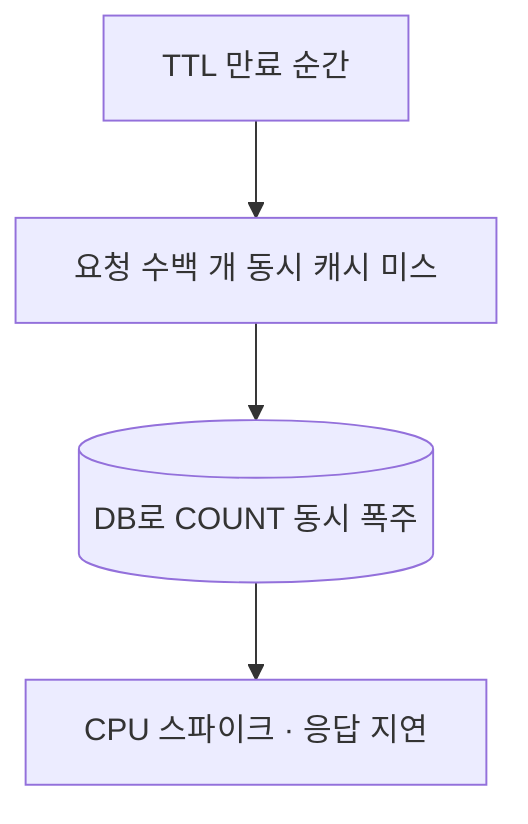

목록 화면 하단의 "총 1,284,503건"은 페이지를 넘길 때마다 다시 계산된다. 그런데 이 숫자는 대부분 **거의 변하지 않는다.** 매 요청마다 무거운 `COUNT(*)`를 도는 건 낭비라, 자연히 캐시를 떠올린다. 여기서 캐시 초보와 실무자를 가르는 함정이 하나 있다. **캐시 스탬피드(cache stampede)**, 일명 dog-piling이다.

## 왜 count는 캐시 후보인가, 그리고 왜 위험한가

`COUNT(*)`는 조건에 맞는 행을 세야 해서, 인덱스를 타더라도 매칭 범위가 넓으면 비싸다. 반면 총건수는 페이지 번호·정렬과 무관하게 동일하고, 분 단위로 봐도 거의 안 변한다. 그래서 결과를 TTL과 함께 캐시에 넣는다.

문제는 **TTL이 만료되는 그 순간**이다. 인기 목록이라 초당 수백 요청이 들어온다고 하자. 캐시가 살아 있는 동안은 전부 캐시에서 답한다. 그러다 TTL이 지나 키가 사라지는 찰나, 그 수백 요청이 **동시에 캐시 미스**를 맞고, **전부 DB로 무거운 count를 던진다.** 모두 똑같은 답을 구하려고 똑같은 무거운 쿼리를 동시에 수백 번 돌리는 것이다. 이게 스탬피드다. DB CPU가 튀고, 응답이 느려지고, 그 사이 더 많은 요청이 쌓이며 악순환이 시작된다.



## 해법 1: single-flight (락 기반 재계산)

핵심 아이디어는 **"여러 요청이 동시에 미스를 맞아도, 실제 DB 계산은 단 하나만 하게"** 만드는 것이다. 미스가 나면 짧은 분산 락을 잡고, 락을 얻은 한 요청만 DB를 조회해 캐시에 채운다. 나머지는 잠깐 기다렸다가 채워진 값을 읽는다.

```java
public long getTotalCount(String key) {
    Long cached = cache.get(key);
    if (cached != null) return cached;

    // 락을 얻은 한 요청만 DB로 — single-flight
    if (lock.tryLock(key, Duration.ofSeconds(5))) {
        try {
            Long again = cache.get(key);    // 더블 체크: 그새 채워졌을 수 있다
            if (again != null) return again;
            long c = repository.countAll();  // 실제 무거운 쿼리는 여기 한 번
            cache.put(key, c, Duration.ofMinutes(5));
            return c;
        } finally {
            lock.unlock(key);
        }
    }
    // 락 못 잡은 요청은 짧게 대기 후 캐시 재조회 (또는 직전 값 반환)
    sleepBriefly();
    Long filled = cache.get(key);
    return filled != null ? filled : repository.countAll();
}
```

## 해법 2: 조기 재계산(probabilistic early expiration)

락은 견고하지만 만료 직후의 대기가 생긴다. 더 부드러운 방법은 **만료 직전에 미리, 확률적으로 갱신**하는 것이다. 캐시에 값과 함께 "계산에 걸린 시간 delta"와 만료 시각을 저장하고, 읽을 때마다 `now - delta * β * ln(rand()) >= expiry` 같은 식으로 판단한다. 만료가 가까울수록 한 요청이 *남들보다 먼저* 자발적으로 재계산을 떠맡을 확률이 높아진다. 그동안 다른 요청은 아직 유효한 옛 값을 계속 받는다. 만료 순간의 동시 미스 자체가 사라진다.

## 운영 함정

**TTL을 일제히 같게 주면 스탬피드를 만든다.** 여러 키를 한 번에 워밍업하면 만료도 한꺼번에 온다. TTL에 약간의 **지터(jitter)**, 예컨대 `5분 ± 랜덤 30초`를 더해 만료 시점을 흩뿌려라.

**무효화와 TTL의 책임 혼동.** 데이터가 *실제로* 바뀌었을 때(대량 등록/삭제)는 TTL 만료를 기다리지 말고 키를 능동적으로 무효화하거나 갱신해야 한다. TTL은 "이만큼은 옛 값을 허용한다"는 신선도 한계일 뿐, 정확성 보장 장치가 아니다.

## 핵심 요약

- 잘 안 변하는 총건수는 캐시 대상이지만, TTL 만료 순간 동시 미스가 DB로 쏟아지는 스탬피드가 위험이다.
- single-flight(락)로 실제 재계산을 하나로 줄이거나, 조기 재계산으로 만료 직전 미리 갱신해 동시 미스를 없앤다.
- TTL에 지터를 더하고, 실제 데이터 변경 시엔 TTL이 아니라 능동적 무효화로 대응한다.

**면접 한 줄 Q&A.** "캐시 스탬피드가 뭔가?" → 인기 키의 TTL이 만료되는 순간 다수 요청이 동시에 미스를 맞고 같은 무거운 쿼리를 DB로 한꺼번에 던지는 현상. single-flight나 조기 재계산으로 막는다.
