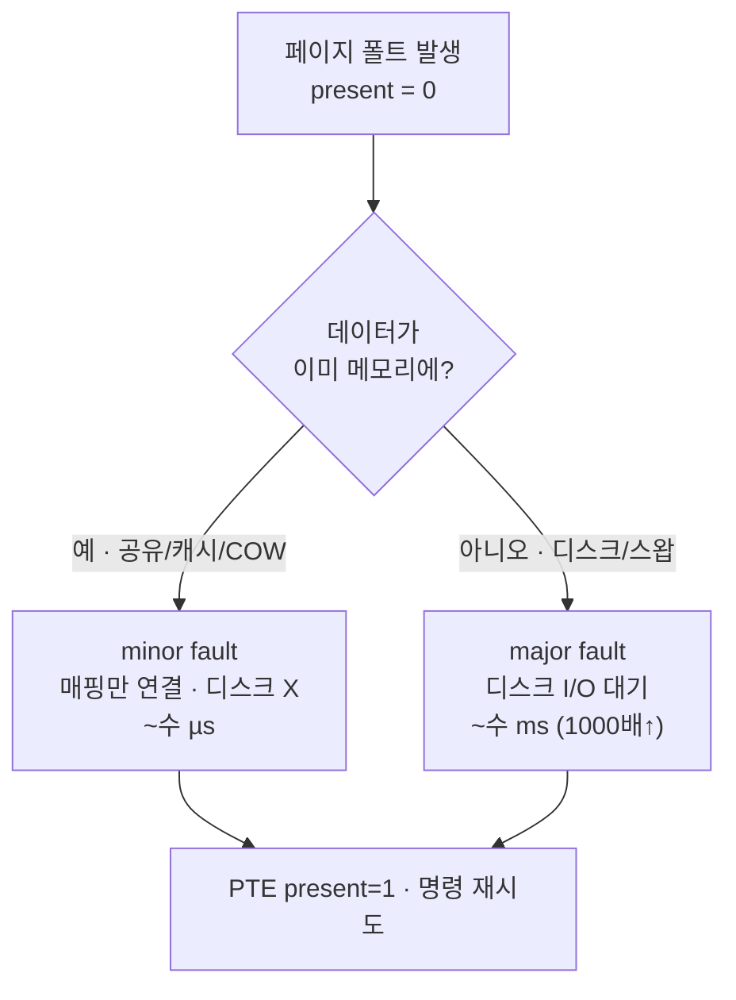

## "1GB를 달라고 했는데 1초도 안 걸렸다"

물리 메모리가 800MB밖에 안 남은 노트북에서 `malloc(1L << 30)` — 1GB를 요청해도 함수는 **즉시 성공**합니다. 심지어 8GB, 16GB를 달라고 해도 포인터가 척척 돌아옵니다. 물리 메모리보다 많이 줬는데 어떻게 성공할까요?

답은 운영체제가 한 거대한 거짓말에 있습니다 — **"줄게"라고 약속만 하고, 실제로는 한 바이트도 안 줍니다.** 메모리는 당신이 *건드리는 순간*에야 비로소 할당됩니다. 이 게으름(laziness)이 디맨드 페이징이고, 그 게으름을 떠받치는 하드웨어 메커니즘이 **페이지 폴트(page fault)** 입니다. 이 글은 "없는 페이지에 접근했을 때" 커널 안에서 정확히 무슨 일이 벌어지는지, 그리고 그 게으름이 메모리가 진짜 모자랄 때 어떻게 스왑과 OOM killer로 이어지는지를 끝까지 따라갑니다.

## 가상 주소는 약속어음이다

[앞서 본]() 페이지 테이블 엔트리(PTE)에는 **present 비트**가 있습니다. 이 한 비트가 모든 마법의 시작입니다.

- `malloc`/`mmap`이 하는 일은 가상 주소 공간에 **VMA(가상 메모리 영역)를 등록**하는 것뿐입니다. "이 주소 범위는 너 거야"라고 장부에 적을 뿐, 물리 프레임은 안 붙입니다.
- 이때 페이지 테이블 엔트리는 `present = 0` — "아직 물리 메모리에 없음" 상태입니다.
- 그래서 `malloc(1GB)`는 장부에 한 줄 적는 것이라 즉시 끝납니다. 물리 메모리 소비는 **0**입니다.

이것이 가상 메모리의 `VSZ`(가상 크기)와 `RSS`(실제 점유 물리 메모리)가 크게 차이 나는 이유입니다. 1GB를 할당해도 RSS는 안 늘고, 당신이 그 메모리에 *처음 쓰는* 페이지(4KB)마다 RSS가 4KB씩 자랍니다.

> **현실 체크 — "할당 성공 ≠ 메모리 확보."** 프로덕션에서 `malloc`이 성공했다고 안심하면 안 됩니다. 리눅스는 기본적으로 **overcommit**(있지도 않은 메모리를 약속)하기 때문에, 실제로 페이지를 건드리는 순간 물리 메모리가 모자라면 그때 가서 **OOM killer**가 당신의 프로세스를 죽입니다. "왜 멀쩡히 돌던 프로세스가 갑자기 SIGKILL로 죽지?"의 단골 원인입니다.

## 페이지 폴트: 없는 페이지를 건드리는 순간

CPU가 `present = 0`인 가상 주소에 접근하면, MMU는 변환에 실패하고 **페이지 폴트 예외**를 일으켜 커널로 trap합니다. 이건 에러가 아니라 **정상적인 메모리 채움 메커니즘**입니다. 아래 애니메이션에서 CPU의 접근(①)이 `present=0`을 만나 커널로 떨어지고(②), 커널이 빈 프레임을 할당해 (필요하면 디스크에서 내용을 읽어) 매핑한 뒤(③), `present=1`로 바꾸고, **방금 실패한 그 명령을 다시 실행**(④)해 이번엔 성공하는 흐름을 보세요.

<div class="os-pf-flow" markdown="0">
<style>
.os-pf-flow{margin:1.4rem 0;overflow-x:auto}
.os-pf-flow svg{width:100%;max-width:720px;height:auto;display:block;margin:0 auto;font-family:inherit}
.os-pf-flow .bx{fill:none;stroke:currentColor;stroke-width:1.4;opacity:.5}
.os-pf-flow .lbl{fill:currentColor;font-size:12px;font-weight:600}
.os-pf-flow .sub{fill:currentColor;font-size:10px;opacity:.65}
.os-pf-flow .tok{fill:#1971c2;animation:ospfmove 7s ease-in-out infinite}
.os-pf-flow .tok{offset-path:path('M 70,70 L 250,70 L 250,150 L 430,150 L 600,150 L 600,70 L 660,70');}
@keyframes ospfmove{0%{offset-distance:0%;opacity:0}3%{opacity:1}97%{opacity:1}100%{offset-distance:100%;opacity:1}}
.os-pf-flow .x0{fill:#e03131;font-size:16px;font-weight:700;opacity:0;animation:ospfx 7s ease-in-out infinite}
@keyframes ospfx{0%,20%{opacity:0}24%{opacity:1}40%{opacity:1}55%{opacity:0}100%{opacity:0}}
.os-pf-flow .ok{fill:#2f9e44;font-size:16px;font-weight:700;opacity:0;animation:ospfok 7s ease-in-out infinite}
@keyframes ospfok{0%,85%{opacity:0}92%{opacity:1}100%{opacity:1}}
.os-pf-flow .disk{stroke:#f08c00;stroke-width:2;fill:none;opacity:0;stroke-dasharray:4 3;animation:ospfdisk 7s ease-in-out infinite}
@keyframes ospfdisk{0%,45%{opacity:0}52%{opacity:.9}68%{opacity:.9}75%{opacity:0}100%{opacity:0}}
</style>
<svg viewBox="0 0 720 230" role="img" aria-label="CPU가 present 0 페이지에 접근해 페이지 폴트가 나고, 커널이 프레임을 할당·디스크 로드 후 매핑하여 명령을 재시도해 성공하는 과정 애니메이션">
  <rect class="bx" x="30" y="50" width="120" height="40" rx="6"/>
  <text class="lbl" x="90" y="74" text-anchor="middle">CPU 접근</text>
  <text class="sub" x="90" y="42" text-anchor="middle">① mov [addr]</text>

  <rect class="bx" x="200" y="50" width="120" height="40" rx="6"/>
  <text class="lbl" x="260" y="74" text-anchor="middle">PTE 확인</text>
  <text class="sub" x="260" y="42" text-anchor="middle">present = 0</text>
  <text class="x0" x="330" y="78">✕</text>

  <rect class="bx" x="370" y="130" width="160" height="40" rx="6"/>
  <text class="lbl" x="450" y="154" text-anchor="middle">커널 폴트 핸들러</text>
  <text class="sub" x="260" y="150" text-anchor="middle">② trap ↓</text>
  <text class="sub" x="450" y="190" text-anchor="middle">③ 프레임 할당 / 로드</text>

  <rect class="bx" x="560" y="130" width="120" height="40" rx="6"/>
  <text class="lbl" x="620" y="154" text-anchor="middle">디스크/스왑</text>
  <path class="disk" d="M 530,150 L 558,150"/>

  <rect class="bx" x="570" y="50" width="120" height="40" rx="6"/>
  <text class="lbl" x="630" y="74" text-anchor="middle">재시도 성공</text>
  <text class="sub" x="630" y="42" text-anchor="middle">④ present=1</text>
  <text class="ok" x="700" y="78">✓</text>
  <circle class="tok" r="7"/>
</svg>
</div>

핵심은 **투명성**입니다. 폴트가 처리되고 나면 커널은 폴트를 일으킨 명령으로 PC를 되돌려 *다시 실행*시키므로, 사용자 프로그램 입장에선 아무 일도 없었던 것처럼 보입니다. 그저 그 한 번의 접근이 조금 느렸을 뿐입니다 — 그 "조금"이 얼마나 느린지가 다음 이야기입니다.

## minor vs major: 1000배의 차이

모든 페이지 폴트가 같은 비용은 아닙니다. 폴트는 두 종류로 갈리고, 그 차이는 보통 **세 자릿수**입니다.

- **Minor fault(소프트 폴트)**: 필요한 데이터가 *이미 물리 메모리 어딘가에 있는* 경우. 디스크 I/O가 없습니다. 예 — 다른 프로세스가 이미 로드한 공유 라이브러리에 내 페이지 테이블만 연결하면 될 때, 또는 페이지 캐시에 이미 있는 파일을 mmap할 때. 수백 나노초~수 마이크로초.
- **Major fault(하드 폴트)**: 데이터를 *디스크에서 읽어와야* 하는 경우. 실행 파일·mmap 파일의 첫 접근, 또는 스왑 아웃됐던 페이지를 다시 가져올 때. 디스크 I/O가 끼므로 수 밀리초 — minor보다 **1000배 이상** 느립니다.



아래는 두 경로의 비용 차이를 길이로 보여줍니다. minor(<span style="color:#2f9e44;font-weight:600">초록</span>)는 메모리 안에서 짧게 끝나고, major(<span style="color:#f08c00;font-weight:600">주황</span>)는 디스크까지 멀리 다녀와 훨씬 오래 걸립니다.

<div class="os-pf-cost" markdown="0">
<style>
.os-pf-cost{margin:1.4rem 0;overflow-x:auto}
.os-pf-cost svg{width:100%;max-width:700px;height:auto;display:block;margin:0 auto;font-family:inherit}
.os-pf-cost .lbl{fill:currentColor;font-size:12px;font-weight:600}
.os-pf-cost .sub{fill:currentColor;font-size:10px;opacity:.65}
.os-pf-cost .track{stroke:currentColor;opacity:.18;stroke-width:10;stroke-linecap:round}
.os-pf-cost .minor{fill:#2f9e44;animation:ospfminor 5s ease-in-out infinite}
@keyframes ospfminor{0%{transform:translateX(0);opacity:0}5%{opacity:1}30%{transform:translateX(150px);opacity:1}45%{transform:translateX(150px);opacity:.25}100%{transform:translateX(150px);opacity:.25}}
.os-pf-cost .major{fill:#f08c00;animation:ospfmajor 5s linear infinite}
@keyframes ospfmajor{0%{transform:translateX(0);opacity:0}5%{opacity:1}85%{transform:translateX(520px);opacity:1}95%{transform:translateX(520px);opacity:.25}100%{transform:translateX(520px);opacity:.25}}
</style>
<svg viewBox="0 0 700 170" role="img" aria-label="minor fault는 메모리 안에서 짧게 끝나고 major fault는 디스크까지 다녀와 약 천 배 오래 걸리는 비용 비교 애니메이션">
  <text class="lbl" x="20" y="30">minor fault · 디스크 X</text>
  <line class="track" x1="40" y1="55" x2="220" y2="55"/>
  <rect class="minor" x="34" y="47" width="18" height="16" rx="3"/>
  <text class="sub" x="230" y="59">메모리에서 즉시 (~µs)</text>

  <text class="lbl" x="20" y="110">major fault · 디스크 I/O</text>
  <line class="track" x1="40" y1="135" x2="600" y2="135"/>
  <rect class="major" x="34" y="127" width="18" height="16" rx="3"/>
  <text class="sub" x="560" y="120" text-anchor="end">디스크 왕복 (~ms, 1000배↑)</text>
</svg>
</div>

그래서 성능 진단에서 `majflt` 수치는 **빨간 깃발**입니다. minor fault 수백만은 정상이지만, major fault가 초당 수천 건이면 — 거의 항상 메모리가 부족해 **스왑으로 thrashing** 중이라는 신호입니다.

## 게으름의 두 얼굴: 디맨드 페이징과 COW

디맨드 페이징은 두 군데서 똑같은 게으름 전략을 씁니다.

1. **첫 접근 시 채우기(demand paging)**: 실행 파일을 실행하면 수십 MB 바이너리 전체를 메모리에 안 올립니다. 실제로 실행되는 코드 페이지만 폴트가 날 때마다 디스크(파일)에서 가져옵니다. 그래서 거대한 프로그램도 빠르게 시작합니다 — file-backed 페이지.
2. **쓸 때 복사하기(copy-on-write)**: [`fork()`]()는 부모의 메모리를 통째로 복사하지 않습니다. 부모·자식이 같은 물리 페이지를 `read-only`로 공유하다가, 어느 쪽이든 *쓰려고* 하면 그 순간 폴트(write protection fault)가 나고 커널이 그 페이지 하나만 복제합니다. `fork` 직후 `exec`하면 거의 아무것도 복사 안 하니 매우 쌉니다.

두 경우 모두 "미리 일하지 않고, 진짜 필요해질 때까지 미룬다"는 동일한 철학입니다. 메모리(anonymous: 힙·스택)와 파일(file-backed)이라는 출처만 다를 뿐, 폴트 핸들러로 들어오는 길은 같습니다.

## 메모리가 진짜 모자라면: 스왑과 OOM killer

게으르게 약속만 잔뜩 했는데 실제 수요가 물리 메모리를 넘으면? 커널은 두 단계로 대응합니다.

- **스왑(swap)**: 당장 안 쓰는 anonymous 페이지를 디스크의 스왑 영역으로 내보내(swap-out) 물리 프레임을 회수합니다. 나중에 그 페이지를 다시 건드리면 major fault로 swap-in. 적당한 스왑은 정상이지만, 활성 워킹셋이 메모리를 넘으면 끊임없이 swap-out/in을 반복하는 **thrashing**에 빠져 시스템이 사실상 멈춥니다(다음 글의 페이지 교체 알고리즘과 직결).
- **OOM killer**: 스왑마저 한계에 닿으면 커널은 `oom_score`가 가장 높은 프로세스를 골라 `SIGKILL`로 죽입니다. overcommit으로 남발한 약속의 청구서가 이 순간 날아옵니다.

```text
overcommit_memory:
  0 (기본) = 휴리스틱 — 터무니없는 요청만 거절, 보통은 허용(overcommit)
  1        = 항상 허용 — 절대 거절 안 함 (Redis 등이 권장)
  2        = 절대 금지 — (swap + RAM*ratio) 넘으면 malloc 자체가 실패
```

## 직접 들여다보기

```bash
# 이 프로세스의 minor/major 폴트 누적 (14·24번째 필드)
ps -o pid,min_flt,maj_flt,vsz,rss,cmd -p <pid>
cat /proc/<pid>/stat        # minflt majflt 직접

# 시스템 전체 스왑 활동: si(swap-in)/so(swap-out)이 0 아니면 메모리 압박
vmstat 1
sar -B 1                    # pgpgin/s, majflt/s, pgscank/s ...

# 명령 하나의 폴트를 직접 측정
/usr/bin/time -v ./a.out    # "Major (requiring I/O) page faults" 줄을 보라

# overcommit 정책 & OOM 흔적
cat /proc/sys/vm/overcommit_memory
dmesg | grep -i "killed process"   # OOM killer가 누굴 죽였나
```

`vmstat 1`을 켜 두고 메모리 부하를 거는 작업을 돌려 보세요. `free`가 줄다가 `si/so`가 튀고 `wa`(I/O 대기)가 치솟는 순간이 바로 시스템이 약속을 못 지키기 시작하는 지점입니다.

## 면접/리뷰 단골 질문

- **Q. malloc(1GB)이 즉시 성공하는 이유는?** → 가상 주소 공간에 VMA만 등록하고 물리 프레임은 안 붙이기 때문(디맨드 페이징). PTE는 present=0이고, 실제 메모리는 첫 접근 시 페이지 폴트로 채워진다. 그래서 VSZ는 늘어도 RSS는 그대로다.
- **Q. minor fault와 major fault의 차이는?** → 필요한 데이터가 이미 메모리에 있으면(공유 라이브러리·페이지 캐시·COW) minor(디스크 X, ~µs), 디스크/스왑에서 읽어와야 하면 major(디스크 I/O, ~ms). 약 1000배 차이.
- **Q. 페이지 폴트는 항상 에러인가?** → 아니다. 대부분은 정상적인 메모리 채움 메커니즘이다. 폴트 후 커널이 매핑을 채우고 폴트 명령을 재시도하므로 프로그램엔 투명하다. 진짜 에러(segfault)는 VMA에 없는 주소를 건드린 경우다.
- **Q. fork가 빠른 이유는?** → COW. 부모 페이지를 복사하지 않고 read-only로 공유하다 쓰기 시점에 폴트로 해당 페이지만 복제. fork 직후 exec하면 거의 복사가 없다.
- **Q. OOM killer는 왜 생기나?** → 리눅스가 overcommit으로 실제보다 많은 메모리를 약속하기 때문. 페이지를 실제로 건드릴 때 물리 메모리가 모자라면 커널이 oom_score 높은 프로세스를 SIGKILL로 죽인다.

## 정리

- 가상 주소는 약속어음이다 — `malloc`/`mmap`은 VMA만 등록(present=0)하고, 물리 프레임은 **첫 접근 시 페이지 폴트로 채운다**(디맨드 페이징).
- 페이지 폴트는 에러가 아니라 정상 메커니즘: 접근→trap→프레임 할당/로드→PTE 갱신→**명령 재시도**, 프로그램엔 투명하다.
- **minor**(메모리에 이미 있음, ~µs) vs **major**(디스크 I/O, ~ms, 1000배↑). `majflt` 급증은 thrashing의 신호.
- 같은 게으름이 디맨드 페이징(file-backed 첫 접근)과 **COW**(fork)에서 동일하게 작동한다.
- 수요가 물리 메모리를 넘으면 **스왑** → **thrashing** → **OOM killer**. overcommit 때문에 "malloc 성공 ≠ 안전"이다.

> 다음 글: 메모리가 꽉 찼을 때 "그럼 누구를 내쫓을 것인가"를 정하는 [페이지 교체 알고리즘]()으로 이어집니다. 앞 글인 [페이징·TLB]()의 PTE present 비트가 이 글의 출발점이었습니다.
