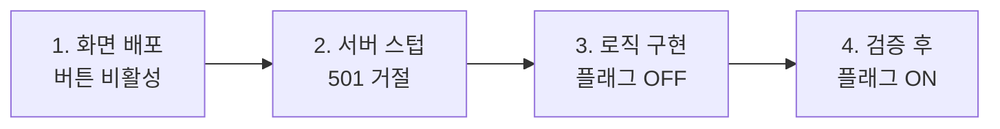

권한을 주고 뺏는 기능처럼 한 번 잘못 켜지면 사고로 직결되는 기능이 있다. 이런 기능을 "다 만들어서 한 번에 배포"하려고 하면, 화면·검증·서버 로직·권한 체크가 전부 한 PR에 뭉치고, 배포 후 문제가 생겨도 어디가 원인인지 좁히기 어렵다. 그래서 쓰는 전략이 **화면을 먼저(동작 없이) 내보내고, 서버 로직을 뒤이어 붙이는 단계적 출시**다.

## UI 스텁이라는 단계

"UI 스텁(stub)"은 버튼·폼·테이블 같은 화면 요소는 다 그려져 있지만, 누르면 아직 아무 일도 일어나지 않거나 "준비 중"이라고 응답하는 상태다. 왜 이런 어정쩡한 상태를 일부러 배포하는가?

- **레이아웃·동선을 먼저 검증한다.** 기획·디자인·운영자가 실제 화면에서 위치와 흐름을 확인하고 피드백을 준다. 로직을 다 만든 뒤 "버튼 위치가 틀렸다"는 말을 들으면 손해가 크다.
- **변경 범위를 쪼갠다.** 화면 PR과 로직 PR이 분리되면 리뷰가 쉽고, 문제 발생 시 어느 단계인지 즉시 안다.
- **위험을 격리한다.** 권한 변경 같은 로직은 마지막에, 충분히 검토한 뒤 붙는다. 그전까지는 화면이 있어도 실제로는 아무것도 바꾸지 못한다.

## 핵심은 '서버가 거절하는 방식'

화면만 먼저 나가는 설계의 진짜 어려움은 프런트가 아니라 서버다. 미완성 엔드포인트로 요청이 와도 **절대 실제 변경이 일어나면 안 된다**. "화면에 버튼이 없으니 호출 안 되겠지"는 통하지 않는다. URL을 직접 때리거나, 캐시된 옛 화면이 호출할 수 있다.

서버는 미완성 기능을 명확히 거절해야 한다. 흔한 방식은 `501 Not Implemented`를 돌려주거나, 의미 있는 비활성 응답을 주는 것이다.

```java
@PostMapping("/users/{id}/roles")
public ResponseEntity<ApiResult> grantRole(
        @PathVariable Long id, @RequestBody RoleRequest req) {

    if (!featureStage.isEnabled(Feature.ROLE_GRANT)) {
        // 화면은 나갔지만 로직은 아직. 명확히 '미구현'으로 거절한다.
        return ResponseEntity.status(HttpStatus.NOT_IMPLEMENTED)
                .body(ApiResult.error("ROLE_GRANT_NOT_READY",
                        "권한 부여 기능은 준비 중입니다."));
    }
    roleService.grant(id, req.getRoleCode());   // 단계가 켜진 뒤에야 도달
    return ResponseEntity.ok(ApiResult.ok());
}
```

`featureStage`는 환경설정이나 DB 플래그로 단계를 제어한다. 화면 배포 시점엔 꺼져 있고, 서버 로직이 충분히 검증되면 켠다. 핵심은 **분기의 기본값이 '안전(아무 변경 없음)'**이라는 점이다.



## 플래그 토글과 무엇이 다른가

흔한 피처 플래그는 "완성된 기능을 누구에게 보여줄지"를 런타임에 켜고 끄는 것이다. 여기서 말하는 단계적 출시는 그보다 앞 단계, **개발·노출 순서 자체를 화면→로직으로 쪼개는 방법론**이다. 플래그는 이 흐름의 마지막 스위치로 쓰일 뿐, 본질은 "위험한 로직을 가장 마지막에, 격리된 채로 붙인다"는 순서 통제에 있다.

## 운영 함정

**함정 1 — 비활성을 프런트에만 둔다.** 버튼을 `disabled` 처리만 하고 서버 가드를 안 넣으면, 직접 호출로 미완성 로직이 실행될 수 있다. 비활성은 반드시 서버에서 강제한다.

**함정 2 — 스텁을 정상 200으로 응답한다.** "준비 중"을 `200 OK`로 돌려주면 클라이언트는 성공으로 처리한다. 미구현은 `501`이나 명시적 에러 코드로 구분해, 호출 측이 "아직 안 됨"을 분기할 수 있게 한다.

## 핵심 요약

- 위험한 기능은 화면(비활성)을 먼저 내보내고, 검증된 서버 로직을 마지막에 붙인다.
- 미완성 엔드포인트는 서버가 명확히 거절해야 한다 — 기본값은 항상 '안전'.
- 프런트의 `disabled`는 UX일 뿐, 진짜 가드는 서버 단계 플래그다.

> **면접 한 줄**: "위험한 기능을 안전하게 출시하려면?" → "화면을 먼저 비활성으로 내보내 동선을 검증하고, 서버는 단계 플래그로 미구현을 명시적으로 거절하다가, 로직이 충분히 검토된 뒤 마지막에 플래그를 켭니다."
