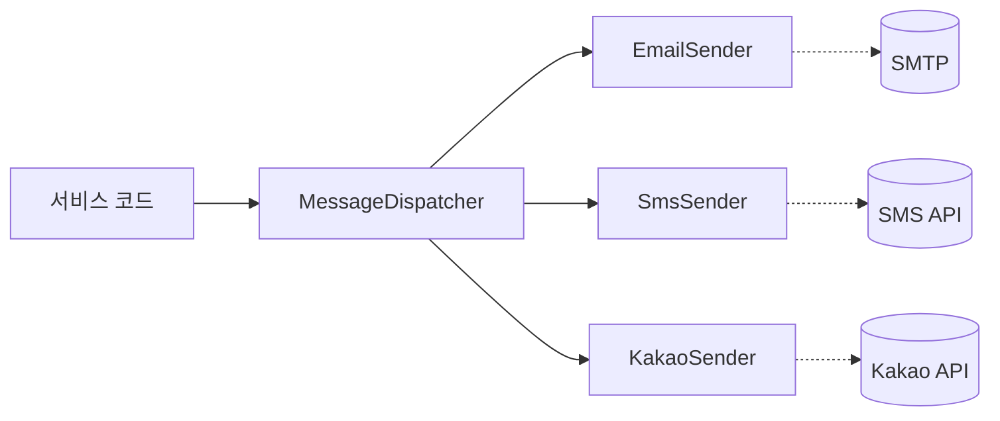

알림을 보내는 채널은 시간이 지날수록 늘어난다. 처음엔 이메일 하나였다가 문자가 붙고, 카카오 알림톡이 붙고, 푸시가 붙는다. 채널이 늘 때마다 서비스 코드에 `if (channel == EMAIL) ... else if (channel == SMS) ...` 분기가 쌓이면, 발송이 필요한 모든 곳이 모든 채널을 알아야 하는 지옥이 된다. 해법은 **발송을 인터페이스 뒤에 숨기고, 채널별 구현을 어댑터로 교체하는 것**이다.

## 추상화의 경계를 어디에 그을까

핵심은 "발송을 호출하는 쪽이 무엇을 몰라도 되는가"를 정하는 것이다. 호출부는 *어떤 채널인지, 그 채널의 인증이 어떻게 되는지, 페이로드 포맷이 무엇인지* 전부 몰라야 한다. 호출부가 아는 건 단 하나 — "이 메시지를 보내라".

그래서 두 가지를 표준화한다. (1) 채널 독립적인 **메시지 모델**, (2) 그걸 받는 **공통 인터페이스**.

```java
// 1. 채널 독립적 메시지 모델
public class Message {
    private String to;            // 수신자 (번호/주소/식별자)
    private String title;
    private String body;
    private Map<String, String> params;  // 템플릿 치환 변수 등
    // getters/setters
}

// 2. 공통 인터페이스
public interface MessageSender {
    boolean supports(Channel channel);
    SendResult send(Message message);
}
```

## 채널별 어댑터

각 채널은 `MessageSender`를 구현하는 어댑터가 된다. 채널별 초기화·인증은 어댑터 안에 갇히고, 바깥으로 새지 않는다.

```java
@Component
public class EmailSender implements MessageSender {
    private final SmtpClient smtp;   // 채널별 클라이언트·인증은 여기 캡슐화

    public boolean supports(Channel channel) {
        return channel == Channel.EMAIL;
    }

    public SendResult send(Message m) {
        smtp.send(m.getTo(), m.getTitle(), m.getBody());
        return SendResult.success();
    }
}

@Component
public class SmsSender implements MessageSender {
    private final SmsApiClient api;

    public boolean supports(Channel channel) {
        return channel == Channel.SMS;
    }

    public SendResult send(Message m) {
        // 문자는 제목이 없다 — 채널 특성을 어댑터가 흡수한다
        return SendResult.from(api.send(m.getTo(), m.getBody()));
    }
}
```

새 채널이 생기면 어댑터 하나를 추가할 뿐, 기존 코드는 손대지 않는다. 이것이 OCP(개방-폐쇄 원칙)가 실제로 작동하는 모습이다.

## 디스패처 — 채널을 고르는 한 곳

호출부와 어댑터 사이에 디스패처를 둔다. 스프링이라면 같은 인터페이스의 모든 구현을 `List`로 주입받아, 채널에 맞는 어댑터를 찾는다.

```java
@Service
public class MessageDispatcher {
    private final List<MessageSender> senders;  // 모든 어댑터 자동 주입

    public MessageDispatcher(List<MessageSender> senders) {
        this.senders = senders;
    }

    public SendResult dispatch(Channel channel, Message message) {
        return senders.stream()
                .filter(s -> s.supports(channel))
                .findFirst()
                .orElseThrow(() -> new IllegalArgumentException(
                        "지원하지 않는 채널: " + channel))
                .send(message);
    }
}
```



호출부는 `dispatcher.dispatch(Channel.SMS, message)` 한 줄이면 된다. 채널이 10개가 돼도 이 줄은 안 바뀐다.

## 발송 검증

외부 발송은 실패가 잦고(네트워크·인증 만료·수신자 오류), 진짜로 쏘면서 테스트할 수 없다. 그래서 어댑터 인터페이스로 분리해두면 **테스트용 가짜 구현**을 쉽게 끼울 수 있다.

```java
// 테스트/스테이징용 — 실제로 안 쏘고 기록만 한다
public class RecordingSender implements MessageSender {
    public final List<Message> sent = new ArrayList<>();
    public boolean supports(Channel c) { return true; }
    public SendResult send(Message m) {
        sent.add(m);                 // 무엇을 보냈는지 검증 가능
        return SendResult.success();
    }
}
```

## 운영 함정

**함정 1 — 메시지 모델이 특정 채널에 오염된다.** `Message`에 카카오 전용 템플릿 코드 필드를 박으면 추상화가 깨진다. 채널 고유 정보는 `params` 같은 자유 맵에 담고, 해석은 어댑터가 한다. 공통 모델은 채널 중립을 유지한다.

**함정 2 — 발송을 동기·요청 스레드에서 한다.** 외부 API는 느리고 불안정하다. 사용자 요청 트랜잭션 안에서 동기로 쏘면 발송 지연·실패가 본 작업까지 끌고 들어간다. 발송은 큐에 적재하고 비동기로 처리하는 편이 안전하다.

## 핵심 요약

- 호출부는 "보내라"만 알고, 채널·인증·포맷은 어댑터 안에 가둔다.
- 채널 추가 = 어댑터 추가. 기존 코드 무수정(OCP).
- 메시지 모델은 채널 중립을 유지하고, 발송은 비동기로 격리한다.

> **면접 한 줄**: "발송 채널이 계속 느는데 어떻게 설계하나요?" → "공통 `MessageSender` 인터페이스와 채널 중립 메시지 모델을 두고 채널별 어댑터로 구현해, 새 채널은 어댑터 추가만으로 붙이고 호출부는 디스패처 한 줄로 고정합니다."
