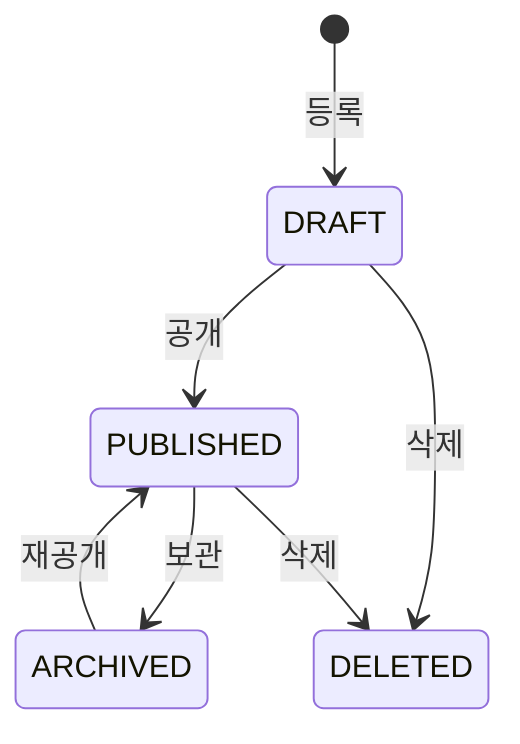

CRUD를 처음 짤 때는 등록·수정·삭제가 서로 독립된 동작처럼 보인다. 그러다 "임시저장 상태에서만 수정 가능", "공개된 글은 삭제 대신 보관", "보관된 건 다시 공개 못 함" 같은 규칙이 붙기 시작하면 if문이 컨트롤러·서비스 곳곳에 흩어진다. 이 혼란의 신호는 하나다. **엔티티에 생명주기(lifecycle)가 있는데 그걸 명시적으로 모델링하지 않았다**는 것이다. 답은 상태 기계(state machine)다.

## 상태 기계: 상태와 허용 전이를 분리한다

상태 기계는 두 가지를 명시적으로 정의한다. (1) 엔티티가 가질 수 있는 **상태들**, (2) 한 상태에서 다른 상태로의 **허용된 전이들**. 이 모델의 핵심은 "어떤 동작이 가능한가"가 *현재 상태에 의해 결정된다*는 점이다. "삭제 가능한가?"는 boolean 플래그가 아니라 "현재 상태가 무엇이고, 거기서 DELETE 전이가 허용되는가"의 문제로 바뀐다.



이 다이어그램이 곧 명세다. `DRAFT`는 공개되거나 삭제될 수 있다. `PUBLISHED`는 보관되거나 삭제된다. `ARCHIVED`는 재공개만 가능하다. 다이어그램에 **없는 화살표는 금지된 전이**다. 예컨대 `DRAFT → ARCHIVED`는 허용되지 않는다. 이렇게 그려 두면 "이 상태에서 뭐가 되나"를 코드 곳곳의 if가 아니라 한 곳에서 답할 수 있다.

## 허용 전이를 한 곳에 가둔다

전이 규칙을 enum과 테이블로 표현하면, 검증이 흩어지지 않고 단 한 군데서 강제된다.

```java
public enum PostStatus {
    DRAFT, PUBLISHED, ARCHIVED, DELETED;

    // 각 상태에서 갈 수 있는 다음 상태들
    private static final Map<PostStatus, Set<PostStatus>> ALLOWED = Map.of(
        DRAFT,     EnumSet.of(PUBLISHED, DELETED),
        PUBLISHED, EnumSet.of(ARCHIVED, DELETED),
        ARCHIVED,  EnumSet.of(PUBLISHED),
        DELETED,   EnumSet.noneOf(PostStatus.class)  // 종착 상태
    );

    public boolean canTransitionTo(PostStatus next) {
        return ALLOWED.getOrDefault(this, Set.of()).contains(next);
    }
}
```

```java
// 모든 상태 변경은 이 한 메서드를 통과한다
public void changeStatus(Post post, PostStatus next) {
    PostStatus current = post.getStatus();
    if (!current.canTransitionTo(next)) {
        throw new IllegalStateTransitionException(current, next);
    }
    post.setStatus(next);
    // 전이 부수효과(공개 시각 기록, 보관 시 색인 제거 등)도 여기서 한 곳에
}
```

이제 컨트롤러는 "이 상태에서 삭제해도 되나?"를 직접 판단하지 않는다. `changeStatus`에 위임하면 불법 전이는 예외로 막힌다. 새 규칙(예: `ARCHIVED → DELETED` 허용)이 생겨도 `ALLOWED` 테이블 한 줄만 고치면 된다. 규칙이 코드 전체가 아니라 데이터로 표현되어 있기 때문이다.

물리 삭제 대신 `DELETED` 상태로 두는 **소프트 삭제**도 자연스럽게 흡수된다. 조회 시 `WHERE status != 'DELETED'`로 거르면 데이터는 남기면서 사용자에겐 사라진 것처럼 보인다.

## 운영 함정

**동시 전이 경쟁(race).** 두 요청이 동시에 같은 엔티티를 읽어 둘 다 "현재 PUBLISHED니까 전이 가능"으로 판단하면, 검증을 통과한 두 전이가 충돌할 수 있다. 상태 변경엔 낙관적 락(버전 컬럼)이나 비관적 락으로 "내가 읽은 상태가 그대로일 때만 갱신"을 보장하라. 검증과 갱신 사이의 틈을 막는 것이다.

**불법 전이를 조용히 무시하지 마라.** `if (canTransition)`만 하고 else를 비워 두면, 실패한 요청이 성공한 것처럼 보인다. 반드시 예외로 끊고, 클라이언트엔 `409 Conflict` 같은 명확한 응답을 주어 "지금 상태에선 그 동작이 불가능하다"를 알려야 한다.

## 핵심 요약

- 생명주기가 있는 엔티티의 CRUD는 흩어진 if가 아니라 상태 기계로 모델링한다.
- 허용 전이를 enum/테이블로 한 곳에 가두고, 모든 상태 변경을 단일 메서드로 통과시켜 검증을 강제한다.
- 동시 전이는 락으로 막고, 불법 전이는 예외 + 명확한 응답 코드로 끊는다. 소프트 삭제는 상태 하나로 흡수된다.

**면접 한 줄 Q&A.** "상태 전이 검증을 왜 한 곳에 모으나?" → 규칙이 서비스·컨트롤러에 흩어지면 누락·불일치가 생긴다. 전이 테이블 + 단일 진입점으로 모든 변경이 같은 규칙을 통과하게 만들어 불법 전이를 원천 차단한다.
