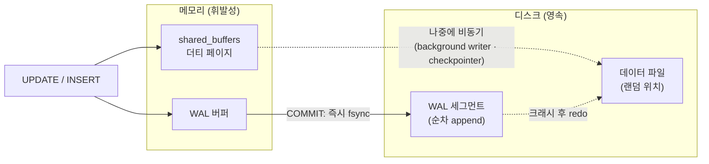
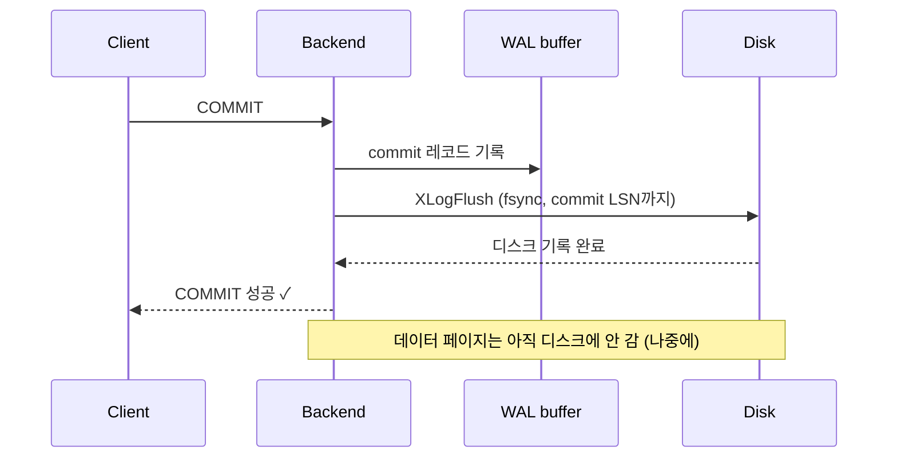
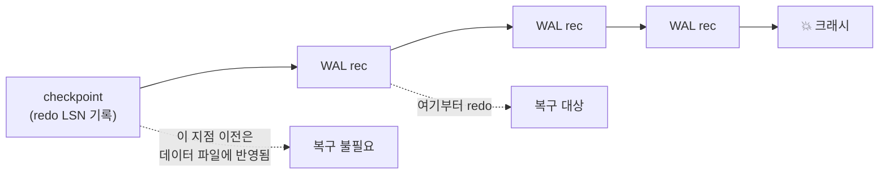
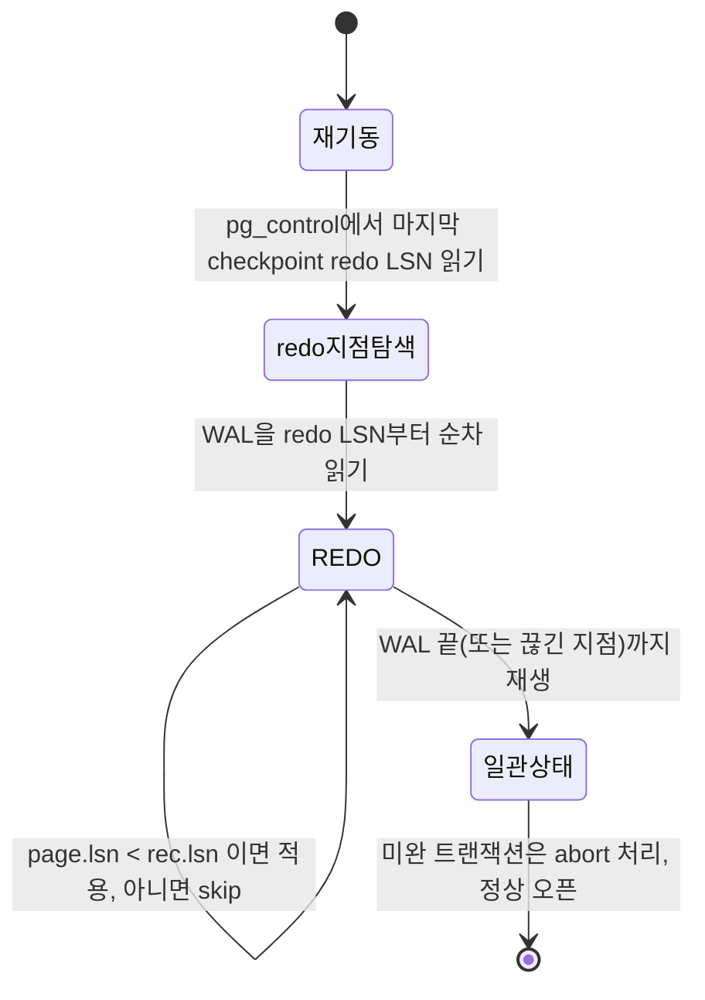
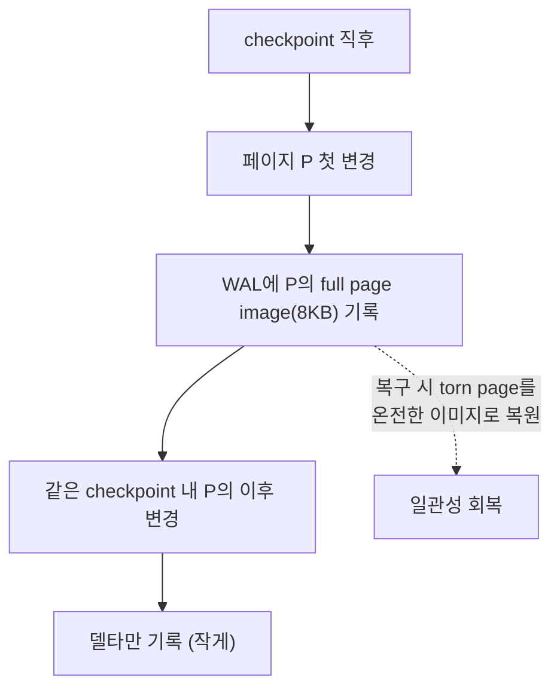

## "COMMIT 떨어진 주문이 사라졌어요"

장애 리포트가 들어옵니다. 정전으로 DB 서버가 통째로 죽었다가 살아났는데, **클라이언트에게 분명히 `COMMIT`이 성공 응답으로 돌아간** 결제 한 건이 보이지 않는다는 겁니다. 반대 사례도 있습니다 — 롤백했어야 할 절반짜리 수정이 디스크에 남아 있다거나, 데이터 페이지가 절반만 기록돼 깨진 행이 보인다거나.

직관적으로는 이런 의심이 듭니다. "DB가 메모리에서만 일하다가 죽었으니 날아간 거 아냐?" 맞습니다. PostgreSQL은 변경을 **공유 버퍼(shared_buffers)** 위에서 합니다. 디스크 데이터 파일은 한참 뒤에야 갱신됩니다. 그런데도 [트랜잭션 글]()에서 약속한 **D(Durability, 영속성)** 는 "COMMIT이 반환됐다 = 정전이 나도 살아남는다"를 보장해야 합니다.

그 약속을 지키는 메커니즘이 **WAL(Write-Ahead Logging)** 입니다. 이 글은 "변경을 데이터 페이지보다 로그에 먼저 적는다"는 한 문장이 어떻게 정전을 이기는지를 PostgreSQL 내부 동작 수준으로 따라갑니다. [앞 글의 잠금]()이 "동시에 쓸 때"를 다뤘다면, 이 글은 "쓰다 죽었을 때"를 다룹니다.

## 핵심 딜레마: 더티 페이지를 언제 디스크에 쓰나

먼저 문제를 정확히 봅시다. UPDATE 하나가 일어나면 PostgreSQL은 8KB [데이터 페이지]()를 버퍼 풀로 읽어와 메모리에서 수정합니다. 디스크에 아직 안 내려간 이 버퍼를 **더티 페이지(dirty page)** 라고 합니다. COMMIT 시점에 이 더티 페이지를 곧장 디스크에 `fsync`하면 영속성은 보장되지만, 두 가지로 망합니다.

- **랜덤 I/O 폭발**: 변경된 페이지들이 데이터 파일 여기저기에 흩어져 있어, COMMIT마다 디스크 헤드가 사방으로 튀는 랜덤 쓰기가 됩니다.
- **쓰기 증폭**: 한 행 8바이트만 바꿔도 페이지 8KB 전체를 써야 합니다.

WAL의 발상은 이 둘을 분리하는 것입니다. **"무엇을 바꿨는가"라는 작은 기록(WAL 레코드)만 순차적으로(append-only) 먼저 디스크에 내린다.** 실제 데이터 페이지를 제자리에 쓰는 무거운 작업은 나중에 천천히 비동기로 한다.



순차 쓰기는 랜덤 쓰기보다 수십 배 빠릅니다(특히 회전 디스크에서). 그래서 "로그 먼저, 데이터 나중"은 단지 안전할 뿐 아니라 **빠르기까지** 합니다.

## WAL 황금률과 LSN

WAL이 성립하려면 단 하나의 규칙이 반드시 지켜져야 합니다. 이것이 **WAL 황금률(Write-Ahead Rule)** 입니다.

> **어떤 데이터 페이지를 디스크에 쓰기 전에, 그 변경을 설명하는 WAL 레코드가 먼저 디스크에 안전하게 기록돼 있어야 한다.**

이 순서를 강제하는 장치가 **LSN(Log Sequence Number)** 입니다. LSN은 WAL 스트림 안의 바이트 위치(예: `0/16B3A40`)로, 모든 WAL 레코드와 모든 데이터 페이지가 LSN을 가집니다.

- 각 데이터 페이지 헤더에는 **그 페이지를 마지막으로 변경한 WAL 레코드의 LSN**(`pd_lsn`)이 박혀 있습니다.
- 버퍼 풀이 더티 페이지를 디스크로 내보내기 직전, 매니저는 **그 페이지의 LSN까지 WAL이 디스크에 flush됐는지** 확인합니다. 아직이면 먼저 WAL을 flush합니다(`XLogFlush`).

이 한 줄의 체크가 황금률을 코드로 구현한 것입니다. 덕분에 데이터 페이지가 디스크에 존재한다면, 그 페이지를 만든 WAL 레코드는 **반드시** 이미 디스크에 있습니다. 거꾸로는 성립하지 않습니다 — WAL은 있는데 데이터 페이지는 아직 옛날 상태일 수 있죠. 바로 그 간극을 복구가 메웁니다.

아래 애니메이션은 황금률의 핵심을 보여줍니다. 하나의 변경이 **WAL에 먼저 순차로 기록**되고, **데이터 페이지는 한참 뒤에 반영**되는 시간차입니다.

<div class="wal-order" markdown="0">
<style>
.wal-order{margin:1.4rem 0;overflow-x:auto}
.wal-order svg{width:100%;max-width:720px;height:auto;display:block;margin:0 auto;font-family:inherit}
.wal-order .lbl{fill:currentColor;font-size:12px;font-weight:600}
.wal-order .sub{fill:currentColor;font-size:9.5px;opacity:.6}
.wal-order .track{fill:none;stroke:currentColor;stroke-width:1.3;opacity:.4}
.wal-order .wrec{fill:#1971c2;opacity:0}
.wal-order .w1{animation:walw1 7s ease-in-out infinite}
.wal-order .w2{animation:walw2 7s ease-in-out infinite}
.wal-order .w3{animation:walw3 7s ease-in-out infinite}
.wal-order .page{fill:#f08c00;opacity:0;animation:walpg 7s ease-in-out infinite}
.wal-order .fsbadge{fill:#2f9e44;opacity:0;animation:walfs 7s ease-in-out infinite}
.wal-order .clk{fill:currentColor;opacity:.5;font-size:10px}
@keyframes walw1{0%,6%{opacity:0}12%,100%{opacity:.9}}
@keyframes walw2{0%,18%{opacity:0}24%,100%{opacity:.9}}
@keyframes walw3{0%,30%{opacity:0}36%,100%{opacity:.9}}
@keyframes walfs{0%,40%{opacity:0}46%,100%{opacity:.95}}
@keyframes walpg{0%,70%{opacity:0}80%,100%{opacity:.9}}
</style>
<svg viewBox="0 0 700 240" role="img" aria-label="변경이 WAL에 먼저 순차로 기록되고 데이터 페이지는 한참 뒤에 디스크에 반영되는 시간차 애니메이션">
  <text class="lbl" x="20" y="40">WAL (순차 append)</text>
  <rect class="track" x="20" y="52" width="660" height="34" rx="4"/>
  <rect class="wrec w1" x="30" y="56" width="60" height="26" rx="3"/>
  <text class="sub w1" x="60" y="73" text-anchor="middle" fill="#fff">rec#1</text>
  <rect class="wrec w2" x="96" y="56" width="60" height="26" rx="3"/>
  <text class="sub w2" x="126" y="73" text-anchor="middle" fill="#fff">rec#2</text>
  <rect class="wrec w3" x="162" y="56" width="60" height="26" rx="3"/>
  <text class="sub w3" x="192" y="73" text-anchor="middle" fill="#fff">rec#3</text>
  <rect class="fsbadge" x="240" y="56" width="92" height="26" rx="3"/>
  <text class="sub fsbadge" x="286" y="73" text-anchor="middle" fill="#fff">fsync ✓ COMMIT</text>

  <text class="lbl" x="20" y="150">데이터 파일 (랜덤 위치)</text>
  <rect class="track" x="20" y="162" width="660" height="40" rx="4"/>
  <rect class="page" x="380" y="166" width="120" height="32" rx="3"/>
  <text class="sub page" x="440" y="186" text-anchor="middle" fill="#fff">페이지 갱신 (LSN 반영)</text>

  <text class="clk" x="60" y="222">t1</text>
  <text class="clk" x="286" y="222">t2 (COMMIT 반환)</text>
  <text class="clk" x="440" y="222">t3 (한참 뒤)</text>
</svg>
</div>

t2에서 이미 클라이언트는 "COMMIT 성공"을 받습니다. 데이터 페이지는 t3에야 디스크에 갑니다. **t2와 t3 사이에 정전이 나면?** 데이터 파일은 옛 상태지만 WAL에는 rec#1~3이 안전히 있으니, 복구가 이를 재생해 메웁니다.

## COMMIT = WAL fsync까지

영속성의 정확한 경계는 여기입니다. PostgreSQL에서 **COMMIT은 "그 트랜잭션의 commit 레코드를 포함한 WAL이 디스크에 `fsync`될 때까지 기다린 뒤" 클라이언트에게 성공을 돌려줍니다.** 데이터 페이지가 디스크에 갔는지는 보지 않습니다 — WAL만 안전하면 충분합니다.

`fsync`가 핵심입니다. OS의 `write()`는 데이터를 커널 페이지 캐시에 넣을 뿐, 실제 디스크 플래터/플래시에 닿았다는 보장이 없습니다. `fsync()`가 "디스크 매체에 영구 기록됐다"를 보장합니다. 그래서 commit마다 WAL을 `fsync`하는 비용이 곧 영속성의 가격입니다.

여기서 **group commit**이 등장합니다. 여러 트랜잭션이 거의 동시에 commit하려 하면, 한 번의 `fsync`로 여러 commit 레코드를 함께 디스크에 내려 `fsync` 호출 수를 줄입니다(`commit_delay`/`commit_siblings`로 튜닝). 동시성이 높을수록 이득이 큽니다.



## 더티 페이지는 누가 언제 내리나 — background writer와 checkpointer

데이터 페이지를 디스크에 내리는 일은 백엔드 트랜잭션이 아니라 **별도 보조 프로세스**가 비동기로 합니다.

- **background writer**: 더티 페이지를 야금야금 미리 디스크로 내려, 백엔드가 빈 버퍼를 찾을 때 직접 flush하느라 멈추는 일을 줄입니다.
- **checkpointer**: 주기적으로 **checkpoint**를 수행합니다. checkpoint는 *"이 시점까지의 모든 더티 페이지를 디스크에 확정 반영했다"* 는 약속이자, **복구의 시작점**입니다.

checkpoint가 왜 복구의 시작점인지가 핵심입니다. checkpoint가 끝나면 PostgreSQL은 그 checkpoint의 위치(redo 시작 LSN)를 `pg_control`에 기록합니다. **그 LSN 이전의 변경은 이미 전부 데이터 파일에 반영됐음이 보장**되므로, 복구할 때 그보다 옛날 WAL은 읽을 필요가 없습니다. checkpoint가 없다면 복구는 DB 생성 시점부터 모든 WAL을 재생해야 할 겁니다.



checkpoint는 공짜가 아닙니다. 그 순간 쌓인 더티 페이지를 한꺼번에 디스크로 밀어내야 하므로 I/O 스파이크가 생깁니다. 그래서 `checkpoint_completion_target`(기본 0.9)으로 쓰기를 checkpoint 간격에 걸쳐 펼치고, `max_wal_size`/`checkpoint_timeout`으로 빈도를 조절합니다. 너무 잦으면 I/O 스파이크와 full page write(아래) 폭증, 너무 드물면 크래시 복구가 길어지는 트레이드오프입니다.

## 크래시 복구: 마지막 checkpoint부터 REDO

이제 정전 후 재기동입니다. PostgreSQL은 `pg_control`에서 마지막 checkpoint의 **redo LSN**을 읽고, 그 지점부터 WAL을 순서대로 읽으며 각 레코드를 데이터 페이지에 다시 적용합니다. 이것이 **REDO(roll-forward)** 입니다.

REDO는 **idempotent(멱등)** 해야 합니다. 같은 WAL 레코드를 여러 번 적용해도 결과가 같아야 하죠(복구 도중 또 죽었다 살아날 수 있으니까). LSN이 이를 보장합니다. WAL 레코드를 페이지에 적용하기 전, 그 **페이지 헤더의 LSN이 이미 이 레코드의 LSN 이상이면 건너뜁니다** — 이미 반영된 변경이라는 뜻이니까요.



아래 애니메이션은 그 전 과정을 한눈에 보여줍니다. 정전으로 옛 상태에 멈춘 데이터 파일에, 마지막 checkpoint 이후의 WAL 레코드들이 **순서대로 redo되어 따라잡는** 모습입니다.

<div class="wal-redo" markdown="0">
<style>
.wal-redo{margin:1.4rem 0;overflow-x:auto}
.wal-redo svg{width:100%;max-width:720px;height:auto;display:block;margin:0 auto;font-family:inherit}
.wal-redo .lbl{fill:currentColor;font-size:12px;font-weight:600}
.wal-redo .sub{fill:currentColor;font-size:9.5px;opacity:.6}
.wal-redo .track{fill:none;stroke:currentColor;stroke-width:1.3;opacity:.4}
.wal-redo .ck{fill:#9c36b5;opacity:.9}
.wal-redo .rec{fill:#1971c2;opacity:.85}
.wal-redo .boom{fill:#e03131;font-size:18px;opacity:0;animation:walboom 8s ease-in-out infinite}
.wal-redo .head{fill:none;stroke:#2f9e44;stroke-width:2.2;animation:walhead 8s ease-in-out infinite}
.wal-redo .dot{fill:#2f9e44;offset-path:path('M 150,150 L 560,150');animation:waldot 8s ease-in-out infinite}
.wal-redo .applied{fill:#2f9e44;opacity:0}
.wal-redo .a1{animation:wala1 8s ease-in-out infinite}
.wal-redo .a2{animation:wala2 8s ease-in-out infinite}
.wal-redo .a3{animation:wala3 8s ease-in-out infinite}
@keyframes walboom{0%,18%{opacity:0}24%,40%{opacity:1}48%,100%{opacity:0}}
@keyframes walhead{0%,50%{opacity:0}55%,100%{opacity:.9}}
@keyframes waldot{0%,50%{offset-distance:0%;opacity:0}55%{opacity:1}95%{offset-distance:100%;opacity:1}100%{offset-distance:100%;opacity:0}}
@keyframes wala1{0%,60%{opacity:0}66%,100%{opacity:.85}}
@keyframes wala2{0%,72%{opacity:0}78%,100%{opacity:.85}}
@keyframes wala3{0%,84%{opacity:0}90%,100%{opacity:.85}}
</style>
<svg viewBox="0 0 700 230" role="img" aria-label="크래시 후 마지막 checkpoint부터 WAL 레코드를 순서대로 redo하여 데이터 파일을 따라잡게 만드는 복구 과정 애니메이션">
  <text class="lbl" x="20" y="56">WAL 스트림</text>
  <rect class="track" x="120" y="68" width="480" height="34" rx="4"/>
  <rect class="ck" x="124" y="72" width="64" height="26" rx="3"/>
  <text class="sub" x="156" y="89" text-anchor="middle" fill="#fff">checkpoint</text>
  <rect class="rec" x="250" y="72" width="64" height="26" rx="3"/>
  <text class="sub" x="282" y="89" text-anchor="middle" fill="#fff">rec#1</text>
  <rect class="rec" x="356" y="72" width="64" height="26" rx="3"/>
  <text class="sub" x="388" y="89" text-anchor="middle" fill="#fff">rec#2</text>
  <rect class="rec" x="462" y="72" width="64" height="26" rx="3"/>
  <text class="sub" x="494" y="89" text-anchor="middle" fill="#fff">rec#3</text>
  <text class="boom" x="556" y="92">💥</text>

  <line class="track" x1="150" y1="150" x2="560" y2="150"/>
  <text class="lbl" x="20" y="154">데이터 파일</text>
  <text class="sub" x="156" y="172" text-anchor="middle">checkpoint 상태</text>
  <circle class="head" cx="150" cy="150" r="9"/>
  <circle class="dot" r="6"/>
  <rect class="applied a1" x="252" y="138" width="60" height="24" rx="3"/>
  <text class="sub applied a1" x="282" y="154" text-anchor="middle" fill="#fff">redo#1</text>
  <rect class="applied a2" x="358" y="138" width="60" height="24" rx="3"/>
  <text class="sub applied a2" x="388" y="154" text-anchor="middle" fill="#fff">redo#2</text>
  <rect class="applied a3" x="464" y="138" width="60" height="24" rx="3"/>
  <text class="sub applied a3" x="494" y="154" text-anchor="middle" fill="#fff">redo#3</text>
  <text class="sub" x="350" y="210" text-anchor="middle">checkpoint redo LSN → 끝까지 순차 redo (page.lsn ≥ rec.lsn 이면 skip) → 일관 상태 복원</text>
</svg>
</div>

여기서 흔한 오해 하나. "그럼 UNDO(롤백 로그)는?" PostgreSQL은 [MVCC]() 덕분에 **별도 UNDO 세그먼트가 없습니다.** commit 안 된 트랜잭션의 변경은 새 버전 튜플로 남아 있을 뿐이고, 그 트랜잭션이 commit 레코드를 남기지 못했으면 가시성 판정에서 그냥 "안 보이는" 것으로 처리됩니다(나중에 [VACUUM]()이 청소). 그래서 PG의 크래시 복구는 본질적으로 **REDO 전용**입니다(Oracle식 redo/undo와 대비됨).

## full page write — torn page를 막는 안전벨트

여기 미묘한 함정이 있습니다. 디스크는 보통 4KB 섹터 단위로 쓰는데 PostgreSQL 페이지는 8KB입니다. 8KB 페이지를 쓰는 도중 정전이 나면 **앞 4KB는 새 내용, 뒤 4KB는 옛 내용**인 찢어진 페이지(**torn page**)가 남을 수 있습니다. 이 깨진 페이지에 WAL 레코드를 redo하면, 레코드는 "이 페이지의 이 부분을 바꿔라"라고 가정하는데 페이지 자체가 일관되지 않아 결과가 망가집니다.

해법이 **full page write**입니다. `full_page_writes = on`(기본값)이면, **각 checkpoint 직후 어떤 페이지가 처음 변경될 때, 그 페이지 전체(8KB)를 WAL에 통째로 기록**합니다. 복구 시 torn page가 의심되면, WAL 안의 이 온전한 페이지 이미지로 통째 덮어쓴 뒤 이후 변경을 redo합니다.



대가는 **WAL 양 증가**입니다. checkpoint 직후엔 페이지마다 8KB가 통째로 WAL에 실리니까요. checkpoint가 잦을수록 "첫 변경" 순간이 자주 와서 full page image가 많아지고 WAL이 부풀어 오릅니다 — 위에서 본 "checkpoint 너무 자주 하면 손해"의 또 다른 이유입니다. `wal_compression`으로 이 full page image들을 압축해 완화할 수 있습니다.

## WAL은 복구만을 위한 게 아니다 — 복제와 PITR

WAL은 "이 DB에 일어난 모든 변경의 순차 기록"입니다. 이 성질은 복구를 넘어 두 가지를 더 가능하게 합니다.

- **물리 복제(streaming replication)**: primary가 생성한 WAL을 standby로 실시간 전송하면, standby는 그 WAL을 계속 redo해 primary의 복제본을 유지합니다. 사실상 "끝나지 않는 크래시 복구"인 셈입니다. 자세한 동기/비동기 트레이드오프는 [복제 글]()에서 다룹니다.
- **PITR(Point-In-Time Recovery)**: 베이스 백업 + 이후 보관된 WAL(archive)을 원하는 시점까지 redo하면 **과거 임의 시점으로 복원**할 수 있습니다. "어제 오후 3시 직전으로 되돌려줘" 같은 실수 복구의 토대입니다.

즉 WAL은 PostgreSQL 영속성·고가용성·백업 전략 전체의 **단일 진실 공급원**입니다.

## synchronous_commit 트레이드오프

마지막으로 실무에서 가장 자주 만지는 손잡이입니다. commit마다 WAL `fsync`를 기다리는 게 영속성의 비용이라면, 그 비용을 일부 포기하고 처리량을 살 수 있습니다.

| `synchronous_commit` | 동작 | 크래시 시 위험 |
|---|---|---|
| `on` (기본) | WAL이 로컬 디스크에 fsync될 때까지 대기 | 가장 안전 |
| `off` | commit 즉시 반환, WAL flush는 뒤따라감(최대 `wal_writer_delay`) | **최근 commit 일부 손실** (단, DB는 일관 상태 유지) |
| `local` | 로컬 fsync만, standby 응답 대기 안 함 | 페일오버 시 손실 가능 |
| `remote_apply`/`remote_write` | standby까지 반영/수신 확인 | 가장 안전, 지연 최대 |

`synchronous_commit = off`의 미묘함을 정확히 짚어야 합니다. 이건 **데이터를 깨뜨리지 않습니다.** WAL 순서와 황금률은 그대로라 크래시 후에도 DB는 일관 상태로 복구됩니다. 다만 "성공 응답을 받은 최근 몇 ms의 commit"이 사라질 수 있을 뿐입니다. 로그성/분석성 워크로드에는 합리적 거래, 결제·금융에는 금물입니다. 절대 건드리면 안 되는 건 `fsync = off`입니다 — 이건 황금률 자체를 깨서 **임의의 데이터 손상**을 부릅니다.

진단/관찰에 쓰는 도구들:

```sql
-- 현재 WAL 위치(LSN)와 마지막 checkpoint
SELECT pg_current_wal_lsn();
SELECT checkpoint_lsn, redo_lsn FROM pg_control_checkpoint();

-- checkpoint 빈도·소요·강제 여부 (잦은 강제 checkpoint = max_wal_size 부족 신호)
SELECT checkpoints_timed, checkpoints_req, checkpoint_write_time
FROM pg_stat_bgwriter;          -- PG17+: pg_stat_checkpointer

-- 두 LSN 간 거리 = 생성된 WAL 양 (복제 지연 진단에도 사용)
SELECT pg_wal_lsn_diff(pg_current_wal_lsn(), '0/16B3A40');
```

`checkpoints_req`(요청 기반 강제 checkpoint)가 `checkpoints_timed`(시간 기반)보다 많다면, WAL이 `max_wal_size`를 자주 넘쳐 checkpoint가 쫓기듯 일어난다는 신호입니다 — `max_wal_size`를 올려 완화합니다. 이 운영 튜닝은 [운영 글]()에서 더 다룹니다.

## 면접/리뷰 단골 질문

- **Q. WAL 황금률을 한 문장으로?** → 데이터 페이지를 디스크에 쓰기 전에 그 변경의 WAL 레코드가 먼저 디스크에 fsync돼 있어야 한다. LSN 비교로 강제한다.
- **Q. COMMIT이 보장하는 건 정확히 뭔가?** → 그 트랜잭션의 commit 레코드까지 포함한 WAL이 디스크에 fsync됐다는 것. 데이터 페이지가 디스크에 갔는지는 무관 — 크래시 후 redo로 메운다.
- **Q. checkpoint가 복구에서 하는 역할은?** → 복구의 시작점. checkpoint의 redo LSN 이전 변경은 이미 데이터 파일에 반영됐으므로, 복구는 그 지점부터의 WAL만 redo하면 된다.
- **Q. full page write는 왜 필요한가?** → 8KB 페이지를 쓰다 정전 나면 torn page가 생긴다. checkpoint 후 첫 변경 시 페이지 전체를 WAL에 실어, 복구 때 온전한 이미지로 덮어쓴 뒤 redo한다.
- **Q. PostgreSQL은 왜 UNDO 로그가 없나?** → MVCC가 옛/새 버전을 모두 보관하므로, 미완 트랜잭션의 변경은 가시성에서 걸러지고 VACUUM이 청소한다. 그래서 크래시 복구는 REDO 전용이다.
- **Q. `synchronous_commit = off`는 데이터를 깨뜨리나?** → 아니다. 황금률은 유지돼 DB는 일관 상태로 복구된다. 다만 성공 응답을 받은 최근 commit 일부가 손실될 수 있다. `fsync = off`는 다르다 — 황금률을 깨서 손상을 부른다.

## 정리

- WAL은 **"데이터 페이지보다 로그 먼저"** — 작은 변경 기록을 순차 append로 디스크에 먼저 내리고, 무거운 데이터 페이지 쓰기는 비동기로 미룬다. 안전하면서 빠르다.
- **LSN**이 황금률을 강제한다: 페이지를 내리기 전 그 페이지 LSN까지 WAL이 flush됐는지 확인. 복구 시 페이지 LSN ≥ 레코드 LSN이면 skip(멱등).
- **COMMIT = WAL fsync까지.** group commit으로 fsync를 묶어 비용을 줄인다. 더티 페이지는 background writer/checkpointer가 비동기로 내린다.
- **checkpoint = 복구 시작점.** 크래시 복구는 마지막 checkpoint redo LSN부터 WAL을 redo한다. PG는 REDO 전용(UNDO 없음).
- **full page write**가 torn page를 막고, 같은 WAL이 **복제·PITR**의 토대다. `synchronous_commit`은 영속성↔처리량 손잡이(끄면 최근 commit 손실, 단 손상 없음).

> 다음 글: 옵티마이저가 짠 계획을 직접 읽는 법 — [EXPLAIN과 조인 알고리즘(Nested Loop·Hash·Merge)]()로 이어집니다.
