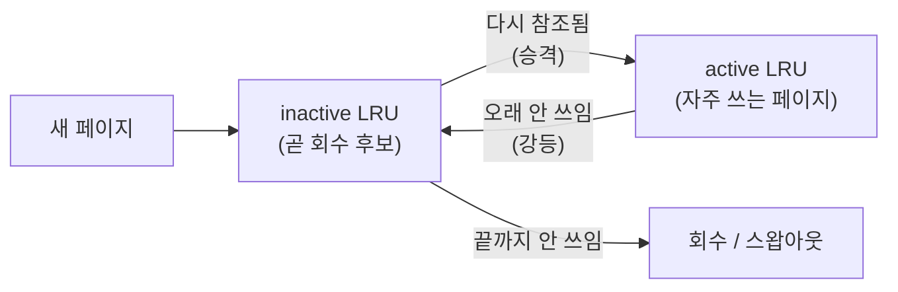

## "한 페이지를 잘못 쫓아내면, 시스템 전체가 멈춘다"

물리 메모리는 꽉 찼는데 새 페이지를 들여야 합니다([페이지 폴트]()). 빈 프레임이 없으니, 커널은 지금 들어 있는 페이지 중 **하나를 골라 내쫓아야(evict)** 합니다. 이 "누구를 쫓아낼까"를 정하는 규칙이 **페이지 교체 알고리즘**입니다.

사소해 보이지만 아닙니다. 방금 쫓아낸 페이지를 **다음 순간 또 쓰면**, 즉시 다시 폴트가 나서 디스크를 또 긁습니다. 이 선택을 계속 틀리면 시스템은 일은 안 하고 **페이지를 디스크와 메모리 사이로 퍼 나르기만** 합니다 — 이게 **thrashing**이고, CPU 사용률은 바닥인데 디스크만 100%인 그 악명 높은 상태입니다. 이 글은 OPT부터 리눅스가 실제로 쓰는 근사 LRU까지, **무엇을 최적화하려 애쓰는지**를 따라갑니다.

## 목표는 단 하나: 폴트(특히 major fault)를 줄여라

교체 알고리즘의 성패는 **앞으로 안 쓸 페이지를 정확히 쫓아내는가**에 달렸습니다. 쫓아낸 페이지를 다시 안 쓰면 손해가 없고, 곧 다시 쓰면 디스크를 왕복하는 [major fault]()가 터집니다. major fault 한 번은 수 ms — CPU 명령 수백만 개에 해당하는 시간입니다.

미래를 모르니, 모든 실전 알고리즘은 **과거로 미래를 추측**합니다. 그 베팅이 바로 **지역성(locality)**입니다 — 최근 쓴 페이지는 곧 또 쓸 확률이 높다(시간 지역성). 좋은 알고리즘일수록 "이론적 최적"에 가깝게 이 베팅을 잘합니다.

## 알고리즘의 진화 — OPT → FIFO → LRU → Clock

| 알고리즘 | 희생자 선택 기준 | 장점 | 치명적 약점 |
|---|---|---|---|
| **OPT (Belady)** | 미래에 가장 늦게 쓸 페이지 | 폴트 수 **이론적 최소** | 미래를 알아야 함 → **구현 불가**(하한선 측정용) |
| **FIFO** | 가장 먼저 들어온 페이지 | 구현 초간단(큐) | 지역성 무시 + **벨라디 이상현상** |
| **LRU** | 가장 오래 안 쓴 페이지 | OPT에 근접(지역성 활용) | **매 접근마다 갱신** → 비용 과다 |
| **Clock** | LRU를 reference bit로 근사 | 싸고 충분히 좋음 | LRU의 근사일 뿐 |

**FIFO와 벨라디 이상현상.** FIFO는 "프레임을 늘리면 폴트가 준다"는 당연한 직관을 깨뜨립니다. 참조열 `1 2 3 4 1 2 5 1 2 3 4 5`를 FIFO로 돌리면 **프레임 3개일 때 9번**, **4개일 때 10번** 폴트가 납니다 — 메모리를 늘렸는데 더 나빠졌습니다. 들어온 순서는 "다시 쓸지"와 무관하기 때문입니다. LRU·OPT 계열(스택 알고리즘)은 이 이상현상이 없습니다.

> **현실 체크 — "정확한 LRU는 왜 아무도 안 쓰나."** 진짜 LRU를 구현하려면 **메모리 접근이 일어날 때마다** 그 페이지를 리스트 맨 앞으로 옮기거나 타임스탬프를 찍어야 합니다. 접근은 1초에 수십억 번 일어납니다. 그 모든 접근에 자료구조 갱신을 끼워 넣는 건 하드웨어로도 소프트웨어로도 감당이 안 됩니다. 그래서 현실은 LRU를 **싸게 흉내** 냅니다 — 그게 Clock입니다.

## Clock(2차 기회) 알고리즘 — LRU를 reference bit 하나로 흉내내기

핵심 아이디어: 페이지마다 **참조 비트(reference bit) 1개**만 둡니다. CPU가 그 페이지를 건드리면 하드웨어(MMU)가 이 비트를 **1**로 세팅합니다. 페이지들을 원형 큐에 배치하고 **시계바늘**을 돌립니다.

- 바늘이 가리킨 페이지의 ref 비트가 **1**이면 → "최근에 썼구나, 한 번 봐준다" → 비트를 **0으로 지우고** 그냥 통과(2차 기회).
- ref 비트가 **0**이면 → "한 바퀴 도는 동안 안 썼네" → **이 페이지를 교체**.

아래 애니메이션에서 파란 바늘이 돌며 ref=1인 P0·P1에 **2차 기회**(1→0)를 주고 통과한 뒤, ref=0인 **P2를 희생**시켜 새 페이지(P9)를 적재합니다.

<div class="ospr-clock" markdown="0">
<style>
.ospr-clock{margin:1.4rem 0;overflow-x:auto}
.ospr-clock svg{width:100%;max-width:520px;height:auto;display:block;margin:0 auto;font-family:inherit}
.ospr-clock .ring{fill:none;stroke:currentColor;stroke-width:1.2;opacity:.22;stroke-dasharray:4 5}
.ospr-clock .pg{fill:none;stroke:currentColor;stroke-width:1.6;opacity:.55}
.ospr-clock .lbl{fill:currentColor;font-size:13px;font-weight:700}
.ospr-clock .sub{fill:currentColor;font-size:10px;opacity:.6}
.ospr-clock .bit{fill:currentColor;font-size:10px;font-weight:700;opacity:.8}
.ospr-clock .hand{stroke:#1971c2;stroke-width:3.5;stroke-linecap:round;transform-origin:240px 180px;animation:osprhand 9s linear infinite}
@keyframes osprhand{0%{transform:rotate(0deg)}100%{transform:rotate(360deg)}}
.ospr-clock .p0one{animation:osprp0one 9s linear infinite}
.ospr-clock .p0zero{opacity:0;animation:osprp0zero 9s linear infinite}
@keyframes osprp0one{0%,3%{opacity:.8}6%,100%{opacity:0}}
@keyframes osprp0zero{0%,3%{opacity:0}6%,100%{opacity:.8}}
.ospr-clock .p1one{animation:osprp1one 9s linear infinite}
.ospr-clock .p1zero{opacity:0;animation:osprp1zero 9s linear infinite}
@keyframes osprp1one{0%,16%{opacity:.8}19%,100%{opacity:0}}
@keyframes osprp1zero{0%,16%{opacity:0}19%,100%{opacity:.8}}
.ospr-clock .evict{opacity:0;animation:osprevict 9s linear infinite}
@keyframes osprevict{0%,31%{opacity:0}35%{opacity:.95}96%{opacity:.95}100%{opacity:0}}
.ospr-clock .p2old{animation:osprp2old 9s linear infinite}
@keyframes osprp2old{0%,34%{opacity:1}40%,100%{opacity:0}}
.ospr-clock .p2new{opacity:0;animation:osprp2new 9s linear infinite}
@keyframes osprp2new{0%,40%{opacity:0}46%,96%{opacity:1}100%{opacity:0}}
</style>
<svg viewBox="0 0 480 372" role="img" aria-label="Clock 페이지 교체 알고리즘: 시계바늘이 돌며 참조비트 1인 페이지에 2차 기회를 주고 참조비트 0인 페이지를 교체하는 애니메이션">
  <circle class="ring" cx="240" cy="180" r="110"/>
  <text class="lbl" x="240" y="176" text-anchor="middle">Clock</text>
  <text class="sub" x="240" y="194" text-anchor="middle">시계바늘 회전</text>

  <!-- P0 top: ref 1 -> cleared -->
  <circle class="pg" cx="240" cy="70" r="26"/>
  <text class="lbl" x="240" y="68" text-anchor="middle">P0</text>
  <text class="bit p0one" x="240" y="84" text-anchor="middle">ref 1</text>
  <text class="bit p0zero" x="240" y="84" text-anchor="middle">ref 0</text>

  <!-- P1: ref 1 -> cleared -->
  <circle class="pg" cx="335" cy="125" r="26"/>
  <text class="lbl" x="335" y="123" text-anchor="middle">P1</text>
  <text class="bit p1one" x="335" y="139" text-anchor="middle">ref 1</text>
  <text class="bit p1zero" x="335" y="139" text-anchor="middle">ref 0</text>

  <!-- P2: ref 0 -> EVICTED -->
  <circle class="pg" cx="335" cy="235" r="26"/>
  <circle class="evict" cx="335" cy="235" r="26" fill="none" stroke="#e03131" stroke-width="3.5"/>
  <g class="p2old"><text class="lbl" x="335" y="233" text-anchor="middle">P2</text><text class="bit" x="335" y="249" text-anchor="middle">ref 0</text></g>
  <g class="p2new"><text class="lbl" x="335" y="233" text-anchor="middle" fill="#2f9e44">P9</text><text class="bit" x="335" y="249" text-anchor="middle" fill="#2f9e44">신규</text></g>
  <text class="evict" x="335" y="290" text-anchor="middle" fill="#e03131" style="font-size:11px;font-weight:700">✕ 교체!</text>

  <!-- P3,P4,P5 untouched this round: ref 1 -->
  <circle class="pg" cx="240" cy="290" r="26"/>
  <text class="lbl" x="240" y="288" text-anchor="middle">P3</text><text class="bit" x="240" y="304" text-anchor="middle">ref 1</text>
  <circle class="pg" cx="145" cy="235" r="26"/>
  <text class="lbl" x="145" y="233" text-anchor="middle">P4</text><text class="bit" x="145" y="249" text-anchor="middle">ref 1</text>
  <circle class="pg" cx="145" cy="125" r="26"/>
  <text class="lbl" x="145" y="123" text-anchor="middle">P5</text><text class="bit" x="145" y="139" text-anchor="middle">ref 1</text>

  <line class="hand" x1="240" y1="180" x2="240" y2="104"/>
  <circle cx="240" cy="180" r="5" fill="#1971c2"/>
  <text class="sub" x="240" y="352" text-anchor="middle">ref 1 → 2차 기회(비트만 0으로) · ref 0 → 교체</text>
</svg>
</div>

이게 거의 공짜인 이유: 알고리즘이 하는 일은 **바늘을 한 칸 옮기고 비트 하나를 보는 것**뿐이고, 비트 세팅은 메모리 접근 때 **하드웨어가 자동으로** 해줍니다. 소프트웨어는 매 접근에 아무 일도 안 합니다. 그래서 "정확한 LRU의 99% 효과를 1% 비용으로" 얻습니다. 변형으로 **수정 비트(dirty bit)까지 보는** 버전이 있어, 깨끗한(수정 안 된) 페이지를 먼저 쫓아냅니다 — 디스크에 다시 쓸 필요가 없어 더 싸기 때문입니다.

## 리눅스의 현실: 단일 시계가 아니라 두 개의 LRU 리스트

실제 리눅스는 단순 Clock이 아니라 페이지를 **active 리스트**와 **inactive 리스트** 두 개로 관리합니다.



새 페이지는 일단 **inactive**로 들어가고, 한 번 더 참조되면 **active**로 승격됩니다. 메모리 압박이 오면 커널은 **inactive 리스트의 꼬리부터** 회수합니다. 이렇게 두 단계로 나누면, "딱 한 번 훑고 마는" 대용량 스트리밍(예: 큰 파일 한 번 읽기)이 자주 쓰는 작업 집합을 active에서 밀어내는 사고를 막습니다 — **scan resistance**. (최신 커널은 이를 더 정교화한 **MGLRU**(다세대 LRU)로 진화했습니다.)

## Thrashing: 워킹셋이 메모리를 넘는 순간

교체 알고리즘이 아무리 똑똑해도, **진짜로 자주 쓰는 페이지들의 합(working set)이 물리 메모리보다 크면** 답이 없습니다. 무엇을 쫓아내든 곧 다시 필요하니까요. 시스템은 일은 안 하고 페이지만 퍼 나르고, **CPU 사용률이 역설적으로 폭락**합니다. 이게 thrashing입니다.

아래는 다중프로그래밍 정도(메모리 수요)를 키울 때 CPU 이용률의 변화입니다. 최적 지점까지는 올라가다가, 워킹셋 합이 메모리를 넘는 순간 <span style="color:#e03131;font-weight:600">절벽처럼 무너집니다</span>.

<div class="ospr-thrash" markdown="0">
<style>
.ospr-thrash{margin:1.4rem 0;overflow-x:auto}
.ospr-thrash svg{width:100%;max-width:600px;height:auto;display:block;margin:0 auto;font-family:inherit}
.ospr-thrash .axis{stroke:currentColor;stroke-width:1.4;opacity:.5}
.ospr-thrash .lbl{fill:currentColor;font-size:11px;font-weight:600}
.ospr-thrash .sub{fill:currentColor;font-size:10px;opacity:.6}
.ospr-thrash .curve{fill:none;stroke:currentColor;stroke-width:2;opacity:.45}
.ospr-thrash .danger{fill:#e03131;opacity:.08}
.ospr-thrash .dot{animation:osprmove 7s linear infinite, osprcol 7s linear infinite;offset-path:path('M 70,232 C 175,100 255,74 330,78 C 388,81 442,192 508,236')}
@keyframes osprmove{0%{offset-distance:0%}100%{offset-distance:100%}}
@keyframes osprcol{0%,58%{fill:#2f9e44}74%,100%{fill:#e03131}}
.ospr-thrash .dz{opacity:0;animation:osprdz 7s linear infinite}
@keyframes osprdz{0%,60%{opacity:0}72%,100%{opacity:1}}
</style>
<svg viewBox="0 0 600 300" role="img" aria-label="다중프로그래밍 정도를 높일수록 CPU 이용률이 최적점까지 오르다가 워킹셋이 메모리를 넘으면 thrashing으로 급락하는 곡선 애니메이션">
  <rect class="danger" x="362" y="40" width="170" height="200"/>
  <line class="axis" x1="60" y1="40" x2="60" y2="240"/>
  <line class="axis" x1="60" y1="240" x2="530" y2="240"/>
  <text class="lbl" x="20" y="44" transform="rotate(-90 20,44)" style="text-anchor:start">CPU 이용률</text>
  <text class="lbl" x="300" y="266" text-anchor="middle">다중프로그래밍 정도 / 워킹셋 수요 →</text>
  <path class="curve" d="M 70,232 C 175,100 255,74 330,78 C 388,81 442,192 508,236"/>
  <text class="sub" x="330" y="64" text-anchor="middle">최적 지점</text>
  <line x1="330" y1="78" x2="330" y2="240" stroke="currentColor" stroke-width="1" opacity=".2" stroke-dasharray="3 3"/>
  <text class="dz" x="447" y="120" text-anchor="middle" fill="#e03131" style="font-size:11px;font-weight:700">THRASHING</text>
  <text class="dz" x="447" y="138" text-anchor="middle" fill="#e03131" style="font-size:9.5px">CPU는 노는데 디스크만 100%</text>
  <circle class="dot" r="6" fill="#2f9e44"/>
</svg>
</div>

> **현실 체크 — "swap이 나쁜 게 아니라 thrashing이 나쁘다."** 스왑이 켜져 있다고 느린 게 아닙니다. 거의 안 쓰는 페이지를 스왑으로 내려 RAM을 페이지 캐시에 더 주는 건 **이득**입니다. 문제는 **자주 쓰는** 페이지가 스왑을 왕복할 때(thrashing)입니다. `vmstat`의 `si`/`so`(스왑 in/out)가 **지속적으로** 높으면 thrashing 신호 — 답은 알고리즘 튜닝이 아니라 **메모리를 늘리거나, 동시 작업을 줄이거나, 워킹셋을 줄이는 것**입니다. 그래서 컨테이너에 메모리 한도를 둘 때 [cgroup]() 한도가 너무 빡빡하면 OOM 대신 thrashing부터 옵니다.

## 직접 들여다보기

```bash
# 스왑 적극성(0~200, 기본 60). 낮추면 익명 페이지를 덜 내보냄
cat /proc/sys/vm/swappiness
sudo sysctl vm.swappiness=10           # DB 서버에서 흔한 튜닝

# active/inactive LRU 리스트 크기 — 회수 후보가 얼마나 쌓였나
grep -E 'Active|Inactive' /proc/meminfo

# thrashing 실시간 감시: si/so가 계속 0보다 크면 위험
vmstat 1                                # si(swap-in) so(swap-out) 컬럼 주목
sar -B 1                                # pgpgin/out, majflt/s, pgscan(회수 스캔)
free -m                                 # used vs available, swap used

# 최신 커널: 메모리 압박 정도를 직접 수치로 (PSI)
cat /proc/pressure/memory               # some/full avg10 — 압박이 실제 얼마나 멈춤을 유발했나
```

`/proc/pressure/memory`(PSI, Pressure Stall Information)는 "메모리 부족으로 프로세스가 멈춰 있던 시간 비율"을 직접 알려줘, thrashing을 정량적으로 잡는 현대적 무기입니다.

## 면접/리뷰 단골 질문

- **Q. OPT는 왜 못 쓰나?** → 미래 참조열을 알아야 하기 때문. 구현은 불가하고, 다른 알고리즘이 얼마나 OPT에 가까운지 재는 **하한선**으로만 쓴다.
- **Q. 벨라디 이상현상이 뭐고 왜 생기나?** → FIFO에서 프레임을 늘렸는데 폴트가 더 느는 현상. 들어온 순서가 미래 사용과 무관하기 때문. LRU/OPT 같은 스택 알고리즘엔 없다.
- **Q. 정확한 LRU 대신 Clock을 쓰는 이유?** → 정확한 LRU는 매 메모리 접근마다 자료구조를 갱신해야 해 비용이 비현실적. Clock은 reference bit 1개 + 원형 스캔으로 LRU를 싸게 근사한다(비트 세팅은 HW가 대신).
- **Q. thrashing의 원인과 해결은?** → 워킹셋 합 > 물리 메모리. 교체 알고리즘으론 못 고친다. 메모리 증설/동시성 축소/워킹셋 감소가 답. swappiness는 증상 완화일 뿐.
- **Q. 리눅스가 LRU 리스트를 둘로 나눈 이유는?** → 한 번만 훑는 대용량 스캔이 자주 쓰는 페이지를 밀어내지 못하게(scan resistance). 새 페이지는 inactive로, 재참조되면 active로 승격.

## 정리

- 물리 메모리가 꽉 차면 새 페이지를 위해 **희생자**를 골라야 한다 = 페이지 교체. 목표는 **(major) 폴트 최소화**.
- 알고리즘 계보: **OPT**(이론 최적·구현 불가) → **FIFO**(간단하나 벨라디 이상현상) → **LRU**(좋으나 매 접근 갱신 비용) → **Clock**(reference bit로 LRU 근사, 사실상 표준).
- 리눅스는 **active/inactive 2-리스트 LRU**(+ 최신 MGLRU)로 scan resistance까지 챙긴다.
- **thrashing**은 워킹셋 > 메모리일 때 발생 — 무엇을 쫓아내도 곧 다시 필요해 CPU가 논다. 교체 알고리즘으로 못 고치고 메모리·동시성·워킹셋으로 푼다.
- 진단은 `vmstat`의 si/so, `sar -B`의 majflt, 그리고 `/proc/pressure/memory`(PSI).

> 다음 글: 페이지 단위 회수까지 봤으니, 이제 한 단계 위 — 유저 공간에서 `malloc(16)`이 매번 커널을 부르지 않고 큰 덩어리를 잘게 나눠 쓰는 [메모리 할당자: malloc·buddy·slab]()로 올라갑니다.
