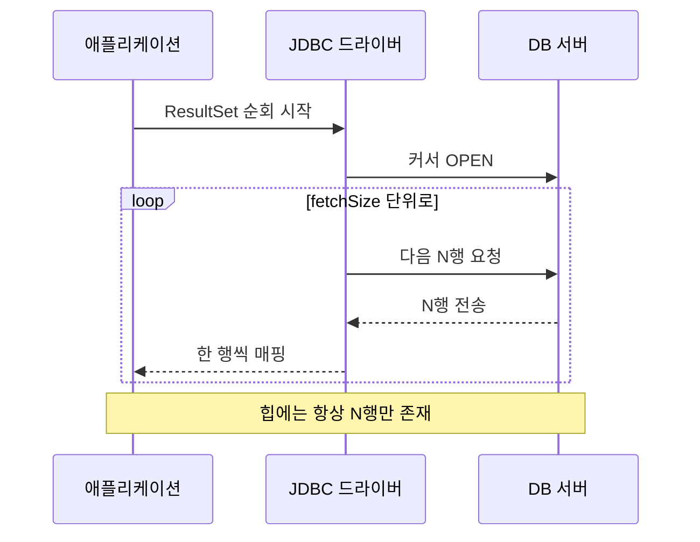

대량 데이터를 한 번에 조회해 가공해야 하는 작업을 맡으면, 처음 작성한 코드는 거의 늘 OOM으로 죽는다. 핵심은 "쿼리가 느려서"가 아니라 "결과 전체를 JVM 힙에 올렸기 때문"이다. 이 글은 결과를 다 모으지 않고 한 행씩 흘려보내는 스트리밍 조회를 다룬다.

## 왜 List 조회가 메모리를 터뜨리는가

`List<User> users = mapper.selectAll()` 같은 호출은 직관적이지만, 내부적으로 **결과 집합 전체를 객체로 매핑해 리스트에 담은 뒤** 반환한다. 50만 건이고 한 행이 1KB면 그것만으로 500MB다. 매핑 과정의 임시 객체까지 더하면 힙은 순식간에 한계에 닿는다.

여기엔 두 단계의 버퍼링이 겹친다.

1. **드라이버 레벨**: 많은 JDBC 드라이버(특히 MySQL Connector/J)는 기본적으로 서버가 보낸 결과 전체를 클라이언트 메모리로 먼저 가져온다. `ResultSet`을 한 행씩 읽는 것처럼 보여도 이미 다 받아 둔 상태다.
2. **매핑 레벨**: MyBatis나 ORM이 그 `ResultSet`을 순회하며 도메인 객체 리스트를 만든다.

즉 같은 데이터가 두 번 메모리를 점유한다.

## fetchSize와 커서 — 흘려보내는 원리

`fetchSize`는 "DB 서버에서 한 번에 몇 행씩 네트워크로 당겨올지"를 정하는 힌트다. 이 값이 동작하려면 드라이버가 결과를 전부 가져오지 않고 **커서를 열어 두고 필요할 때마다 끌어오는 모드**여야 한다.



핵심은 **힙에 상주하는 행 수가 fetchSize로 고정된다**는 점이다. 전체 건수와 무관하게 메모리 사용량이 일정해진다.

## MyBatis에서 한 행씩 처리하기

`ResultHandler`를 쓰면 결과를 리스트로 모으지 않고 콜백으로 한 건씩 받는다.

```java
public void exportAll() {
    Map<String, Object> param = new HashMap<>();
    // 드라이버에 커서 모드를 요청
    mapper.streamAll(param, new ResultHandler<User>() {
        @Override
        public void handleResult(ResultContext<? extends User> ctx) {
            User u = ctx.getResultObject();
            writeToFile(u);   // 처리 후 즉시 GC 대상
        }
    });
}
```

```xml
<select id="streamAll" resultType="User" fetchSize="1000"
        resultSetType="FORWARD_ONLY">
  SELECT id, name, created_at FROM users ORDER BY id
</select>
```

`FORWARD_ONLY` + 적절한 `fetchSize` 조합이 스트리밍의 전제다. MySQL 드라이버는 여기에 더해 `fetchSize`를 `Integer.MIN_VALUE`로 줘야 진짜 행 단위 스트리밍으로 전환되는 특이 동작이 있으니 드라이버 문서를 반드시 확인한다.

## 운영 함정

- **트랜잭션과 커서 생명주기**: 스트리밍은 커서가 열려 있는 동안 DB 커넥션을 점유한다. 처리 중간에 다른 쿼리를 같은 커넥션으로 던지면 "커서가 닫혔다"거나 결과가 깨지는 문제가 난다. 스트리밍 중에는 그 커넥션을 다른 용도로 쓰지 않는다.
- **긴 커서 = 긴 트랜잭션/락**: 한 행씩 처리하는 동안 외부 API 호출 같은 느린 작업을 끼우면 커서가 수 분간 열린다. 그만큼 언두 로그가 쌓이고 락이 길어진다. 무거운 후처리는 청크로 모아 트랜잭션 밖에서 한다.

## 핵심 요약

- 대량 조회의 OOM은 쿼리 속도가 아니라 **결과 전체를 힙에 적재**하기 때문이다.
- `fetchSize` + 커서(FORWARD_ONLY) + `ResultHandler`로 힙 상주 행 수를 고정하면 건수와 무관하게 일정 메모리로 처리한다.
- 드라이버마다 커서 모드 활성 조건이 다르다 — 기본값이 "전체 가져오기"인 경우가 많으니 명시적으로 설정한다.
