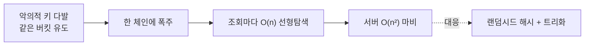

## 키를 주면 곧장 닿는다

[배열]()은 정수 인덱스로 O(1)에 닿았습니다. 그런데 키가 `"user:1024"` 같은 문자열이면? 해시 테이블의 발상은 단순합니다 — **키를 함수에 넣어 정수 인덱스로 바꾸고**, 그 자리에 값을 둔다. 조회도 같은 함수로 자리를 계산해 곧장 닿습니다. 이게 평균 **O(1)** 조회의 정체입니다.

이 단순한 아이디어가 가장 많이 쓰이는 자료구조(`HashMap`, `dict`, Redis, DB 인덱스의 한 축)이면서, 동시에 **평균이 깨지는 순간**(충돌·HashDoS·리해싱 멈춤)을 모르면 프로덕션에서 발등을 찍습니다.

## 해시 함수와 버킷

해시 함수 `h(key)`는 임의의 키를 정수로 흩뿌리고, `h(key) % capacity`로 **버킷(bucket) 인덱스**를 정합니다. 좋은 해시 함수의 조건은 **균등 분포**(키가 골고루 흩어짐)와 **빠른 계산**입니다. 아래는 키들이 해시되어 각자의 버킷으로 날아가 꽂히고, 같은 자리에 부딪히면(충돌) 체인에 매달리는 모습입니다.

<svg viewBox="0 0 680 200" role="img" aria-label="여러 키가 해시 함수를 통과해 각자의 버킷으로 날아가고, 같은 버킷에 부딪힌 키는 충돌하여 체인에 연결되는 애니메이션">
  <rect class="hf" x="150" y="70" width="90" height="56" rx="8"/>
  <text class="lbl" x="195" y="94" text-anchor="middle">h(key)</text>
  <text class="sub" x="195" y="112" text-anchor="middle">% capacity</text>
  <text class="sub" x="40" y="100">키들</text>
  <rect class="bkt" x="540" y="30" width="120" height="28" rx="3"/><text class="sub" x="528" y="48" text-anchor="end">0</text>
  <rect class="bkt" x="540" y="64" width="120" height="28" rx="3"/><text class="sub" x="528" y="82" text-anchor="end">1</text>
  <rect class="bkt" x="540" y="98" width="120" height="28" rx="3"/><text class="sub" x="528" y="116" text-anchor="end">2</text>
  <rect class="bkt" x="540" y="132" width="120" height="28" rx="3"/><text class="sub" x="528" y="150" text-anchor="end">3</text>
  <g class="k1"><rect x="60" y="58" width="44" height="22" rx="4"/><text class="k" x="82" y="73" text-anchor="middle">A</text></g>
  <g class="k2"><rect x="60" y="58" width="44" height="22" rx="4"/><text class="k" x="82" y="73" text-anchor="middle">B</text></g>
  <g class="k3"><rect x="60" y="58" width="44" height="22" rx="4"/><text class="k" x="82" y="73" text-anchor="middle">C</text></g>
  <text class="sub" x="600" y="184" text-anchor="middle">A·C가 버킷1 충돌 → 체인 연결</text>
</svg>

A와 C가 같은 버킷 1로 갔습니다 — **충돌(collision)**. 버킷 수는 유한하고 키는 무한하니 충돌은 **반드시** 생깁니다([비둘기집 원리](https://ko.wikipedia.org/wiki/비둘기집_원리)). 관건은 "충돌을 없애기"가 아니라 "**충돌을 싸게 처리하기**"입니다.

## 충돌 해결 — 체이닝 vs 오픈 어드레싱

**체이닝(separate chaining)**: 각 버킷이 연결 리스트(또는 트리)를 들고, 충돌한 키들을 거기 매답니다. Java `HashMap`이 이 방식이고, 한 버킷의 체인이 너무 길어지면(기본 8개) **레드블랙 트리로 전환**해 최악을 O(n)에서 O(log n)으로 막습니다.

**오픈 어드레싱(open addressing)**: 체인 없이, 충돌하면 **다음 빈 버킷을 탐사(probing)** 해 거기 둡니다(선형 탐사·이차 탐사·이중 해싱). 포인터가 없어 캐시 친화적이지만, 삭제가 까다롭고 로드팩터에 민감합니다(Python `dict`가 오픈 어드레싱 계열).

| 항목 | 체이닝 | 오픈 어드레싱 |
|------|--------|--------------|
| 충돌 처리 | 버킷별 리스트/트리 | 다른 버킷 탐사 |
| 캐시 지역성 | 낮음(포인터) | 높음(연속 배열) |
| 로드팩터 한계 | 1 넘어도 동작 | 1 미만 필수(보통 ≤0.7) |
| 삭제 | 단순 | tombstone 필요 |
| 대표 | Java `HashMap` | Python `dict`, 구글 dense_hash |

## 로드팩터와 리해싱 — 평균을 지키는 비용

**로드팩터(load factor)** = 원소 수 / 버킷 수. 이게 커지면 버킷당 충돌이 늘어 O(1)이 무너집니다. 그래서 임계값(Java 기본 0.75)을 넘으면 **버킷 배열을 2배로 늘리고 전 원소를 재배치**합니다 — **리해싱(rehashing)**. 이 순간만 O(n)이지만, [분할상환]()으로 보면 삽입당 평균 O(1)을 유지합니다.

<svg viewBox="0 0 660 200" role="img" aria-label="로드팩터가 임계값을 넘으면 버킷 배열을 두 배로 늘리고 모든 원소를 새 버킷으로 재배치하는 리해싱 애니메이션">
  <text class="sub" x="20" y="26">로드팩터 0.75 초과 → 버킷 2배 + 전체 재배치 (리해싱)</text>
  <text class="sub" x="20" y="56">기존 4 버킷 (꽉 참)</text>
  <rect class="bkt" x="40"  y="64" width="60" height="30" rx="3"/><rect class="old" x="44" y="68" width="52" height="22" rx="2"/>
  <rect class="bkt" x="110" y="64" width="60" height="30" rx="3"/><rect class="old" x="114" y="68" width="52" height="22" rx="2"/>
  <rect class="bkt" x="180" y="64" width="60" height="30" rx="3"/><rect class="old" x="184" y="68" width="52" height="22" rx="2"/>
  <rect class="bkt" x="250" y="64" width="60" height="30" rx="3"/><rect class="old" x="254" y="68" width="52" height="22" rx="2"/>
  <text class="sub" x="20" y="150">새 8 버킷 (재분배)</text>
  <rect class="newb" x="40"  y="158" width="60" height="30" rx="3"/>
  <rect class="newb" x="110" y="158" width="60" height="30" rx="3"/>
  <rect class="newb" x="180" y="158" width="60" height="30" rx="3"/>
  <rect class="newb" x="250" y="158" width="60" height="30" rx="3"/>
  <rect class="newb" x="320" y="158" width="60" height="30" rx="3"/>
  <rect class="newb" x="390" y="158" width="60" height="30" rx="3"/>
  <rect class="newb" x="460" y="158" width="60" height="30" rx="3"/>
  <rect class="newb" x="530" y="158" width="60" height="30" rx="3"/>
  <rect class="mv mv1" x="44"  y="68" width="52" height="22" rx="2"/>
  <rect class="mv mv2" x="114" y="68" width="52" height="22" rx="2" style="transform:translate(280px,0)"/>
  <rect class="mv mv3" x="184" y="68" width="52" height="22" rx="2" style="transform:translate(206px,0)"/>
  <rect class="mv mv4" x="254" y="68" width="52" height="22" rx="2" style="transform:translate(206px,0)"/>
</svg>

복잡도를 정리하면 이렇습니다.

| 연산 | 평균 | 최악 |
|------|------|------|
| 삽입 | O(1) | O(n) (전부 충돌) / 리해싱 순간 |
| 조회 | O(1) | O(n) → 트리화 시 O(log n) |
| 삭제 | O(1) | O(n) |

## 평균이 깨지는 순간 — HashDoS

해시 테이블의 최악 O(n)은 이론적 호기심이 아닙니다. 공격자가 **의도적으로 같은 버킷에 몰리는 키**를 대량 전송하면, 모든 조회가 한 체인을 선형 탐색해 서버가 O(n²)로 마비됩니다 — **HashDoS**. 대응은 두 가지입니다.

- **랜덤 시드 해시**: 프로세스마다 무작위 시드를 섞어(SipHash 등) 공격자가 충돌 키를 예측 못 하게. Python·Rust·Java가 채택.
- **트리화**: 한 버킷이 길어지면 트리로 전환해 최악을 O(log n)으로 제한(Java 8 `HashMap`).

## 실무·AWS 연결

해시는 분산 시스템의 척추입니다. **DynamoDB**는 파티션 키를 해시해 데이터를 물리 파티션에 분산합니다 — 특정 키에 트래픽이 몰리면(hot partition) 해당 파티션만 throttle되는, 로드팩터 불균형의 분산 버전입니다. 노드를 추가/삭제할 때 **전체 재배치(리해싱)** 를 피하려고 분산 캐시는 단순 `% N` 대신 [일관된 해싱]()을 씁니다.

## 프로덕션에서 마주치는 함정

| 함정 | 증상 | 해법 |
|------|------|------|
| 가변 객체를 키로 | 키 변경 후 영영 못 찾음 | 불변 키 사용 |
| `equals`만 재정의, `hashCode` 누락 | 같은 키인데 다른 버킷 | 둘을 함께 재정의 |
| 초기 용량 미지정 | 리해싱 반복으로 지연 스파이크 | 예상 크기로 초기화 |
| 외부 입력을 키로 무방비 | HashDoS | 랜덤시드 해시·입력 검증 |
| hot key/partition | 일부 노드만 과부하 | 키 분산·샤딩·캐싱 |

## 면접/리뷰 단골 질문

- **Q. 해시 테이블이 평균 O(1)인 이유와, 깨지는 경우?** → 균등 분포 가정 하에 버킷당 원소가 상수. 충돌이 한 버킷에 몰리면(또는 HashDoS) 최악 O(n).
- **Q. 체이닝과 오픈 어드레싱 차이?** → 체이닝은 버킷별 리스트/트리, 오픈 어드레싱은 빈 버킷 탐사. 후자가 캐시 친화적이나 로드팩터·삭제에 민감.
- **Q. 로드팩터와 리해싱?** → 원소/버킷 비율. 임계값 넘으면 버킷 2배로 늘려 전체 재배치, 분할상환 O(1) 유지.
- **Q. `hashCode`와 `equals`를 함께 재정의해야 하는 이유?** → 같다고 판단되는 두 객체는 같은 해시를 내야 같은 버킷에서 찾힌다. 어기면 조회 실패.
- **Q. HashDoS 방어?** → 랜덤 시드 해시(SipHash)로 충돌 예측 차단 + 긴 체인 트리화.

## 정리

- 해시 테이블은 **키를 정수 인덱스로 바꿔** 평균 O(1) 조회를 준다. 충돌은 필연이라 "싸게 처리"가 핵심.
- 충돌 해결은 **체이닝**(버킷별 리스트/트리)과 **오픈 어드레싱**(빈 버킷 탐사). 로드팩터가 임계값을 넘으면 **리해싱**으로 평균을 지킨다.
- 최악 O(n)은 현실 위협(**HashDoS**)이다 — 랜덤 시드 해시 + 트리화로 막는다.
- 분산 환경에선 `% N` 리해싱을 피하려 [일관된 해싱]()으로 확장한다.

> 다음 글부터는 자료구조에 데이터를 **정렬**해 담는 이야기로 넘어갑니다 — [비교 정렬]()의 퀵·머지·힙과 "왜 O(n log n)보다 빠를 수 없는가"라는 하한을 봅니다.
</content>
</invoke>
