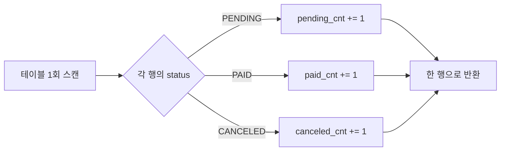

대시보드나 목록 상단의 "전체 120 / 대기 30 / 완료 90" 같은 요약 숫자를 만들다 보면, 무심코 상태마다 `COUNT` 쿼리를 따로 던지게 된다. 이 글은 그 N번의 스캔을 단 한 번으로 줄이는 조건부 집계를 다룬다.

## 왜 따로 던지는 게 비싼가

상태가 3개라고 상태별 카운트를 이렇게 짜기 쉽다.

```sql
SELECT COUNT(*) FROM orders WHERE status = 'PENDING';
SELECT COUNT(*) FROM orders WHERE status = 'PAID';
SELECT COUNT(*) FROM orders WHERE status = 'CANCELED';
```

문제는 **각 쿼리가 독립적으로 테이블(또는 인덱스)을 한 번씩 스캔**한다는 것이다. 상태가 6개면 6번, 거기에 전체 건수까지 더하면 7번 훑는다. 인덱스가 있어도 쿼리 파싱·최적화·실행 오버헤드가 매번 발생하고, 애플리케이션 ↔ DB 왕복(round-trip)도 그 수만큼 늘어난다.

## 조건부 집계의 원리

`SUM(CASE WHEN 조건 THEN 1 ELSE 0 END)`은 **한 번의 스캔 동안 각 행을 보면서 조건에 맞으면 1을 더하는** 방식이다. 행을 한 번만 읽고, 그 행이 어느 버킷에 속하는지 판정해 여러 카운터를 동시에 증가시킨다.



```sql
SELECT
  COUNT(*)                                            AS total,
  SUM(CASE WHEN status = 'PENDING'  THEN 1 ELSE 0 END) AS pending,
  SUM(CASE WHEN status = 'PAID'     THEN 1 ELSE 0 END) AS paid,
  SUM(CASE WHEN status = 'CANCELED' THEN 1 ELSE 0 END) AS canceled
FROM orders;
```

`SUM(CASE...)` 대신 `COUNT(CASE WHEN status='PAID' THEN 1 END)`도 가능하다. `COUNT`는 NULL을 세지 않으므로 `ELSE`를 생략하면 자연스럽게 동작한다. 결과는 **단일 행**으로 떨어지므로 애플리케이션에서 매핑도 간단하다.

## GROUP BY와의 차이

상태가 동적이고 종류가 많다면 `GROUP BY status`가 낫다. 둘의 차이는 출력 모양에 있다.

- `GROUP BY`: 상태당 한 **행**(세로 방향). 종류를 미리 몰라도 됨.
- 조건부 집계: 상태별 카운트가 한 행의 여러 **컬럼**(가로 방향). 종류가 고정·소수일 때 화면 매핑이 편함.

"전체와 부분을 한 행에 같이" 담아야 할 때는 조건부 집계가 특히 빛난다. `GROUP BY`로는 total을 따로 구해야 하지만, 조건부 집계는 `COUNT(*)`와 나란히 둘 수 있다.

## 운영 함정

- **인덱스 활용을 잃을 수 있다**: 상태별 분리 쿼리는 `status` 인덱스로 일부만 읽을 수 있지만, 조건부 집계는 보통 **전체 스캔**으로 모든 행을 한 번 본다. 전체 건수 대비 특정 상태가 극히 일부고 그 상태만 자주 조회한다면, 부분 인덱스나 분리 쿼리가 더 빠를 수 있다. "한 화면에 여러 집계를 다 보여줄 때"가 조건부 집계의 본령이다.
- **NULL과 ELSE 처리**: `SUM(CASE...)`에서 `ELSE 0`을 빠뜨리면 매칭 안 된 행이 NULL이 되고, 전부 NULL이면 합계가 0이 아니라 NULL이 된다. `COALESCE`로 감싸거나 `ELSE 0`을 명시한다.

## 핵심 요약

- 상태별 카운트를 상태마다 던지면 테이블을 N번 스캔한다.
- `SUM(CASE WHEN ...)` / `COUNT(CASE WHEN ...)`는 1번 스캔으로 여러 버킷을 동시에 센다.
- 한 화면에 전체+부분 집계를 같이 보여줄 때 최적. 단, 특정 상태만 인덱스로 골라 읽는 게 유리한 경우는 예외다.
