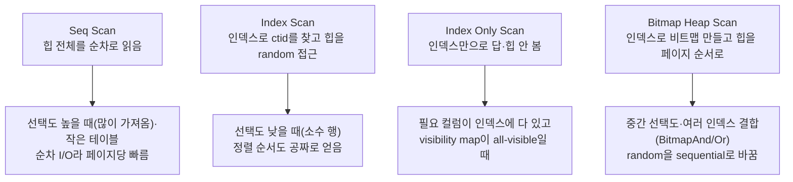
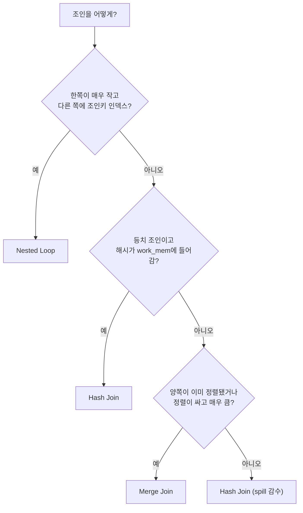

## "인덱스 걸었는데 왜 느리지?"

분명히 `WHERE` 컬럼에 인덱스를 만들었는데 쿼리가 풀스캔처럼 느립니다. 또는 어제까지 50ms이던 조인이 오늘 갑자기 8초가 나옵니다. 코드는 한 줄도 안 바뀌었는데요. 이럴 때 추측으로 인덱스를 더 거는 건 도박입니다. 답은 **옵티마이저가 실제로 짠 실행 계획(plan)을 직접 읽는 것**입니다.

[앞 글의 WAL과 크래시 복구]()까지가 "데이터가 안전하게 저장·복구되는가"였다면, 이제부터는 "그 데이터를 어떻게 빨리 꺼내는가"입니다. [SELECT가 도는 길]()에서 봤듯 SQL은 선언적이고, 절차로 바꾸는 건 옵티마이저입니다. 같은 결과를 내는 plan이 수십 개라면 옵티마이저는 **cost가 가장 싼 것**을 고릅니다. 이 글은 그 plan을 읽는 법(`EXPLAIN`)과, plan의 심장인 **3대 조인 알고리즘**을 PostgreSQL 내부 동작 수준으로 풉니다.

## EXPLAIN — plan 트리를 읽는 문법

`EXPLAIN`은 옵티마이저가 고른 plan 트리를 보여줍니다. `ANALYZE`를 붙이면 **실제로 실행**하고 실측치를 같이 줍니다(주의: `INSERT/UPDATE/DELETE`도 진짜 실행되므로 트랜잭션으로 감싸 롤백). `BUFFERS`는 버퍼 풀([shared_buffers]()) 히트/디스크 읽기까지 보여줍니다.

```sql
BEGIN;
EXPLAIN (ANALYZE, BUFFERS, FORMAT TEXT)
SELECT o.id, c.name
FROM orders o JOIN customers c ON c.id = o.customer_id
WHERE o.created_at >= '2023-08-01';
ROLLBACK;
```

```text
Hash Join  (cost=33.50..512.30 rows=980 width=40)
           (actual time=0.412..6.183 rows=1024 loops=1)
  Hash Cond: (o.customer_id = c.id)
  Buffers: shared hit=210 read=88
  ->  Seq Scan on orders o  (cost=0.00..420.00 rows=980 width=12)
                            (actual time=0.018..3.901 rows=1024 loops=1)
        Filter: (created_at >= '2023-08-01')
        Rows Removed by Filter: 19000
        Buffers: shared hit=120 read=80
  ->  Hash  (cost=21.00..21.00 rows=1000 width=36)
            (actual time=0.350..0.351 rows=1000 loops=1)
        Buckets: 1024  Batches: 1  Memory Usage: 72kB
        ->  Seq Scan on customers c  (cost=0.00..21.00 rows=1000 width=36)
                                     (actual time=0.006..0.140 rows=1000 loops=1)
```

읽는 순서는 **안쪽(가장 들여쓰기 깊은 자식)에서 바깥으로, 위가 마지막**입니다. 트리이므로 부모 노드는 자식이 흘려보낸 행을 받아 가공합니다([실행기는 Volcano/iterator 모델]()로 한 행씩 위로 끌어올립니다).

핵심 숫자들의 의미:

| 항목 | 뜻 | 보는 법 |
|---|---|---|
| `cost=시작..총` | 옵티마이저의 **추정 비용**(단위 없는 상대값). 앞=첫 행 반환까지, 뒤=마지막 행까지 | 절대값보다 **plan 간 비교**용 |
| `rows` (cost 줄) | 옵티마이저가 **추정한** 반환 행 수 | `actual`과 크게 벌어지면 통계 문제 |
| `actual time=시작..총` | `ANALYZE` 실측 시간(ms) | 어느 노드가 진짜 느린지 |
| `rows` (actual 줄) | **실제** 반환 행 수 | 추정과 10배 이상 벌어지면 경보 |
| `loops` | 그 노드가 **반복 실행된 횟수** | 1보다 크면 표시값은 **1회 평균** |
| `Buffers: hit/read` | 캐시 히트 / 디스크 읽기 페이지 수 | `read`가 크면 I/O 바운드 |

가장 중요한 진단 습관: **추정 `rows` vs 실제 `rows`를 나란히 본다.** 위 예에서 `Seq Scan on orders`는 `rows=980` 추정에 실제 `1024` — 거의 맞습니다. 이게 980 추정인데 실제 50만이면, 옵티마이저는 "작다"고 믿고 엉뚱한 조인(Nested Loop)을 골라 폭발합니다. 그 추정이 어디서 오는지(통계·히스토그램·MCV)는 [다음 글]()의 주제입니다.

> **loops 함정**: Nested Loop 안쪽 노드가 `actual time=0.02..0.03 rows=1 loops=50000`이면 한 번은 빠르지만 5만 번 돌아 총 1.5초입니다. 표시 시간/행에 **항상 loops를 곱해** 실제 부담을 계산하세요.

plan은 트리이고 실행은 **아래(잎 노드인 스캔)에서 위(루트)로** 행을 끌어올립니다. 아래 애니메이션에서 두 스캔이 흘려보낸 행이 조인 노드에서 합쳐져 루트로 솟아오르는 흐름을 보세요 — `EXPLAIN` 출력의 들여쓰기가 바로 이 트리의 모양입니다.

<div class="plan-tree" markdown="0">
<style>
.plan-tree{margin:1.4rem 0;overflow-x:auto}
.plan-tree svg{width:100%;max-width:640px;height:auto;display:block;margin:0 auto;font-family:inherit}
.plan-tree .node{stroke:currentColor;stroke-width:1.4;fill:none;opacity:.55}
.plan-tree .lbl{fill:currentColor;font-size:11px;font-weight:600}
.plan-tree .sub{fill:currentColor;font-size:9px;opacity:.6}
.plan-tree .edge{stroke:currentColor;stroke-width:1.2;opacity:.3;fill:none}
.plan-tree .rowL{fill:#1971c2;offset-path:path('M 120,210 L 120,140 L 300,140 L 300,80');opacity:0;animation:ptL 5s linear infinite}
.plan-tree .rowR{fill:#2f9e44;offset-path:path('M 480,210 L 480,140 L 300,140 L 300,80');opacity:0;animation:ptR 5s linear infinite}
.plan-tree .rowU{fill:#f08c00;offset-path:path('M 300,70 L 300,30');opacity:0;animation:ptU 5s linear infinite}
@keyframes ptL{0%{offset-distance:0%;opacity:0}5%{opacity:1}45%{offset-distance:100%;opacity:1}50%,100%{opacity:0}}
@keyframes ptR{0%{offset-distance:0%;opacity:0}5%{opacity:1}45%{offset-distance:100%;opacity:1}50%,100%{opacity:0}}
@keyframes ptU{0%,55%{offset-distance:0%;opacity:0}60%{opacity:1}90%{offset-distance:100%;opacity:1}100%{opacity:0}}
</style>
<svg viewBox="0 0 600 240" role="img" aria-label="plan 트리에서 두 스캔 노드의 행이 위 조인 노드로 올라가 합쳐진 뒤 루트로 솟아오르는 bottom-up 실행 흐름 애니메이션">
  <rect class="node" x="250" y="6" width="100" height="26" rx="4"/><text class="lbl" x="300" y="23" text-anchor="middle">결과(루트)</text>
  <rect class="node" x="248" y="56" width="104" height="26" rx="4"/><text class="lbl" x="300" y="73" text-anchor="middle">Hash Join</text>
  <rect class="node" x="60" y="208" width="120" height="26" rx="4"/><text class="lbl" x="120" y="225" text-anchor="middle">Seq Scan o</text>
  <rect class="node" x="420" y="208" width="120" height="26" rx="4"/><text class="lbl" x="480" y="225" text-anchor="middle">Seq Scan c</text>
  <path class="edge" d="M 120,208 L 120,140 L 280,140 L 280,82"/>
  <path class="edge" d="M 480,208 L 480,140 L 320,140 L 320,82"/>
  <path class="edge" d="M 300,56 L 300,32"/>
  <text class="sub" x="120" y="250" text-anchor="middle">probe 쪽 행 ↑</text>
  <text class="sub" x="480" y="250" text-anchor="middle">build 쪽 행 ↑</text>
  <circle class="rowL" r="5"/>
  <circle class="rowR" r="5"/>
  <circle class="rowU" r="5"/>
</svg>
</div>

## 스캔 노드 — 데이터를 어떻게 집어오나

조인을 보기 전에, 조인의 입력이 되는 **스캔 노드**부터 구분해야 합니다. 같은 테이블이라도 어떻게 읽느냐로 비용이 갈립니다.



- **Seq Scan**: 힙([heap]())을 처음부터 끝까지 순차로 읽습니다. "인덱스가 없어서"가 아니라, **많은 행을 가져올 땐 random I/O인 인덱스보다 순차 I/O가 더 싸다**고 옵티마이저가 판단한 것일 수도 있습니다. 작은 테이블에선 거의 항상 Seq Scan이 정답입니다.
- **Index Scan**: [B-Tree]()로 키를 찾아 `ctid`를 얻고, 그 `ctid`로 힙 페이지를 **random 접근**합니다. 소수 행을 콕 집을 때(낮은 선택도) 유리하고, 인덱스의 정렬 순서를 그대로 쓸 수 있어 `ORDER BY`/Merge Join 입력으로 좋습니다.
- **Index Only Scan**: 필요한 컬럼이 전부 인덱스 안에 있고([커버링 인덱스]()), visibility map이 해당 페이지를 all-visible로 표시했으면 **힙을 아예 안 읽습니다**. `Heap Fetches:` 값이 크면 visibility map이 갱신 안 돼(=VACUUM 필요) 결국 힙을 보고 있다는 신호입니다.
- **Bitmap Heap Scan**: 인덱스로 먼저 **비트맵**(어느 페이지에 매칭이 있나)을 만든 뒤, 힙을 **페이지 번호 순서**로 한 번에 읽습니다. random 접근을 sequential에 가깝게 바꿔, 중간 선택도에서 Index Scan과 Seq Scan 사이를 메웁니다. `BitmapAnd`/`BitmapOr`로 여러 인덱스를 결합할 수도 있습니다.

## 3대 조인 알고리즘 — 두 테이블을 매칭하는 세 가지 방식

조인은 결국 "왼쪽(outer) 행마다 짝이 되는 오른쪽(inner) 행을 찾는" 일입니다. 찾는 방법이 셋이고, 옵티마이저는 입력 크기·인덱스·정렬 상태·`work_mem`을 보고 cost가 싼 것을 고릅니다. 아래 애니메이션이 세 방식의 매칭 동작을 나란히 보여줍니다.

<div class="join-algo" markdown="0">
<style>
.join-algo{margin:1.4rem 0;overflow-x:auto}
.join-algo svg{width:100%;max-width:760px;height:auto;display:block;margin:0 auto;font-family:inherit}
.join-algo .ttl{fill:currentColor;font-size:12px;font-weight:700}
.join-algo .sub{fill:currentColor;font-size:9px;opacity:.6}
.join-algo .row{stroke:currentColor;stroke-width:1.1;fill:none;opacity:.5}
.join-algo .o{fill:#1971c2}
.join-algo .i{fill:#2f9e44}
.join-algo .h{fill:#f08c00}
.join-algo .txt{fill:#fff;font-size:9px;font-weight:600}
/* Nested Loop: 외부 행을 가리키는 포인터가 내부를 훑는다 */
.join-algo .nl-scan{fill:#e03131;opacity:.85;animation:jnl 4s ease-in-out infinite}
@keyframes jnl{
  0%{transform:translateY(0)}
  20%{transform:translateY(0)}
  25%{transform:translateY(26px)}
  45%{transform:translateY(26px)}
  50%{transform:translateY(52px)}
  70%{transform:translateY(52px)}
  75%{transform:translateY(78px)}
  100%{transform:translateY(78px)}}
.join-algo .nl-probe{fill:#e03131;opacity:0;animation:jnlp 4s linear infinite}
@keyframes jnlp{0%,8%{opacity:0}12%{opacity:.9}88%{opacity:.9}100%{opacity:0}}
/* Hash: 빌드 단계 후 프로브가 버킷으로 점프 */
.join-algo .hb{opacity:0;animation:jhb 5s ease-in-out infinite}
@keyframes jhb{0%{opacity:0}15%,100%{opacity:.9}}
.join-algo .hp{fill:#e03131;offset-path:path('M 250,150 L 330,150 L 330,60');opacity:0;animation:jhp 5s ease-in-out infinite}
@keyframes jhp{0%,40%{offset-distance:0%;opacity:0}45%{opacity:1}70%{offset-distance:100%;opacity:1}75%,100%{opacity:0}}
/* Merge: 두 정렬 포인터가 나란히 전진 */
.join-algo .mg-l{fill:#e03131;animation:jmgl 4s steps(1) infinite}
.join-algo .mg-r{fill:#e03131;animation:jmgr 4s steps(1) infinite}
@keyframes jmgl{0%{transform:translateY(0)}33%{transform:translateY(26px)}66%,100%{transform:translateY(52px)}}
@keyframes jmgr{0%{transform:translateY(0)}33%,66%{transform:translateY(26px)}100%{transform:translateY(52px)}}
</style>
<svg viewBox="0 0 760 230" role="img" aria-label="Nested Loop·Hash Join·Merge Join 세 조인 알고리즘이 두 테이블의 행을 매칭하는 방식을 비교하는 애니메이션">
  <!-- Nested Loop -->
  <text class="ttl" x="20" y="20">① Nested Loop</text>
  <text class="sub" x="20" y="34">외부 1행마다 내부를 훑음</text>
  <g transform="translate(20,46)">
    <rect class="row o" x="0" y="0" width="40" height="22" rx="3"/><text class="txt" x="20" y="15" text-anchor="middle">o1</text>
    <rect class="row" x="80" y="0" width="40" height="22" rx="3"/><text class="sub" x="100" y="15" text-anchor="middle">i1</text>
    <rect class="row" x="80" y="26" width="40" height="22" rx="3"/><text class="sub" x="100" y="41" text-anchor="middle">i2</text>
    <rect class="row" x="80" y="52" width="40" height="22" rx="3"/><text class="sub" x="100" y="67" text-anchor="middle">i3</text>
    <rect class="row" x="80" y="78" width="40" height="22" rx="3"/><text class="sub" x="100" y="93" text-anchor="middle">i4</text>
    <circle class="nl-probe" cx="100" cy="11" r="6"/>
    <rect class="nl-scan" x="46" y="0" width="28" height="22" rx="3" opacity="0.85"/>
  </g>
  <text class="sub" x="20" y="160">작은 외부 + 내부 인덱스일 때 최적</text>
  <text class="sub" x="20" y="173">O(외부 × 내부탐색)</text>

  <!-- Hash Join -->
  <text class="ttl" x="270" y="20">② Hash Join</text>
  <text class="sub" x="270" y="34">작은 쪽으로 해시테이블 build → probe</text>
  <g transform="translate(250,46)">
    <rect class="row i" x="0" y="0" width="40" height="22" rx="3"/><text class="txt" x="20" y="15" text-anchor="middle">i</text>
    <rect class="row hb h" x="80" y="0" width="34" height="18" rx="3"/><text class="sub hb" x="97" y="13" text-anchor="middle" fill="#fff">b0</text>
    <rect class="row hb h" x="80" y="22" width="34" height="18" rx="3"/><text class="sub hb" x="97" y="35" text-anchor="middle" fill="#fff">b1</text>
    <rect class="row hb h" x="80" y="44" width="34" height="18" rx="3"/><text class="sub hb" x="97" y="57" text-anchor="middle" fill="#fff">b2</text>
    <rect class="row o" x="0" y="92" width="40" height="22" rx="3"/><text class="txt" x="20" y="107" text-anchor="middle">o</text>
    <text class="sub" x="20" y="135">probe →</text>
  </g>
  <circle class="hp" r="6"/>
  <text class="sub" x="270" y="160">등치 조인·대용량, 인덱스 불필요</text>
  <text class="sub" x="270" y="173">build O(작은쪽) + probe O(큰쪽)</text>

  <!-- Merge Join -->
  <text class="ttl" x="540" y="20">③ Merge Join</text>
  <text class="sub" x="540" y="34">정렬된 양쪽을 지퍼처럼 전진</text>
  <g transform="translate(540,46)">
    <rect class="row o" x="0" y="0" width="40" height="22" rx="3"/><text class="txt" x="20" y="15" text-anchor="middle">1</text>
    <rect class="row o" x="0" y="26" width="40" height="22" rx="3"/><text class="txt" x="20" y="41" text-anchor="middle">3</text>
    <rect class="row o" x="0" y="52" width="40" height="22" rx="3"/><text class="txt" x="20" y="67" text-anchor="middle">5</text>
    <rect class="row i" x="90" y="0" width="40" height="22" rx="3"/><text class="txt" x="110" y="15" text-anchor="middle">1</text>
    <rect class="row i" x="90" y="26" width="40" height="22" rx="3"/><text class="txt" x="110" y="41" text-anchor="middle">3</text>
    <rect class="row i" x="90" y="52" width="40" height="22" rx="3"/><text class="txt" x="110" y="67" text-anchor="middle">5</text>
    <circle class="mg-l" cx="52" cy="11" r="5"/>
    <circle class="mg-r" cx="78" cy="11" r="5"/>
  </g>
  <text class="sub" x="540" y="160">양쪽이 이미 정렬돼 있을 때 최적</text>
  <text class="sub" x="540" y="173">O(정렬된 N + M), 메모리 적게</text>
</svg>
</div>

### ① Nested Loop Join

가장 단순합니다. 외부(outer) 행 하나마다 내부(inner)를 통째로 훑어 짝을 찾습니다. 순진하게 하면 O(N×M)이라 끔찍하지만, **내부에 인덱스가 있으면** 내부 훑기가 인덱스 탐색(O(log M))으로 줄어 강력해집니다.

```text
Nested Loop  (rows=8)
  ->  Index Scan on orders o   (rows=8)   -- 외부: 소수 행
  ->  Index Scan on customers c (rows=1 loops=8)  -- 외부 행마다 1번씩
        Index Cond: (c.id = o.customer_id)
```

`loops=8`을 보세요 — 내부가 외부 행 수만큼 반복됩니다. **외부가 작고**(WHERE로 좁혀짐) **내부에 조인키 인덱스가 있을 때** 최강입니다. 반대로 외부가 수만 행이면 내부 인덱스 탐색을 수만 번 = 폭발. 옵티마이저가 외부 rows를 과소추정([통계 오류]())하면 이 함정에 빠집니다.

### ② Hash Join

작은 쪽 테이블 전체를 읽어 조인키로 **해시테이블(build phase)**을 메모리에 만든 뒤, 큰 쪽을 한 행씩 흘리며 해시테이블을 **조회(probe phase)**합니다. 인덱스가 전혀 필요 없고, 등치 조인(`=`)에서 대용량끼리 붙일 때 압도적입니다.

```text
Hash Join
  Hash Cond: (o.customer_id = c.id)
  ->  Seq Scan on orders o        -- 큰 쪽: probe
  ->  Hash
        Buckets: 1024  Batches: 1  Memory Usage: 72kB
        ->  Seq Scan on customers c  -- 작은 쪽: build
```

`Batches: 1`이 핵심 건강 지표입니다. 해시테이블이 `work_mem`에 다 들어가면 1배치(메모리 내 완결). 안 들어가면 **여러 배치로 쪼개 디스크로 흘러내립니다(spill)** — 뒤에서 다룹니다. `Buckets`는 해시 버킷 수, `Memory Usage`는 실제 사용량입니다.

### ③ Merge Join

양쪽을 **조인키로 정렬**한 뒤, 두 포인터를 지퍼처럼 나란히 전진시키며 같은 값을 매칭합니다. 정렬이 전제라, 입력이 **이미 정렬돼 있으면**(인덱스 순서로 읽거나 직전 단계가 정렬됨) 정렬 비용 없이 최강입니다. 정렬을 새로 해야 하면 그 비용(Sort 노드)이 추가됩니다.

```text
Merge Join
  Merge Cond: (o.customer_id = c.id)
  ->  Index Scan on orders_cust_idx o   -- 정렬된 채로 나옴
  ->  Index Scan on customers_pkey c     -- 정렬된 채로 나옴
```

부등호 범위 조인(`>`, `<` 일부)이나 매우 큰 양쪽을 정렬된 상태로 다룰 때, 그리고 메모리를 적게 쓰면서 스트리밍하고 싶을 때 유리합니다.



## work_mem과 spill — 메모리가 모자라면 디스크로 흘러내린다

Hash Join의 해시테이블, `ORDER BY`/`GROUP BY`의 정렬은 **`work_mem`** 한도 안에서 메모리로 처리합니다. 넘치면 옵티마이저/실행기는 임시파일로 **spill**합니다 — 갑작스런 슬로우다운의 단골 원인입니다.

핵심 함정 셋:

1. **`work_mem`은 노드당·연결당 한도**입니다. 전역 총량이 아닙니다. 한 쿼리가 정렬 3개 + 해시 2개를 쓰면 최악의 경우 `work_mem × 5`를, 동시 연결 100개면 또 그만큼을 곱해 메모리가 폭발할 수 있습니다. 그래서 `work_mem`은 함부로 크게 잡지 않습니다([운영 튜닝]()).
2. **Hash가 spill하면 `Batches > 1`** 로 나타납니다. `EXPLAIN ANALYZE`에서 `Batches: 8  Memory Usage: 4096kB  Disk Usage: 30720kB` 같은 줄이 보이면 디스크로 새고 있다는 증거입니다.
3. **Sort가 spill하면 `Sort Method: external merge Disk: 24000kB`** 로 나타납니다. `quicksort Memory`면 메모리 내, `external merge Disk`면 디스크 정렬입니다.

```sql
-- 이 쿼리만 한도를 올려 spill 회피 (세션 한정, 전역 변경 X)
SET work_mem = '128MB';
EXPLAIN (ANALYZE, BUFFERS)
SELECT customer_id, count(*) FROM orders GROUP BY customer_id ORDER BY 2 DESC;
RESET work_mem;
```

진단 순서는 항상 같습니다: `EXPLAIN (ANALYZE, BUFFERS)`로 (1) **추정 vs 실제 rows**가 벌어진 노드를 찾고(통계 문제 → 다음 글), (2) `Batches`/`Sort Method`로 **spill**을 확인하고, (3) `loops`를 곱해 **진짜 느린 노드**를 짚은 뒤, (4) 인덱스·`work_mem`·쿼리 재작성으로 손봅니다.

## 면접/리뷰 단골 질문

- **Q. EXPLAIN의 cost와 actual time의 차이는?** → cost는 옵티마이저의 **추정 상대값**(단위 없음, plan 비교용), actual time은 `ANALYZE`로 **실제 실행한 ms**. 둘이 크게 어긋나면 통계나 비용 파라미터 문제를 의심한다.
- **Q. 추정 rows와 실제 rows가 10배 벌어지면?** → 옵티마이저가 잘못된 카디널리티로 조인/스캔을 골랐다는 신호. ANALYZE로 통계 갱신, 상관 컬럼이면 `CREATE STATISTICS`. 전형적으로 작은 외부를 가정해 Nested Loop를 골랐다가 폭발한다.
- **Q. Nested Loop·Hash·Merge는 각각 언제?** → 한쪽이 작고 내부 조인키에 인덱스 → Nested Loop. 등치 조인 + 대용량 + 해시가 work_mem에 맞음 → Hash. 양쪽이 이미 정렬(또는 정렬이 싸고 매우 큼) → Merge.
- **Q. Bitmap Heap Scan은 왜 쓰나?** → Index Scan의 random I/O를 비트맵으로 모아 **힙을 페이지 순서(sequential)로** 읽기 위해. 중간 선택도와 여러 인덱스 결합(BitmapAnd/Or)에서 유리.
- **Q. Index Only Scan인데 느리다, 왜?** → `Heap Fetches`가 크면 visibility map이 all-visible이 아니라 결국 힙을 보고 있다. VACUUM으로 visibility map을 갱신해야 한다.
- **Q. work_mem을 크게 잡으면 항상 좋은가?** → 아니다. 노드당·연결당 한도라 동시성 × 노드 수만큼 곱해져 OOM을 부른다. 무거운 분석 쿼리에만 세션 단위로 올린다.

## 정리

- `EXPLAIN (ANALYZE, BUFFERS)`는 **추정 rows vs 실제 rows**, `actual time`, `loops`, `Buffers`로 어디가 느린지 가리킨다. loops는 항상 곱해서 본다.
- 스캔: **Seq**(많이/작은 테이블), **Index**(소수·정렬), **Index Only**(커버링+visibility map), **Bitmap Heap**(중간 선택도·random→sequential).
- 조인 3대장: **Nested Loop**(작은 외부+내부 인덱스), **Hash Join**(등치·대용량·인덱스 불필요), **Merge Join**(정렬된 양쪽).
- 옵티마이저는 입력 크기·인덱스·정렬 상태·`work_mem`을 보고 **cost가 싼 plan**을 고른다. 통계가 틀리면 선택이 틀린다.
- `work_mem`을 넘기면 해시/정렬이 디스크로 **spill**한다 — `Batches > 1`, `Sort Method: external merge`가 증거다.

> 다음 글: 옵티마이저의 선택은 결국 **rows 추정**에 달렸습니다. 그 추정이 어디서 오고 왜 틀어지는지 — [카디널리티 추정과 통계의 세계]()로 이어집니다.
