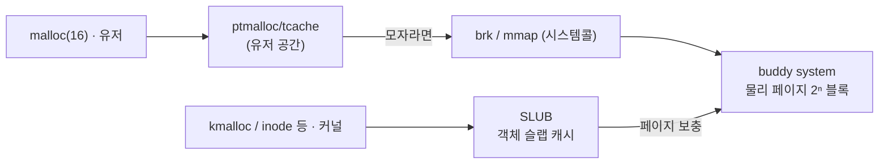

## "malloc(16)을 백만 번 부르면 시스템콜도 백만 번일까"

아닙니다. 그렇다면 [12편]()에서 본 모드 전환 비용 때문에 C 프로그램은 기어 다닐 겁니다. 진실은 이렇습니다 — `malloc`은 **시스템콜이 아니라 라이브러리 함수**입니다. 커널에게서 메모리를 큰 덩어리로 **한 번 받아두고**, 그 덩어리를 유저 공간에서 잘게 떼어 줍니다. 커널 문(시스템콜)은 덩어리가 모자랄 때만 두드립니다.

그래서 "메모리 할당"은 사실 **두 층의 할당자**가 협력하는 일입니다. 유저 공간 할당자(glibc의 `ptmalloc`)와 커널의 물리 페이지 할당자(`buddy`·`slab`). 이 글은 `malloc(16)` 한 줄이 이 두 층을 어떻게 통과하는지, 그리고 그 과정에서 생기는 **단편화**라는 숙적을 어떻게 다루는지를 따라갑니다.

## 두 층의 경계: brk와 mmap

유저 공간 할당자가 커널에서 메모리를 받는 통로는 둘뿐입니다.

- **`brk`/`sbrk`**: 힙의 끝(program break)을 위로 밀어 올려 [주소 공간]()의 힙 영역을 키웁니다. 작고 빈번한 할당에 씁니다. 단, 힙은 **연속 영역**이라 중간이 비어도 끝에서만 줄일 수 있습니다(반환의 비대칭성).
- **`mmap`**: 익명 페이지를 통째로 매핑합니다. 큰 할당(glibc 기본 임계값 128KB 이상, `M_MMAP_THRESHOLD`)은 `mmap`으로 따로 받고, `free` 시 `munmap`으로 **즉시 커널에 반납**됩니다.

```c
/* malloc은 결국 이 둘 중 하나로 귀결된다 — strace로 보면 보인다 */
void *small = malloc(16);      /* 보통 기존 힙 청크에서 떼줌 → 시스템콜 0회 */
void *big   = malloc(1 << 20); /* 1MB → mmap()을 직접 호출 */
```

> **현실 체크 — "free 했는데 RSS가 안 줄어요."** `brk`로 받은 영역은 힙 끝이 아니면 커널에 못 돌려줍니다. 그래서 작은 청크를 잔뜩 `free`해도 [RSS]()가 그대로일 수 있습니다 — 할당자가 **다음 요청에 재사용하려고 쥐고 있는** 것이지 누수가 아닙니다. 진짜 반납을 원하면 `malloc_trim()`을 부르거나, 애초에 큰 할당이 `mmap` 경로를 타게 설계합니다.

## 단편화: 할당자의 숙적

메모리가 충분한데도 할당이 실패하거나 낭비되는 두 가지 방식이 있습니다.

- **내부 단편화(internal)**: 32바이트를 요청했는데 할당자가 48바이트짜리 슬롯을 줘서 16바이트가 청크 **안에서** 노는 것. 크기 클래스(size class)를 두는 할당자의 숙명입니다.
- **외부 단편화(external)**: 자유 공간의 총합은 충분한데 **연속된** 큰 구멍이 없어 큰 요청을 못 받는 것.

아래에서 메모리에는 자유 공간(여유 8 + 24 + 16 = 48)이 요청(32)보다 많습니다. 그런데도 32짜리 요청(<span style="color:#f08c00;font-weight:600">주황</span>)이 어느 구멍에도 안 들어갑니다 — 각 구멍을 지날 때 너무 작으면 <span style="color:#e03131;font-weight:600">빨갛게</span> 거부됩니다. 이게 **외부 단편화**입니다.

<div class="os-frag" markdown="0">
<style>
.os-frag{margin:1.4rem 0;overflow-x:auto}
.os-frag svg{width:100%;max-width:720px;height:auto;display:block;margin:0 auto;font-family:inherit}
.os-frag .lbl{fill:currentColor;font-size:12px;font-weight:600}
.os-frag .sub{fill:currentColor;font-size:10px;opacity:.6}
.os-frag .alloc{fill:currentColor;opacity:.32}
.os-frag .free{fill:none;stroke:currentColor;stroke-width:1.3;stroke-dasharray:3 3;opacity:.55}
.os-frag .req{fill:#f08c00;opacity:.9;animation:osfragmove 8s ease-in-out infinite}
.os-frag .no1,.os-frag .no2,.os-frag .no3{fill:#e03131;opacity:0;font-weight:700}
.os-frag .no1{animation:osfragno 8s infinite}
.os-frag .no2{animation:osfragno 8s infinite}
.os-frag .no3{animation:osfragno 8s infinite}
@keyframes osfragmove{
  0%{transform:translateX(0)}
  12%,20%{transform:translateX(150px)}
  32%,44%{transform:translateX(330px)}
  56%,68%{transform:translateX(540px)}
  82%,100%{transform:translateX(610px)}}
@keyframes osfragno{0%,12%{opacity:0}16%{opacity:1}24%{opacity:0}100%{opacity:0}}
</style>
<svg viewBox="0 0 720 170" role="img" aria-label="여유 공간 총합은 요청보다 크지만 연속된 큰 구멍이 없어 할당에 실패하는 외부 단편화 애니메이션">
  <text class="lbl" x="20" y="26">물리/힙 메모리 (여유 총합 48 &gt; 요청 32, 그러나…)</text>
  <g>
    <rect class="alloc" x="20"  y="80" width="120" height="40" rx="3"/><text class="sub" x="80"  y="105" text-anchor="middle">사용중</text>
    <rect class="free"  x="142" y="80" width="44"  height="40" rx="3"/><text class="sub" x="164" y="105" text-anchor="middle">8</text>
    <rect class="alloc" x="188" y="80" width="120" height="40" rx="3"/><text class="sub" x="248" y="105" text-anchor="middle">사용중</text>
    <rect class="free"  x="310" y="80" width="120" height="40" rx="3"/><text class="sub" x="370" y="105" text-anchor="middle">24</text>
    <rect class="alloc" x="432" y="80" width="100" height="40" rx="3"/><text class="sub" x="482" y="105" text-anchor="middle">사용중</text>
    <rect class="free"  x="534" y="80" width="80"  height="40" rx="3"/><text class="sub" x="574" y="105" text-anchor="middle">16</text>
    <rect class="alloc" x="616" y="80" width="84"  height="40" rx="3"/><text class="sub" x="658" y="105" text-anchor="middle">사용중</text>
  </g>
  <rect class="req" x="14" y="46" width="96" height="26" rx="4"/>
  <text class="lbl" x="62" y="64" text-anchor="middle" fill="#fff" style="opacity:1">req 32</text>
  <text class="no1" x="164" y="140" text-anchor="middle">✕ 8&lt;32</text>
  <text class="no2" x="370" y="140" text-anchor="middle" style="animation-delay:0s">✕ 24&lt;32</text>
  <text class="no3" x="574" y="140" text-anchor="middle">✕ 16&lt;32</text>
  <text class="sub" x="360" y="160" text-anchor="middle">연속된 32짜리 구멍이 없다 → 외부 단편화로 할당 실패</text>
</svg>
</div>

이 문제를 줄이는 고전적 답이 **buddy system**입니다.

## 커널의 페이지 할당자: buddy system

커널은 물리 메모리를 [페이지]() 단위로, 그것도 **2의 거듭제곱 개(2⁰·2¹·…·2¹⁰ 페이지, order 0~10)** 묶음으로만 내줍니다. 요청이 오면 충분히 큰 블록을 **반씩 쪼개(split)** 딱 맞는 크기를 만들고, 반납될 때 짝(buddy)이 비어 있으면 **다시 합쳐(coalesce)** 큰 블록으로 되돌립니다. 짝의 주소는 비트 하나만 XOR하면 나와서 병합 판정이 O(1)입니다.

아래에서 큰 블록이 절반씩 쪼개져 요청(<span style="color:#1971c2;font-weight:600">파랑</span>)을 충족하고, 해제되면 짝과 병합되어 원래 크기로 돌아갑니다.

<div class="os-buddy" markdown="0">
<style>
.os-buddy{margin:1.4rem 0;overflow-x:auto}
.os-buddy svg{width:100%;max-width:720px;height:auto;display:block;margin:0 auto;font-family:inherit}
.os-buddy .lbl{fill:currentColor;font-size:12px;font-weight:600}
.os-buddy .sub{fill:currentColor;font-size:10px;opacity:.6}
.os-buddy .blk{fill:none;stroke:currentColor;stroke-width:1.4;opacity:.55}
.os-buddy .split{stroke:currentColor;stroke-width:1.6;opacity:0}
.os-buddy .s1{animation:osbsplit1 8s infinite}
.os-buddy .s2{animation:osbsplit2 8s infinite}
.os-buddy .alloc{fill:#1971c2;opacity:0;animation:osballoc 8s infinite}
.os-buddy .merge{fill:#2f9e44;opacity:0;animation:osbmerge 8s infinite}
@keyframes osbsplit1{0%,16%{opacity:0}22%,86%{opacity:.6}92%,100%{opacity:0}}
@keyframes osbsplit2{0%,34%{opacity:0}40%,86%{opacity:.6}92%,100%{opacity:0}}
@keyframes osballoc{0%,52%{opacity:0}58%,76%{opacity:.85}82%,100%{opacity:0}}
@keyframes osbmerge{0%,88%{opacity:0}92%,97%{opacity:.7}100%{opacity:0}}
</style>
<svg viewBox="0 0 720 180" role="img" aria-label="buddy system이 큰 블록을 절반씩 분할해 요청을 충족하고 해제 시 짝과 병합하는 애니메이션">
  <text class="lbl" x="20" y="26">order 6 블록 (64페이지)에서 16페이지 요청</text>
  <rect class="blk" x="40" y="60" width="640" height="50" rx="4"/>
  <line class="split s1" x1="360" y1="60" x2="360" y2="110"/>
  <line class="split s2" x1="200" y1="60" x2="200" y2="110"/>
  <rect class="alloc" x="42" y="62" width="156" height="46" rx="3"/>
  <text class="sub" x="120" y="90" text-anchor="middle">① 64→32+32  ② 32→16+16  ③ 좌측 16 할당</text>
  <rect class="merge" x="42" y="62" width="636" height="46" rx="3"/>
  <text class="sub" x="120" y="135" text-anchor="middle" style="opacity:.8">할당 16(파랑)</text>
  <text class="sub" x="500" y="135" text-anchor="middle" style="opacity:.8">free 시 짝과 병합 → 다시 64(초록)</text>
  <text class="sub" x="360" y="160" text-anchor="middle">2ⁿ 단위라 병합 판정은 주소 XOR로 O(1) — 외부 단편화를 억제</text>
</svg>
</div>

buddy는 외부 단편화를 잘 억제하지만, 2의 거듭제곱으로 반올림하니 **내부 단편화**가 생깁니다(33페이지 요청 → 64페이지 블록). 그리고 커널은 `task_struct`·`inode`·`dentry`처럼 **작고 같은 크기의 객체를 끊임없이** 만들고 부숩니다. 페이지 단위 buddy로 이걸 처리하면 낭비가 큽니다. 그래서 한 층이 더 있습니다.

## slab/slub: 객체 전용 캐시

**slab 할당자**는 buddy에게서 페이지를 받아, 그 안을 **특정 객체 크기로 미리 잘라** 캐시해 둡니다. `inode`가 필요하면 슬랩에서 이미 초기화된 슬롯 하나를 즉시 떼주고, 해제되면 슬롯을 **반환만** 합니다(파괴/재초기화 생략). 이점이 세 가지입니다.

- **속도**: 객체 생성/파괴가 free 리스트 push/pop 수준.
- **내부 단편화 최소화**: 슬랩 한 장을 같은 크기 객체로 빽빽이 채움.
- **캐시 친화**: 같은 종류 객체를 모아두어 [캐시]() 지역성↑, 컬러링으로 캐시 라인 충돌 분산.

현대 리눅스 기본은 이를 단순화·확장한 **SLUB**입니다.



## 유저 공간으로 돌아와서: ptmalloc과 tcache

glibc의 `ptmalloc`은 위 아이디어를 유저 공간에서 재현합니다.

- **arena**: 멀티스레드 경합을 줄이려 [스레드]()별로 독립 힙(arena)을 둡니다(최대 `MALLOC_ARENA_MAX`, 기본 코어×8). 락 경합↓, 대신 메모리 사용↑.
- **bins**: free된 청크를 크기별 free 리스트(fast/small/large/unsorted bin)로 관리해 재사용.
- **tcache**: 스레드 로컬 캐시. 작은 청크는 락 없이 thread-local 리스트에서 떼줍니다 → 멀티스레드 `malloc`이 빨라진 핵심.

> **현실 체크 — "스레드를 늘렸더니 메모리가 폭증."** arena가 스레드 수만큼 늘면서 각자 여유 청크를 쥐기 때문입니다. 서버에서 RSS가 코어 수에 비례해 부풀면 `MALLOC_ARENA_MAX=2` 같은 제한이나 **jemalloc/tcmalloc** 교체를 검토합니다 — 둘 다 단편화·멀티스레드 확장성에서 ptmalloc보다 유리한 경우가 많습니다.

## 직접 들여다보기

```bash
# 커널 buddy의 order별 free 블록 수 — 외부 단편화 상태가 보인다
cat /proc/buddyinfo
# 커널 슬랩 캐시(객체 종류별 사용량) — inode_cache, dentry 등
sudo slabtop -o          # 또는 cat /proc/slabinfo
# malloc이 brk/mmap을 언제 부르는지 직접 관찰
strace -e trace=brk,mmap,munmap ./a.out
# glibc 할당자 통계(arena·free 청크)
# (코드 안에서) malloc_stats(); malloc_info(0, stderr);
# arena 수 제한 / 큰 할당 임계값 조정
MALLOC_ARENA_MAX=2 MALLOC_MMAP_THRESHOLD_=131072 ./server
```

## 면접/리뷰 단골 질문

- **Q. malloc은 시스템콜인가?** → 아니다. 라이브러리 함수다. 커널에서 `brk`/`mmap`으로 큰 덩어리를 받아 유저 공간에서 잘게 떼준다. 시스템콜은 덩어리가 부족할 때만.
- **Q. free 했는데 RSS가 안 주는 이유?** → `brk` 힙은 끝에서만 줄어들고, 할당자가 재사용하려 청크를 쥐고 있어서. 누수가 아니다. `malloc_trim`/`mmap` 경로로 반납.
- **Q. 내부 vs 외부 단편화?** → 내부=청크 안의 낭비(크기 반올림), 외부=총 여유는 충분하나 연속 구멍이 없음. buddy는 외부를, slab은 내부를 주로 공략.
- **Q. buddy system이 병합을 빠르게 하는 원리?** → 블록이 2ⁿ 정렬이라 짝(buddy) 주소가 자기 주소의 특정 비트 XOR로 계산됨 → O(1) 병합 판정.
- **Q. slab/slub은 왜 필요한가?** → 커널이 같은 크기 객체(inode 등)를 빈번히 생성/파괴 → 미리 잘라둔 슬롯 재사용으로 속도·초기화 비용·내부 단편화·캐시 지역성을 모두 개선.

## 정리

- 메모리 할당은 **유저 공간 할당자(ptmalloc)** 와 **커널 페이지 할당자(buddy)** 두 층의 협력이다. `malloc`은 시스템콜이 아니다.
- 커널은 `brk`/`mmap`으로만 메모리를 내주고, 유저 할당자는 그 덩어리를 bins·tcache로 잘게 재사용한다.
- 적은 **외부 단편화**(연속 구멍 부재)와 **내부 단편화**(크기 반올림 낭비). buddy는 2ⁿ 분할/병합으로 외부를, slab/slub은 객체 캐시로 내부를 공략한다.
- 멀티스레드에선 arena·tcache가 락 경합을 줄이지만 메모리를 더 쓴다 — RSS 폭증 시 `MALLOC_ARENA_MAX`나 jemalloc/tcmalloc.
- 진단은 `/proc/buddyinfo`(외부 단편화), `slabtop`(커널 객체), `strace`(brk/mmap), `malloc_stats`(유저 힙).

> 다음 글: 지금까지 메모리를 다뤘다면, 이제 그 데이터가 영속되는 곳 — **파일 시스템: inode·VFS·디렉터리**로 내려갑니다. 파일명이 사실은 파일이 아니라는 이야기부터 시작합니다.
