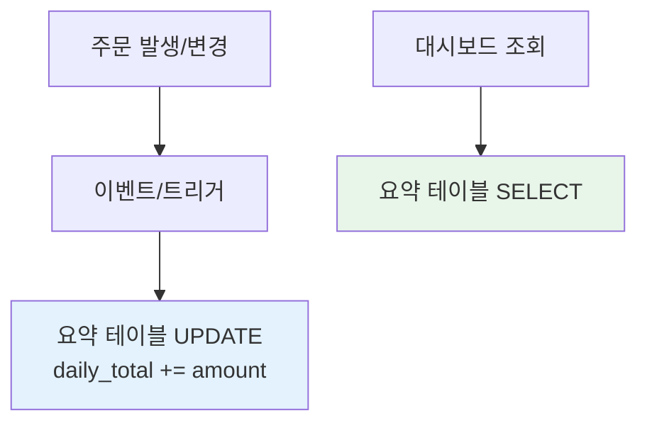

통계나 대시보드 화면을 만들면 곧 같은 질문에 부딪힌다. "이 숫자, 매번 계산할까 아니면 미리 만들어 둘까?" 이 글은 온더플라이 집계와 사전 집계 테이블 사이의 선택, 그리고 그 중간 지점인 증분 갱신을 다룬다.

## 두 방식의 본질

**실시간 집계(on-the-fly)**는 화면을 그릴 때마다 원본 테이블을 `GROUP BY`로 훑는다. 항상 최신이지만, 데이터가 커질수록 매 조회가 무거워진다.

**사전 집계(precompute)**는 결과를 요약 테이블에 미리 저장해 두고 화면은 그걸 읽기만 한다. 조회는 O(1)에 가깝지만, 그 숫자는 "마지막 갱신 시점"의 스냅샷이라 신선하지 않다.

핵심 트레이드오프는 명확하다.

| 축 | 실시간 집계 | 사전 집계 |
|----|------------|----------|
| 신선도 | 항상 최신 | 갱신 주기만큼 지연 |
| 조회 비용 | 데이터량에 비례 | 일정(낮음) |
| 쓰기/유지 비용 | 없음 | 갱신 로직·정합성 부담 |
| 적합 | 데이터 적음·정확성 중요 | 데이터 많음·약간의 지연 허용 |

## 언제 무엇을 고르는가

판단 기준은 **조회 빈도 × 데이터 크기 vs 신선도 요구**다.

- 거래 상세의 합계처럼 데이터가 작고 정확해야 하면 실시간 집계.
- 누적 회원 수, 일별 매출 추이처럼 수백만 행을 매 페이지 로드마다 훑어야 하고 "5분 전 숫자도 괜찮다"면 사전 집계.

극단을 피하는 현실적 답은 **증분 갱신(incremental)**이다. 전체를 다시 계산하지 않고, 변경분만 요약 테이블에 반영한다.



## 증분 갱신 예시

원본에 행이 들어올 때 요약 테이블의 해당 버킷을 함께 누적한다. 한 트랜잭션으로 묶어 정합성을 지킨다.

```sql
-- 주문 입력
INSERT INTO orders(user_id, amount, created_at)
VALUES (?, ?, NOW());

-- 같은 트랜잭션에서 일별 요약 누적 (없으면 생성)
INSERT INTO daily_sales (sale_date, order_cnt, amount_sum)
VALUES (CURDATE(), 1, ?)
ON DUPLICATE KEY UPDATE
  order_cnt  = order_cnt + 1,
  amount_sum = amount_sum + VALUES(amount_sum);
```

조회는 `daily_sales`만 읽으면 끝이다. 원본 수백만 행을 훑지 않는다.

## 운영 함정

- **정합성 드리프트**: 증분 갱신은 누락·중복·취소 처리에서 요약값이 원본과 서서히 어긋난다. 환불로 주문이 취소됐는데 요약을 안 빼면 합계가 부풀려진다. **주기적 재계산(reconciliation) 배치**로 야간에 전체를 다시 맞춰 두는 안전망이 필요하다.
- **동시 갱신 경합**: 인기 있는 단일 버킷(예: 오늘 날짜 행)에 모든 트랜잭션이 몰리면 그 한 행에 락이 집중돼 핫스팟이 된다. 갱신을 비동기 큐로 모아 배치 반영하거나, 버킷을 잘게 쪼개 분산한다.

## 핵심 요약

- 실시간 집계는 신선하지만 비싸고, 사전 집계는 싸지만 지연된다 — 선택은 **데이터 크기 × 조회 빈도 vs 신선도 요구**로 결정한다.
- 둘의 절충은 증분 갱신이다. 변경분만 요약에 반영하되, **정기 재계산으로 드리프트를 보정**하는 안전망을 반드시 둔다.
