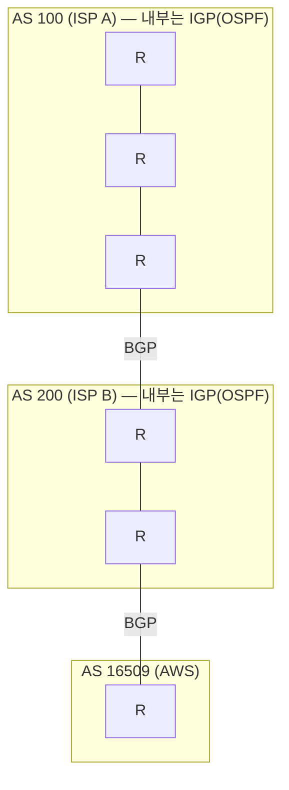

## "이 패킷, 다음은 어디로 보내지?"

[패킷 교환]()의 핵심은 **아무도 길을 예약하지 않는다**는 것이었습니다. 그렇다면 목적지까지 가는 길은 누가 정할까요? 정답은 "**아무도 전체 경로를 모른다**"입니다. 각 라우터는 오직 한 가지 결정만 합니다 — **"이 패킷의 다음 한 홉(next-hop)은 어디인가."** 출발지부터 목적지까지의 완성된 경로는 어디에도 저장돼 있지 않고, 홉마다 독립적으로 내려지는 국소 결정의 연쇄로 만들어집니다(**hop-by-hop forwarding**).

이 글은 그 국소 결정의 근거인 **라우팅 테이블**, 테이블에서 후보가 충돌할 때의 승자를 정하는 **Longest Prefix Match**, 그리고 전 세계 7만 개 자율 시스템이 경로를 합의하는 **BGP**까지 — "패킷이 길을 찾는다"는 말의 실제 메커니즘을 끝까지 따라갑니다.

## 패킷이 홉을 건너는 모습

목적지 IP를 든 패킷이 라우터를 하나씩 건넙니다. 각 라우터는 패킷을 받자마자 **자기 라우팅 테이블을 조회**해 next-hop을 정하고 넘깁니다. 전체 경로를 아는 주체는 없고, 매 홉 같은 절차가 반복됩니다 — 라우터가 차례로 켜지는 게 바로 "테이블 조회 → 전달"의 순간입니다.

<div class="rte-hop" markdown="0">
<style>
.rte-hop{margin:1.4rem 0;overflow-x:auto}
.rte-hop svg{width:100%;max-width:720px;height:auto;display:block;margin:0 auto;font-family:inherit}
.rte-hop .node{fill:none;stroke:currentColor;stroke-width:1.6;opacity:.5}
.rte-hop .r1{animation:rter1 5s ease-in-out infinite}
.rte-hop .r2{animation:rter2 5s ease-in-out infinite}
.rte-hop .r3{animation:rter3 5s ease-in-out infinite}
.rte-hop .lbl{fill:currentColor;font-size:12px;font-weight:600}
.rte-hop .sub{fill:currentColor;font-size:9.5px;opacity:.6}
.rte-hop .wire{stroke:currentColor;opacity:.25;stroke-width:1.6}
.rte-hop .tok{fill:#1971c2;animation:rtehop 5s linear infinite}
@keyframes rtehop{0%{transform:translateX(0);opacity:0}4%{opacity:1}96%{opacity:1}100%{transform:translateX(660px);opacity:0}}
@keyframes rter1{0%,8%{opacity:.4}18%{opacity:1}30%,100%{opacity:.4}}
@keyframes rter2{0%,35%{opacity:.4}45%{opacity:1}55%,100%{opacity:.4}}
@keyframes rter3{0%,63%{opacity:.4}73%{opacity:1}83%,100%{opacity:.4}}
</style>
<svg viewBox="0 0 720 180" role="img" aria-label="목적지 IP를 든 패킷이 라우터를 차례로 건너며 매 홉마다 라우팅 테이블을 조회해 다음 홉을 정하는 hop-by-hop 전달 애니메이션">
  <line class="wire" x1="60" y1="80" x2="90" y2="80"/>
  <line class="wire" x1="210" y1="80" x2="270" y2="80"/>
  <line class="wire" x1="390" y1="80" x2="450" y2="80"/>
  <line class="wire" x1="570" y1="80" x2="660" y2="80"/>
  <circle class="node" cx="30" cy="80" r="18"/>
  <rect class="node r1" x="90"  y="55" width="120" height="50" rx="8"/>
  <rect class="node r2" x="270" y="55" width="120" height="50" rx="8"/>
  <rect class="node r3" x="450" y="55" width="120" height="50" rx="8"/>
  <circle class="node" cx="690" cy="80" r="18"/>
  <text class="sub" x="30"  y="125" text-anchor="middle">출발지</text>
  <text class="lbl" x="150" y="78" text-anchor="middle">R1</text>
  <text class="sub" x="150" y="93" text-anchor="middle">테이블 조회</text>
  <text class="lbl" x="330" y="78" text-anchor="middle">R2</text>
  <text class="sub" x="330" y="93" text-anchor="middle">테이블 조회</text>
  <text class="lbl" x="510" y="78" text-anchor="middle">R3</text>
  <text class="sub" x="510" y="93" text-anchor="middle">테이블 조회</text>
  <text class="sub" x="690" y="125" text-anchor="middle">목적지</text>
  <circle class="tok" cx="30" cy="80" r="7"/>
</svg>
</div>

라우터는 "목적지까지 어떻게 가야 하는가"를 모릅니다. 오직 "**이 목적지로 가려면 다음에 누구에게 넘겨야 하는가**"만 압니다. 이 분산성이 인터넷이 한 곳의 장애로 무너지지 않는 이유입니다.

## 라우팅 테이블: 단 한 줄의 결정 근거

라우터(그리고 모든 호스트)는 **라우팅 테이블**을 가집니다. 각 엔트리는 본질적으로 "**이 목적지 대역으로 갈 패킷은, 이 인터페이스로, 이 next-hop에게**"입니다.

```text
$ ip route
default via 192.168.0.1 dev eth0                  # 0.0.0.0/0  (기본 경로)
10.0.0.0/8 via 10.1.0.1 dev eth1  metric 100
10.1.0.0/16 via 10.1.0.1 dev eth1 metric 100
10.1.2.0/24 dev eth2  scope link                   # 직접 연결
192.168.0.0/24 dev eth0  scope link  src 192.168.0.50
```

| 필드 | 의미 |
|------|------|
| **목적지 prefix** | `10.1.2.0/24` — 이 엔트리가 책임지는 IP 대역(CIDR, [IP/서브넷 글]()) |
| **next-hop (`via`)** | 다음으로 넘길 라우터 IP. 없으면(`scope link`) 직접 연결된 대역 |
| **인터페이스 (`dev`)** | 어느 NIC로 내보낼지 |
| **metric** | 같은 목적지 후보가 여럿일 때의 우선순위(작을수록 우선) |

핵심은 테이블이 **목적지 호스트 단위가 아니라 prefix(대역) 단위**라는 점입니다. 인터넷에 호스트가 수십억 개지만, 라우터 테이블이 수십억 줄이 아닌 이유 — CIDR로 **대역을 통째로 묶어(aggregation)** 한 줄로 표현하기 때문입니다. 이 집약이 라우팅 테이블 확장성의 전부입니다.

## Longest Prefix Match: 가장 구체적인 길이 이긴다

위 테이블을 보면 목적지 `10.1.2.5`는 **세 엔트리에 동시에 매칭**됩니다 — `10.0.0.0/8`, `10.1.0.0/16`, `10.1.2.0/24`. 라우터는 어느 길을 고를까요? 규칙은 단 하나, **가장 긴 prefix(가장 구체적인 대역)가 이긴다** — Longest Prefix Match(LPM)입니다.

<div class="rte-lpm" markdown="0">
<style>
.rte-lpm{margin:1.4rem 0;overflow-x:auto}
.rte-lpm svg{width:100%;max-width:680px;height:auto;display:block;margin:0 auto;font-family:inherit}
.rte-lpm .row{fill:none;stroke:currentColor;stroke-width:1.4;opacity:.45}
.rte-lpm .t{fill:currentColor;font-size:12px;font-family:ui-monospace,monospace}
.rte-lpm .lbl{fill:currentColor;font-size:12px;font-weight:600}
.rte-lpm .sub{fill:currentColor;font-size:10px;opacity:.6}
.rte-lpm .ck1{fill:#1971c2;opacity:0;animation:rtelpmck1 5s ease-in-out infinite}
.rte-lpm .ck2{fill:#1971c2;opacity:0;animation:rtelpmck2 5s ease-in-out infinite}
.rte-lpm .win{fill:#2f9e44;opacity:0;animation:rtelpmwin 5s ease-in-out infinite}
.rte-lpm .tok{fill:#2f9e44;opacity:0;animation:rtelpmtok 5s ease-in-out infinite}
@keyframes rtelpmck1{0%,12%{opacity:0}20%{opacity:.16}34%,100%{opacity:0}}
@keyframes rtelpmck2{0%,27%{opacity:0}35%{opacity:.16}49%,100%{opacity:0}}
@keyframes rtelpmwin{0%,42%{opacity:0}52%{opacity:.26}100%{opacity:.26}}
@keyframes rtelpmtok{0%,56%{opacity:0;transform:translateX(0)}62%{opacity:1}92%{opacity:1;transform:translateX(150px)}100%{opacity:0;transform:translateX(150px)}}
</style>
<svg viewBox="0 0 680 230" role="img" aria-label="목적지 10.1.2.5가 세 개의 prefix에 모두 매칭되지만 가장 구체적인 24비트 prefix가 Longest Prefix Match로 승리하는 애니메이션">
  <text class="lbl" x="20" y="28">목적지 10.1.2.5 → 라우팅 테이블 조회</text>
  <rect class="ck1" x="40" y="50" width="430" height="34" rx="5"/>
  <rect class="ck2" x="40" y="94" width="430" height="34" rx="5"/>
  <rect class="win" x="40" y="138" width="430" height="34" rx="5"/>
  <rect class="row" x="40" y="50"  width="430" height="34" rx="5"/>
  <rect class="row" x="40" y="94"  width="430" height="34" rx="5"/>
  <rect class="row" x="40" y="138" width="430" height="34" rx="5"/>
  <text class="t" x="58" y="72">10.0.0.0/8     → next-hop A</text>
  <text class="t" x="58" y="116">10.1.0.0/16    → next-hop B</text>
  <text class="t" x="58" y="160">10.1.2.0/24    → next-hop C</text>
  <text class="sub" x="490" y="72">매칭(/8)</text>
  <text class="sub" x="490" y="116">매칭(/16)</text>
  <text class="sub" x="490" y="160" fill="#2f9e44" font-weight="600">최장 매칭(/24) ✓</text>
  <circle class="tok" cx="470" cy="155" r="7"/>
  <text class="sub" x="540" y="200">→ next-hop C 로 전달</text>
</svg>
</div>

왜 가장 긴 prefix일까요? **더 구체적인 정보가 더 정확하기 때문**입니다. `/8`은 "1670만 개 주소를 대충 이쪽으로", `/24`는 "바로 이 256개 주소는 정확히 저쪽으로"입니다. 더 좁게 아는 사람의 말을 따르는 게 합리적입니다. 이 규칙 덕에 **큰 대역을 한 줄로 광고하면서도, 그 안의 특정 작은 대역만 예외 경로로 빼는** 일이 가능합니다(트래픽 엔지니어링의 토대). 그래서 `0.0.0.0/0`(기본 경로)는 prefix 길이 0 — **모든 것에 매칭되지만 가장 약한 후보**라, 더 구체적인 게 없을 때만 쓰이는 "그 외 전부" 경로가 됩니다.

> **실무 함정 — 의도치 않은 LPM 가로채기.** 누군가 `10.1.2.0/24`를 광고하기 시작하면, `10.1.0.0/16`으로 가던 그 대역의 트래픽이 *조용히* 새 경로로 빨려 들어갑니다. BGP 하이재킹의 본질이 바로 이것입니다 — 공격자가 **더 구체적인 prefix**를 광고하면 LPM 규칙상 정당 소유자를 이깁니다(2008년 파키스탄텔레콤의 유튜브 `/24` 광고로 전 세계 유튜브가 먹통이 된 사건). 그래서 BGP에 RPKI 같은 출처 검증이 붙습니다.

## 테이블은 어떻게 채워지나: 정적 vs 동적

라우팅 테이블의 엔트리는 누가 넣을까요?

| | 정적 라우팅 | 동적 라우팅 |
|---|---|---|
| 설정 | 사람이 직접 입력 | 라우터끼리 프로토콜로 교환 |
| 장애 대응 | 수동(끊겨도 그대로) | **자동 우회**(경로 재계산) |
| 확장성 | 소규모·단순망 | 대규모·변화 잦은 망 |
| 예측성 | 높음(고정) | 수렴 시간 동안 변동 |
| 대표 | 홈 라우터의 기본 경로, [AWS VPC 라우팅 테이블]() | OSPF, BGP |

흥미롭게도 **AWS VPC의 라우팅 테이블은 정적**입니다 — AWS가 내부적으로 가용성을 책임지므로, 사용자는 "이 대역은 IGW로, 저 대역은 NAT GW로" 같은 명시적 규칙만 적습니다. 반면 인터넷 백본은 동적 라우팅 없이는 단 1초도 못 버팁니다.

## 동적 라우팅의 두 세계: IGP와 BGP

인터넷은 **자율 시스템(AS, Autonomous System)** 들의 네트워크입니다. AS는 단일 운영 주체(ISP, 대기업, AWS=AS16509 등)가 관리하는 라우터 집합이고, 각자 고유 번호(ASN)를 가집니다. 라우팅은 두 층위로 나뉩니다.



- **IGP (Interior Gateway Protocol)** — AS *내부* 라우팅. 대표는 **OSPF**(link-state): 모든 라우터가 전체 토폴로지 지도를 공유하고 다익스트라로 최단 경로를 계산. 목표는 **최단/최속 경로**.
- **EGP = BGP (Border Gateway Protocol)** — AS *사이* 라우팅. 인터넷을 하나로 묶는 유일한 프로토콜. path-vector 방식으로, 목표가 최단 경로가 아니라 **정책(policy)** 입니다 — "어느 이웃을 통할지"가 비용·계약·정치로 결정됩니다.

### BGP 경로 선택: 거리가 아니라 정책

BGP 라우터는 같은 목적지에 대한 여러 경로 중 **경로 속성(path attributes)** 으로 승자를 고릅니다. 단순화한 우선순위:

1. **LOCAL_PREF**(높을수록 우선) — "이 이웃으로 나가는 게 우리 회사에 이득"(예: 정산 비용 낮은 회선). *내부* 정책.
2. **AS_PATH 길이**(짧을수록 우선) — 거쳐가는 AS 수. 동시에 **루프 방지**: 자기 ASN이 이미 path에 있으면 그 경로를 버립니다(거리 벡터의 count-to-infinity를 구조적으로 차단).
3. **MED**(낮을수록) — 이웃에게 "우리 쪽 어느 입구로 들어와라" 힌트.
4. 그 외 eBGP > iBGP, IGP metric, 라우터 ID…

> **여기서 가장 중요한 통찰:** BGP는 **최단 경로 프로토콜이 아닙니다.** 물리적으로 더 가까운 경로가 있어도, LOCAL_PREF(=돈·계약)가 우선이라 트래픽이 멀리 돌 수 있습니다. "왜 한국→일본 트래픽이 미국을 경유하지?"의 답이 여기 있습니다 — 라우팅은 기술이자 **경제·정치**입니다.

AWS의 **Global Accelerator**나 CDN의 **Anycast**([프록시·CDN 글]())는 이 BGP를 역이용합니다 — 같은 IP(prefix)를 전 세계 여러 위치에서 동시에 광고하면, BGP가 각 사용자에게 *AS 경로상 가장 가까운* 입구로 자동 라우팅합니다.

## 디버깅: 경로를 추측하지 말고 추적하라

**(1) 특정 목적지의 실제 결정을 조회** — 어떤 엔트리가 LPM으로 선택됐는지 그대로 보여줍니다.

```bash
$ ip route get 10.1.2.5
10.1.2.5 via 10.1.0.1 dev eth1 src 10.1.0.50   # /24가 아니라 /16이 선택됐다면? 테이블 확인
```

**(2) 홉을 직접 추적** — `traceroute`/`mtr`는 TTL을 1,2,3…으로 늘려 각 홉이 버리며 보내는 ICMP로 경로를 역추적합니다.

```bash
$ traceroute -n 8.8.8.8        # 홉마다 RTT, 어디서 지연·끊김이 생기는지
$ mtr 8.8.8.8                  # 실시간 + 홉별 손실률
```

**(3) BGP 경로 확인** — 공개 라우트 서버나 `looking glass`로 "이 prefix가 어떤 AS_PATH로 보이나"를 확인. 하이재킹·route leak 진단의 출발점.

> **흔한 프로덕션 버그 — 비대칭 라우팅(asymmetric routing).** 갈 때와 올 때 경로가 다르면, 중간 방화벽([방화벽·보안그룹 글]())이 한쪽 방향만 보고 stateful 세션을 못 만들어 연결이 죽습니다. "핑은 되는데 TCP는 안 된다"의 흔한 원인. `traceroute`를 **양방향**에서 떠 보세요.

## 면접/리뷰 단골 질문

- **Q. 라우터는 목적지까지의 전체 경로를 아나?** → 모른다. 오직 next-hop만. 경로는 hop-by-hop 국소 결정의 연쇄다.
- **Q. 한 목적지가 여러 엔트리에 매칭되면?** → Longest Prefix Match — 가장 구체적인(긴) prefix가 이긴다. `0.0.0.0/0`은 최후의 보루.
- **Q. OSPF와 BGP의 본질적 차이는?** → OSPF(IGP)는 AS *내부*, 최단 경로가 목표. BGP(EGP)는 AS *사이*, **정책**이 목표라 최단이 아닐 수 있다. BGP는 AS_PATH로 루프를 막는다.
- **Q. BGP 하이재킹은 왜 가능한가?** → 더 구체적인 prefix를 광고하면 LPM상 정당 소유자를 이긴다. 대응은 RPKI(출처 검증)·필터링.
- **Q. AWS VPC 라우팅 테이블은 동적인가?** → 아니다, 정적(명시적 규칙). 가용성은 AWS 인프라가 책임진다.

## 정리

- 라우팅 = **hop-by-hop** 국소 결정의 연쇄. 라우터는 next-hop만 알고, 전체 경로를 아는 주체는 없다.
- 라우팅 테이블은 **prefix(대역) 단위**라 CIDR 집약으로 확장된다. 충돌 시 **Longest Prefix Match**(가장 구체적인 것)가 이긴다.
- 인터넷은 **AS들의 네트워크**: 내부는 IGP(OSPF, 최단 경로), 사이는 **BGP**(정책 — 거리가 아니라 돈·계약).
- BGP는 AS_PATH로 루프를 막고, **더 구체적인 prefix가 트래픽을 가로챈다**(하이재킹·Anycast 둘 다 이 원리).
- 추측 금지: `ip route get` / `traceroute` / `mtr` / looking glass로 실제 경로를 본다.

> 다음 글: 라우터가 next-hop을 정했어도, 실제로 그 옆 장비에게 프레임을 건네려면 **MAC 주소**가 필요합니다. 같은 망이냐 아니냐를 가르고 IP를 MAC으로 바꾸는 [ARP와 L2/L3 경계]()로 이어집니다.
