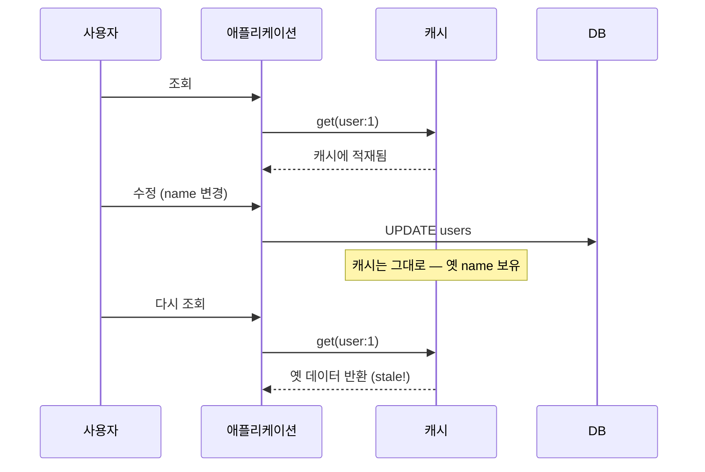

조회가 느린 화면에 캐시를 붙이는 건 쉽다. 진짜 어려운 건 그 데이터가 바뀌었을 때다. "캐시 무효화와 이름 짓기가 컴퓨터과학의 두 난제"라는 농담은 과장이 아니다. 이 글은 쓰기 시점에 캐시를 어떻게 다룰지를 다룬다.

## stale은 어떻게 생기는가

캐시의 전제는 "원본과 캐시가 같다"이다. 읽기는 이 전제를 깨지 않는다. **쓰기**가 깬다.



DB는 바뀌었는데 캐시는 옛 값을 들고 있다. 이게 stale이다. 원인은 단순하다 — **수정 경로에서 캐시를 건드리지 않았기 때문**이다.

## 두 가지 쓰기 전략

**Cache-aside (lazy)**: 가장 흔한 패턴. 읽을 때 캐시에 없으면 DB에서 읽어 채운다. 쓸 때는 **DB를 갱신하고 캐시는 삭제(evict)**한다. 다음 읽기에서 자연스럽게 다시 채워진다.

```java
@CacheEvict(value = "users", key = "#user.id")
@Transactional
public void update(User user) {
    userMapper.update(user);   // DB 먼저, 캐시는 비움
}

@Cacheable(value = "users", key = "#id")
public User get(Long id) {
    return userMapper.findById(id);
}
```

**Write-through**: 쓸 때 DB와 캐시를 **동시에 갱신**한다. 캐시가 항상 최신이라 다음 읽기가 빠르지만, 안 읽힐 데이터까지 캐시에 써 두는 낭비가 있고 캐시 쓰기 실패 시 정합성 처리가 더 복잡하다.

대개 **갱신보다 삭제(evict)가 안전**하다. 갱신은 "캐시에 무엇을 쓸지" 새 값을 계산해야 하고 그 계산이 틀리면 또 다른 stale을 만든다. 삭제는 "다음에 DB에서 다시 읽는다"는 단순한 보장만 한다.

## 순서가 중요하다 — DB 먼저인가 캐시 먼저인가

`DB 갱신 → 캐시 삭제` 순서를 지킨다. 반대로 `캐시 삭제 → DB 갱신` 사이에 다른 요청이 끼면, 그 요청이 **옛 DB 값을 읽어 캐시를 다시 채운 뒤** DB가 갱신되어 stale이 영구화될 수 있다. 그래도 완벽하진 않다(읽기-쓰기 레이스는 남는다). 그래서 **TTL을 함께 둬서** 무효화 누락이 있어도 일정 시간 뒤 자동 소멸하게 하는 게 실무의 안전망이다.

## 운영 함정

- **무효화 누락**: 한 데이터가 여러 캐시 키(상세 캐시 + 목록 캐시)에 걸쳐 있으면, 수정 시 그 **모든 키**를 무효화해야 한다. 상세만 지우고 목록 캐시를 깜빡하면 목록엔 옛 값이 남는다. 한 엔티티가 어떤 캐시들에 들어가는지 매핑을 명시적으로 관리한다.
- **분산 환경의 로컬 캐시**: 서버가 여러 대인데 각자 로컬 캐시(예: 인메모리)를 들면, 한 노드에서 무효화해도 다른 노드의 캐시는 그대로다. 공용 캐시(Redis 등)로 단일화하거나, 무효화 이벤트를 모든 노드에 브로드캐스트한다.

## 핵심 요약

- stale의 원인은 **쓰기 경로에서 캐시를 건드리지 않은 것**이다.
- 대부분 cache-aside + evict가 안전하다(새 값 계산 불필요). 순서는 **DB 먼저, 캐시 삭제 나중**.
- 무효화는 누락되기 마련이다. **TTL을 안전망**으로 두고, 한 엔티티가 걸친 모든 키를 빠짐없이 지운다.
