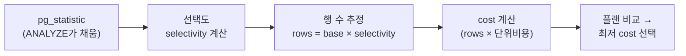

## "어제까지 빠르던 쿼리가 오늘 30초"

코드도, 인덱스도, 데이터도 그대로인데 어느 날 같은 쿼리가 수십 배 느려집니다. `EXPLAIN`을 떠보면 어제는 인덱스를 타던 자리에 Seq Scan이 박혀 있거나, 작은 테이블을 바깥에 둬야 할 Nested Loop가 거꾸로 돌고 있습니다. 코드 변경 이력에는 아무것도 없습니다.

범인은 대개 **카디널리티 추정(cardinality estimation)** 입니다. 옵티마이저는 각 플랜 노드가 "몇 행을 뱉을지(rows)"를 **추측**한 다음 그 추측 위에 cost를 쌓습니다. 추측이 맞으면 좋은 플랜이 나오고, 추측이 한 자릿수만 틀어져도 조인 순서와 스캔 방식이 통째로 뒤집힙니다. [앞 글]()에서 `EXPLAIN ANALYZE`의 `rows` 추정 vs 실제를 봤다면, 이 글은 그 **추정값이 어디서 오고, 왜 틀어지고, 어떻게 고치는가**를 PostgreSQL 내부까지 파고듭니다.

## 옵티마이저는 cost를 비교하는데, cost는 rows에서 나온다

[옵티마이저]()는 같은 결과를 내는 여러 플랜의 **cost**를 비교해 가장 싼 것을 고릅니다. 그런데 cost는 결국 "이 노드가 처리하는 행 수 × 단위 비용"입니다. 예를 들어 Nested Loop의 cost는 대략 `outer_rows × (inner 1회 cost)`이고, 여기서 `outer_rows`가 1이라 믿으면 인덱스 Nested Loop가 압도적으로 싸 보이지만, 실제로 100만이면 재앙이 됩니다.



즉 **모든 플랜 선택의 뿌리에 rows 추정**이 있습니다. 그리고 그 추정의 근거가 되는 통계는 테이블에 박혀 있는 게 아니라, `ANALYZE`가 **표본을 떠서 따로 저장한 요약본**입니다. 요약본이 실제 분포와 어긋나는 순간 모든 게 무너집니다.

## ANALYZE가 모으는 4가지 — pg_statistic 해부

`ANALYZE`는 테이블에서 기본 3만 행(`default_statistics_target` 100 × 300)을 무작위 표본으로 떠서, 컬럼별 통계를 `pg_statistic`에 저장합니다(사람이 읽기 좋은 뷰는 `pg_stats`). 핵심 네 가지를 봅니다.

| 통계 | pg_stats 컬럼 | 무엇 | 쓰임 |
|---|---|---|---|
| 행 수 | `reltuples`(pg_class) | 테이블 총 추정 행 수 | base rows |
| n_distinct | `n_distinct` | 고유값 개수(또는 비율) | 등치 선택도 = 1/n_distinct |
| MCV | `most_common_vals` / `most_common_freqs` | 가장 흔한 값들과 빈도 | 편향된 값의 정확한 선택도 |
| 히스토그램 | `histogram_bounds` | MCV 제외 나머지를 등빈도 구간으로 | 범위 조건(`<`, `BETWEEN`) 선택도 |
| 상관 | `correlation` | 컬럼 값 순서와 물리 저장 순서의 상관(-1~1) | index scan vs seq scan cost |

```sql
-- 실제로 통계를 들여다보기
SELECT attname, n_distinct, most_common_vals, most_common_freqs,
       correlation
FROM pg_stats
WHERE tablename = 'orders' AND attname IN ('status','customer_id');
```

`n_distinct`가 음수면(예: `-0.2`) "행 수의 20%가 고유값"이라는 **비율** 표현입니다. 테이블이 커져도 비율이 유지될 때(이메일·UUID 등) 정확해서, PG는 고유값이 표본의 10%를 넘으면 자동으로 비율로 저장합니다.

## 선택도 계산: 추정 rows는 이렇게 뽑힌다

옵티마이저가 `WHERE status = 'shipped'`의 행 수를 추정하는 과정을 따라가 봅시다.

- **MCV에 있으면**: `most_common_freqs`의 해당 빈도를 그대로 씁니다. `'shipped'`가 전체의 0.6이면 → `rows ≈ reltuples × 0.6`. 편향 분포에서 정확한 이유입니다.
- **MCV에 없으면**: `(1 − sum(MCV 빈도) − null_frac) / (n_distinct − MCV 개수)`로 "나머지 값들의 평균 선택도"를 씁니다.
- **범위 조건** `created_at < '2023-01-01'`: 히스토그램 경계에서 그 값이 몇 번째 구간에 떨어지는지 보간(interpolation)해 비율을 계산합니다.
- **AND로 묶이면**: PG는 컬럼들이 **독립**이라 가정하고 선택도를 **곱합니다**(`sel(A) × sel(B)`). 이 독립 가정이 나중에 가장 크게 배신합니다.

아래 애니메이션은 히스토그램 + MCV로 추정 rows를 뽑아 플랜을 고르는 과정, 그리고 통계가 어긋났을 때 실제 행이 추정과 벌어지는 모습을 보여줍니다.

<div class="card-est" markdown="0">
<style>
.card-est{margin:1.4rem 0;overflow-x:auto}
.card-est svg{width:100%;max-width:720px;height:auto;display:block;margin:0 auto;font-family:inherit}
.card-est .lbl{fill:currentColor;font-size:12px;font-weight:600}
.card-est .sub{fill:currentColor;font-size:10px;opacity:.6}
.card-est .axis{stroke:currentColor;opacity:.4;stroke-width:1.2}
.card-est .bar{fill:#1971c2;opacity:.75}
.card-est .mcv{fill:#f08c00;opacity:0;animation:cardmcv 7s ease-in-out infinite}
.card-est .sel{stroke:#2f9e44;stroke-width:2;stroke-dasharray:4 3;opacity:0;animation:cardsel 7s ease-in-out infinite}
.card-est .estbox{fill:#2f9e44;opacity:0;animation:cardest 7s ease-in-out infinite}
.card-est .actbox{fill:#e03131;opacity:0;animation:cardact 7s ease-in-out infinite}
.card-est .etxt{fill:#fff;font-size:10px;font-weight:700;opacity:0;animation:cardest 7s ease-in-out infinite}
.card-est .atxt{fill:#fff;font-size:10px;font-weight:700;opacity:0;animation:cardact 7s ease-in-out infinite}
@keyframes cardmcv{0%,18%{opacity:0}28%,100%{opacity:.85}}
@keyframes cardsel{0%,35%{opacity:0}45%,100%{opacity:.9}}
@keyframes cardest{0%,52%{opacity:0}60%,100%{opacity:.9}}
@keyframes cardact{0%,75%{opacity:0}85%,100%{opacity:.9}}
</style>
<svg viewBox="0 0 700 280" role="img" aria-label="히스토그램과 MCV로 추정 행 수를 뽑아내고, 실제 행 수가 추정과 벌어지며 플랜이 바뀌는 과정 애니메이션">
  <text class="lbl" x="20" y="26">컬럼 분포 (히스토그램 구간 + MCV)</text>
  <line class="axis" x1="40" y1="150" x2="430" y2="150"/>
  <rect class="bar" x="50" y="120" width="34" height="30"/>
  <rect class="bar" x="90" y="105" width="34" height="45"/>
  <rect class="bar" x="130" y="128" width="34" height="22"/>
  <rect class="bar" x="170" y="135" width="34" height="15"/>
  <rect class="bar" x="210" y="132" width="34" height="18"/>
  <rect class="mcv" x="250" y="40" width="34" height="110"/>
  <text class="mcv sub" x="267" y="34" text-anchor="middle" fill="#f08c00">MCV: 'shipped' 0.6</text>
  <rect class="bar" x="290" y="130" width="34" height="20"/>
  <rect class="bar" x="330" y="138" width="34" height="12"/>
  <rect class="bar" x="370" y="140" width="34" height="10"/>
  <text class="sub" x="40" y="168">값 →</text>

  <line class="sel" x1="250" y1="40" x2="600" y2="40"/>
  <text class="sub" x="455" y="56" fill="#2f9e44">선택도 0.6 → 추정 rows</text>

  <rect class="estbox" x="470" y="90" width="180" height="40" rx="4"/>
  <text class="etxt" x="560" y="115" text-anchor="middle">추정 rows = 6,000</text>

  <rect class="actbox" x="470" y="170" width="210" height="40" rx="4"/>
  <text class="atxt" x="575" y="195" text-anchor="middle">실제 rows = 480,000  ✗</text>

  <text class="sub" x="470" y="240">통계가 stale → 추정 6천 (인덱스 NL 선택)</text>
  <text class="sub" x="470" y="258">실제 48만 → 잘못된 플랜, 30초</text>
</svg>
</div>

## 추정이 틀어지는 4가지 전형

### 1) 상관된 컬럼 (independence assumption 붕괴)

`WHERE city = 'Seoul' AND country = 'Korea'`. 두 조건은 사실상 같은 사실을 말하지만, PG는 독립으로 보고 `sel(city) × sel(country)`로 곱해 **실제보다 훨씬 작게** 추정합니다. 그 결과 "몇 행 안 나온다"고 믿고 인덱스 Nested Loop를 골랐다가 대량 매칭에 무너집니다. 함수 종속이 있는 컬럼 조합([정규화]()에서 미처 못 쪼갠)에서 전형적입니다.

### 2) 함수·표현식으로 감싼 컬럼

`WHERE date_trunc('month', created_at) = '2023-09-01'`처럼 컬럼을 함수로 감싸면, `created_at`의 히스토그램을 쓸 수 없어 PG는 고정 추정치(등치는 0.5%, 범위는 약 33%)를 박습니다. [인덱스 글]()에서 본 "함수로 감싸면 인덱스를 못 탄다"는 문제와 동전의 양면입니다.

### 3) 편향(skew)인데 MCV가 못 잡음

값 하나가 99%를 차지하는데 통계 타깃이 낮아 MCV 목록이 짧으면, 그 값이 MCV에서 빠져 "평균 선택도"로 계산됩니다. 추정이 극단적으로 틀어집니다.

### 4) Stale 통계

대량 INSERT/DELETE 직후, 또는 시계열처럼 계속 자라는 테이블에서 [autovacuum]()의 ANALYZE가 아직 안 돌았다면 통계는 과거를 가리킵니다. `created_at > now() - '1 hour'`가 히스토그램 상한을 넘어가면 PG는 "거의 0행"으로 추정합니다 — 방금 들어온 수만 행을 못 보는 것이죠.

## 진단: 추정 vs 실제를 나란히 본다

핵심 도구는 `EXPLAIN (ANALYZE, BUFFERS)`의 **`rows=추정 ... rows=실제`** 비교입니다. 비율이 10배 이상 벌어지는 노드가 범인입니다.

```sql
EXPLAIN (ANALYZE, BUFFERS)
SELECT * FROM orders o JOIN customers c ON c.id = o.customer_id
WHERE o.city = 'Seoul' AND o.country = 'Korea';
```
```text
Nested Loop  (... rows=12 ...) (actual ... rows=480000 ...)   ← 4만 배!
  -> Seq Scan on orders  (rows=12) (actual rows=480000)        ← 상관 컬럼
  -> Index Scan on customers ...
```

추정 12, 실제 48만. 옵티마이저는 12행이라 믿고 안쪽을 48만 번 도는 Nested Loop를 골랐습니다. 노드 단위로 어디서 추정이 깨졌는지 짚는 게 첫 단계입니다.

아래 애니메이션은 같은 쿼리에서 추정 rows가 작을 때 옵티마이저가 Nested Loop를, 추정이 실제(큰 값)에 맞춰질 때 Hash Join을 고르는 — 즉 **추정 하나로 플랜이 통째로 바뀌는** 모습입니다.

<div class="card-plan" markdown="0">
<style>
.card-plan{margin:1.4rem 0;overflow-x:auto}
.card-plan svg{width:100%;max-width:720px;height:auto;display:block;margin:0 auto;font-family:inherit}
.card-plan .lbl{fill:currentColor;font-size:11px;font-weight:600}
.card-plan .sub{fill:currentColor;font-size:10px;opacity:.6}
.card-plan .box{fill:none;stroke:currentColor;stroke-width:1.4;opacity:.5}
.card-plan .nl{fill:#1971c2;opacity:0;animation:cardpnl 8s ease-in-out infinite}
.card-plan .nltx{fill:#fff;font-size:11px;font-weight:700;opacity:0;animation:cardpnl 8s ease-in-out infinite}
.card-plan .hj{fill:#2f9e44;opacity:0;animation:cardphj 8s ease-in-out infinite}
.card-plan .hjtx{fill:#fff;font-size:11px;font-weight:700;opacity:0;animation:cardphj 8s ease-in-out infinite}
.card-plan .estsm{fill:#f08c00;opacity:0;animation:cardpsm 8s ease-in-out infinite}
.card-plan .estbg{fill:#e03131;opacity:0;animation:cardpbg 8s ease-in-out infinite}
.card-plan .vtx{fill:#fff;font-size:10px;font-weight:700}
@keyframes cardpsm{0%,8%{opacity:0}16%,46%{opacity:.9}54%,100%{opacity:0}}
@keyframes cardpnl{0%,16%{opacity:0}24%,46%{opacity:.9}54%,100%{opacity:0}}
@keyframes cardpbg{0%,54%{opacity:0}62%,100%{opacity:.9}}
@keyframes cardphj{0%,62%{opacity:0}70%,100%{opacity:.9}}
</style>
<svg viewBox="0 0 700 220" role="img" aria-label="추정 행 수가 작으면 Nested Loop, 추정이 실제 큰 값에 맞춰지면 Hash Join으로 플랜이 바뀌는 과정 애니메이션">
  <text class="lbl" x="20" y="28">옵티마이저 입력: 추정 rows</text>
  <rect class="estsm" x="20" y="44" width="150" height="34" rx="4"/>
  <text class="vtx estsm" x="95" y="66" text-anchor="middle" style="opacity:0;animation:cardpsm 8s ease-in-out infinite">추정 = 12 (작다)</text>
  <rect class="estbg" x="20" y="44" width="180" height="34" rx="4"/>
  <text class="vtx estbg" x="110" y="66" text-anchor="middle" style="opacity:0;animation:cardpbg 8s ease-in-out infinite">추정 = 480,000 (실제)</text>

  <text class="sub" x="250" y="66">→ 선택되는 플랜 →</text>

  <rect class="box" x="440" y="36" width="230" height="150"/>
  <rect class="nl" x="460" y="60" width="190" height="44" rx="5"/>
  <text class="nltx" x="555" y="87" text-anchor="middle">Nested Loop (안쪽 반복)</text>
  <rect class="hj" x="460" y="118" width="190" height="44" rx="5"/>
  <text class="hjtx" x="555" y="145" text-anchor="middle">Hash Join (해시 테이블)</text>
  <text class="sub" x="555" y="180" text-anchor="middle">추정 하나로 플랜이 뒤집힌다</text>
</svg>
</div>

## 해결: 통계를 정확하게, 더 정확하게

### ANALYZE / autovacuum 먼저

```sql
ANALYZE orders;                       -- 즉시 통계 갱신
-- 자주 변하는 테이블은 임계치를 낮춰 ANALYZE가 더 자주 돌게
ALTER TABLE orders SET (autovacuum_analyze_scale_factor = 0.02);
```
대량 적재 직후에는 autovacuum을 기다리지 말고 **명시적 ANALYZE**를 거는 것이 stale 문제의 1차 방어입니다.

### 통계 타깃 상향 (편향·고유값 많은 컬럼)

```sql
-- 이 컬럼만 MCV/히스토그램을 더 촘촘히 (기본 100 → 500)
ALTER TABLE orders ALTER COLUMN status SET STATISTICS 500;
ANALYZE orders;
```
타깃을 올리면 MCV 목록이 길어지고 히스토그램 구간이 잘게 쪼개져, 편향과 범위 추정이 정확해집니다. 대신 ANALYZE 비용과 플래닝 시간이 늘어납니다.

### CREATE STATISTICS — 다변량 통계 (상관 컬럼의 정답)

상관된 컬럼 문제의 직접 해결책입니다. 독립 가정 대신 **조합의 실제 분포**를 저장합니다.

```sql
CREATE STATISTICS orders_loc (dependencies, ndistinct, mcv)
  ON city, country FROM orders;
ANALYZE orders;
```
- `dependencies`: 함수 종속도(city→country)를 저장해 선택도 곱셈을 보정
- `ndistinct`: (city, country) **조합**의 고유값 수 → GROUP BY 추정 개선
- `mcv`: 조합값의 MCV → 다중 등치 조건 추정 개선

이걸 걸면 위 예시의 추정 12가 실제에 가까운 48만으로 잡혀 플랜이 Hash Join으로 바로잡힙니다.

### 표현식 인덱스로 통계 확보

함수로 감싼 컬럼은 [표현식 인덱스]()를 만들면 그 표현식에 대한 통계까지 생겨 추정이 정확해집니다.

```sql
CREATE INDEX ON orders (date_trunc('month', created_at));
-- 인덱스 생성 후 ANALYZE가 표현식 통계도 수집
```

## 면접/리뷰 단골 질문

- **Q. 옵티마이저가 cost를 어떻게 계산하나?** → 각 플랜 노드의 추정 rows(카디널리티)에 단위 cost(seq_page_cost, cpu_tuple_cost 등)를 곱해 누적. rows 추정이 틀리면 cost 비교 자체가 무의미해진다.
- **Q. rows 추정은 어디서 오나?** → `ANALYZE`가 표본을 떠 `pg_statistic`에 저장한 n_distinct·MCV·히스토그램. 등치는 MCV/1÷n_distinct, 범위는 히스토그램 보간으로 선택도를 구한다.
- **Q. `WHERE a=? AND b=?`에서 추정이 작게 나오는 이유는?** → PG가 컬럼을 독립으로 가정해 선택도를 곱하기 때문. 상관 컬럼이면 실제보다 과소추정 → `CREATE STATISTICS`로 다변량 통계를 줘서 보정한다.
- **Q. 함수로 감싼 컬럼의 추정이 부정확한 이유는?** → 컬럼 히스토그램을 못 쓰고 고정 추정치를 쓴다. 표현식 인덱스를 만들면 표현식 통계가 생겨 정확해진다.
- **Q. 갑자기 플랜이 느려졌다, 첫 진단은?** → `EXPLAIN (ANALYZE)`로 노드별 추정 rows vs 실제 rows 비교. 크게 벌어진 노드가 범인 → stale이면 ANALYZE, 편향이면 통계 타깃, 상관이면 CREATE STATISTICS.
- **Q. n_distinct가 음수면?** → 행 수 대비 고유값 비율. 테이블이 커져도 비율이 유지되는 컬럼(UUID·이메일)에서 절대값보다 정확하다.

## 정리

- 옵티마이저의 모든 플랜 선택은 **추정 rows(카디널리티)** 위에 cost를 쌓는다 — 추정이 틀리면 플랜도 틀린다.
- 추정 근거는 `ANALYZE`가 `pg_statistic`에 모은 **n_distinct · MCV · 히스토그램 · correlation**. 등치·범위·AND 조건마다 선택도 계산 방식이 다르다.
- 추정이 깨지는 전형: **상관 컬럼(독립 가정)**, **함수로 감싼 컬럼**, **MCV가 못 잡은 편향**, **stale 통계**.
- 진단의 출발점은 `EXPLAIN (ANALYZE)`의 **추정 vs 실제 rows** 비교 — 크게 벌어진 노드가 범인.
- 해결: ANALYZE/autovacuum 튜닝, 통계 타깃 상향, **`CREATE STATISTICS` 다변량**, 표현식 인덱스로 통계 확보.

> 다음 글: 한 대가 죽어도 살아남고 읽기를 여러 대로 퍼뜨리는 [복제]()로 넘어가, [WAL]()이 어떻게 분산의 기반이 되는지를 봅니다.
