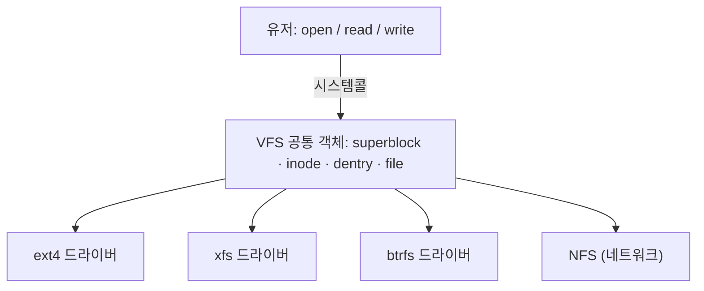

## "이 파일의 진짜 이름은 무엇인가"

`report.pdf`를 `final.pdf`로 바꿔도 내용은 그대로입니다. 같은 파일에 하드링크를 걸면 이름이 두 개가 됩니다. `rm`으로 이름을 지워도 누군가 그 파일을 열고 있으면 디스크에서 안 사라집니다. 이 세 가지 현상은 전부 한 가지 사실에서 나옵니다 — **이름은 파일이 아니다.**

파일의 실체는 `inode`라는 자료구조이고, 우리가 보는 파일명은 그 inode를 가리키는 **포인터(라벨)** 일 뿐입니다. 디렉터리는 폴더라는 물건이 아니라 "**이름 → inode 번호**" 매핑을 담은 특수한 파일입니다. 이 글은 파일 시스템을 "디렉터리 트리"로 보는 익숙한 그림을 깨고, **이름·inode·데이터 블록·파일 디스크립터가 어떻게 분리되어 연결되는지**를 끝까지 따라갑니다.

## 디렉터리의 정체: 이름 → inode 번호 매핑표

리눅스에서 모든 파일은 정수 하나, **inode 번호**로 식별됩니다. inode에는 파일에 대한 거의 모든 것이 들어 있습니다 — 단 하나, **이름만 빼고**.

- **inode가 담는 것**: 파일 종류(일반/디렉터리/심볼릭/장치), 크기, 소유자(uid/gid), 권한(mode), 타임스탬프(atime/mtime/ctime), 링크 수(`nlink`), 그리고 **실제 데이터가 어느 디스크 블록에 있는지 가리키는 포인터들**.
- **inode가 담지 않는 것**: 파일 이름. 이름은 오직 **디렉터리 엔트리**에만 존재합니다.

디렉터리도 결국 하나의 파일인데, 그 내용이 `(이름, inode 번호)` 쌍의 목록입니다. 그래서 `/etc/hosts`를 여는 건 사실 **이름으로 inode를 찾아가는 연속 조회**입니다.

> **현실 체크 — `rm`은 파일을 지우지 않는다.** `unlink()`는 디렉터리에서 이름 하나를 떼고 inode의 `nlink`를 1 줄일 뿐입니다. `nlink`가 0이 **되고**, 그 파일을 연 프로세스도 0개일 때 비로소 데이터 블록이 회수됩니다. 그래서 "디스크 꽉 찼다고 큰 로그를 `rm` 했는데 용량이 안 줄어드는" 고전 함정이 생깁니다 — 어떤 프로세스가 그 파일을 아직 열고 있으면(`nlink`=0이어도 열린 fd가 있으면) 공간은 그대로입니다. `lsof +L1`로 "이름은 없는데 열려 있는" 파일을 찾습니다.

## 경로 해석: 한 칸씩 inode를 점프한다

`/a/b/c`를 여는 과정은 마법이 아니라 **디렉터리 엔트리를 따라가는 반복 조회**입니다. 루트 inode(항상 2번)에서 출발해, 디렉터리 내용에서 다음 이름의 inode 번호를 찾고, 그 inode로 점프하고, 다시 그 디렉터리에서 다음 이름을 찾고… 목적지에 닿을 때까지 반복합니다.

아래 애니메이션에서 토큰이 `/`(inode 2)에서 출발해 `a`의 inode를 찾아 점프하고, 그 디렉터리에서 `b`를, 다시 `c`를 찾아 최종 파일 inode에 도착합니다. **각 단계가 별도의 디렉터리 조회**라는 점을 보세요 — 경로가 깊을수록 조회가 늘어, 그래서 커널은 이 결과를 **dentry 캐시**에 담아둡니다.

<div class="os-fs-path" markdown="0">
<style>
.os-fs-path{margin:1.4rem 0;overflow-x:auto}
.os-fs-path svg{width:100%;max-width:720px;height:auto;display:block;margin:0 auto;font-family:inherit}
.os-fs-path .bx{fill:none;stroke:currentColor;stroke-width:1.4;opacity:.4}
.os-fs-path .lbl{fill:currentColor;font-size:11px;font-weight:600}
.os-fs-path .sub{fill:currentColor;font-size:9.5px;opacity:.6}
.os-fs-path .ent{fill:currentColor;opacity:.06;stroke:currentColor;stroke-width:1}
.os-fs-path .hl{fill:#1971c2;opacity:0}
.os-fs-path .h1{animation:osfsp 8s linear infinite}
.os-fs-path .h2{animation:osfsp 8s linear infinite 2s}
.os-fs-path .h3{animation:osfsp 8s linear infinite 4s}
.os-fs-path .h4{animation:osfsp 8s linear infinite 6s}
@keyframes osfsp{0%{opacity:0}3%{opacity:.85}22%{opacity:.85}28%{opacity:.2}100%{opacity:.2}}
.os-fs-path .tok{fill:#f08c00;offset-path:path('M 70,150 L 230,150 L 230,90 L 350,90 L 350,150 L 510,150 L 510,90 L 630,90');animation:osfstok 8s linear infinite}
@keyframes osfstok{0%{offset-distance:0%;opacity:0}3%{opacity:1}97%{opacity:1}100%{offset-distance:100%;opacity:0}}
</style>
<svg viewBox="0 0 720 210" role="img" aria-label="경로 /a/b/c 해석 과정: 루트 inode에서 디렉터리 엔트리로 이름의 inode 번호를 찾아 다음 inode로 점프하기를 반복하는 애니메이션">
  <text class="lbl" x="20" y="24">경로 해석: /a/b/c 를 연다</text>

  <g><rect class="bx h1" x="30" y="120" width="90" height="60" rx="6"/><rect class="hl h1" x="30" y="120" width="90" height="60" rx="6"/>
  <text class="lbl" x="75" y="142" text-anchor="middle">/ (inode 2)</text>
  <text class="sub" x="75" y="160" text-anchor="middle">디렉터리</text>
  <text class="sub" x="75" y="173" text-anchor="middle">a → 12</text></g>

  <g><rect class="bx h2" x="205" y="60" width="90" height="60" rx="6"/><rect class="hl h2" x="205" y="60" width="90" height="60" rx="6"/>
  <text class="lbl" x="250" y="82" text-anchor="middle">inode 12</text>
  <text class="sub" x="250" y="100" text-anchor="middle">디렉터리 a/</text>
  <text class="sub" x="250" y="113" text-anchor="middle">b → 45</text></g>

  <g><rect class="bx h3" x="325" y="120" width="90" height="60" rx="6"/><rect class="hl h3" x="325" y="120" width="90" height="60" rx="6"/>
  <text class="lbl" x="370" y="142" text-anchor="middle">inode 45</text>
  <text class="sub" x="370" y="160" text-anchor="middle">디렉터리 b/</text>
  <text class="sub" x="370" y="173" text-anchor="middle">c → 78</text></g>

  <g><rect class="bx h4" x="485" y="60" width="100" height="60" rx="6"/><rect class="hl h4" x="485" y="60" width="100" height="60" rx="6"/>
  <text class="lbl" x="535" y="82" text-anchor="middle">inode 78</text>
  <text class="sub" x="535" y="100" text-anchor="middle">일반 파일 c</text>
  <text class="sub" x="535" y="113" text-anchor="middle">→ 데이터 블록</text></g>

  <circle class="tok" r="6"/>
  <text class="sub" x="640" y="150">도착!</text>
</svg>
</div>

이 반복 조회가 **`..`(상위 디렉터리)가 가능한 이유**이기도 합니다. 모든 디렉터리에는 `.`(자기 inode)과 `..`(부모 inode) 엔트리가 기본으로 들어 있어, 트리를 위아래로 오갈 수 있습니다. 그리고 매번 디스크를 긁지 않도록, 커널은 최근 해석 결과를 **dentry 캐시**(이름↔inode 연결)에 보관합니다.

## 큰 파일을 가리키는 법: 직접·간접 블록 포인터

inode는 크기가 고정(예: ext4에서 256바이트)인데, 파일은 수 GB가 될 수 있습니다. 어떻게 작은 inode가 거대한 파일의 모든 블록을 가리킬까요? 답은 **다단계 간접 포인터**입니다.

- **직접 포인터(direct)**: inode 안에 데이터 블록 주소를 직접 몇 개(전통 ext에선 12개) 담습니다. 작은 파일은 이걸로 끝 — 한 번에 블록에 닿습니다.
- **단일 간접(single indirect)**: 포인터가 "데이터 블록"이 아니라 "**포인터들이 든 블록**"을 가리킵니다. 한 단계 더 거치지만 수천 개를 추가로 가리킵니다.
- **이중·삼중 간접**: 포인터 블록이 또 포인터 블록을 가리킵니다. 단계가 깊어질수록 가리킬 수 있는 파일 크기가 기하급수로 커집니다.

아래에서 작은 파일은 **직접 포인터**로 곧장 데이터에 닿고(빠름), 큰 파일일수록 **간접 블록을 한 겹씩 더** 거쳐 도달하는 것을 보세요. 깊은 간접일수록 한 블록을 읽는 데 디스크 접근이 더 필요합니다.

<div class="os-fs-inode" markdown="0">
<style>
.os-fs-inode{margin:1.4rem 0;overflow-x:auto}
.os-fs-inode svg{width:100%;max-width:720px;height:auto;display:block;margin:0 auto;font-family:inherit}
.os-fs-inode .bx{fill:none;stroke:currentColor;stroke-width:1.4;opacity:.45}
.os-fs-inode .lbl{fill:currentColor;font-size:11px;font-weight:600}
.os-fs-inode .sub{fill:currentColor;font-size:9px;opacity:.6}
.os-fs-inode .ln{stroke:currentColor;stroke-width:1.3;opacity:.3;fill:none}
.os-fs-inode .blk{rx:3}
.os-fs-inode .d{fill:#2f9e44}.os-fs-inode .i{fill:#f08c00}
.os-fs-inode .pulse{opacity:0}
.os-fs-inode .pd{animation:osfsi 7s ease-in-out infinite}
.os-fs-inode .pi1{animation:osfsi 7s ease-in-out infinite 1.6s}
.os-fs-inode .pi2a{animation:osfsi 7s ease-in-out infinite 3.2s}
.os-fs-inode .pi2b{animation:osfsi 7s ease-in-out infinite 4s}
@keyframes osfsi{0%{opacity:0}4%{opacity:.9}40%{opacity:.9}48%{opacity:.25}100%{opacity:.25}}
</style>
<svg viewBox="0 0 720 280" role="img" aria-label="inode의 직접·단일 간접·이중 간접 블록 포인터가 데이터 블록에 닿는 트리 구조 애니메이션">
  <rect class="bx" x="20" y="40" width="120" height="210" rx="8"/>
  <text class="lbl" x="80" y="32" text-anchor="middle">inode</text>
  <rect class="bx" x="32" y="56" width="96" height="34" rx="4"/><text class="sub" x="80" y="77" text-anchor="middle">직접 ×12</text>
  <rect class="bx" x="32" y="120" width="96" height="34" rx="4"/><text class="sub" x="80" y="141" text-anchor="middle">단일 간접</text>
  <rect class="bx" x="32" y="190" width="96" height="34" rx="4"/><text class="sub" x="80" y="211" text-anchor="middle">이중 간접</text>

  <!-- direct -->
  <path class="ln" d="M 128,73 L 250,73"/>
  <rect class="d pulse pd blk" x="250" y="60" width="26" height="26"/><rect class="d pulse pd blk" x="282" y="60" width="26" height="26"/><rect class="d pulse pd blk" x="314" y="60" width="26" height="26"/>
  <text class="sub" x="360" y="77">데이터 블록 (한 번에 도달 · 작은 파일)</text>

  <!-- single indirect -->
  <path class="ln" d="M 128,137 L 230,137"/>
  <rect class="i pulse pi1 blk" x="230" y="124" width="40" height="26"/><text class="sub" x="250" y="141" text-anchor="middle" fill="#fff" style="opacity:.95">간접</text>
  <path class="ln" d="M 270,137 L 360,137"/>
  <rect class="d pulse pi1 blk" x="360" y="124" width="26" height="26"/><rect class="d pulse pi1 blk" x="392" y="124" width="26" height="26"/><rect class="d pulse pi1 blk" x="424" y="124" width="26" height="26"/>
  <text class="sub" x="470" y="141">+1단계 (수천 블록)</text>

  <!-- double indirect -->
  <path class="ln" d="M 128,207 L 200,207"/>
  <rect class="i pulse pi2a blk" x="200" y="194" width="40" height="26"/><text class="sub" x="220" y="211" text-anchor="middle" fill="#fff" style="opacity:.95">간접</text>
  <path class="ln" d="M 240,207 L 310,194"/><path class="ln" d="M 240,207 L 310,224"/>
  <rect class="i pulse pi2b blk" x="310" y="180" width="40" height="24"/><text class="sub" x="330" y="197" text-anchor="middle" fill="#fff" style="opacity:.95">간접</text>
  <rect class="i pulse pi2b blk" x="310" y="214" width="40" height="24"/><text class="sub" x="330" y="231" text-anchor="middle" fill="#fff" style="opacity:.95">간접</text>
  <path class="ln" d="M 350,192 L 420,192"/><path class="ln" d="M 350,226 L 420,226"/>
  <rect class="d pulse pi2b blk" x="420" y="180" width="24" height="24"/><rect class="d pulse pi2b blk" x="450" y="180" width="24" height="24"/>
  <rect class="d pulse pi2b blk" x="420" y="214" width="24" height="24"/><rect class="d pulse pi2b blk" x="450" y="214" width="24" height="24"/>
  <text class="sub" x="490" y="211">+2단계 (수 GB · 깊을수록 디스크 접근↑)</text>
</svg>
</div>

이 구조의 묘미는 **작은 파일에 페널티가 없다**는 점입니다. 대부분의 파일은 작아서 직접 포인터로 끝나고, 드물게 거대한 파일만 간접 단계의 비용을 치릅니다. 한편 ext4·xfs 같은 현대 파일 시스템은 연속된 블록 범위를 하나로 표현하는 **익스텐트(extent)** 로 이 포인터 트리를 더 효율화합니다 — 하지만 "메타데이터가 데이터 위치를 가리킨다"는 본질은 같습니다.

## VFS: 하나의 인터페이스, 여러 파일 시스템

내 코드는 ext4든 xfs든 btrfs든 네트워크 파일 시스템(NFS)이든 똑같이 `open`/`read`/`write`로 다룹니다. 이 다형성을 만드는 게 **VFS(가상 파일 시스템)** — 커널이 모든 파일 시스템에 강제하는 공통 추상 계층입니다.



VFS의 네 객체가 핵심입니다 — **superblock**(마운트된 파일 시스템 전체 정보), **inode**(파일 메타데이터, 위에서 본 그것), **dentry**(이름↔inode 연결, 경로 해석 캐시), **file**(열린 파일 인스턴스: 오프셋·플래그). 각 파일 시스템은 이 객체들의 함수 포인터(예: `read_inode`)를 자기 방식으로 채워 끼웁니다 — 객체지향의 인터페이스/구현 분리를 C로 구현한 셈입니다.

## fd → 열린 파일 → inode: 세 단계의 분리

`open()`이 돌려주는 작은 정수, **파일 디스크립터(fd)** 의 뒤에는 세 단계 구조가 있습니다. 이 분리를 이해하면 `dup`, 파이프, `fork` 후 오프셋 공유가 전부 설명됩니다.

| 단계 | 무엇 | 프로세스별/공유 |
|---|---|---|
| **fd 테이블** | 프로세스마다 가진 정수→포인터 배열 (0·1·2 = stdin/out/err) | 프로세스별 |
| **열린 파일 테이블(open file table)** | 파일 **오프셋**·접근 모드. 한 `open()`당 하나 | `fork`/`dup` 시 **공유** |
| **inode (in-core)** | 실제 파일 메타데이터·블록 위치 | 시스템 전역 1개 |

그래서 `fork()` 후 부모·자식이 **같은 오프셋**을 공유해 한쪽이 읽으면 다른 쪽 위치도 함께 전진합니다(같은 열린 파일 테이블 엔트리). 반대로 같은 파일을 두 번 `open()` 하면 inode는 하나지만 **열린 파일 엔트리가 둘**이라 오프셋이 독립입니다.

## 직접 들여다보기

```bash
# inode 번호와 메타데이터 보기 — 이름이 아니라 inode가 본체
ls -i report.pdf            # 앞의 정수가 inode 번호
stat report.pdf             # Inode, Links(nlink), 크기, atime/mtime/ctime

# 하드링크 vs 심볼릭 링크
ln  report.pdf same.pdf     # 같은 inode에 이름 추가 → nlink 2, stat 동일
ln -s report.pdf short.pdf  # 경로를 담은 별도 inode(특수 파일) → 원본 지우면 깨짐
ls -li *.pdf                # 하드링크는 inode 번호가 같다

# inode 고갈: 용량은 남는데 "No space left" — 작은 파일이 너무 많을 때
df -i                       # IUse% 가 100%면 inode 소진(블록은 남아도 생성 불가)

# 열린 fd → 어떤 파일을 가리키나 (rm 했는데 공간 안 주는 범인 찾기)
ls -l /proc/<pid>/fd        # fd가 가리키는 실제 경로(삭제된 파일은 (deleted) 표시)
lsof +L1                    # nlink 0인데 열려 있는 파일 추적
```

## 면접/리뷰 단골 질문

- **Q. 파일명은 어디에 저장되나?** → inode가 아니라 **디렉터리 엔트리**에. 디렉터리는 (이름, inode 번호) 목록을 담은 파일이고, inode에는 이름이 없다.
- **Q. 하드링크와 심볼릭 링크의 차이는?** → 하드링크는 같은 inode에 이름을 하나 더 다는 것(nlink 증가, 원본 삭제해도 유효). 심볼릭 링크는 대상 경로 문자열을 담은 별도 파일(원본 삭제 시 깨짐, 파일 시스템 경계·디렉터리도 가능).
- **Q. `rm` 했는데 디스크 용량이 안 줄어든다. 왜?** → unlink는 이름만 떼고 nlink를 줄인다. 그 파일을 연 프로세스가 있으면(열린 fd) nlink가 0이어도 블록이 회수되지 않는다. `lsof +L1`로 찾아 해당 프로세스를 재시작/종료한다.
- **Q. 작은 inode가 어떻게 거대한 파일을 가리키나?** → 직접 포인터 + 단일·이중·삼중 간접 포인터의 다단계 트리. 작은 파일은 직접 포인터로 즉시, 큰 파일만 간접 단계 비용을 치른다(현대 FS는 익스텐트로 최적화).
- **Q. VFS가 왜 필요한가?** → ext4·xfs·NFS 등 서로 다른 파일 시스템을 동일한 open/read/write로 다루기 위한 공통 추상(superblock/inode/dentry/file). 관심사 분리 + 교체 가능성.
- **Q. `df`는 공간이 남았다는데 파일 생성이 실패한다?** → inode 고갈(`df -i`). 블록은 남아도 inode 풀이 비면 새 파일을 못 만든다.

## 정리

- **이름 ≠ 파일.** 파일의 실체는 inode(메타데이터 + 블록 포인터). 이름은 디렉터리 엔트리에만 존재하는 라벨이다.
- 경로 해석은 루트 inode에서 디렉터리 엔트리를 따라 **inode를 한 칸씩 점프**하는 반복 조회 — dentry 캐시가 이를 가속한다.
- inode는 **직접·간접 블록 포인터**의 다단계 트리로 작은 파일부터 수 GB 파일까지 가리킨다.
- **VFS**가 superblock·inode·dentry·file 추상으로 모든 파일 시스템을 한 인터페이스로 묶는다.
- fd → 열린 파일 테이블(오프셋) → inode의 **3단 분리**가 dup·fork 오프셋 공유·중복 open의 동작을 설명한다. `nlink`와 열린 fd가 0이어야 공간이 회수된다.

> 다음 글: 파일을 쓰는 도중 전원이 꺼지면 메타데이터가 절반만 갱신돼 파일 시스템이 깨집니다. 이 크래시 일관성을 지키는 [저널링]()으로 이어집니다.
