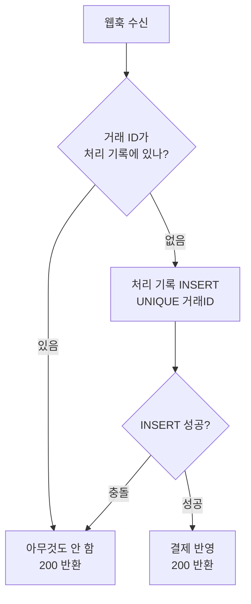

결제 결과를 외부에서 콜백(웹훅)으로 받는 기능을 다루면 반드시 마주치는 진실이 있다. **같은 통보는 한 번만 오지 않는다.** 이 글은 동일한 결제 통보가 여러 번 도착해도 결과를 한 번만 반영하는 멱등 처리를 다룬다.

## 왜 두 번 오는가

웹훅 발신자(결제 게이트웨이)는 "수신자가 확실히 받았다"를 보장하려고 한다. 그래서 우리 서버가 **2xx 응답을 명확히 돌려주기 전까지** 같은 통보를 재전송한다. 문제는 응답이 안 가는 경우가 여러 가지라는 점이다.

- 우리 서버가 처리는 끝냈는데 응답 직전에 네트워크가 끊김
- 응답이 타임아웃 안에 못 돌아감
- 발신자 측 재시도 정책이 그냥 보수적임

발신자 입장에선 "받았는지 모르겠으니 다시 보낸다". 즉 **at-least-once 전달**이 웹훅의 기본 전제다. 정확히 한 번(exactly-once) 전달은 분산 시스템에서 보장하기 어렵다. 그러니 **전달은 여러 번이어도 처리(효과)는 한 번**이 되도록 수신 측이 책임진다 — 이게 멱등성이다.

## 멱등성의 원리: 처리한 적 있는지 기록한다

핵심은 통보마다 들어 있는 **고유 식별자(거래 ID 또는 멱등 키)**를 기준으로, "이미 처리했으면 다시 처리하지 않는다"를 보장하는 것이다.



판정과 기록을 **분리하면 레이스가 생긴다**(두 통보가 동시에 "없음"으로 통과). 그래서 DB의 **UNIQUE 제약**을 잠금장치로 쓴다. 거래 ID에 유니크 인덱스를 걸고, 처리 기록을 INSERT 시도해서 **성공하면 처음, 중복 키 에러가 나면 이미 처리됨**으로 판정한다. 판정과 선점이 한 번의 원자적 연산으로 합쳐진다.

## 코드 예시

```java
@Transactional
public void handle(PaymentNotice notice) {
    try {
        // 거래 ID에 UNIQUE 인덱스. 동시 두 통보 중 하나만 성공
        receiptMapper.insert(notice.getTxId(), notice.getStatus());
    } catch (DuplicateKeyException e) {
        return;   // 이미 처리됨 — 멱등하게 무시
    }
    // 여기 도달했다는 건 이 통보를 "처음" 잡았다는 뜻
    orderService.applyPayment(notice.getTxId(), notice.getAmount());
}
```

`insert`(선점)와 `applyPayment`(반영)를 **한 트랜잭션**에 둬, 반영이 실패하면 선점 기록도 롤백되어 다음 재전송 때 다시 시도된다.

## 운영 함정

- **상태 역전(out-of-order)**: 재전송 때문에 "승인" 통보보다 "취소" 통보가 먼저 처리되거나, 옛 상태가 새 상태를 덮을 수 있다. 멱등성만으로는 순서를 보장하지 못한다. 통보에 시퀀스/타임스탬프가 있으면 **현재 상태보다 과거 통보는 무시**하는 상태 전이 규칙을 둔다.
- **항상 2xx를 빠르게 반환**: 처리 로직이 느리거나 일시 오류로 5xx를 반환하면 발신자가 폭주하듯 재전송한다. 수신을 빠르게 ACK(2xx)하고 무거운 후처리는 큐로 비동기 처리하되, 그 후처리도 멱등해야 한다.

## 면접 한 줄 Q&A

- **Q. 웹훅 처리에서 exactly-once를 보장할 수 있나?** 전달은 사실상 at-least-once이므로 exactly-once 전달은 어렵다. 대신 **거래 ID + UNIQUE 제약**으로 멱등 처리해 "효과는 한 번"을 보장한다.
- **Q. 왜 SELECT로 먼저 확인하지 않고 INSERT 충돌을 쓰나?** SELECT 후 INSERT는 그 사이에 동시 요청이 끼는 레이스가 있다. UNIQUE INSERT는 판정과 선점을 원자적으로 합친다.
