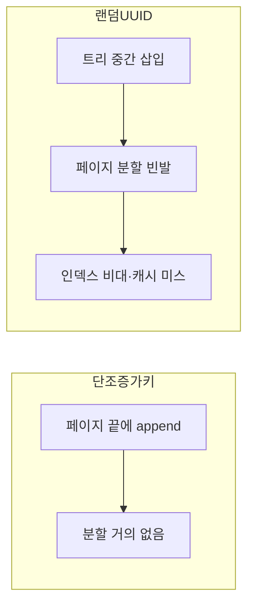

새 엔티티에 식별자를 붙이는 일은 사소해 보이지만, 트래픽이 커지고 서버가 여러 대가 되는 순간 "어떻게 만드냐"가 성능과 정합성을 좌우한다. 이 글은 충돌하지 않는 ID 생성 전략들과 각자의 비용을 다룬다.

## auto_increment의 한계

DB의 `AUTO_INCREMENT`(또는 시퀀스)는 단순하고 정렬되며 작다. 하지만 한계가 있다.

- **DB에 발급을 의존**한다. INSERT 전에는 ID를 알 수 없어, 부모-자식을 함께 만들 때 흐름이 꼬인다.
- **단일 채번 지점**이라 샤딩 환경에서 여러 노드가 같은 시퀀스를 공유하기 어렵다.
- 연속적이라 **추측 가능**하다(다음 주문 번호를 쉽게 유추). 외부 노출 식별자로는 부적절할 수 있다.

## UUID — 분산은 쉽지만 인덱스가 운다

UUIDv4는 애플리케이션에서 DB 없이 즉시 만들 수 있고 충돌 확률이 사실상 0이다. 분산 환경에 이상적으로 보인다. 그런데 **인덱스 비용**이라는 함정이 있다.

대부분의 RDB는 PK를 B+Tree로, 흔히 클러스터드 인덱스로 저장한다. 클러스터드 인덱스는 **PK 순서대로 물리 정렬**된다. auto_increment 같은 단조 증가 키는 항상 트리의 오른쪽 끝에 추가되어 페이지 분할이 거의 없다. 반면 **랜덤한 UUIDv4는 트리 중간 아무 곳에나 꽂힌다**. 그러면 기존 페이지를 쪼개는 페이지 분할(page split)이 빈발하고, 캐시 지역성이 깨지며, 인덱스가 비대해진다.



해법은 **시간 정렬 가능한 UUID**(UUIDv7 등)다. 상위 비트에 타임스탬프를 둬 대체로 단조 증가하게 만들면 랜덤 키의 분할 문제를 크게 줄이면서 분산 생성의 장점은 유지한다.

## Snowflake — 정렬되면서 분산 생성

Snowflake류 ID는 64비트 정수를 세 조각으로 나눈다.

```
| 타임스탬프(밀리초) | 노드 ID | 시퀀스 |
   ~41 bit            ~10 bit    ~12 bit
```

- **타임스탬프**가 상위 비트라 시간순 정렬된다 → 인덱스 친화적.
- **노드 ID**로 서버마다 다른 공간을 써서 DB 없이도 충돌하지 않는다.
- **시퀀스**로 같은 밀리초 내 다중 발급을 처리한다.

64비트 정수라 UUID(128비트 문자열)보다 작고 인덱스도 가볍다. "정렬 + 분산 + 작음"을 한 번에 잡는다.

```java
public synchronized long nextId() {
    long now = System.currentTimeMillis();
    if (now == lastTs) {
        sequence = (sequence + 1) & MAX_SEQ;   // 같은 ms 내 증가
        if (sequence == 0) now = waitNextMillis(lastTs); // 소진 시 다음 ms 대기
    } else {
        sequence = 0;
    }
    lastTs = now;
    return ((now - EPOCH) << 22) | (nodeId << 12) | sequence;
}
```

## 운영 함정

- **시계 역행(clock skew)**: Snowflake는 시간 단조 증가에 의존한다. NTP 보정으로 시계가 뒤로 가면 같은 타임스탬프가 재사용돼 중복이 날 수 있다. "마지막 타임스탬프보다 과거면 발급을 막거나 대기"하는 방어가 필수다.
- **노드 ID 중복**: 두 인스턴스에 같은 노드 ID가 배정되면 충돌이 난다. 노드 ID는 배포 시 유일하게 할당되도록(중앙 등록 등) 관리한다.

## 핵심 요약

- auto_increment는 단순·정렬·소형이지만 DB 의존·추측 가능·샤딩 난점이 있다.
- UUIDv4는 분산 생성이 쉽지만 랜덤 키라 클러스터드 인덱스의 페이지 분할을 유발한다 → 시간정렬 UUID(v7)로 완화.
- Snowflake는 시간순 정렬 + 분산 생성 + 64비트를 동시에 잡는다. 대신 **시계 역행과 노드 ID 유일성**을 반드시 방어한다.
