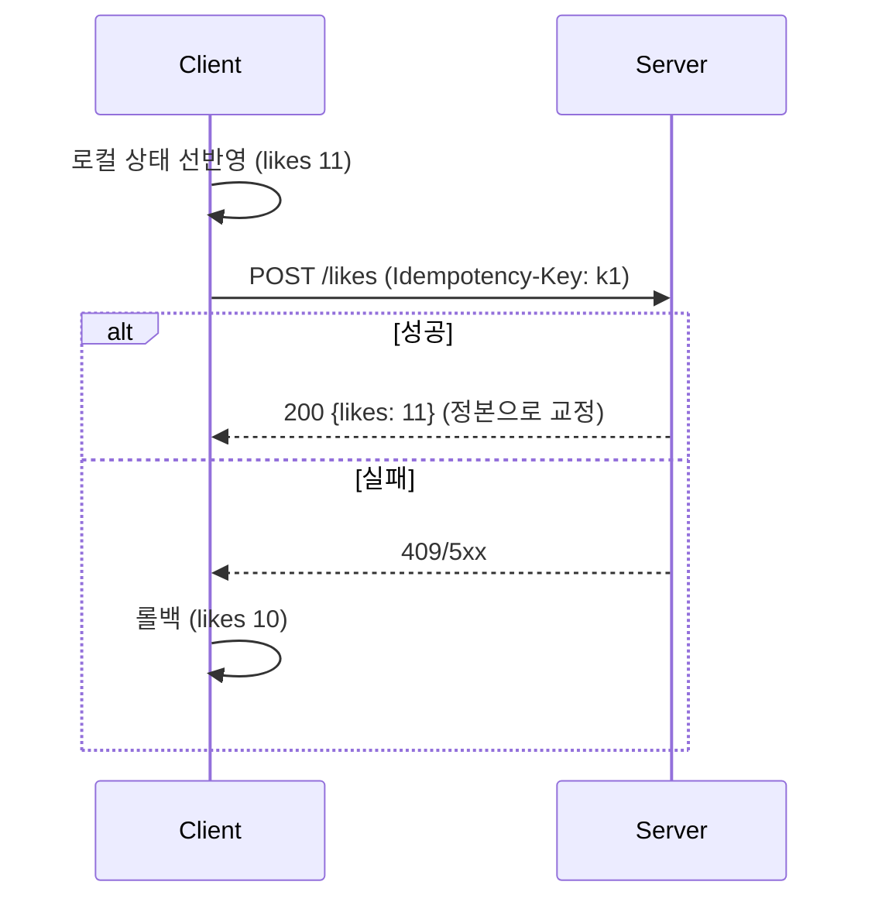

좋아요 버튼을 눌렀는데 0.5초 멈췄다 숫자가 오르면 사용자는 앱이 느리다고 느낀다. 이 주에는 "즉시 반영되는 UX"를 다뤘다. 핵심은 화면을 먼저 바꾸고 서버 확정을 나중에 받는 **낙관적 UI(optimistic update)** 와, 그 사이에 벌어지는 *화면과 서버 진실의 간극*을 어떻게 메우느냐다.

## 핵심 개념 — 낙관적 갱신과 재조정

낙관적 UI는 요청을 보내자마자 "성공했다고 가정"하고 로컬 상태를 미리 갱신한다. 응답이 오면 두 가지다.

- **성공**: 미리 그린 상태가 맞았으니 서버가 돌려준 정본(canonical)으로 조용히 덮어쓴다.
- **실패**: 미리 바꾼 것을 되돌리고(rollback) 에러를 노출한다.

여기서 서버가 책임질 것은 두 가지다. 첫째, **재시도에 안전해야 한다**. 네트워크가 불안하면 클라이언트는 같은 요청을 두 번 보낼 수 있다. 둘째, 응답은 항상 **재조정 가능한 정본 상태**를 담아야 한다. 클라이언트가 추정한 값과 서버의 실제 값이 다를 수 있으니, 서버는 "현재 진짜 값"을 돌려줘 클라이언트가 자기 추정을 교정하게 한다.



## 멱등성이 핵심이다

선반영의 위험은 중복 요청이다. 사용자가 따닥 두 번 누르거나, 클라이언트가 타임아웃 후 재시도하면 같은 동작이 두 번 적용될 수 있다. 이를 막는 표준이 **멱등성 키(Idempotency-Key)** 다. 클라이언트가 요청마다 고유 키를 부여하고, 서버는 그 키로 결과를 캐시한다.

```java
@PostMapping("/orders/{id}/cancel")
public ResponseEntity<OrderView> cancel(
        @PathVariable Long id,
        @RequestHeader("Idempotency-Key") String key) {

    // 같은 키로 이미 처리됐다면 저장된 결과를 그대로 반환 (재실행 안 함)
    return idempotencyStore.find(key)
        .map(cached -> ResponseEntity.ok(cached))
        .orElseGet(() -> {
            OrderView result = orderService.cancel(id);
            idempotencyStore.save(key, result);   // 결과 정본 저장
            return ResponseEntity.ok(result);     // 클라가 이 값으로 교정
        });
}
```

응답 본문에 변경 후 **확정 상태**를 담는 것이 중요하다. 클라이언트가 "취소했다고 가정"한 화면이 서버가 돌려준 `status: CANCELED`와 일치하면 그대로 두고, 어긋나면 서버 값으로 덮는다. 이 단방향 교정 규칙(서버가 진실) 덕분에 두 상태가 영원히 갈라지지 않는다.

## 운영 함정

**함정 1 — 실패 롤백을 안 한다.** 선반영만 구현하고 실패 경로에서 되돌리는 코드를 빠뜨리면, 서버는 거절했는데 화면만 "성공" 상태로 남는다. 사용자는 반영됐다고 믿고 떠난다. 선반영하는 모든 액션에는 반드시 짝이 되는 롤백이 있어야 한다.

**함정 2 — 응답이 정본을 안 준다.** 서버가 `204 No Content`만 주면 클라이언트는 자기 추정을 검증할 길이 없다. 동시성 환경(다른 사용자가 같은 카운터를 올림)에서 추정값과 실제값이 어긋나면 그대로 굳는다. 변경 API는 변경 후 상태를 돌려주는 편이 안전하다.

## 핵심 요약

- 낙관적 UI = 선반영 + (성공 시 정본 교정 / 실패 시 롤백).
- 서버는 **멱등**해야 하고, 응답에 **확정 상태**를 담아 클라이언트가 자기 추정을 교정하게 한다.
- 면접 한 줄: "낙관적 업데이트에서 서버 책임은?" → "재시도 안전성(멱등성)과, 클라이언트가 재조정할 수 있는 정본 상태 반환."
