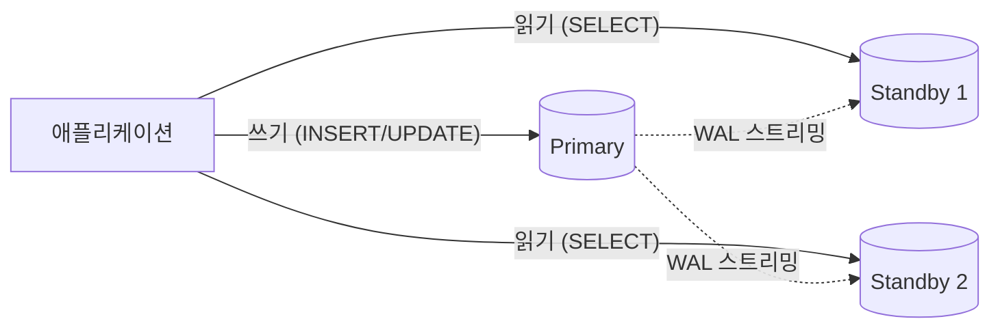
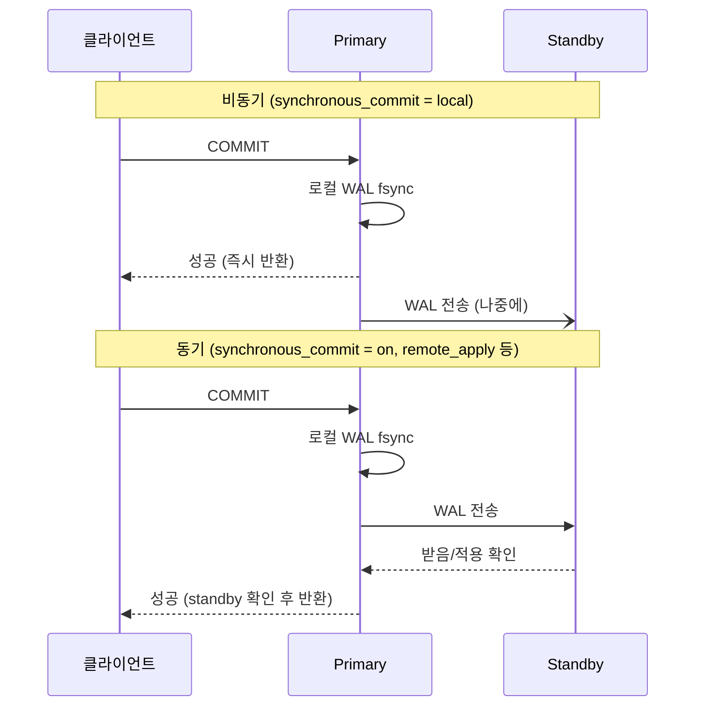
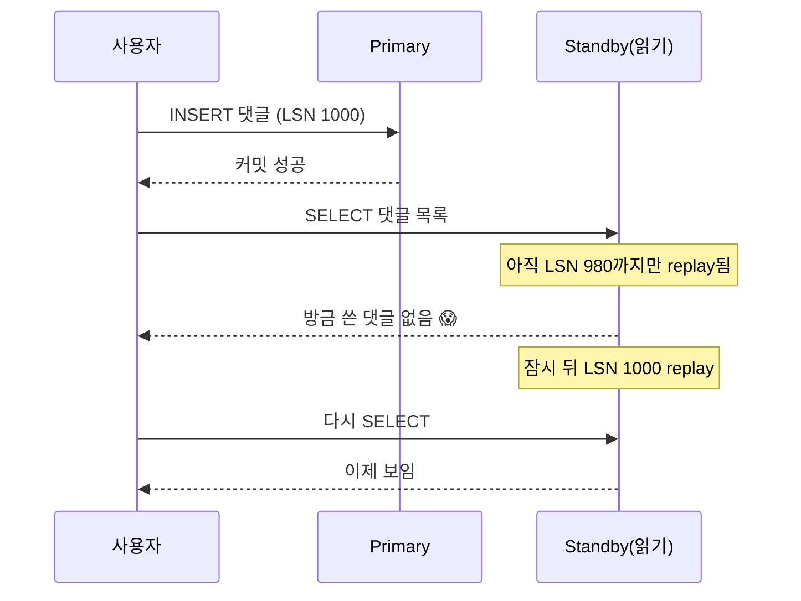

## "방금 쓴 글이 새로고침하니 사라졌어요"

장애를 대비해 읽기 부하를 분산하려고 standby를 한 대 붙이고, 애플리케이션이 **쓰기는 primary, 읽기는 standby**로 가도록 라우팅했습니다. 그런데 사용자가 댓글을 쓰자마자 목록을 새로고침하면 방금 쓴 댓글이 안 보입니다. 잠시 뒤 다시 누르면 나타납니다. 버그 리포트는 "가끔 글이 사라졌다 나타나요"로 들어옵니다.

DB는 멀쩡합니다. primary에는 댓글이 분명히 있습니다. 문제는 **복제가 0이 아닌 시간**을 먹는다는 것 — `replication lag`입니다. 이 글은 복제를 "장애 대비 + 읽기 확장"이라는 마법으로만 보지 않고, **WAL이 어떻게 다른 노드로 흘러가 재생되는지**, 그 과정에서 생기는 동기/비동기 트레이드오프와 lag으로 깨지는 일관성을 PostgreSQL 내부 수준으로 따라갑니다. 앞 글 [카디널리티 추정과 통계]()까지가 "한 대를 잘 쓰는 법"이었다면, 여기서부터는 **여러 대**의 세계입니다.

## 왜 복제하는가 — 네 가지 동기

복제(replication)는 같은 데이터를 여러 노드에 **중복 보관**하는 것입니다. 동기는 크게 넷입니다.

- **고가용성(availability)**: primary 한 대가 디스크·전원·커널 패닉으로 죽어도, standby가 데이터를 이미 갖고 있으니 **승격(promote)**해서 서비스를 잇습니다. 단일 장애점(SPOF) 제거.
- **읽기 확장(read scaling)**: 읽기가 쓰기보다 압도적으로 많은 워크로드(블로그·커머스 상품조회)에서 읽기 트래픽을 여러 standby로 분산합니다. 쓰기는 여전히 한 곳(primary)이라 **쓰기 확장은 아님** — 그건 [샤딩]()의 영역입니다.
- **지리 분산(geo-distribution)**: 서울 primary, 도쿄·프랑크푸르트 standby. 가까운 노드에서 읽어 지연을 줄입니다.
- **백업/오프로딩**: 무거운 분석 쿼리나 `pg_dump`를 standby에서 돌려 primary I/O를 보호합니다.



핵심은 화살표의 방향입니다. **쓰기는 단방향으로 primary에만**, 그 변경이 standby로 흘러내려 갑니다. 그 "흘러내림"의 정체가 바로 [WAL]()입니다.

## 물리 복제 = WAL 스트리밍

[WAL과 크래시 복구]() 글에서 본 핵심을 떠올려 봅시다. PostgreSQL은 데이터 페이지를 고치기 **전에** 변경 내용을 WAL 레코드로 먼저 기록합니다(write-ahead). 그리고 크래시가 나면 마지막 checkpoint부터 WAL을 **redo**(재생)해서 디스크 상태를 복구합니다.

물리 복제(physical/streaming replication)는 이 메커니즘을 그대로 빌려옵니다. **"크래시 복구를 영원히 멈추지 않고 돌리는 standby"**가 물리 복제의 본질입니다.

1. primary가 WAL 레코드를 생성(LSN — Log Sequence Number로 위치 식별).
2. primary의 `walsender` 프로세스가 그 WAL 바이트 스트림을 standby로 전송.
3. standby의 `walreceiver`가 받아서 디스크에 쓰고,
4. standby의 `startup`(recovery) 프로세스가 그 WAL을 **자기 데이터 페이지에 redo(replay)** → primary와 똑같은 물리 상태를 만든다.

즉 standby는 "끝나지 않는 복구 모드"로 떠 있으면서, primary가 보내주는 WAL을 계속 재생합니다. **바이트 단위로 동일한 페이지**를 만들기 때문에 "물리(physical)" 복제라고 부릅니다 — 같은 PostgreSQL 메이저 버전, 같은 아키텍처여야 합니다.

아래 애니메이션은 primary에서 생성된 WAL 레코드가 두 standby로 **스트리밍**되어 각자 replay되는 흐름, 그리고 한쪽 standby가 처지면서 **lag**이 벌어지는 모습입니다.

<div class="repl-stream" markdown="0">
<style>
.repl-stream{margin:1.4rem 0;overflow-x:auto}
.repl-stream svg{width:100%;max-width:760px;height:auto;display:block;margin:0 auto;font-family:inherit}
.repl-stream .lbl{fill:currentColor;font-size:12px;font-weight:600}
.repl-stream .sub{fill:currentColor;font-size:9.5px;opacity:.6}
.repl-stream .node{fill:none;stroke:currentColor;stroke-width:1.6;opacity:.55}
.repl-stream .wire{stroke:currentColor;stroke-width:1.2;opacity:.25;fill:none;stroke-dasharray:4 4}
.repl-stream .pri{fill:#1971c2;opacity:.12}
.repl-stream .wal{fill:#1971c2}
.repl-stream .replayed{fill:#2f9e44}
.repl-stream .laggy{fill:#f08c00}
/* WAL 레코드가 primary에서 standby1로 흐름 (정상) */
.repl-stream .p1{offset-path:path('M 150,70 L 560,70');animation:replp1 4s linear infinite}
.repl-stream .p2{offset-path:path('M 150,70 L 560,70');animation:replp1 4s linear infinite 1.3s}
@keyframes replp1{0%{offset-distance:0%;opacity:0}6%{opacity:1}90%{opacity:1}100%{offset-distance:100%;opacity:0}}
/* WAL 레코드가 primary에서 standby2로 흐름 (느림 = lag) */
.repl-stream .q1{offset-path:path('M 150,170 L 560,170');animation:replq1 7s linear infinite}
@keyframes replq1{0%{offset-distance:0%;opacity:0}6%{opacity:1}92%{opacity:1}100%{offset-distance:100%;opacity:0}}
/* standby에서 replay 깜빡임 */
.repl-stream .rp1{fill:#2f9e44;opacity:0;animation:replrp1 4s ease-in-out infinite}
@keyframes replrp1{0%,85%{opacity:0}92%{opacity:.9}100%{opacity:0}}
.repl-stream .rp2{fill:#2f9e44;opacity:0;animation:replrp2 7s ease-in-out infinite}
@keyframes replrp2{0%,88%{opacity:0}95%{opacity:.9}100%{opacity:0}}
</style>
<svg viewBox="0 0 760 240" role="img" aria-label="Primary가 생성한 WAL 레코드가 두 standby로 스트리밍되어 각자 replay되는 흐름과, 한 standby가 처지며 복제 지연(lag)이 벌어지는 모습 애니메이션">
  <!-- primary -->
  <rect class="node pri" x="30" y="40" width="120" height="160" rx="8"/>
  <text class="lbl" x="90" y="32" text-anchor="middle">Primary</text>
  <text class="sub" x="90" y="120" text-anchor="middle">walsender</text>
  <text class="sub" x="90" y="135" text-anchor="middle">WAL 생성 →</text>
  <!-- WAL 원본 막대 -->
  <rect class="wal" x="50" y="58" width="14" height="10" rx="2"/>
  <rect class="wal" x="68" y="58" width="14" height="10" rx="2"/>
  <rect class="wal" x="86" y="58" width="14" height="10" rx="2"/>
  <rect class="wal" x="104" y="58" width="14" height="10" rx="2"/>

  <!-- standby1 (정상) -->
  <rect class="node" x="560" y="40" width="160" height="70" rx="8"/>
  <text class="lbl" x="640" y="32" text-anchor="middle">Standby 1</text>
  <path class="wire" d="M 150,70 L 560,70"/>
  <rect class="rp1" x="575" y="78" width="130" height="20" rx="3"/>
  <text class="sub" x="640" y="92" text-anchor="middle">replay 완료 (lag≈0)</text>

  <!-- standby2 (느림) -->
  <rect class="node" x="560" y="140" width="160" height="70" rx="8"/>
  <text class="lbl" x="640" y="132" text-anchor="middle">Standby 2</text>
  <path class="wire" d="M 150,170 L 560,170"/>
  <rect class="rp2" x="575" y="178" width="130" height="20" rx="3"/>
  <text class="sub" x="640" y="192" text-anchor="middle">처짐 → lag 누적</text>

  <!-- 흐르는 WAL 레코드들 -->
  <rect class="wal p1" x="-7" y="-5" width="14" height="10" rx="2"/>
  <rect class="wal p2" x="-7" y="-5" width="14" height="10" rx="2"/>
  <rect class="laggy q1" x="-7" y="-5" width="14" height="10" rx="2"/>

  <text class="sub" x="355" y="58" text-anchor="middle">WAL 스트리밍 (LSN 순서대로)</text>
  <text class="sub" x="355" y="158" text-anchor="middle">같은 WAL, 더 늦게 도착·replay</text>
</svg>
</div>

WAL은 LSN 순서대로 **순차적**으로만 흐르고 standby는 받은 순서대로 redo하므로, standby는 항상 primary의 **과거 어느 시점** 상태입니다. 그 "얼마나 과거인가"가 lag입니다.

### 설정의 큰 그림

```ini
# primary: postgresql.conf
wal_level = replica            # 복제에 필요한 WAL 수준
max_wal_senders = 10           # 동시에 띄울 walsender 수
# standby: 복제 슬롯으로 primary가 WAL을 미리 지우지 않게 보장
```

여기서 **복제 슬롯(replication slot)**이 중요합니다. standby가 잠깐 끊겼다 돌아왔을 때 필요한 WAL이 이미 삭제됐다면 복제가 깨져 base backup부터 다시 떠야 합니다. 슬롯은 "이 standby가 아직 LSN X까지밖에 못 받았다"를 primary가 기억하게 해서 그 이전 WAL을 지우지 못하게 막습니다. 단, **standby가 영영 안 돌아오면 WAL이 무한정 쌓여 primary 디스크가 터지는** 양날의 검이라 `max_slot_wal_keep_size`로 상한을 둡니다.

## 동기 vs 비동기 — `synchronous_commit`의 트레이드오프

primary가 커밋을 어디까지 확인하고 클라이언트에게 "성공"을 반환할지가 **동기/비동기**를 가릅니다. 핵심 파라미터는 `synchronous_commit`입니다.



- **비동기(`local` 또는 standby가 sync 목록에 없을 때)**: primary는 자기 WAL만 디스크에 안전하게 쓰면 즉시 성공을 반환합니다. 빠릅니다. 하지만 standby로 WAL이 가기 **전에** primary가 죽으면, 그 커밋은 standby에 없어 **데이터 손실**이 납니다(RPO > 0).
- **동기(`on`, `remote_write`, `remote_apply`)**: primary가 지정된 standby(`synchronous_standby_names`)로부터 "받았다/썼다/적용했다" 확인을 받은 **뒤에야** 성공을 반환합니다. 손실 0(RPO=0)에 가깝지만, 커밋 지연 = primary↔standby **왕복(RTT)**이 그대로 더해집니다.

`synchronous_commit` 단계별로 "어디까지 기다리나"가 다릅니다:

| 값 | primary 로컬 | standby 수신 | standby 디스크 | standby replay | 손실 위험 | 지연 |
|---|---|---|---|---|---|---|
| `off` | flush 안 기다림 | — | — | — | 크래시 시 로컬도 손실 | 최소 |
| `local` | fsync | — | — | — | standby 손실 가능 | 낮음 |
| `remote_write` | fsync | OS 버퍼 | — | — | standby OS 크래시 시 | 중간 |
| `on` | fsync | ✓ | fsync | — | 거의 없음 | 높음 |
| `remote_apply` | fsync | ✓ | fsync | ✓ 적용까지 | 거의 없음 | 가장 높음 |

`remote_apply`는 standby가 **재생까지 끝낸 뒤** 반환하므로, 그 standby에서 읽으면 방금 커밋이 **반드시 보입니다** — 도입부의 read-your-writes 문제를 동기 복제로 푸는 길입니다. 대신 모든 커밋이 가장 느려집니다.

> **현실 체크 — 동기 복제는 가용성을 떨어뜨릴 수도 있다.** sync standby가 한 대뿐인데 그게 죽거나 느려지면, primary의 모든 커밋이 **그 standby를 기다리며 멈춥니다**. "가용성을 위한 복제"가 오히려 primary를 인질로 잡는 셈입니다. 그래서 보통 sync standby를 2대 이상 두고 `ANY 1 (s1, s2)`처럼 **정족수**로 설정하거나, 정말 중요한 트랜잭션만 세션 단위로 `SET synchronous_commit = remote_apply`를 켜고 나머지는 비동기로 둡니다.

## Hot Standby와 복제 지연 — read-your-writes가 깨지는 순간

`hot_standby = on`이면 standby는 WAL을 재생하면서 **동시에 읽기 쿼리를 받습니다**(hot standby). 이게 읽기 확장의 핵심입니다. 그러나 standby는 primary의 과거 상태이므로, 비동기 복제에서는 **방금 primary에 쓴 데이터가 standby엔 아직 없을 수 있습니다.** 이것이 도입부 증상의 정체입니다.



이걸 **복제 지연(replication lag)**이라 부르고, 세 종류로 나눠 봅니다:

- **write lag**: primary가 WAL을 만든 시점 ~ standby가 받은 시점.
- **flush lag**: ~ standby가 디스크에 쓴 시점.
- **replay lag**: ~ standby가 실제로 재생해 쿼리에 보이는 시점. **읽기 일관성에 직접 영향**을 주는 건 이 replay lag입니다.

진단은 primary와 standby 양쪽에서 LSN 차이를 봅니다.

```sql
-- primary에서: 각 standby가 어디까지 받았/적용했나
SELECT application_name, state,
       pg_wal_lsn_diff(sent_lsn, replay_lsn) AS replay_bytes_behind,
       write_lag, flush_lag, replay_lag
FROM pg_stat_replication;

-- standby에서: 마지막 재생 시점이 얼마나 과거인가 (시간 기준)
SELECT now() - pg_last_xact_replay_timestamp() AS replay_delay;
```

### lag을 안고 사는 법

물리 법칙상 비동기 복제의 lag은 0이 될 수 없습니다. 그래서 lag을 **없애는** 게 아니라 **다루는** 전략을 씁니다.

- **read-your-writes가 필요한 경로만 primary로**: "방금 내가 쓴 걸 바로 읽는" 화면(작성 직후 상세 페이지)은 standby가 아니라 primary에서 읽습니다.
- **세션 단위 동기화 대기**: 애플리케이션이 커밋 시점의 LSN(`pg_current_wal_lsn()`)을 기억했다가, standby에서 읽기 전에 그 LSN까지 재생됐는지 확인(LSN-based read routing). 일부 미들웨어/ORM이 지원.
- **`recovery_min_apply_delay`로 의도적 지연**: 오히려 standby 재생을 일부러 늦춰 "실수로 DROP TABLE 친 걸 1시간 안에 살리는" 지연 복제본으로 쓰기도 합니다.
- **장시간 쿼리 vs 재생 충돌**: standby의 긴 분석 쿼리가, primary가 VACUUM으로 정리한 [죽은 튜플]()을 아직 보고 있으면 재생이 그 튜플을 지우려다 충돌합니다. PostgreSQL은 쿼리를 취소(`max_standby_streaming_delay`)하거나, `hot_standby_feedback = on`으로 standby가 "나 이 xmin 아직 봐"를 primary에 알려 VACUUM을 늦추게 합니다(대신 primary 블로트 위험).

## 논리 복제 — 행 단위, 이종 버전, 무중단 업그레이드

물리 복제는 **WAL 바이트를 그대로** 재생하므로 전체 클러스터가 통째로, 같은 버전으로만 복제됩니다. 반면 **논리 복제(logical replication)**는 WAL을 디코딩해 **"이 테이블의 이 행이 INSERT/UPDATE/DELETE 됐다"**는 **논리적 변경 이벤트**로 바꿔 보냅니다.

```sql
-- 발행자(publisher, 보통 primary 역할)
CREATE PUBLICATION my_pub FOR TABLE orders, customers;

-- 구독자(subscriber, 독립적으로 쓰기 가능한 별도 DB)
CREATE SUBSCRIPTION my_sub
  CONNECTION 'host=pub-host dbname=app'
  PUBLICATION my_pub;
```

내부적으로 `wal_level = logical`이면 WAL에 디코딩에 필요한 정보가 더 들어가고, **logical decoding** 플러그인(`pgoutput`)이 WAL을 행 변경 스트림으로 풀어냅니다. 변경 식별을 위해 테이블에 **replica identity**(기본은 PK)가 필요합니다 — UPDATE/DELETE된 행이 구독자 쪽 어느 행인지 매칭해야 하니까요.

물리 복제와의 차이가 곧 논리 복제의 쓰임새입니다:

| | 물리 복제 | 논리 복제 |
|---|---|---|
| 단위 | WAL 바이트(페이지) | 행(row) 변경 |
| 범위 | 클러스터 전체 | 선택한 테이블/DB |
| 버전 | 동일 메이저 | **이종 버전 가능** |
| 구독자 쓰기 | 불가(read-only) | **가능**(독립 DB) |
| 용도 | HA, 읽기 확장 | 무중단 업그레이드, 부분 통합, CDC |

가장 강력한 용도는 **무중단 메이저 버전 업그레이드**입니다. PG 13 → 16으로 올릴 때, 16을 구독자로 띄워 데이터를 논리 복제로 따라잡게 한 뒤, lag이 0에 수렴하면 트래픽을 잠깐 끊고 16으로 스위치합니다. 다운타임이 분 단위가 아니라 초 단위가 됩니다. 그 외에 여러 DB의 일부 테이블을 한 분석 DB로 모으거나(CDC, Change Data Capture), 멀티 마스터의 기반으로도 씁니다.

> **함정**: 논리 복제는 **DDL을 복제하지 않습니다.** `ALTER TABLE ADD COLUMN`을 발행자에만 하고 구독자에 안 하면 복제가 깨집니다. 또 시퀀스 값, 큰 트랜잭션의 초기 동기화 부하도 챙겨야 합니다.

## 페일오버와 승격

primary가 죽으면 standby 하나를 **승격(promote)**해 새 primary로 만듭니다. `pg_ctl promote` 또는 트리거 파일로, standby는 복구 모드를 끝내고 쓰기를 받기 시작합니다.

수동으로 이걸 다 하면 새벽 3시 장애에 사람이 깨야 하므로, 보통 **Patroni**, **repmgr**, 클라우드의 RDS/Aurora 같은 오케스트레이터가 자동화합니다. 핵심 위험은 둘:

- **데이터 손실(RPO)**: 비동기였다면 승격된 standby에 없던 마지막 커밋들은 사라집니다. 동기 복제로 줄이지만 0 보장은 비용이 큽니다.
- **스플릿 브레인(split-brain)**: 옛 primary가 사실은 안 죽고 네트워크만 단절됐던 거라면, 양쪽이 모두 자기가 primary라 믿고 **둘 다 쓰기를 받아 데이터가 갈라집니다.** 그래서 오케스트레이터는 승격 전 옛 primary를 확실히 차단하는 **펜싱(fencing/STONITH)**과, 누가 리더인지 합의하는 **정족수**를 씁니다 — 이 "여러 노드가 하나의 리더에 합의" 문제가 다음 글의 주제입니다.

승격 후 옛 primary를 새 standby로 되돌릴 땐, 갈라진 WAL을 되감는 `pg_rewind`로 base backup 없이 재합류시킵니다.

## 면접/리뷰 단골 질문

- **Q. 물리 복제와 논리 복제의 차이는?** → 물리는 WAL 바이트를 그대로 재생(클러스터 전체, 동일 버전, read-only standby), 논리는 WAL을 디코딩해 행 변경으로 전송(테이블 선택, 이종 버전, 구독자 쓰기 가능). HA/읽기확장엔 물리, 업그레이드/CDC엔 논리.
- **Q. `synchronous_commit`을 `on`으로 하면 데이터 손실이 0인가?** → 거의 0이지만, 커밋마다 standby 왕복 지연이 더해지고 sync standby가 죽으면 primary 커밋이 멈춘다. 그래서 정족수(`ANY n`)나 트랜잭션별 선택을 쓴다. `remote_apply`라야 그 standby에서 read-your-writes가 보장된다.
- **Q. standby에서 읽었더니 방금 쓴 데이터가 없다. 왜?** → 비동기 복제의 replay lag. standby는 primary의 과거 시점이다. read-your-writes 경로는 primary로 보내거나 LSN까지 대기, 혹은 동기(remote_apply).
- **Q. 복제 슬롯은 왜 필요한가?** → standby가 못 받은 WAL을 primary가 미리 지우지 않게 보장. 단 standby가 죽은 채 방치되면 WAL이 쌓여 primary 디스크가 찬다 → `max_slot_wal_keep_size`로 상한.
- **Q. 스플릿 브레인이란?** → 페일오버 시 옛 primary가 살아 있어 두 노드가 모두 primary로 동작해 데이터가 갈라지는 것. 펜싱/STONITH와 정족수 기반 리더 선출로 방지.
- **Q. 복제로 쓰기를 확장할 수 있나?** → 아니다. 쓰기는 여전히 단일 primary로 모인다. 읽기 확장만 된다. 쓰기 확장은 샤딩의 영역.

## 정리

- 복제의 동기는 **가용성·읽기 확장·지리 분산·백업**. 쓰기는 단일 primary, 그 변경이 standby로 흐른다(읽기만 확장).
- PG 물리 복제 = **WAL 스트리밍**: walsender→walreceiver→startup이 WAL을 재생해 바이트 단위로 같은 페이지를 만든다. 동일 메이저 버전 전제.
- **동기 vs 비동기**는 `synchronous_commit` 한 줄로 갈린다 — 손실(RPO) ↓ vs 커밋 지연 ↑. `remote_apply`만이 그 standby에서 read-your-writes 보장.
- 비동기 복제의 **replay lag**은 0이 될 수 없다 → read-your-writes가 깨진다. primary 라우팅·LSN 대기·동기로 다룬다.
- **논리 복제**는 행 단위·테이블 선택·이종 버전이라 무중단 업그레이드/CDC에 쓴다(단 DDL 미복제).
- 페일오버는 **승격**으로, 위험은 데이터 손실과 **스플릿 브레인** → 펜싱·정족수로 막는다.

> 다음 글: 읽기는 복제로 늘렸지만 데이터가 한 대에 다 안 들어가면? 테이블을 쪼개는 [파티셔닝과 샤딩]()으로 이어집니다. 그리고 "여러 노드가 하나의 리더에 합의하는" 문제는 [분산 트랜잭션·CAP·합의]()에서 정면으로 다룹니다.
