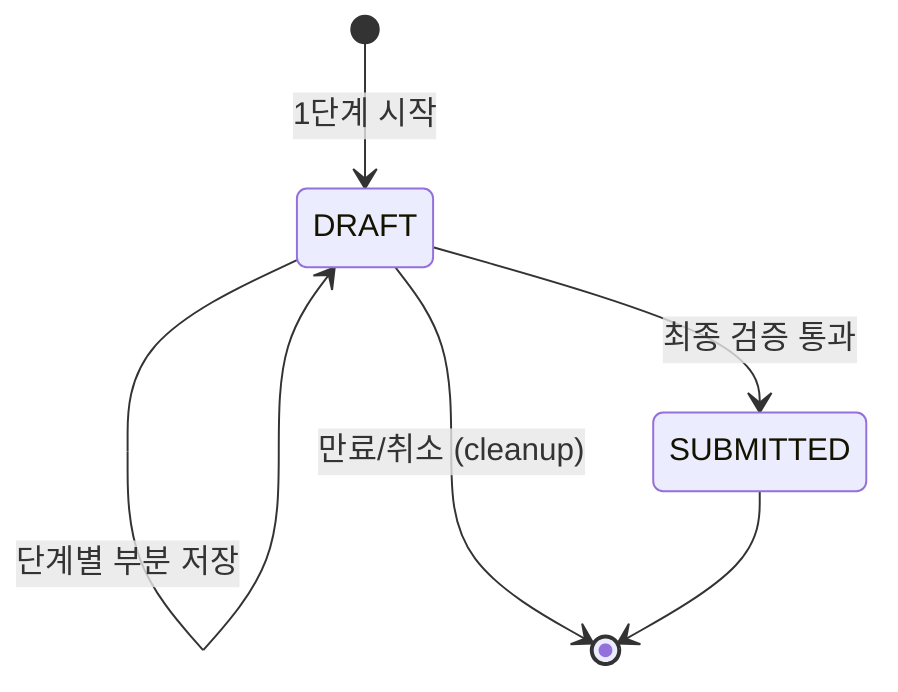

한 화면에 다 못 담는 입력은 단계로 쪼갠다. 이 주에는 "여러 단계로 나뉜 입력 폼"을 다뤘다. 핵심은 단계마다 데이터를 *어디에 어떻게 보존*하고, 중간에 이탈한 사용자를 *복구*시키며, 최종 검증을 *어느 시점에* 하느냐다.

## 핵심 개념 — 상태를 어디에 둘 것인가

다단계 폼의 본질은 "여러 요청에 걸친 상태"를 다루는 일이다. HTTP는 무상태(stateless)이므로 단계 간 데이터를 명시적으로 들고 다녀야 한다. 선택지는 세 가지다.

| 방식 | 보존 위치 | 장점 | 단점 |
|------|-----------|------|------|
| 클라이언트 누적 | 브라우저/앱 메모리 | 서버 단순 | 새로고침·기기변경 시 소실 |
| 서버 세션 | 세션 저장소 | 구현 쉬움 | 만료·확장(scale-out) 시 분실 |
| 임시 저장(draft) | DB(상태=DRAFT) | 영속·복구·여러 기기 | 정리(cleanup) 필요 |

검증의 무게가 가볍고 단기면 세션으로 충분하다. 하지만 "작성하다 말고 내일 이어서"가 필요하면 **DB에 DRAFT 레코드**로 저장하는 편이 정답이다. 핵심 통찰은, 단계가 끝날 때마다 부분 데이터를 저장하되 최종 제출 전까지는 **불완전 상태를 정식 데이터와 구분**하는 것이다.



## 부분 검증과 최종 검증의 분리

단계마다 그 단계 필드만 검증하고, 마지막에 **전체를 한 번 더** 검증한다. 단계별 검증은 사용자에게 즉시 피드백을 주기 위한 것이고, 최종 검증은 신뢰 경계다. 클라이언트가 단계를 건너뛰거나 조작했을 수 있으니 서버는 제출 시점에 전체 일관성을 다시 본다.

```java
public Long saveStep(Long draftId, int step, StepData data) {
    OrderDraft draft = draftRepo.findById(draftId)
            .orElseGet(OrderDraft::new);
    validateStep(step, data);          // 해당 단계만 검증
    draft.merge(step, data);
    draft.setStatus(DraftStatus.DRAFT);
    return draftRepo.save(draft).getId();   // 부분 저장
}

@Transactional
public Order submit(Long draftId) {
    OrderDraft draft = draftRepo.findById(draftId).orElseThrow();
    validateAll(draft);                // 전체 일관성 최종 검증
    Order order = draft.toOrder();     // 정식 엔티티로 승격
    orderRepo.save(order);
    draftRepo.delete(draft);           // draft 정리
    return order;
}
```

## 운영 함정

**함정 1 — 세션에만 의존하다 scale-out에서 잃는다.** 서버 세션에 폼 데이터를 쌓다가 인스턴스가 늘면(혹은 재배포되면) 세션이 다른 노드로 라우팅되거나 사라진다. 스티키 세션이나 분산 세션 저장소 없이 로컬 세션에 의존하면 사용자는 작성하던 내용을 잃는다. 장기 보존이 필요하면 DRAFT를 DB에 둔다.

**함정 2 — 버려진 draft가 쌓인다.** 작성하다 떠난 DRAFT는 영원히 남는다. 만료 기준(예: 7일 미수정)으로 주기적 정리 배치가 필요하다. 안 그러면 테이블이 미완성 데이터로 부풀고, 통계·조회 쿼리가 오염된다.

## 핵심 요약

- 다단계 폼 = "여러 요청에 걸친 상태" 관리. 보존 위치(클라/세션/DB DRAFT)를 요구사항으로 결정한다.
- 단계별 검증은 UX, 최종 검증은 신뢰 경계 — 둘을 분리한다.
- DRAFT는 정식 데이터와 상태로 구분하고, 만료 정리를 반드시 둔다.
