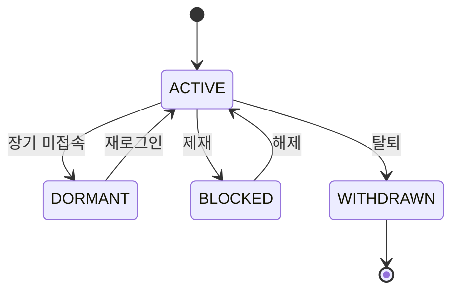

`isActive`, `isDeleted`, `isPending` 세 컬럼이 한 테이블에 나란히 있다면 의심해야 한다. 이 주에는 상태 모델링을 다뤘다. 핵심은 여러 boolean이 곱해져 만드는 *불가능한 조합*을, 단일 상태 enum으로 **모순 자체가 표현 불가능**하게 만드는 일이다.

## 핵심 개념 — 불리언의 조합 폭발

boolean 플래그 N개는 2^N 가지 조합을 만든다. 그런데 실제 도메인에서 의미 있는 상태는 그중 일부뿐이다. 나머지는 "있어선 안 되는" 상태다.

`isActive`, `isDeleted`, `isBlocked` 세 개면 8가지 조합이 가능하다. 하지만 `active=true & deleted=true`는 모순이고, `deleted=true & blocked=true`도 의미가 없다. 이런 모순 조합이 데이터에 실제로 들어가는 순간, 모든 조회 쿼리와 분기 로직이 그 가능성까지 방어해야 한다. 코드가 `if (active && !deleted && !blocked)` 같은 누더기로 변한다.

해법은 **상태를 하나의 enum으로 승격**하는 것이다. 상태는 본질적으로 *상호 배타적*이다. 회원은 활성이거나, 휴면이거나, 탈퇴했거나 — 동시에 둘일 수 없다. 그렇다면 표현도 단일 값이어야 한다.



## enum 모델링과 전이 제약

```java
public enum MemberStatus {
    ACTIVE, DORMANT, BLOCKED, WITHDRAWN
}

@Entity
public class Member {
    @Enumerated(EnumType.STRING)   // 순서(ORDINAL) 말고 문자열로 저장
    private MemberStatus status;
}
```

`@Enumerated(EnumType.STRING)` 이 중요하다. `ORDINAL`로 저장하면 DB에 0,1,2,3이 들어가는데, 나중에 enum 중간에 값을 끼워넣으면 기존 데이터의 의미가 통째로 어긋난다. 문자열로 저장하면 순서에 무관하고 DB를 직접 봐도 의미가 읽힌다.

여기에 **전이 규칙**까지 enum 안에 두면 모델이 자기 일관성을 지킨다. 임의의 상태로 막 바꾸는 대신 허용된 전이만 통과시킨다.

```java
public enum MemberStatus {
    ACTIVE   { public boolean canMoveTo(MemberStatus s) { return s != ACTIVE; } },
    DORMANT  { public boolean canMoveTo(MemberStatus s) { return s == ACTIVE; } },
    BLOCKED  { public boolean canMoveTo(MemberStatus s) { return s == ACTIVE; } },
    WITHDRAWN{ public boolean canMoveTo(MemberStatus s) { return false; } };

    public abstract boolean canMoveTo(MemberStatus next);
}
```

이제 `WITHDRAWN`에서 다시 활성으로 가는 잘못된 전이는 컴파일된 규칙이 막는다. boolean 세 개를 동시에 갱신하다 빠뜨려 모순이 생기던 문제가 구조적으로 사라진다.

## 운영 함정

**함정 1 — 무분별한 마이그레이션.** boolean을 enum으로 합칠 때 기존 데이터의 모순 조합을 어떻게 매핑할지 먼저 정해야 한다. `active=true & deleted=true` 같은 더러운 데이터가 이미 있다면, 그것부터 한 상태로 정규화하는 백필이 선행돼야 한다.

**함정 2 — 검색 조건이 enum과 안 맞는다.** "삭제 안 된 것 전부"가 자주 필요하면 `status != 'WITHDRAWN'` 같은 부정 조건이 늘어 인덱스 활용이 나빠질 수 있다. 활성 집합을 자주 본다면 부분 인덱스나 별도 상태 그룹핑을 고려한다.

## 면접 한 줄 Q&A

- "boolean 플래그 여러 개 vs 상태 enum, 언제 enum?" → "플래그들이 상호 배타적이라 모순 조합이 생길 수 있으면 enum. 2^N 중 의미 없는 상태를 표현 불가능하게 만들어 불변식을 보장한다."
- "enum을 DB에 저장할 때 주의점?" → "ORDINAL은 순서 의존이라 위험. STRING으로 저장한다."
