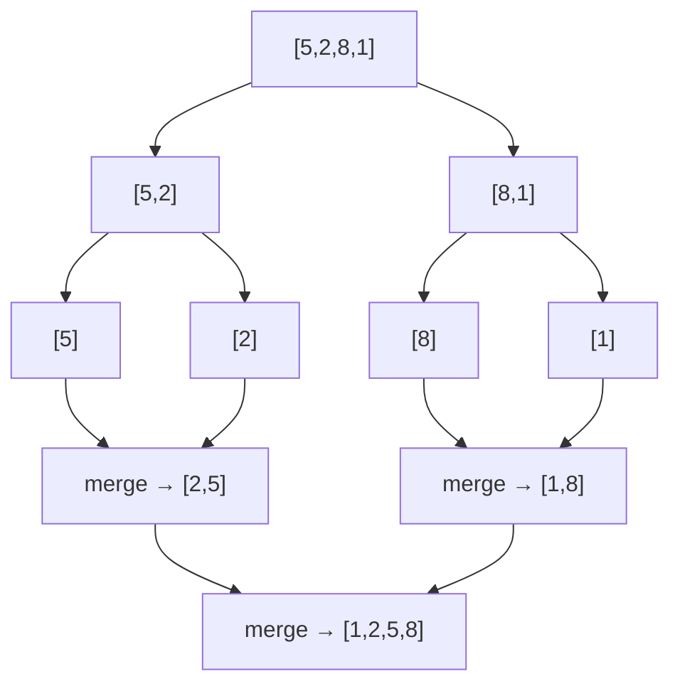
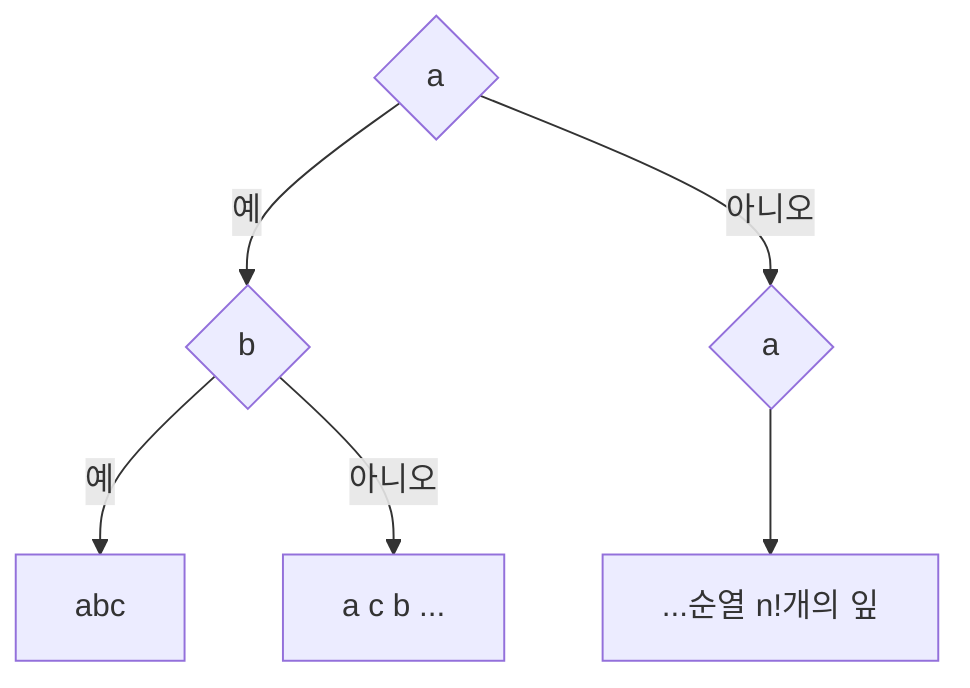

## 정렬은 "비교"만으로 얼마나 빨라질 수 있나

정렬은 거의 모든 시스템의 바닥에 깔려 있습니다. DB 인덱스 빌드, `GROUP BY`, 검색 결과 랭킹, 중복 제거 — 모두 정렬을 깔고 시작합니다. 그런데 두 원소의 대소만 비교할 수 있을 때(`a < b`?), 정렬은 **아무리 영리해도 Ω(n log n)보다 빠를 수 없습니다.** 이 글은 그 벽이 왜 존재하는지, 그리고 그 벽에 가장 가까이 붙은 세 알고리즘 — **퀵·머지·힙** — 이 각각 무엇을 사고 무엇을 파는지를 다룹니다.

## 막대로 보는 정렬 — 자리를 바꾸며 질서가 생긴다

먼저 감을 잡읍시다. 아래는 뒤섞인 막대들이 비교·교환을 거쳐 **키 순으로 자리를 잡는** 과정입니다. 모든 비교 정렬이 결국 하는 일은 이것 — "잘못 놓인 쌍(inversion)"을 줄여 나가는 것입니다.

<div class="sortc5-bars" markdown="0">
<style>
.sortc5-bars{margin:1.4rem 0;overflow-x:auto}
.sortc5-bars svg{width:100%;max-width:640px;height:auto;display:block;margin:0 auto;font-family:inherit}
.sortc5-bars .sub{fill:currentColor;font-size:10px;opacity:.6}
.sortc5-bars rect{fill:#1971c2;opacity:.85}
.sortc5-bars .b0{animation:sortc5b0 7s ease-in-out infinite}
.sortc5-bars .b1{animation:sortc5b1 7s ease-in-out infinite}
.sortc5-bars .b2{animation:sortc5b2 7s ease-in-out infinite}
.sortc5-bars .b3{animation:sortc5b3 7s ease-in-out infinite}
.sortc5-bars .b4{animation:sortc5b4 7s ease-in-out infinite}
.sortc5-bars .b5{animation:sortc5b5 7s ease-in-out infinite}
.sortc5-bars .b6{animation:sortc5b6 7s ease-in-out infinite}
@keyframes sortc5b0{0%,20%{transform:translateX(0)}40%,100%{transform:translateX(360px)}}
@keyframes sortc5b1{0%,20%{transform:translateX(0)}40%,100%{transform:translateX(180px)}}
@keyframes sortc5b2{0%,20%{transform:translateX(0)}40%,100%{transform:translateX(-120px)}}
@keyframes sortc5b3{0%,20%{transform:translateX(0)}40%,100%{transform:translateX(180px)}}
@keyframes sortc5b4{0%,20%{transform:translateX(0)}40%,100%{transform:translateX(-180px)}}
@keyframes sortc5b5{0%,20%{transform:translateX(0)}40%,100%{transform:translateX(-300px)}}
@keyframes sortc5b6{0%,20%{transform:translateX(0)}40%,100%{transform:translateX(-120px)}}
</style>
<svg viewBox="0 0 520 180" role="img" aria-label="뒤섞인 막대들이 비교와 교환을 거쳐 키 순서대로 자리를 잡아 오름차순으로 정렬되는 애니메이션">
  <g transform="translate(40,150)">
    <rect class="b0" x="0"   y="-40"  width="44" height="40"/>
    <rect class="b1" x="60"  y="-70"  width="44" height="70"/>
    <rect class="b2" x="120" y="-100" width="44" height="100"/>
    <rect class="b3" x="180" y="-80"  width="44" height="80"/>
    <rect class="b4" x="240" y="-130" width="44" height="130"/>
    <rect class="b5" x="300" y="-50"  width="44" height="50"/>
    <rect class="b6" x="360" y="-110" width="44" height="110"/>
  </g>
  <text class="sub" x="260" y="174" text-anchor="middle">비교·교환으로 inversion이 사라지면 정렬 완료</text>
</svg>
</div>

## 퀵 정렬 — 평균은 왕, 최악은 함정

**퀵 정렬**은 피벗(pivot)을 하나 골라, 배열을 "피벗보다 작은 것 | 피벗 | 큰 것"으로 **분할(partition)** 한 뒤 좌우를 재귀적으로 정렬합니다. [분할 정복]()의 대표 사례죠.

```python
def quicksort(a, lo, hi):
    if lo >= hi: return
    p = partition(a, lo, hi)   # 피벗 자리 확정, O(hi-lo)
    quicksort(a, lo, p - 1)
    quicksort(a, p + 1, hi)
```

아래는 피벗(빨강)을 기준으로 작은 값은 왼쪽, 큰 값은 오른쪽으로 모이는 파티션 과정입니다.

<div class="sortc5-part" markdown="0">
<style>
.sortc5-part{margin:1.4rem 0;overflow-x:auto}
.sortc5-part svg{width:100%;max-width:600px;height:auto;display:block;margin:0 auto;font-family:inherit}
.sortc5-part .sub{fill:currentColor;font-size:10px;opacity:.6}
.sortc5-part .lbl{fill:#fff;font-size:12px;font-weight:700}
.sortc5-part .piv{fill:#e03131}
.sortc5-part .sm{fill:#2f9e44;opacity:.85}
.sortc5-part .bg{fill:#f08c00;opacity:.85}
.sortc5-part .m0{animation:sortc5p0 6s ease-in-out infinite}
.sortc5-part .m1{animation:sortc5p1 6s ease-in-out infinite}
.sortc5-part .m2{animation:sortc5p2 6s ease-in-out infinite}
.sortc5-part .m3{animation:sortc5p3 6s ease-in-out infinite}
.sortc5-part .m4{animation:sortc5p4 6s ease-in-out infinite}
@keyframes sortc5p0{0%,25%{transform:translateX(0)}50%,100%{transform:translateX(0)}}
@keyframes sortc5p1{0%,25%{transform:translateX(0)}50%,100%{transform:translateX(-60px)}}
@keyframes sortc5p2{0%,25%{transform:translateX(0)}50%,100%{transform:translateX(120px)}}
@keyframes sortc5p3{0%,25%{transform:translateX(0)}50%,100%{transform:translateX(-120px)}}
@keyframes sortc5p4{0%,25%{transform:translateX(0)}50%,100%{transform:translateX(60px)}}
</style>
<svg viewBox="0 0 520 140" role="img" aria-label="피벗을 기준으로 작은 값은 왼쪽 큰 값은 오른쪽으로 모이는 퀵 정렬 파티션 애니메이션">
  <text class="sub" x="20" y="24">피벗(빨강)보다 작으면(초록) 왼쪽, 크면(주황) 오른쪽</text>
  <g transform="translate(40,50)">
    <rect class="bg m1" x="0"   width="50" height="44" rx="4"/><text class="lbl m1" x="25" y="29" text-anchor="middle">7</text>
    <rect class="sm m3" x="60"  width="50" height="44" rx="4"/><text class="lbl m3" x="85" y="29" text-anchor="middle">2</text>
    <rect class="piv m0" x="120" width="50" height="44" rx="4"/><text class="lbl m0" x="145" y="29" text-anchor="middle">5</text>
    <rect class="bg m4" x="180" width="50" height="44" rx="4"/><text class="lbl m4" x="205" y="29" text-anchor="middle">8</text>
    <rect class="sm m2" x="240" width="50" height="44" rx="4"/><text class="lbl m2" x="265" y="29" text-anchor="middle">1</text>
  </g>
  <text class="sub" x="260" y="128" text-anchor="middle">분할 후 피벗은 제 자리 확정 → 좌우를 재귀 정렬</text>
</svg>
</div>

평균 $\Theta(n \log n)$로 **상수가 작아** 실측이 가장 빠른 편입니다(메모리 지역성이 좋고, 추가 공간이 거의 없음). 그러나 **이미 정렬된 입력 + 끝 원소 피벗** 같은 조합에선 분할이 1:n-1로 치우쳐 **최악 $O(n^2)$**. 실무 라이브러리는 이걸 막으려 **랜덤/median-of-three 피벗**을 쓰고, 재귀가 깊어지면 힙 정렬로 전환하는 **introsort**(C++ `std::sort`)를 씁니다. 작은 구간은 삽입 정렬로 마무리합니다.

> 악의적 입력으로 일부러 최악 $O(n^2)$를 유도하는 게 [복잡도 공격]()의 한 형태입니다. "평균만 보면 된다"가 안 통하는 이유.

## 머지 정렬 — 안정적이고 예측 가능한 일꾼

**머지 정렬**은 절반으로 나눠 각각 정렬한 뒤, 두 정렬된 배열을 **병합(merge)** 합니다. 분할은 공짜, 일은 병합에서 일어납니다.



핵심 성질:

- **최악도 $\Theta(n\log n)$ 보장** — 입력이 어떻든 흔들리지 않음. p99 지연이 중요한 곳에서 강점.
- **안정 정렬(stable)** — 같은 키의 상대 순서를 보존(아래에서 설명).
- 대신 **$O(n)$ 추가 공간**이 필요. 이 "병합" 구조가 메모리에 다 안 들어가는 데이터를 디스크에서 정렬하는 [외부 정렬]()의 뼈대가 됩니다.

## 힙 정렬 — 추가 공간 없는 보장된 n log n

[힙(우선순위 큐)]()을 만든 뒤 최댓값을 하나씩 뽑아 뒤에서부터 채웁니다. **제자리(in-place) + 최악 $O(n\log n)$ 보장**이라는 두 마리 토끼를 잡지만, 캐시 지역성이 나빠(힙은 부모-자식이 메모리상 멀리 떨어짐) 실측은 퀵보다 느린 편입니다. 그래서 보통은 단독으로 쓰기보다 introsort의 **안전망**으로 쓰입니다.

| | 퀵 정렬 | 머지 정렬 | 힙 정렬 |
|---|---|---|---|
| 평균 | Θ(n log n) | Θ(n log n) | Θ(n log n) |
| 최악 | **O(n²)** | Θ(n log n) | Θ(n log n) |
| 추가 공간 | O(log n) | **O(n)** | O(1) |
| 안정성 | 불안정 | **안정** | 불안정 |
| 실측 속도 | **최상(상수 작음)** | 중 | 중하(캐시 나쁨) |

## 안정성(stable) — 같은 점수면 누가 앞에?

**안정 정렬**은 키가 같은 두 원소의 **원래 순서를 보존**합니다. "결제액으로 정렬했다가, 다시 등급으로 정렬"하는 **다중 키 정렬**에서 결정적입니다 — 2차 정렬이 1차 정렬 결과를 흩뜨리지 않아야 하니까요.

<div class="sortc5-stable" markdown="0">
<style>
.sortc5-stable{margin:1.4rem 0;overflow-x:auto}
.sortc5-stable svg{width:100%;max-width:620px;height:auto;display:block;margin:0 auto;font-family:inherit}
.sortc5-stable .sub{fill:currentColor;font-size:10px;opacity:.65}
.sortc5-stable .ttl{fill:currentColor;font-size:11px;font-weight:700}
.sortc5-stable .lbl{fill:#fff;font-size:11px;font-weight:700}
.sortc5-stable .a{fill:#1971c2}
.sortc5-stable .b{fill:#1971c2;opacity:.55}
.sortc5-stable .sa{animation:sortc5sa 6s ease-in-out infinite}
.sortc5-stable .sb{animation:sortc5sb 6s ease-in-out infinite}
.sortc5-stable .ua{animation:sortc5ua 6s ease-in-out infinite}
.sortc5-stable .ub{animation:sortc5ub 6s ease-in-out infinite}
@keyframes sortc5sa{0%,30%{transform:translateX(0)}55%,100%{transform:translateX(70px)}}
@keyframes sortc5sb{0%,30%{transform:translateX(0)}55%,100%{transform:translateX(140px)}}
@keyframes sortc5ua{0%,30%{transform:translateX(0)}55%,100%{transform:translateX(140px)}}
@keyframes sortc5ub{0%,30%{transform:translateX(0)}55%,100%{transform:translateX(0)}}
</style>
<svg viewBox="0 0 560 200" role="img" aria-label="같은 키 A1 A2를 정렬할 때 안정 정렬은 A1 A2 순서를 보존하고 불안정 정렬은 뒤집힐 수 있음을 비교하는 애니메이션">
  <text class="sub" x="20" y="20">입력: B · A①· A② (키 A가 둘, 원래 ①→② 순)</text>
  <g transform="translate(40,34)">
    <rect class="a" x="0"  width="56" height="38" rx="5"/><text class="lbl" x="28" y="24" text-anchor="middle">B</text>
    <rect class="a sa" x="66" width="56" height="38" rx="5" fill="#2f9e44"/><text class="lbl sa" x="94" y="24" text-anchor="middle">A①</text>
    <rect class="a sb" x="132" width="56" height="38" rx="5" fill="#2f9e44" opacity=".55"/><text class="lbl sb" x="160" y="24" text-anchor="middle">A②</text>
  </g>
  <text class="ttl" x="40" y="112">안정 정렬 → A①·A② 순서 보존</text>
  <g transform="translate(40,120)">
    <rect class="a sa" x="0"  width="56" height="38" rx="5" fill="#2f9e44"/><text class="lbl sa" x="28" y="24" text-anchor="middle">A①</text>
    <rect class="a sb" x="0"  width="56" height="38" rx="5" fill="#2f9e44" opacity=".55" style="transform:translateX(66px)"/>
  </g>
  <text class="ttl" x="320" y="112" fill="#e03131">불안정 → A②·A① 뒤집힐 수도</text>
  <g transform="translate(320,120)">
    <rect class="ub" x="0"  width="56" height="38" rx="5" fill="#e03131" opacity=".55"/><text class="lbl ub" x="28" y="24" text-anchor="middle">A②</text>
    <rect class="ua" x="0"  width="56" height="38" rx="5" fill="#e03131"/><text class="lbl ua" x="28" y="24" text-anchor="middle">A①</text>
  </g>
</svg>
</div>

퀵·힙은 불안정, 머지는 안정입니다. Java의 `Arrays.sort`는 **객체엔 안정 정렬(TimSort)**, **기본형엔 불안정(듀얼피벗 퀵)** 을 쓰는데, 기본형은 "같은 값"의 구분이 의미 없으니 빠른 쪽을 택한 설계입니다.

## Ω(n log n) — 비교만으로는 넘을 수 없는 벽

왜 비교 정렬은 더 빨라질 수 없을까요? **결정 트리(decision tree)** 로 직관할 수 있습니다. `n`개 원소의 가능한 순열은 $n!$가지. 비교 한 번은 "예/아니오" 분기 하나라, 트리의 한 단계입니다. $n!$개의 잎(정답)을 구분하려면 트리 높이가 최소 $\log_2(n!)$ 이어야 하고,

$$\log_2(n!) = \Theta(n \log n)$$

(스털링 근사). 즉 **최악의 경우 비교 횟수는 Ω(n log n)을 피할 수 없습니다.** 이 벽을 넘으려면 비교를 버리고 키의 구조(자릿수·범위)를 직접 써야 하는데, 그게 다음 글 [계수·기수 정렬]()입니다.



## 프로덕션 함정

| 함정 | 증상 | 해법 |
|------|------|------|
| 퀵 정렬 최악 O(n²) | 정렬된/적대적 입력에 멈춤 | 랜덤·median-of-three 피벗, introsort |
| 깊은 재귀 스택 오버플로 | 큐가 한쪽으로 치우쳐 재귀 깊이 n | 작은 쪽 먼저 재귀 + 큰 쪽 꼬리 반복 |
| 비교자 비일관성 | "Comparison contract violated" 예외 | 추이律 지키는 comparator(a<b, b<c ⇒ a<c) |
| 안정성 오인 | 다중 키 정렬 결과가 뒤섞임 | 안정 정렬 사용 또는 복합 키 한 번에 비교 |
| 대용량 메모리 초과 | 머지의 O(n) 버퍼로 OOM | 외부 정렬(디스크 k-way merge) |

## 면접/리뷰 단골 질문

- **Q. 퀵이 평균 가장 빠른데 왜 최악이 위험한가?** → 분할이 1:n-1로 치우치면 O(n²). 랜덤 피벗·introsort로 방어. 보장이 필요하면 머지/힙.
- **Q. 머지를 언제 쓰나?** → 최악도 n log n 보장 + 안정성 필요 + 외부 정렬. 대신 O(n) 공간.
- **Q. 비교 정렬 하한이 Ω(n log n)인 이유?** → 결정 트리. n!개 순열을 구분하려면 높이 ≥ log₂(n!) = Θ(n log n).
- **Q. 안정 정렬이 중요한 사례?** → 다중 키 정렬(등급→결제액). 2차 정렬이 1차 순서를 보존해야 함.
- **Q. Java Arrays.sort가 타입마다 다른 이유?** → 객체는 안정 TimSort, 기본형은 빠른 듀얼피벗 퀵(같은 값 구분이 무의미).

## 정리

- 비교 정렬은 **퀵(평균 최강·최악 위험)·머지(보장·안정·O(n)공간)·힙(제자리·보장·캐시 약점)** 의 트레이드오프 게임.
- 실무는 이를 섞는다 — **introsort**(퀵+힙+삽입), **TimSort**(머지+삽입, 안정).
- **안정성**은 다중 키 정렬에서 결정적. **Ω(n log n)** 은 비교만으로는 못 넘는 정보이론적 벽.

> [복잡도 분석]()에서 시작한 시리즈가 이제 정렬에 닿았습니다. 다음 글 [선형 시간 정렬]()에서 이 Ω(n log n) 벽을 "비교를 버리고" 우회하는 법을 봅니다.
</content>
