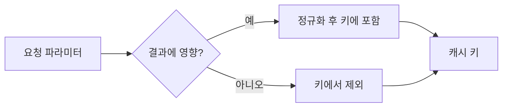

캐시를 붙였는데 히트율이 5%면 캐시가 아니라 부하다. 이 주에는 캐시 효율을 다뤘다. 핵심은 **캐시 키의 입도(granularity)**다. 키에 무엇을 넣고 무엇을 빼느냐가 적중률과 정합성을 동시에 결정한다.

## 핵심 개념 — 키 입도와 적중률의 트레이드오프

캐시 키는 "같은 결과를 내는 입력들을 하나로 묶는 식별자"다. 키 설계는 두 극단 사이의 선택이다.

- **너무 세밀한 키(과한 파라미터)**: 요청 파라미터를 전부 키에 넣으면, 사소하게 다른 요청마다 다른 키가 생긴다. 페이지·정렬·필터·타임스탬프까지 들어가면 키 공간이 폭발해 거의 매번 미스가 난다. 캐시가 채워지기도 전에 entry가 evict된다.
- **너무 거친 키**: 반대로 핵심 파라미터를 키에서 빼면 서로 다른 결과가 같은 키를 공유한다. A 사용자 데이터가 B에게 나가는 **캐시 오염**이 생긴다. 이건 단순 비효율이 아니라 *정합성 사고*다.

정답은 **결과를 결정하는 변수만, 정규화해서** 키에 넣는 것이다. 결과에 영향 없는 파라미터(예: 추적용 파라미터, 무관한 쿼리스트링)는 키에서 배제한다.



## 정규화가 적중률을 만든다

`?category=Book&sort=price` 와 `?sort=price&category=Book` 은 같은 결과지만, 쿼리스트링을 그대로 키로 쓰면 다른 키가 된다. 정규화는 이런 변형을 하나로 모아 적중률을 끌어올린다.

```java
public String buildKey(String category, String sortBy, int page) {
    // 1) 영향 없는 값 제외  2) 소문자/트림 정규화  3) 안정적 순서로 조합
    String c = category == null ? "all" : category.trim().toLowerCase();
    String s = (sortBy == null || sortBy.isBlank()) ? "default" : sortBy.toLowerCase();
    return "product:list:" + c + ":" + s + ":p" + page;   // page는 결과를 바꾸므로 포함
}

@Cacheable(value = "productList", key = "@keyGen.buildKey(#category, #sortBy, #page)")
public List<Product> list(String category, String sortBy, int page) {
    return productRepo.search(category, sortBy, page);
}
```

키에는 namespace prefix(`product:list:`)를 붙인다. 무효화 단위가 명확해지고, Redis 같은 공유 캐시에서 키 충돌을 막는다. 페이지 번호처럼 결과를 실제로 바꾸는 값은 반드시 포함하되, 무한히 큰 페이지는 캐시 대상에서 빼는(예: 앞 N페이지만 캐시) 전략도 함께 쓴다.

## 운영 함정

**함정 1 — 사용자 식별자 누락으로 인한 오염.** 개인화된 결과(내 주문, 내 권한 기반 목록)를 캐시하면서 키에 사용자 식별자를 빼면, 한 사용자의 응답이 다른 사용자에게 그대로 나간다. 개인화 데이터를 캐시할 땐 사용자 범위를 키에 반드시 넣거나, 아예 공유 캐시 대상에서 제외한다.

**함정 2 — 무한 키 공간으로 인한 메모리 폭발.** 검색어·자유 입력 값을 그대로 키에 넣으면 키 종류가 무한대로 늘어 메모리를 잡아먹고 evict이 빈번해진다. 캐시는 "재사용될 만한 키"에만 건다. 일회성에 가까운 키는 캐시 의미가 없다.

## 핵심 요약

- 캐시 키 = 결과를 결정하는 변수만, 정규화해서, namespace prefix와 함께.
- 너무 세밀 → 미스 폭발, 너무 거침 → 오염(정합성 사고).
- 개인화 데이터는 키에 사용자 범위를 넣거나 공유 캐시에서 제외한다.
