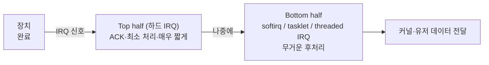

## "디스크에서 한 블록 읽는 동안 CPU는 뭘 하고 있나"

CPU가 한 명령을 처리하는 데 1ns가 안 걸립니다. 그런데 SSD에서 한 블록을 읽는 데는 수십 μs, HDD라면 수 ms가 걸립니다. CPU 시간으로 환산하면 **수십만~수백만 사이클**입니다. 이 차이를 사람 시간으로 바꾸면, CPU의 1초가 디스크에겐 며칠~몇 주입니다.

그러니 질문은 단순합니다. **그 며칠을 CPU가 멍하니 기다려야 하나?** 만약 그렇다면 디스크를 읽을 때마다 컴퓨터 전체가 얼어붙을 겁니다. 이 글은 OS가 "느린 장치"라는 근본 문제를 푸는 세 가지 장치 — **인터럽트**(기다리지 않기), **DMA**(CPU를 데이터 운반에서 빼기), **소프트 IRQ/NAPI**(인터럽트 폭주 막기) — 를 움직이는 그림으로 따라갑니다. 외울 건 없습니다. 매번 "그럼 CPU 사이클이 어디서 낭비되나"만 물으면 됩니다.

## 폴링 vs 인터럽트: 기다림을 없애는 법

장치가 일을 끝냈는지 아는 방법은 두 가지뿐입니다.

- **폴링(polling)**: CPU가 장치의 상태 레지스터를 **계속 들여다봅니다.** "끝났니? 끝났니? 끝났니?" 끝날 때까지 그 루프를 도느라 CPU는 다른 일을 못 합니다(busy-wait). 수 ms짜리 디스크 I/O를 폴링하면 수백만 사이클을 검사에만 태웁니다.
- **인터럽트(interrupt)**: CPU는 I/O를 시작시킨 뒤 **딴 일을 하러 떠납니다.** 장치가 일을 끝내면 **하드웨어 신호(IRQ)** 를 보내 CPU를 강제로 멈추고, CPU는 하던 일을 잠시 제쳐둔 채 인터럽트 핸들러로 점프합니다 — "끝났대" 한 번이면 됩니다.

아래에서 위쪽 폴링은 CPU가 장치를 끝없이 확인하며(<span style="color:#e03131;font-weight:600">빨강=낭비</span>) 다른 일을 전혀 못 하고, 아래쪽 인터럽트는 CPU가 자기 일(<span style="color:#2f9e44;font-weight:600">초록</span>)을 하다가 장치의 완료 신호 **한 번**(<span style="color:#1971c2;font-weight:600">파랑</span>)에만 반응합니다.

<div class="os-io-poll" markdown="0">
<style>
.os-io-poll{margin:1.4rem 0;overflow-x:auto}
.os-io-poll svg{width:100%;max-width:720px;height:auto;display:block;margin:0 auto;font-family:inherit}
.os-io-poll .lane{fill:none;stroke:currentColor;stroke-width:1.4;opacity:.35}
.os-io-poll .lbl{fill:currentColor;font-size:12px;font-weight:600}
.os-io-poll .sub{fill:currentColor;font-size:10px;opacity:.6}
.os-io-poll .chk{fill:#e03131;opacity:0}
.os-io-poll .c1{animation:osiochk 5s linear infinite}
.os-io-poll .c2{animation:osiochk 5s linear infinite .5s}
.os-io-poll .c3{animation:osiochk 5s linear infinite 1s}
.os-io-poll .c4{animation:osiochk 5s linear infinite 1.5s}
.os-io-poll .c5{animation:osiochk 5s linear infinite 2s}
.os-io-poll .c6{animation:osiochk 5s linear infinite 2.5s}
.os-io-poll .c7{animation:osiochk 5s linear infinite 3s}
.os-io-poll .c8{animation:osiochk 5s linear infinite 3.5s}
@keyframes osiochk{0%{opacity:0}3%{opacity:.85}18%{opacity:.85}22%{opacity:0}100%{opacity:0}}
.os-io-poll .work{fill:#2f9e44;opacity:.8}
.os-io-poll .irq{fill:#1971c2;opacity:0;animation:osioirq 5s linear infinite}
@keyframes osioirq{0%,72%{opacity:0}75%{opacity:1}88%{opacity:1}92%{opacity:0}100%{opacity:0}}
.os-io-poll .bolt{fill:#1971c2;opacity:0;animation:osiobolt 5s linear infinite}
@keyframes osiobolt{0%,72%{opacity:0}76%{opacity:1}90%{opacity:1}93%{opacity:0}100%{opacity:0}}
</style>
<svg viewBox="0 0 720 250" role="img" aria-label="폴링은 CPU가 장치를 끊임없이 확인하며 다른 일을 못 하고, 인터럽트는 CPU가 다른 일을 하다 완료 신호 한 번에만 반응하는 비교 애니메이션">
  <text class="lbl" x="20" y="22">폴링 · CPU가 장치를 끝없이 확인 (그동안 아무 일도 못 함)</text>
  <rect class="lane" x="20" y="34" width="680" height="40" rx="6"/>
  <text class="sub" x="30" y="58">CPU</text>
  <rect class="chk c1" x="80"  y="42" width="58" height="24" rx="3"/>
  <rect class="chk c2" x="148" y="42" width="58" height="24" rx="3"/>
  <rect class="chk c3" x="216" y="42" width="58" height="24" rx="3"/>
  <rect class="chk c4" x="284" y="42" width="58" height="24" rx="3"/>
  <rect class="chk c5" x="352" y="42" width="58" height="24" rx="3"/>
  <rect class="chk c6" x="420" y="42" width="58" height="24" rx="3"/>
  <rect class="chk c7" x="488" y="42" width="58" height="24" rx="3"/>
  <rect class="chk c8" x="556" y="42" width="58" height="24" rx="3"/>
  <text class="sub" x="345" y="90" text-anchor="middle" style="opacity:.7">"끝났니?" × 무한 → CPU 사이클 전부 낭비</text>

  <text class="lbl" x="20" y="150">인터럽트 · CPU는 다른 일을 하다 완료 신호 한 번에만 멈춤</text>
  <rect class="lane" x="20" y="162" width="680" height="40" rx="6"/>
  <text class="sub" x="30" y="186">CPU</text>
  <rect class="work" x="80" y="170" width="430" height="24" rx="3"/>
  <text class="sub" x="295" y="187" text-anchor="middle" fill="#fff" style="opacity:.95">다른 프로세스 실행 (유용한 일)</text>
  <rect class="irq" x="556" y="170" width="58" height="24" rx="3"/>
  <text class="sub" x="585" y="187" text-anchor="middle" fill="#fff" style="opacity:1">IRQ!</text>
  <polygon class="bolt" points="585,150 579,164 586,164 580,178 596,160 588,160"/>
  <text class="sub" x="345" y="218" text-anchor="middle" style="opacity:.7">완료 시 단 한 번 트랩 → 핸들러 실행 → 복귀</text>
</svg>
</div>

> **현실 체크 — "그럼 폴링은 항상 나쁜가?"** 아닙니다. 장치가 **극도로 빠르고**(NVMe SSD), I/O가 **쉴 새 없이 쏟아질 때**는 오히려 폴링이 이깁니다. 인터럽트는 매번 모드 전환·핸들러 진입 비용을 치르는데, 초당 수십만 건이면 그 비용이 인터럽트 폭주(interrupt storm)가 되어 CPU를 잡아먹습니다. 그래서 Linux의 NVMe 드라이버에는 `io_poll` 모드가 있고, 네트워크의 NAPI는 트래픽이 몰리면 인터럽트를 끄고 잠시 폴링으로 전환합니다. **"느리고 드물면 인터럽트, 빠르고 잦으면 폴링"** 이 핵심 직관입니다.

## 인터럽트 핸들러는 왜 둘로 쪼개지나 — Top half / Bottom half

인터럽트가 들어오면 CPU는 하던 일을 멈추고 핸들러로 뜁니다. 그런데 핸들러가 **오래 걸리면** 그동안 다른 인터럽트가 막히고(대개 인터럽트 비활성 상태로 실행), 시스템 응답성이 무너집니다. 그래서 리눅스는 인터럽트 처리를 둘로 나눕니다.

- **Top half (하드 IRQ)**: 인터럽트 즉시 실행되는 **최소한의 긴급 처리.** 장치에 "받았다" ACK를 보내고, 데이터를 안전한 곳에 옮길 준비만 한 뒤 빠르게 빠져나옵니다. 인터럽트가 막히는 구간이라 **최대한 짧아야** 합니다.
- **Bottom half (소프트 IRQ / tasklet / threaded IRQ)**: 무거운 후처리(패킷 프로토콜 처리, 버퍼 복사 등)는 인터럽트를 다시 켠 상태에서 **나중에** 처리합니다. `softirq`, `tasklet`, 그리고 커널 스레드로 도는 `threaded IRQ`가 그 수단입니다.



이 분리가 "인터럽트는 짧게, 일은 나중에"라는 커널 설계의 황금률입니다. `/proc/interrupts`로 어느 IRQ가 어느 CPU에서 얼마나 발생하는지, `/proc/softirqs`로 bottom half 부하를 볼 수 있습니다.

## PIO vs DMA: CPU를 데이터 운반에서 빼다

인터럽트로 "기다림"은 없앴지만, 문제가 하나 더 남습니다. **데이터를 누가 옮기나?** 디스크에서 4KB를 읽어 메모리에 넣는다고 합시다.

- **PIO (Programmed I/O)**: CPU가 장치 레지스터에서 한 워드씩 읽어 메모리에 쓰기를 반복합니다. 4KB면 CPU가 **수천 번** 직접 복사합니다 — 데이터 운반에 CPU를 통째로 묶어 두는 셈입니다.
- **DMA (Direct Memory Access)**: CPU는 DMA 컨트롤러에게 "이 장치에서 이만큼을 이 메모리 주소로 옮겨라"라고 **명령만** 내립니다. 그러면 DMA 컨트롤러가 **CPU를 거치지 않고** 장치↔메모리를 직접 전송하고, **다 끝나면 인터럽트 한 번**으로 알립니다. 그동안 CPU는 다른 일을 합니다.

아래에서 데이터 블록들이 **CPU를 우회**해 장치에서 메모리로 직접 흐르고(<span style="color:#2f9e44;font-weight:600">초록</span>), 전송이 끝난 뒤에야 완료 인터럽트(<span style="color:#1971c2;font-weight:600">파랑</span>)가 CPU로 올라갑니다. CPU 박스가 전송 내내 "다른 일 중"인 점을 보세요.

<div class="os-io-dma" markdown="0">
<style>
.os-io-dma{margin:1.4rem 0;overflow-x:auto}
.os-io-dma svg{width:100%;max-width:720px;height:auto;display:block;margin:0 auto;font-family:inherit}
.os-io-dma .bx{fill:none;stroke:currentColor;stroke-width:1.5;opacity:.55}
.os-io-dma .lbl{fill:currentColor;font-size:11px;font-weight:600}
.os-io-dma .sub{fill:currentColor;font-size:9.5px;opacity:.6}
.os-io-dma .path{stroke:currentColor;opacity:.18;stroke-width:1.6;fill:none;stroke-dasharray:4 4}
.os-io-dma .blk{fill:#2f9e44}
.os-io-dma .d1{animation:osiodma 4.5s linear infinite}
.os-io-dma .d2{animation:osiodma 4.5s linear infinite .7s}
.os-io-dma .d3{animation:osiodma 4.5s linear infinite 1.4s}
.os-io-dma .d4{animation:osiodma 4.5s linear infinite 2.1s}
.os-io-dma .blk{offset-path:path('M 150,150 L 330,150 L 330,150 L 560,150');}
@keyframes osiodma{0%{offset-distance:0%;opacity:0}6%{opacity:1}94%{opacity:1}100%{offset-distance:100%;opacity:0}}
.os-io-dma .cpu{fill:currentColor;opacity:.06;stroke:currentColor;stroke-width:1.5}
.os-io-dma .busy{fill:#888;opacity:0;animation:osiobusy 4.5s linear infinite}
@keyframes osiobusy{0%,72%{opacity:.5}100%{opacity:.5}}
.os-io-dma .done{stroke:#1971c2;stroke-width:2.4;fill:none;opacity:0;animation:osiodone 4.5s linear infinite}
.os-io-dma .donetok{fill:#1971c2;opacity:0;animation:osiodonetok 4.5s linear infinite}
.os-io-dma .donetok{offset-path:path('M 470,128 L 470,70 L 360,70');}
@keyframes osiodonetok{0%,80%{offset-distance:0%;opacity:0}83%{opacity:1}97%{offset-distance:100%;opacity:1}100%{opacity:0}}
@keyframes osiodone{0%,80%{opacity:0}84%{opacity:1}100%{opacity:1}}
</style>
<svg viewBox="0 0 720 220" role="img" aria-label="DMA 전송에서 데이터가 CPU를 우회해 장치에서 메모리로 직접 흐르고, 전송 완료 후에야 완료 인터럽트가 CPU로 통지되는 애니메이션">
  <rect class="cpu" x="270" y="36" width="180" height="48" rx="10"/>
  <text class="lbl" x="360" y="56" text-anchor="middle">CPU</text>
  <text class="sub" x="360" y="72" text-anchor="middle">전송 내내 다른 일 실행</text>

  <rect class="bx" x="40" y="126" width="110" height="48" rx="8"/>
  <text class="lbl" x="95" y="146" text-anchor="middle">장치</text>
  <text class="sub" x="95" y="162" text-anchor="middle">디스크·NIC</text>

  <rect class="bx" x="300" y="126" width="120" height="48" rx="8" style="stroke:#f08c00"/>
  <text class="lbl" x="360" y="146" text-anchor="middle" style="fill:#f08c00">DMA 컨트롤러</text>
  <text class="sub" x="360" y="162" text-anchor="middle">CPU 대신 운반</text>

  <rect class="bx" x="560" y="126" width="120" height="48" rx="8"/>
  <text class="lbl" x="620" y="146" text-anchor="middle">메모리(RAM)</text>
  <text class="sub" x="620" y="162" text-anchor="middle">목적지 버퍼</text>

  <path class="path" d="M 150,150 L 560,150"/>
  <rect class="blk d1" x="-7" y="-7" width="14" height="14" rx="2"/>
  <rect class="blk d2" x="-7" y="-7" width="14" height="14" rx="2"/>
  <rect class="blk d3" x="-7" y="-7" width="14" height="14" rx="2"/>
  <rect class="blk d4" x="-7" y="-7" width="14" height="14" rx="2"/>

  <path class="done" d="M 470,128 L 470,70 L 366,70"/>
  <circle class="donetok" r="6"/>
  <text class="sub" x="470" y="100" text-anchor="middle" style="opacity:.7">전송 끝 → 완료 IRQ 한 번</text>
  <text class="sub" x="360" y="206" text-anchor="middle" style="opacity:.7">데이터는 CPU를 거치지 않는다 — CPU는 명령만 내리고, 완료 통지만 받는다</text>
</svg>
</div>

> **현실 체크 — 네트워크가 빠른 진짜 이유.** 10Gbps NIC가 초당 수백만 패킷을 받는데 패킷마다 CPU가 복사하고 인터럽트를 걸면 CPU는 그 일만 하다 끝납니다. 그래서 현대 NIC는 **DMA로 패킷을 메모리에 직접 꽂고**, **인터럽트를 모아서**(coalescing) 걸며, NAPI로 폭주 시 폴링으로 전환합니다. 더 나아가 zero-copy(`sendfile`, `splice`)·커널 우회(DPDK, io_uring)까지 가는 이유가 전부 "CPU를 데이터 경로에서 빼라"는 한 문장입니다.

## 인터럽트 폭주를 길들이기 — Coalescing과 NAPI

빠른 장치에서 인터럽트가 너무 자주 오면, 처리보다 **인터럽트 진입/복귀 오버헤드**가 더 커집니다(live-lock에 가까운 상태). 두 가지로 길들입니다.

- **인터럽트 합치기(coalescing)**: 장치가 패킷 하나마다가 아니라, N개가 모이거나 일정 시간이 지나면 인터럽트를 **한 번** 겁니다. 지연(latency)을 약간 희생해 처리량(throughput)을 얻는 전형적 트레이드오프입니다(`ethtool -c`로 조정).
- **NAPI (New API)**: 트래픽이 몰리면 NIC 인터럽트를 **끄고** 커널이 잠시 **폴링**으로 한꺼번에 긁어옵니다. 한가해지면 다시 인터럽트로 돌아갑니다 — "느리고 드물면 인터럽트, 빠르고 잦으면 폴링"을 자동 전환으로 구현한 것입니다.

마지막으로 장치의 두 부류만 짚고 갑시다. **블록 디바이스**(디스크·SSD)는 고정 크기 블록 단위로 임의 접근하고 보통 페이지 캐시·I/O 스케줄러를 거칩니다(다음 글 주제). **캐릭터 디바이스**(터미널·키보드·`/dev/random`)는 바이트 스트림으로 순차 처리합니다. 둘 다 결국 **디바이스 드라이버**가 위의 인터럽트·DMA 메커니즘을 장치별로 구현해 커널의 통일된 인터페이스 뒤에 숨깁니다.

## 직접 들여다보기

```bash
# 어떤 IRQ가 어느 CPU에서 몇 번 발생했나 (장치별 인터럽트 분포)
cat /proc/interrupts
# bottom half(소프트 IRQ) 부하 — NET_RX/NET_TX/TIMER 등
cat /proc/softirqs
# NIC 인터럽트 합치기 설정 보기/조정 (지연↔처리량 트레이드오프)
ethtool -c eth0
# 블록 장치 I/O 통계 — await(대기), %util(포화도)
iostat -x 1
# CPU별 인터럽트 처리 비율 (%irq, %soft)
mpstat -P ALL 1
# 특정 IRQ를 특정 CPU에 고정 (인터럽트 친화도)
cat /proc/irq/<N>/smp_affinity
```

`%soft`(softirq)나 특정 IRQ가 한 CPU에 쏠려 있다면, 그 코어가 인터럽트 처리로 포화된 것입니다 — `irqbalance`나 RSS/RPS로 분산하는 게 네트워크 성능 튜닝의 단골입니다.

## 면접/리뷰 단골 질문

- **Q. 폴링과 인터럽트는 언제 각각 쓰나?** → 느리고 드문 I/O는 인터럽트(기다리지 않고 CPU를 양보). 빠르고 잦은 I/O(NVMe·고속 NIC)는 인터럽트 오버헤드가 커져 폴링/NAPI가 유리. 절충이 NAPI·coalescing.
- **Q. 인터럽트 핸들러를 top/bottom half로 나누는 이유는?** → top half는 인터럽트가 막힌 채 실행되므로 ACK 등 최소 처리만 빠르게. 무거운 일은 인터럽트를 켠 상태에서 bottom half(softirq/tasklet/threaded IRQ)로 미뤄 응답성 보장.
- **Q. DMA가 없으면 무엇이 문제인가?** → CPU가 PIO로 데이터를 한 워드씩 직접 복사해야 해서, 대용량 전송 동안 CPU가 운반에 묶인다. DMA는 CPU를 데이터 경로에서 빼고 완료 인터럽트만 받게 한다.
- **Q. 인터럽트와 시스템콜의 공통점·차이는?** → 둘 다 커널로 진입하는 트랩. 시스템콜은 소프트웨어가 자발적으로(syscall), 인터럽트는 하드웨어가 비자발적으로 발생시킨다.
- **Q. 인터럽트 storm이 뭐고 어떻게 막나?** → 인터럽트가 너무 잦아 처리 오버헤드가 시스템을 잡아먹는 상태. coalescing(모아서 한 번), NAPI(폴링 전환), 친화도 분산으로 완화.

## 정리

- 장치는 CPU보다 수십만~백만 배 느리다 → 핵심 질문은 늘 "CPU 사이클이 어디서 낭비되나".
- **인터럽트**는 기다림(busy-wait)을 없앤다: CPU는 다른 일을 하다 완료 신호 한 번에만 반응한다.
- 핸들러는 **top half(짧게)/bottom half(나중에)** 로 쪼개 응답성을 지킨다.
- **DMA**는 CPU를 데이터 운반에서 뺀다: 컨트롤러가 장치↔메모리를 직접 전송하고 완료 인터럽트만 올린다.
- 빠른 장치에선 인터럽트가 되레 독 → **coalescing·NAPI·폴링**으로 길들인다. 모든 처방의 한 문장은 "CPU를 데이터 경로에서 빼라".

> 다음 글: DMA로 메모리에 올라온 데이터는 어디에 머무는가 — 같은 파일을 두 번째 읽을 때 빨라지는 비밀, [블록 I/O와 페이지 캐시]()로 이어집니다. 인터럽트·시스템콜이 커널로 들어가는 트랩이라는 출발점은 [1편]()에서 다뤘습니다.
