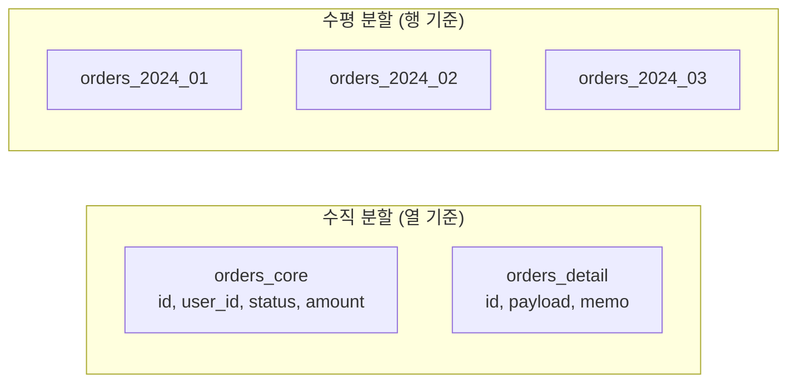
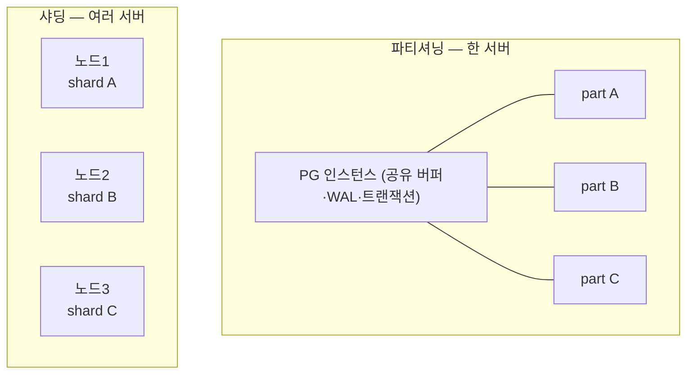
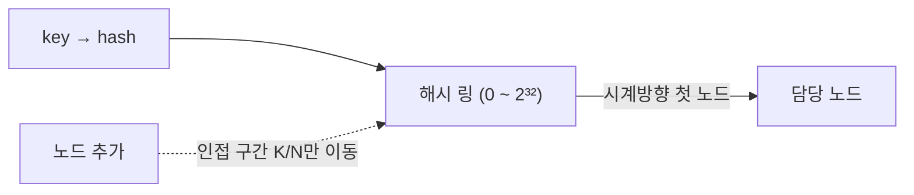

## "인덱스도 잘 탔는데 왜 점점 느려지지?"

주문 테이블이 3억 건을 넘기자 이상한 일이 벌어집니다. `EXPLAIN`을 보면 인덱스 스캔을 제대로 타는데도 응답이 느려지고, 야간 배치가 끝나지 않습니다. `VACUUM`은 몇 시간씩 돌고, 인덱스 하나가 디스크 200GB를 먹습니다. 한 달 치 데이터만 지우려고 `DELETE`를 날렸더니 테이블이 락에 잠기고 [dead tuple]()이 폭증합니다.

문제는 쿼리가 아니라 **테이블 그 자체가 너무 커진 것**입니다. B-Tree 인덱스의 높이가 한 단 더 늘고, 버퍼 풀에 인덱스 상위 노드가 다 안 들어오고, 통계는 거대한 분포를 요약하느라 부정확해집니다. [앞 글]()에서 본 복제는 "장애 대비·읽기 확장"을 주지만, **한 테이블·한 서버의 한계**는 풀지 못합니다. 복제본 10대를 둬도 각 노드는 똑같이 3억 건짜리 테이블을 들고 있으니까요.

이 글은 거대한 데이터를 **쪼개는** 두 가지 길 — 한 서버 안에서 쪼개는 **파티셔닝**과 여러 서버로 쪼개는 **샤딩** — 을 PostgreSQL 내부 동작 수준에서 따라갑니다. 그리고 샤딩이 왜 "마지막 수단"인지, 샤드 키 하나를 잘못 고르면 무슨 지옥이 열리는지를 봅니다.

## 먼저: 수직 분할 vs 수평 분할

큰 테이블을 쪼개는 방향은 두 가지입니다.

- **수직 분할(vertical partitioning)**: **열(column)** 기준으로 쪼갠다. 자주 읽는 좁은 컬럼(`id, status, amount`)과 가끔 쓰는 큰 컬럼(`description text`, `payload jsonb`)을 다른 테이블로 분리. 효과는 [페이지·튜플 글]()의 관점에서 분명합니다 — 한 페이지(8KB)에 더 많은 행이 들어가 같은 I/O로 더 많은 행을 읽고, 핫한 컬럼만 캐시에 올라갑니다. PG는 큰 값을 자동으로 TOAST로 떼어내므로 일부는 자동이지만, 접근 패턴이 명확히 갈리면 명시적 분리가 유효합니다.
- **수평 분할(horizontal partitioning)**: **행(row)** 기준으로 쪼갠다. 같은 스키마를 유지한 채 행을 여러 조각(파티션)으로 나눈다. "2024년 1월 주문", "2024년 2월 주문" 식으로. 우리가 보통 "파티셔닝"이라 부르는 건 이쪽이고, 이걸 여러 **서버**로 흩으면 샤딩이 됩니다.



이 글의 주인공은 수평 분할입니다.

## PostgreSQL 선언적 파티셔닝

PG 10부터 **선언적 파티셔닝(declarative partitioning)**을 지원합니다. 부모 테이블은 데이터를 직접 갖지 않는 **라우팅 껍데기**이고, 실제 행은 자식 파티션(각각이 독립적인 [힙]())에 들어갑니다.

```sql
-- 부모: PARTITION BY 로 분할 방식 선언 (자체 저장 없음)
CREATE TABLE orders (
    id        bigint,
    user_id   bigint,
    created_at timestamptz NOT NULL,
    amount    numeric
) PARTITION BY RANGE (created_at);

-- 자식 파티션: 경계를 명시
CREATE TABLE orders_2024_01 PARTITION OF orders
    FOR VALUES FROM ('2024-01-01') TO ('2024-02-01');
CREATE TABLE orders_2024_02 PARTITION OF orders
    FOR VALUES FROM ('2024-02-01') TO ('2024-03-01');
```

세 가지 분할 전략이 있습니다.

| 전략 | 키 의미 | 전형적 용도 |
|------|---------|-------------|
| **RANGE** | 값의 범위(`FROM ... TO`) | 시계열(날짜), 순번 — 오래된 파티션 통째 삭제(`DROP`)가 핵심 이점 |
| **LIST** | 명시된 값 집합 | 지역 코드, 카테고리, 테넌트 ID 등 이산값 |
| **HASH** | `hash(key) mod N` | 자연스러운 범위가 없을 때 균등 분산(`MODULUS m, REMAINDER r`) |

```sql
-- LIST
CREATE TABLE logs_kr PARTITION OF logs FOR VALUES IN ('KR', 'JP');
-- HASH (4개로 균등 분산)
CREATE TABLE users_h0 PARTITION OF users FOR VALUES WITH (MODULUS 4, REMAINDER 0);
```

### 파티션 프루닝 — 안 볼 파티션은 아예 안 본다

파티셔닝의 진짜 성능 이점은 **partition pruning**입니다. `WHERE` 조건에 파티션 키가 있으면 플래너(또는 실행기)가 **관련 없는 파티션을 통째로 스킵**합니다. 12개월치 12파티션 중 한 달만 보면 됩니다.

```sql
EXPLAIN SELECT * FROM orders WHERE created_at >= '2024-02-10' AND created_at < '2024-02-20';
-- Append
--   ->  Index Scan on orders_2024_02   ← 단 한 파티션만 스캔
```

프루닝에는 두 종류가 있습니다. **plan-time pruning**은 플래너가 상수 조건으로 미리 잘라내고, **execution-time pruning**(`enable_partition_pruning`, PG 11+)은 `$1` 같은 파라미터나 조인 결과로 런타임에 결정되는 값에 대해 실행 중 잘라냅니다. 후자가 `EXPLAIN`엔 모든 파티션이 보이지만 `ANALYZE`엔 `never executed`로 찍히는 이유입니다.

<div class="psh-route" markdown="0">
<style>
.psh-route{margin:1.6rem 0;overflow-x:auto}
.psh-route svg{width:100%;max-width:720px;height:auto;display:block;margin:0 auto;font-family:inherit}
.psh-route .lbl{fill:currentColor;font-size:12px;font-weight:600}
.psh-route .sub{fill:currentColor;font-size:10px;opacity:.6}
.psh-route .bx{fill:none;stroke:currentColor;stroke-width:1.4;opacity:.5}
.psh-route .hit{fill:#2f9e44;opacity:0;animation:pshHit 6s ease-in-out infinite}
.psh-route .prune{stroke:#e03131;stroke-width:2;opacity:0;animation:pshPrune 6s ease-in-out infinite}
.psh-route .router{fill:#1971c2;opacity:.18;stroke:#1971c2;stroke-width:1.4}
.psh-route .row{fill:#1971c2;offset-path:path('M 70,150 L 250,150');animation:pshRow 6s ease-in-out infinite}
@keyframes pshRow{0%{offset-distance:0%;opacity:0}6%{opacity:1}38%{offset-distance:100%;opacity:1}44%,100%{offset-distance:100%;opacity:0}}
@keyframes pshHit{0%,46%{opacity:0}54%,92%{opacity:.85}100%{opacity:0}}
@keyframes pshPrune{0%,46%{opacity:0}54%,92%{opacity:.9}100%{opacity:0}}
</style>
<svg viewBox="0 0 700 300" role="img" aria-label="created_at 키를 가진 행이 RANGE 파티션 라우터를 지나 2월 파티션으로만 들어가고, 쿼리 시 나머지 파티션이 프루닝으로 제외되는 과정 애니메이션">
  <text class="lbl" x="20" y="40">WHERE created_at ∈ 2024-02</text>
  <rect class="router" x="250" y="120" width="120" height="60" rx="6"/>
  <text class="lbl" x="310" y="146" text-anchor="middle">RANGE</text>
  <text class="sub" x="310" y="164" text-anchor="middle">라우팅/프루닝</text>
  <circle class="row" r="7"/>
  <text class="sub" x="60" y="135">행/쿼리</text>

  <rect class="bx" x="440" y="40" width="200" height="40" rx="4"/>
  <text class="lbl" x="455" y="65">orders_2024_01</text>
  <line class="prune" x1="450" y1="50" x2="630" y2="70"/>

  <rect class="bx" x="440" y="130" width="200" height="40" rx="4"/>
  <rect class="hit" x="441" y="131" width="198" height="38" rx="4"/>
  <text class="lbl" x="455" y="155">orders_2024_02 ✓</text>

  <rect class="bx" x="440" y="220" width="200" height="40" rx="4"/>
  <text class="lbl" x="455" y="245">orders_2024_03</text>
  <line class="prune" x1="450" y1="230" x2="630" y2="250"/>

  <line class="bx" x1="370" y1="150" x2="440" y2="60"/>
  <line class="bx" x1="370" y1="150" x2="440" y2="150"/>
  <line class="bx" x1="370" y1="150" x2="440" y2="240"/>
  <text class="sub" x="540" y="290" text-anchor="middle">초록=스캔 대상 · 빨강 빗금=프루닝으로 제외</text>
</svg>
</div>

### 로컬 인덱스 vs 글로벌 인덱스 — PG의 중요한 제약

여기서 RDBMS 출신이 자주 데이는 지점입니다. PG의 파티션 인덱스는 **로컬 인덱스**입니다. 부모에 `CREATE INDEX`를 걸면 각 파티션마다 **독립된 인덱스**가 생기고, 각 인덱스는 자기 파티션의 [ctid]()만 가리킵니다. 글로벌(파티션 전체를 한 인덱스로 묶는) 인덱스는 PG에 없습니다.

이게 만드는 결정적 제약: **UNIQUE 제약과 PRIMARY KEY는 반드시 파티션 키를 포함해야 합니다.**

```sql
-- 실패: id만으로는 전역 유일성을 로컬 인덱스로 보장할 수 없다
ALTER TABLE orders ADD PRIMARY KEY (id);
-- ERROR: unique constraint on partitioned table must include all partitioning columns

-- 성공: 파티션 키(created_at)를 포함
ALTER TABLE orders ADD PRIMARY KEY (id, created_at);
```

왜? 로컬 인덱스만 있으면 "`id=42`가 전체 파티션을 통틀어 유일한가"를 한 인덱스로 검사할 수 없습니다. 각 파티션의 로컬 인덱스를 다 뒤져야 하는데, 그건 유일성 제약의 비용 모델과 맞지 않습니다. 그래서 PG는 파티션 키를 유일 키에 포함시켜 "각 파티션 안에서만 유일하면 전체에서도 유일"하도록 강제합니다. 이 제약은 시퀀스 기반 글로벌 ID를 쓰는 설계와 충돌하므로 파티셔닝 도입 전에 반드시 검토해야 합니다.

## 파티셔닝(한 서버) vs 샤딩(여러 서버)

여기서 선을 그어야 합니다. **파티셔닝**은 지금까지 본 것처럼 **한 서버 안**에서 한 논리 테이블을 여러 물리 조각으로 나누는 것입니다. 모든 파티션이 같은 PG 인스턴스, 같은 버퍼 풀, 같은 [WAL](), 같은 트랜잭션 매니저를 공유합니다. 그래서 **트랜잭션·외래키·조인이 평소처럼 동작**합니다.

**샤딩**은 그 조각들을 **여러 서버(노드)로 흩는** 것입니다. 각 샤드는 독립된 DB 인스턴스라 자기 버퍼 풀·WAL·트랜잭션을 갖습니다. 단일 서버의 CPU·메모리·디스크·쓰기 처리량 한계를 넘는 유일한 길이지만, 대가가 큽니다.



| 구분 | 파티셔닝(한 서버) | 샤딩(여러 서버) |
|------|------------------|-----------------|
| 한계 돌파 | 큰 테이블 관리·프루닝 | CPU/메모리/쓰기 처리량/디스크 |
| 트랜잭션 | 일반 ACID | 교차 샤드는 [2PC/분산 트랜잭션]() 필요 |
| 조인 | 일반 조인 | 교차 샤드 조인은 애플리케이션/미들웨어가 fan-out |
| 유일성 | 파티션 키 포함 시 보장 | 전역 유일 ID는 별도 설계(스노우플레이크 등) |
| 운영 난도 | 중 | 상 (재분배·리밸런싱·라우팅) |

**순서가 중요합니다.** "느리다 → 인덱스 → 쿼리 튜닝 → 읽기 복제([15편]()) → 수직 분할 → 파티셔닝 → 그래도 안 되면 샤딩." 샤딩은 분산 트랜잭션·교차 샤드 조인이라는 복잡도를 영구히 짊어지므로 **정말 마지막에** 갑니다.

## 샤드 키 — 한 번 잘못 고르면 평생 후회

샤딩의 모든 고통은 **샤드 키 선택**으로 귀결됩니다. 샤드 키는 "이 행이 어느 노드에 사는가"를 결정합니다. 세 가지 고통이 여기서 나옵니다.

### 고통 1 — 핫스팟(hotspot)

키가 한쪽으로 쏠리면 한 노드만 불타고 나머지는 논다. 전형적 실수:

- **단조 증가 키(타임스탬프·auto-increment)로 RANGE 샤딩** → 항상 "마지막 샤드"에만 쓰기가 몰린다(write hotspot).
- **편중된 분포**(예: 거대 테넌트 하나가 트래픽의 50%) → 그 테넌트가 사는 샤드만 과부하.

<div class="psh-hot" markdown="0">
<style>
.psh-hot{margin:1.6rem 0;overflow-x:auto}
.psh-hot svg{width:100%;max-width:720px;height:auto;display:block;margin:0 auto;font-family:inherit}
.psh-hot .lbl{fill:currentColor;font-size:11px;font-weight:600}
.psh-hot .sub{fill:currentColor;font-size:10px;opacity:.6}
.psh-hot .node{fill:none;stroke:currentColor;stroke-width:1.4;opacity:.5}
.psh-hot .barBad{fill:#e03131}
.psh-hot .b1{animation:pshB1 5s ease-in-out infinite}
.psh-hot .b2{animation:pshB2 5s ease-in-out infinite}
.psh-hot .b3{animation:pshB3 5s ease-in-out infinite}
.psh-hot .barOk{fill:#2f9e44}
.psh-hot .g1{animation:pshG 5s ease-in-out infinite}
@keyframes pshB1{0%{height:0;y:200}100%{height:140;y:60}}
@keyframes pshB2{0%{height:0;y:200}100%{height:14;y:186}}
@keyframes pshB3{0%{height:0;y:200}100%{height:14;y:186}}
@keyframes pshG{0%{height:0;y:200}100%{height:52;y:148}}
</style>
<svg viewBox="0 0 700 260" role="img" aria-label="나쁜 샤드 키는 한 노드에 부하가 쏠려 핫스팟이 생기고, 좋은 샤드 키는 세 노드에 부하가 고르게 분산되는 비교 애니메이션">
  <text class="lbl" x="30" y="24">단조 증가 키 (핫스팟)</text>
  <rect class="barBad b1" x="60" y="200" width="44" height="0"/>
  <rect class="barBad b2" x="130" y="200" width="44" height="0"/>
  <rect class="barBad b3" x="200" y="200" width="44" height="0"/>
  <text class="sub" x="82" y="216" text-anchor="middle">N1</text>
  <text class="sub" x="152" y="216" text-anchor="middle">N2</text>
  <text class="sub" x="222" y="216" text-anchor="middle">N3</text>

  <text class="lbl" x="430" y="24">해시 분산 (균등)</text>
  <rect class="barOk g1" x="450" y="200" width="44" height="0"/>
  <rect class="barOk g1" x="520" y="200" width="44" height="0"/>
  <rect class="barOk g1" x="590" y="200" width="44" height="0"/>
  <text class="sub" x="472" y="216" text-anchor="middle">N1</text>
  <text class="sub" x="542" y="216" text-anchor="middle">N2</text>
  <text class="sub" x="612" y="216" text-anchor="middle">N3</text>
  <line class="node" x1="40" y1="200" x2="260" y2="200"/>
  <line class="node" x1="430" y1="200" x2="650" y2="200"/>
  <text class="sub" x="350" y="250" text-anchor="middle">같은 부하, 키 선택만 다르다</text>
</svg>
</div>

해법은 보통 **해시 샤딩**(키를 해시해 분산)이나 합성 키(`tenant_id + bucket`)로 쏠림을 깨는 것입니다. 단, 해시 샤딩은 범위 스캔을 못 하는 대가가 있습니다(연속한 키가 다른 샤드에 흩어짐).

### 고통 2 — 재분배(resharding)

노드를 4대에서 5대로 늘릴 때, 단순 모듈로(`hash(key) mod N`)를 쓰면 N이 바뀌는 순간 **거의 모든 키의 소속이 바뀝니다**. `mod 4`에서 `mod 5`로 가면 키의 약 80%가 다른 노드로 이사해야 하고, 그 사이 대량 데이터 이동·캐시 무효화·일시적 불일치가 발생합니다.

### 고통 3 — 교차 샤드 조인·트랜잭션

샤드 키와 다른 기준으로 묻는 쿼리는 **모든 샤드에 부채살(fan-out)**로 날아가 결과를 모아야 합니다(scatter-gather). 두 샤드에 걸친 트랜잭션은 [2PC]()가 필요해 코디네이터 단일 실패·blocking 위험을 떠안습니다. 그래서 샤드 키는 **가장 흔한 쿼리가 단일 샤드로 떨어지도록**(예: 멀티테넌트는 `tenant_id`) 골라야 하고, 때로는 [정규화를 일부러 깨서]() 조인을 피하는 반정규화가 정당화됩니다.

## 일관된 해싱(consistent hashing)

고통 2(재분배)를 누그러뜨리는 핵심 아이디어가 **consistent hashing**입니다. 키와 노드를 같은 해시 공간(0 ~ 2³²−1을 잇는 가상의 **링**) 위에 올리고, 각 키는 **링을 시계 방향으로 돌다 처음 만나는 노드**가 담당합니다.

노드를 하나 추가/제거하면 그 노드와 직전 노드 사이의 키만 이동합니다. 평균적으로 **`K/N` 만큼의 키만** 재배치됩니다(K=키 수, N=노드 수) — 모듈로 방식의 "거의 전부 이동"과 대조적입니다. 분포 편향을 줄이려 각 물리 노드를 링 위에 여러 **가상 노드(vnode)**로 흩뿌립니다. Cassandra·DynamoDB·memcached 클러스터·Redis Cluster(해시 슬롯 변형)가 이 계열입니다.



## 면접/리뷰 단골 질문

- **Q. 파티셔닝과 샤딩의 차이는?** → 파티셔닝은 한 서버 안에서 한 테이블을 물리 조각으로 나누는 것(트랜잭션·조인 정상). 샤딩은 그 조각을 여러 서버로 흩는 것(교차 샤드 트랜잭션은 2PC, 조인은 scatter-gather). 샤딩은 단일 서버 한계를 넘는 마지막 수단.
- **Q. partition pruning이 뭔가?** → `WHERE`에 파티션 키가 있으면 관련 없는 파티션을 통째로 스킵하는 최적화. plan-time(상수)과 execution-time(파라미터/조인값) 두 종류. 파티션 키 없는 조건은 모든 파티션을 스캔하니 키 설계가 중요.
- **Q. PG에서 파티션 테이블 PK에 왜 파티션 키를 넣어야 하나?** → PG는 로컬 인덱스만 있고 글로벌 유일 인덱스가 없어, 파티션 키를 포함해야 "각 파티션 안 유일 = 전체 유일"이 성립하기 때문.
- **Q. RANGE vs HASH 샤딩 트레이드오프?** → RANGE는 범위 스캔·오래된 데이터 DROP에 강하나 단조 키면 핫스팟. HASH는 균등 분산이지만 범위 스캔 불가(연속 키가 흩어짐).
- **Q. `hash(key) mod N`의 문제와 해법은?** → 노드 수 N이 바뀌면 대부분 키가 재배치됨. consistent hashing(링 + 가상 노드)으로 평균 K/N만 이동하게 한다.
- **Q. 샤드 키는 어떻게 고르나?** → 가장 흔한 쿼리가 단일 샤드로 떨어지고(교차 샤드 회피), 분포가 고르며(핫스팟 회피), 잘 안 바뀌는 컬럼. 멀티테넌트면 보통 tenant_id.

## 정리

- 큰 테이블은 **수직(열)/수평(행)**으로 쪼갠다. 우리가 말하는 파티셔닝·샤딩은 수평 분할.
- PG 선언적 파티셔닝은 **RANGE/LIST/HASH**. 진짜 이점은 **partition pruning**(안 볼 파티션은 안 본다)과 오래된 파티션 통째 DROP.
- PG는 **로컬 인덱스만** 있다 → UNIQUE/PK는 **파티션 키를 포함**해야 한다(글로벌 유일 인덱스 없음).
- **파티셔닝=한 서버**(트랜잭션·조인 정상), **샤딩=여러 서버**(교차 샤드 트랜잭션·조인은 고통). 샤딩은 마지막 수단.
- 샤드 키 3대 고통: **핫스팟·재분배·교차 샤드 조인/트랜잭션**. 재분배 완화는 **consistent hashing**(링+가상 노드, K/N만 이동).

> 다음 글: 샤딩이 강요하는 "여러 노드가 하나처럼 합의하기" — [분산 트랜잭션·CAP·합의]()로 이어집니다.
</content>
</invoke>
