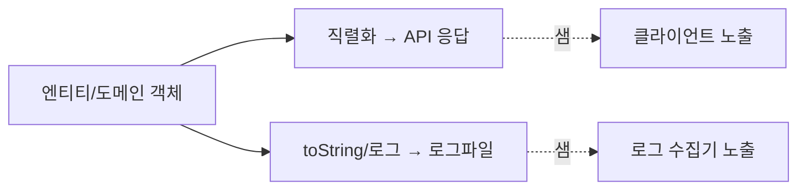

응답 JSON에 주민번호 전체가 찍혀 나가거나, 에러 로그에 카드번호가 그대로 남는 사고는 코드 한 줄에서 시작된다. 이 주에는 개인정보 표시 처리를 다뤘다. 핵심은 PII(개인식별정보)가 새는 **두 경로 — 직렬화와 로그 —** 를 구조적으로 틀어막고, 부분 마스킹을 일관되게 적용하는 일이다.

## 핵심 개념 — 새는 두 경로

민감정보가 외부로 나가는 경로는 크게 둘이다.



- **직렬화 경로**: 엔티티를 그대로 응답으로 직렬화하면 화면에 안 쓰는 필드까지 전부 나간다. 응답 전용 DTO를 쓰고, 민감 필드는 마스킹하거나 아예 제외한다.
- **로그 경로**: `log.info("user={}", user)`가 `toString()`을 호출하면 모든 필드가 평문으로 찍힌다. 외부 연동 요청/응답 바디를 통째로 로깅할 때도 마찬가지다.

원칙은 **"표시는 마스킹, 저장은 별개"**다. 마스킹은 출력 표현일 뿐 원본을 훼손하지 않는다. 저장 시 암호화/해시는 별도 관심사다. 둘을 섞으면 안 된다.

## 직렬화 단계 마스킹

Jackson에서는 커스텀 serializer로 필드 단위 마스킹을 선언적으로 건다.

```java
public class PhoneMaskingSerializer extends JsonSerializer<String> {
    @Override
    public void serialize(String value, JsonGenerator gen, SerializerProvider p)
            throws IOException {
        // 010-1234-5678 → 010-****-5678 (가운데만 가림)
        gen.writeString(value.replaceAll("(\\d{3})-?\\d{4}-?(\\d{4})", "$1-****-$2"));
    }
}

public class UserResponse {
    private String name;

    @JsonSerialize(using = PhoneMaskingSerializer.class)
    private String phone;

    // 비밀번호 같은 건 마스킹이 아니라 아예 직렬화 제외
    @JsonIgnore
    private String password;
}
```

부분 마스킹 규칙의 핵심은 **식별 가능성과 검증 가능성의 균형**이다. 전화번호 끝 4자리는 본인 확인용으로 남기고 가운데를 가린다. 이메일은 앞 1~2글자만 남긴다. 완전히 가리면 사용자가 자기 정보를 못 알아본다.

## 운영 함정

**함정 1 — `toString()`이 로그로 샌다.** Lombok `@ToString`을 무심코 붙이면 엔티티의 모든 필드가 로그에 평문으로 나온다. `@ToString.Exclude`로 민감 필드를 빼거나, 민감 필드를 가진 클래스엔 `@ToString`을 안 붙인다. 외부 API 요청/응답 바디 로깅도 마스킹 필터를 거치게 한다.

**함정 2 — DTO는 가렸는데 예외 메시지로 샌다.** 응답 DTO는 마스킹했어도, 검증 실패 메시지나 스택트레이스에 입력값이 그대로 들어가면 거기로 샌다. 글로벌 예외 핸들러에서 클라이언트로 내려가는 메시지에 입력 원본을 담지 않도록 한다. 디버깅용 상세는 서버 로그로만, 그것도 마스킹해서.

## 핵심 요약

- PII는 **직렬화**와 **로그** 두 경로로 샌다 — 둘 다 막는다.
- 응답은 전용 DTO + 필드 단위 마스킹 serializer, 비밀번호류는 `@JsonIgnore`로 제외.
- 로그는 `@ToString.Exclude`/마스킹 필터, 예외 메시지에 입력 원본 금지.
- 마스킹(표시)과 암호화(저장)는 별개 관심사다.
