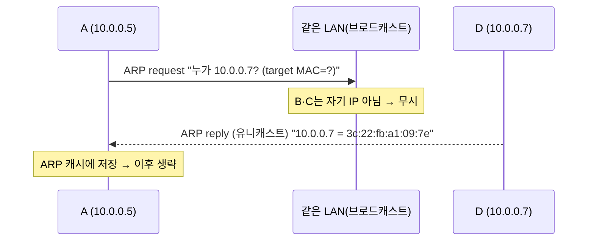

## "목적지 IP를 아는데, 왜 프레임을 못 보내지?"

[라우팅 글]()에서 라우터는 "다음 홉(next-hop)의 IP"를 정했습니다. 그런데 실제로 옆 장비에게 데이터를 건네는 건 IP가 아니라 **MAC 주소**입니다 — [이더넷 프레임]()의 목적지 칸에는 IP가 아니라 MAC이 들어가니까요. "next-hop의 IP는 10.1.0.1"까진 알아도, **그 IP를 가진 장비의 MAC을 모르면 프레임을 못 만듭니다.**

이 IP→MAC 변환을 같은 망 안에서 해결하는 게 **ARP(Address Resolution Protocol)** 입니다. 그리고 이 글의 더 중요한 절반은 그 *앞 단계* — "목적지가 **나와 같은 망**(직접 전달)이냐, **다른 망**(게이트웨이 경유)이냐"를 호스트가 매 패킷 어떻게 판단하는지, 즉 **L2와 L3의 경계**입니다. 여기를 정확히 이해하면 "같은 IP인데 왜 MAC은 게이트웨이 거냐" 같은 혼란이 영구히 사라집니다.

## 모든 송신의 첫 분기: 같은 서브넷인가?

호스트가 패킷을 보내기 직전, 단 하나의 비교를 합니다 — **목적지 IP와 내 IP를, 내 서브넷 마스크로 AND 해서 같은 네트워크인지** 봅니다([서브넷팅 글]()).

<div class="arp-dec" markdown="0">
<style>
.arp-dec{margin:1.4rem 0;overflow-x:auto}
.arp-dec svg{width:100%;max-width:700px;height:auto;display:block;margin:0 auto;font-family:inherit}
.arp-dec .node{fill:none;stroke:currentColor;stroke-width:1.6;opacity:.5}
.arp-dec .wire{stroke:currentColor;opacity:.25;stroke-width:1.6}
.arp-dec .lbl{fill:currentColor;font-size:12px;font-weight:600}
.arp-dec .sub{fill:currentColor;font-size:10px;opacity:.6}
.arp-dec .mono{fill:currentColor;font-size:10px;font-family:ui-monospace,monospace;opacity:.75}
.arp-dec .same{fill:#2f9e44;animation:arpdecsame 5s linear infinite}
.arp-dec .diff{fill:#f08c00;animation:arpdecdiff 5s linear infinite}
.arp-dec .rew{fill:#f08c00;opacity:0;animation:arpdecrew 5s ease-in-out infinite}
@keyframes arpdecsame{0%{transform:translateX(0);opacity:0}6%{opacity:1}90%{opacity:1}100%{transform:translateX(560px);opacity:0}}
@keyframes arpdecdiff{0%{transform:translateX(0);opacity:0}6%{opacity:1}46%{transform:translateX(270px);opacity:1}54%{transform:translateX(270px);opacity:1}94%{opacity:1}100%{transform:translateX(560px);opacity:0}}
@keyframes arpdecrew{0%,44%{opacity:0}50%{opacity:1}60%{opacity:1}66%{opacity:0}100%{opacity:0}}
</style>
<svg viewBox="0 0 700 230" role="img" aria-label="목적지가 같은 서브넷이면 목적지 MAC으로 직접 전달하고, 다른 서브넷이면 게이트웨이 MAC으로 보낸 뒤 게이트웨이에서 MAC이 재작성되는 분기 애니메이션">
  <text class="lbl" x="20" y="26">같은 서브넷 → 목적지에게 직접 (dst MAC = 목적지)</text>
  <line class="wire" x1="70" y1="60" x2="630" y2="60"/>
  <circle class="node" cx="70" cy="60" r="16"/>
  <circle class="node" cx="630" cy="60" r="16"/>
  <text class="sub" x="70" y="92" text-anchor="middle">A</text>
  <text class="sub" x="630" y="92" text-anchor="middle">B (같은 망)</text>
  <circle class="same" cx="70" cy="60" r="7"/>

  <text class="lbl" x="20" y="150">다른 서브넷 → 게이트웨이로 (dst MAC = GW, 거기서 재작성)</text>
  <line class="wire" x1="70" y1="184" x2="630" y2="184"/>
  <circle class="node" cx="70" cy="184" r="16"/>
  <rect class="node" x="324" y="164" width="52" height="40" rx="6"/>
  <circle class="node" cx="630" cy="184" r="16"/>
  <text class="sub" x="70" y="216" text-anchor="middle">A</text>
  <text class="sub" x="350" y="216" text-anchor="middle">게이트웨이</text>
  <text class="sub" x="630" y="216" text-anchor="middle">외부 망</text>
  <text class="mono" x="350" y="158" text-anchor="middle">dst MAC 재작성</text>
  <rect class="rew" x="334" y="176" width="32" height="16" rx="3"/>
  <circle class="diff" cx="70" cy="184" r="7"/>
</svg>
</div>

- **같은 망이면(위)**: 목적지에게 **직접** 보냅니다. 프레임의 dst MAC = 목적지 호스트의 MAC. ARP로 목적지 IP의 MAC을 구합니다.
- **다른 망이면(아래)**: 목적지에게 직접 못 갑니다. **기본 게이트웨이**에게 떠넘깁니다. 프레임의 dst MAC = *게이트웨이의 MAC*. ARP로 구하는 건 목적지가 아니라 **게이트웨이 IP의 MAC**입니다.

> **여기가 핵심 통찰입니다.** 다른 망으로 가는 패킷에서, **L3의 목적지 IP는 최종 목적지로 끝까지 유지**되지만, **L2의 목적지 MAC은 매 홉 바뀝니다**(지금 프레임을 받을 바로 옆 장비의 MAC). 그래서 "패킷이 인터넷을 건넌다"는 건, *변하지 않는 IP 봉투* 안의 내용물이, *홉마다 새로 쓰이는 MAC 겉봉*에 담겨 옆집으로 계속 전달되는 것입니다. IP=목적지 주소, MAC=바로 다음 한 집 주소.

## ARP: IP를 MAC으로 바꾸는 브로드캐스트 질문

이제 "이 IP의 MAC이 뭐지?"를 풀어야 합니다. 호스트는 같은 망 전체에 **브로드캐스트**로 묻고("누가 10.0.0.7의 주인이냐?"), 해당 IP를 가진 호스트만 **유니캐스트**로 답합니다("나야, 내 MAC은 …").

<div class="arp-res" markdown="0">
<style>
.arp-res{margin:1.4rem 0;overflow-x:auto}
.arp-res svg{width:100%;max-width:700px;height:auto;display:block;margin:0 auto;font-family:inherit}
.arp-res .node{fill:none;stroke:currentColor;stroke-width:1.6;opacity:.5}
.arp-res .sw{fill:none;stroke:currentColor;stroke-width:1.6;opacity:.5}
.arp-res .wire{stroke:currentColor;opacity:.25;stroke-width:1.5}
.arp-res .lbl{fill:currentColor;font-size:11px;font-weight:600}
.arp-res .sub{fill:currentColor;font-size:10px;opacity:.65}
.arp-res .q{fill:#1971c2}
.arp-res .b0{animation:arpresb0 5s ease-in-out infinite}
.arp-res .bB{animation:arpresbB 5s ease-in-out infinite}
.arp-res .bC{animation:arpresbC 5s ease-in-out infinite}
.arp-res .bD{animation:arpresbD 5s ease-in-out infinite}
.arp-res .rep{fill:#2f9e44;animation:arpresrep 5s ease-in-out infinite}
.arp-res .hit{opacity:0;animation:arpreshit 5s ease-in-out infinite}
@keyframes arpresb0{0%{transform:translate(0,0);opacity:0}4%{opacity:1}18%{transform:translate(240px,0);opacity:1}22%{opacity:0}100%{opacity:0}}
@keyframes arpresbB{0%,22%{transform:translate(0,0);opacity:0}26%{opacity:1}46%{transform:translate(320px,-80px);opacity:1}52%{opacity:0}100%{opacity:0}}
@keyframes arpresbC{0%,22%{transform:translate(0,0);opacity:0}26%{opacity:1}46%{transform:translate(320px,0);opacity:1}52%{opacity:0}100%{opacity:0}}
@keyframes arpresbD{0%,22%{transform:translate(0,0);opacity:0}26%{opacity:1}46%{transform:translate(320px,80px);opacity:1}52%{opacity:0}100%{opacity:0}}
@keyframes arpresrep{0%,56%{transform:translate(0,0);opacity:0}60%{opacity:1}78%{transform:translate(-320px,-80px);opacity:1}96%{transform:translate(-560px,-80px);opacity:1}100%{opacity:0}}
@keyframes arpreshit{0%,58%{opacity:0}64%{opacity:1}82%{opacity:1}90%{opacity:0}100%{opacity:0}}
</style>
<svg viewBox="0 0 700 240" role="img" aria-label="호스트 A가 ARP 요청을 브로드캐스트로 모든 호스트에 보내고, 해당 IP를 가진 D만 유니캐스트로 MAC을 응답하는 ARP 해석 애니메이션">
  <line class="wire" x1="60" y1="120" x2="300" y2="120"/>
  <line class="wire" x1="300" y1="120" x2="620" y2="40"/>
  <line class="wire" x1="300" y1="120" x2="620" y2="120"/>
  <line class="wire" x1="300" y1="120" x2="620" y2="200"/>
  <circle class="node" cx="60" cy="120" r="18"/>
  <rect class="sw" x="278" y="100" width="44" height="40" rx="6"/>
  <circle class="node" cx="620" cy="40" r="16"/>
  <circle class="node" cx="620" cy="120" r="16"/>
  <circle class="node" cx="620" cy="200" r="16"/>
  <text class="sub" x="60" y="155" text-anchor="middle">A 10.0.0.5</text>
  <text class="sub" x="300" y="160" text-anchor="middle">스위치</text>
  <text class="sub" x="650" y="40">B .6</text>
  <text class="sub" x="650" y="120">C .8</text>
  <text class="sub" x="650" y="204" fill="#2f9e44" font-weight="600">D .7 ✓</text>
  <text class="lbl" x="60" y="40">"누가 10.0.0.7?" (브로드캐스트)</text>
  <circle class="hit" cx="620" cy="200" r="22" fill="none" stroke="#2f9e44" stroke-width="2"/>
  <circle class="q b0" cx="60" cy="120" r="7"/>
  <circle class="q bB" cx="300" cy="120" r="6"/>
  <circle class="q bC" cx="300" cy="120" r="6"/>
  <circle class="q bD" cx="300" cy="120" r="6"/>
  <circle class="rep" cx="620" cy="200" r="7"/>
</svg>
</div>

B와 C는 자기 IP가 아니라 조용히 무시하고, **D만** 자기 MAC을 담아 A에게 직접(유니캐스트) 답합니다. A는 이 결과를 **ARP 캐시**에 저장해, 다음부턴 묻지 않습니다.

```text
$ ip neigh                 # (구버전: arp -a) — ARP 캐시 확인
10.0.0.7  dev eth0  lladdr  3c:22:fb:a1:09:7e  REACHABLE
10.0.0.1  dev eth0  lladdr  00:1a:2b:3c:4d:5e  STALE      # 게이트웨이, 곧 재검증
```

ARP 패킷 자체는 IP 헤더조차 없는 **순수 L2 프로토콜**입니다(EtherType `0x0806`). 주요 필드: sender/target의 **IP와 MAC** 4쌍, opcode(1=request, 2=reply). request는 "target MAC = 00:00:..(모름)"으로 보내고, reply가 그 칸을 채워 돌아옵니다.



## 전체 그림: 다른 망으로 보낼 때 실제로 일어나는 일

`10.0.0.5`의 A가 인터넷의 `8.8.8.8`로 패킷을 보낸다고 합시다.

1. **분기**: `8.8.8.8`을 내 마스크로 AND → 내 서브넷이 아님 → **게이트웨이로 보낸다**.
2. **ARP**: 목적지(8.8.8.8)가 아니라 **게이트웨이 10.0.0.1의 MAC**을 ARP로 구한다.
3. **프레임 작성**: dst IP = `8.8.8.8`(최종), **dst MAC = 게이트웨이 MAC**(바로 옆).
4. **게이트웨이(라우터)**: 프레임을 받아 IP는 그대로 두고, 다음 홉을 향해 **dst MAC만 새로 써서**(다음 라우터의 MAC) 내보낸다. 이게 매 홉 반복된다.

즉 ARP는 "**내 망 안에서 옆 장비의 MAC을 구하는 도구**"일 뿐이고, 인터넷을 건너는 동안 IP는 불변, MAC은 홉마다 교체됩니다.

## 보안 함정: ARP 스푸핑 — 신뢰가 없는 프로토콜

ARP에는 **인증이 없습니다.** "내가 10.0.0.1(게이트웨이)다"라는 거짓 reply를 보내면, 같은 망의 호스트들은 그대로 믿고 게이트웨이로 갈 트래픽을 **공격자에게** 보냅니다(중간자 공격, MITM). gratuitous ARP(요청 없이 보내는 ARP — 원래는 IP 충돌 감지·페일오버용)가 이 공격의 흔한 수단입니다.

> **대응**: 스위치의 **Dynamic ARP Inspection(DAI)** + **DHCP Snooping**으로 위조 ARP를 포트 레벨에서 차단, 중요 장비엔 **static ARP** 고정. 클라우드는 아예 ARP를 우회합니다 — AWS VPC는 가상 L2라 ARP 스푸핑이 구조적으로 불가능합니다([VPC 글]()).

진단:

```bash
$ tcpdump -n -e arp                 # 누가 어떤 ARP를 뿌리는지 실시간
$ ip neigh | grep 10.0.0.1          # 게이트웨이 MAC이 갑자기 바뀌었나?
```

게이트웨이의 MAC이 어느 순간 다른 값으로 바뀌어 있다면, 스푸핑을 의심해야 합니다.

## 면접/리뷰 단골 질문

- **Q. IP를 아는데 ARP가 왜 필요한가?** → 실제 프레임 전달은 L2(MAC)로 한다. IP를 같은 망 안의 MAC으로 변환해야 프레임을 만들 수 있다.
- **Q. 다른 서브넷으로 보낼 때 dst MAC은 누구 것?** → 최종 목적지가 아니라 **게이트웨이의 MAC**. dst IP만 최종 목적지로 유지된다. (L2 MAC은 홉마다 교체, L3 IP는 불변.)
- **Q. ARP request는 왜 브로드캐스트, reply는 유니캐스트?** → 누가 그 IP의 주인인지 모르니 전체에 묻고(브로드캐스트), 답하는 쪽은 묻는 이를 알므로 직접 답한다(유니캐스트).
- **Q. ARP 스푸핑이 가능한 근본 이유?** → ARP에 인증이 없어 거짓 reply를 검증 없이 믿는다. 대응은 DAI+DHCP Snooping, static ARP.
- **Q. 게이트웨이 통신이 갑자기 끊겼는데 핑도 안 된다, 첫 확인은?** → `ip neigh`로 게이트웨이 MAC이 정상인지(스푸핑/캐시 STALE) 확인.

## 정리

- 모든 송신의 첫 분기 = **목적지가 같은 서브넷인가**(IP를 마스크로 AND). 같으면 직접, 다르면 게이트웨이로.
- **ARP** = 같은 망 안에서 IP→MAC을 푸는 도구. request는 브로드캐스트, reply는 유니캐스트, 결과는 캐시.
- 다른 망으로 갈 때: **dst IP는 최종 목적지(불변), dst MAC은 게이트웨이(홉마다 교체)**. IP=목적지, MAC=다음 한 집.
- ARP는 인증이 없어 **스푸핑(MITM)** 에 취약 → DAI·DHCP Snooping·static ARP. 클라우드(VPC)는 가상 L2로 원천 차단.

> 다음 글: 같은 망 안에서 MAC으로 프레임을 실어 나르고, 스위치가 그 MAC을 학습해 포워딩하는 [이더넷·MAC·스위치]()로 이어집니다. 한편 다른 망으로 넘기는 결정의 근거였던 서브넷 계산은 [IP 주소와 서브넷팅]()에서 다룹니다.
