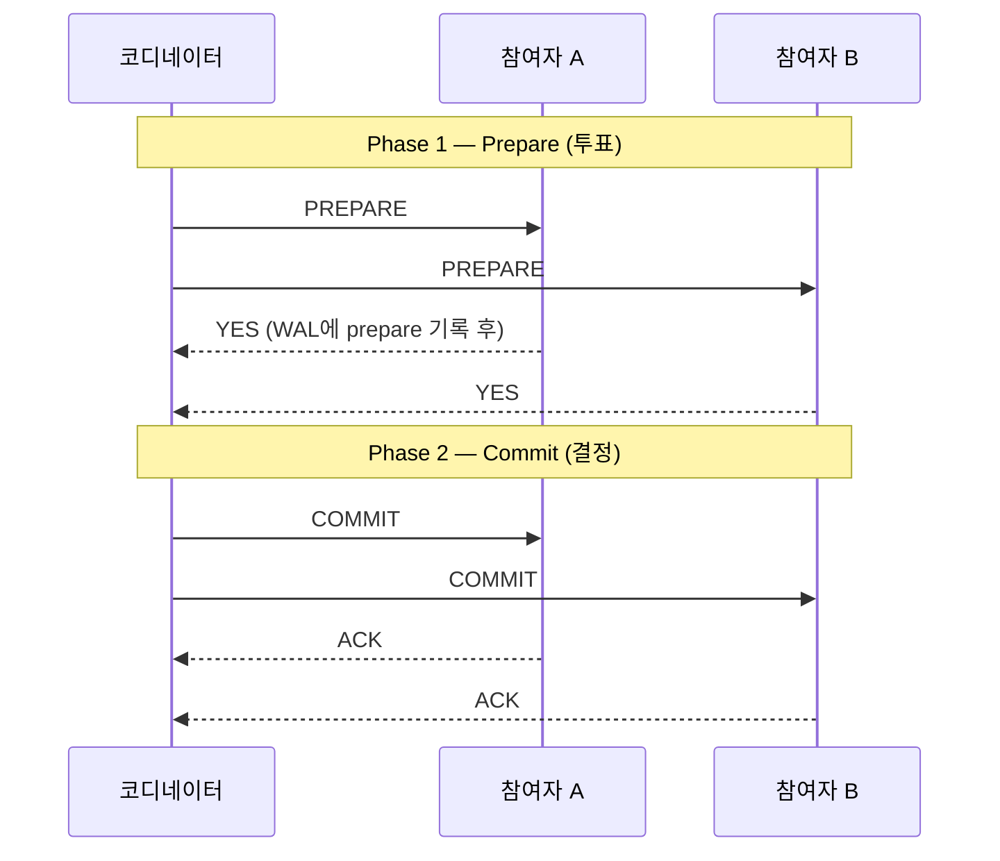
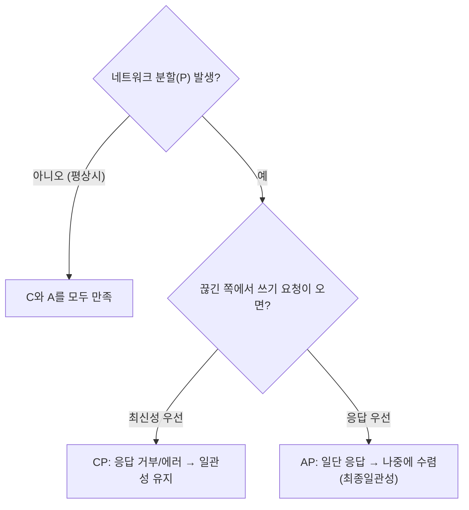
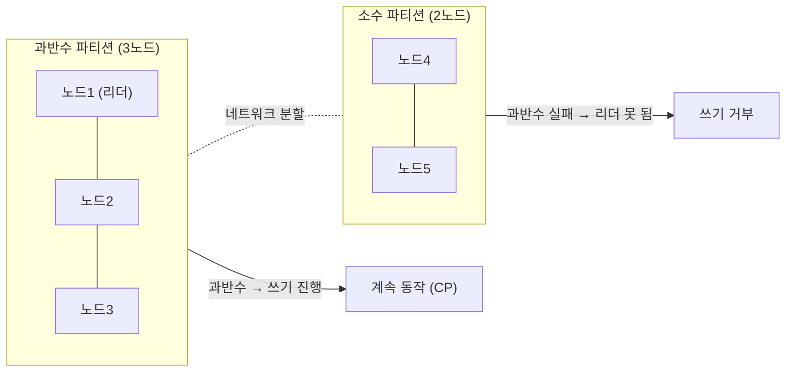

## "분명 둘 다 커밋했는데 왜 한쪽만 들어갔지?"

샤드 A의 계좌에서 1만 원을 빼고 샤드 B의 계좌에 1만 원을 넣는 이체. 단일 노드라면 트랜잭션 하나로 끝납니다([ACID 글]()). 그런데 [샤딩]()으로 두 계좌가 다른 서버에 흩어지는 순간, "둘 다 성공" 또는 "둘 다 실패"를 보장하던 마법이 사라집니다. A는 커밋됐는데 B로 보내는 응답이 네트워크에서 증발하면? 돈은 사라지고, 정합성은 깨집니다.

분산이 되는 순간 우리는 세 가지 적과 동시에 싸웁니다. **노드는 죽고, 메시지는 유실·지연되고, 시계는 어긋납니다.** 이 글은 그 적들 위에서 "여러 노드를 하나처럼" 보이게 만드는 세 개의 기둥 — **2PC(원자적 커밋)**, **CAP/PACELC(트레이드오프의 법칙)**, **합의(Raft, 과반수의 힘)** — 를 정확하게 세웁니다.

## 2PC: 원자적 커밋을 흉내 내는 가장 솔직한 방법

여러 노드에 걸친 트랜잭션을 "전부 커밋 / 전부 롤백"으로 묶으려면, 누군가 지휘해야 합니다. 그 지휘자가 **코디네이터(coordinator)**, 실제 데이터를 쥔 노드들이 **참여자(participant)**입니다. 2PC(2-Phase Commit, 2단계 커밋)는 이름 그대로 두 단계로 진행합니다.



핵심은 **Phase 1에서 참여자가 "YES"라고 답한 순간, 그 노드는 약속을 어길 수 없다**는 점입니다. PostgreSQL의 `PREPARE TRANSACTION`이 바로 이 동작입니다 — prepare 시점에 변경 내용을 [WAL]()에 영속화하고 락을 잡은 채, 자신의 의지로는 커밋도 롤백도 하지 않고 코디네이터의 최종 명령만 기다립니다. 코디네이터는 **모두가 YES일 때만** COMMIT을, 하나라도 NO·무응답이면 ABORT를 내려보냅니다.

```sql
-- 분산 트랜잭션 참여자 측 (PostgreSQL prepared transaction)
BEGIN;
UPDATE accounts SET balance = balance - 10000 WHERE id = 1;
PREPARE TRANSACTION 'txn-transfer-42';   -- ← Phase 1: 영속화 + 잠금, 커밋 대기
-- ... 코디네이터가 모든 참여자의 YES 확인 후 ...
COMMIT PREPARED 'txn-transfer-42';        -- ← Phase 2: 최종 커밋
-- 또는 ROLLBACK PREPARED 'txn-transfer-42';
```

> **현실 체크 — prepared transaction은 잠금을 쥔 채 매달려 있다.** `max_prepared_transactions`로 켜야 하고, 코디네이터가 죽으면 락을 쥔 in-doubt 트랜잭션이 남아 `pg_prepared_xacts`에서 좀비처럼 보입니다. VACUUM이 막히고 다른 트랜잭션이 줄줄이 대기합니다. 그래서 PG 단독으로 2PC를 직접 운영하는 일은 드물고, 보통 외부 트랜잭션 매니저(XA)나 분산 DB 내부 엔진이 관리합니다.

### 2PC의 진짜 약점: blocking과 코디네이터 단일 실패

아래 애니메이션은 가장 무서운 시나리오입니다. 모든 참여자가 YES를 보내 **prepared 상태로 락을 쥐고 대기**하는데, **하필 그 순간 코디네이터가 죽습니다.** 참여자는 커밋해야 할지 롤백해야 할지 스스로 결정할 수 없습니다 — 코디네이터만이 답을 알기 때문입니다.

<div class="tpc-block" markdown="0">
<style>
.tpc-block{margin:1.4rem 0;overflow-x:auto}
.tpc-block svg{width:100%;max-width:720px;height:auto;display:block;margin:0 auto;font-family:inherit}
.tpc-block .lbl{fill:currentColor;font-size:12px;font-weight:600}
.tpc-block .sub{fill:currentColor;font-size:10px;opacity:.6}
.tpc-block .box{fill:none;stroke:currentColor;stroke-width:1.4;opacity:.55}
.tpc-block .vote{fill:#2f9e44;opacity:0;animation:tpcvote 7s ease-in-out infinite}
.tpc-block .v2{animation-delay:.4s}
.tpc-block .coord{fill:#1971c2;opacity:.85;animation:tpccoord 7s ease-in-out infinite}
.tpc-block .dead{fill:#e03131;opacity:0;animation:tpcdead 7s ease-in-out infinite}
.tpc-block .wait{fill:#f08c00;opacity:0;font-size:11px;font-weight:700;animation:tpcwait 7s ease-in-out infinite}
.tpc-block .lock{fill:#f08c00;opacity:0;animation:tpclock 7s ease-in-out infinite}
@keyframes tpcvote{0%,18%{opacity:0;transform:translateX(0)}28%,55%{opacity:1;transform:translateX(0)}65%,100%{opacity:1}}
@keyframes tpccoord{0%,55%{opacity:.85}62%{opacity:.85}63%,100%{opacity:0}}
@keyframes tpcdead{0%,62%{opacity:0}66%,100%{opacity:.9}}
@keyframes tpcwait{0%,66%{opacity:0}74%,100%{opacity:1}}
@keyframes tpclock{0%,28%{opacity:0}40%,100%{opacity:.9}}
</style>
<svg viewBox="0 0 700 250" role="img" aria-label="모든 참여자가 prepare에 YES로 투표해 락을 쥔 채 대기하던 중 코디네이터가 죽어 참여자들이 영원히 blocking되는 2PC의 약점 애니메이션">
  <rect class="box" x="290" y="20" width="120" height="44" rx="6"/>
  <text class="lbl" x="350" y="40" text-anchor="middle">코디네이터</text>
  <circle class="coord" cx="320" cy="52" r="6"/>
  <text class="dead" x="378" y="57" text-anchor="middle" font-size="18" font-weight="700">✕</text>

  <rect class="box" x="60" y="160" width="120" height="50" rx="6"/>
  <text class="lbl" x="120" y="182" text-anchor="middle">참여자 A</text>
  <circle class="lock" cx="100" cy="196" r="6"/>
  <text class="sub" x="138" y="200">prepared</text>

  <rect class="box" x="520" y="160" width="120" height="50" rx="6"/>
  <text class="lbl" x="580" y="182" text-anchor="middle">참여자 B</text>
  <circle class="lock" cx="560" cy="196" r="6"/>
  <text class="sub" x="598" y="200">prepared</text>

  <circle class="vote" cx="160" cy="120" r="6"/>
  <text class="vote" x="180" y="124" font-size="11" font-weight="700">YES ↑</text>
  <circle class="vote v2" cx="540" cy="120" r="6"/>
  <text class="vote v2" x="500" y="124" font-size="11" font-weight="700">↑ YES</text>

  <text class="wait" x="350" y="150" text-anchor="middle">결정을 모름 → 락을 쥔 채 무한 대기 (blocking)</text>
  <text class="sub" x="350" y="238" text-anchor="middle">prepared 상태의 참여자는 스스로 commit/abort를 못 한다</text>
</svg>
</div>

이것이 2PC가 **blocking 프로토콜**이라 불리는 이유입니다. 코디네이터가 복구되기 전까지 참여자들은 락을 쥔 채 멈춰 있고, 그동안 해당 행에 걸린 다른 트랜잭션도 줄줄이 멈춥니다. 약점을 정리하면:

- **코디네이터 단일 실패점(SPOF)**: 결정 권한이 한 노드에 집중. 그 노드가 잘못된 순간에 죽으면 시스템 전체가 멈춤.
- **동기 blocking**: prepare~commit 사이 락 보유 + 모든 왕복을 기다림 → 지연·처리량 악화.
- **네트워크 분할에 취약**: 코디네이터-참여자 간 단절 시 in-doubt 상태가 무기한 지속.

3PC(3-Phase Commit)는 단계를 하나 더 넣어 일부 blocking을 줄이려 했지만, 네트워크 분할 앞에서는 여전히 안전하지 않습니다. 진짜 해법은 **"단일 코디네이터" 자체를 없애고, 과반수의 합의로 결정을 내리는 것** — 글 뒷부분의 Raft입니다.

## CAP 정리 — 무엇을 포기할지가 아니라, 언제 무엇을 고를지

분산 시스템을 이야기할 때 가장 많이 인용되고 가장 많이 오해받는 정리가 CAP입니다.

- **C (Consistency, 선형화가능성)**: 모든 노드가 같은 시점에 같은 최신 값을 본다. "방금 쓴 값을 읽으면 그 값이 나온다."
- **A (Availability, 가용성)**: 살아 있는 모든 노드는 (지연 없이) 응답을 돌려준다.
- **P (Partition tolerance, 분할 내성)**: 노드 간 네트워크가 끊겨 메시지가 오가지 못해도 시스템이 동작한다.



### 흔한 오해 두 가지를 못 박자

**오해 1 — "셋 중 둘만 고른다(CA/CP/AP)."** 가장 널리 퍼진 오해입니다. 정확히는 이렇습니다: **네트워크 분할(P)은 선택이 아니라 현실**입니다. 여러 노드가 네트워크로 이어진 이상 분할은 언젠가 일어나고, 우리는 그것을 끌 수 없습니다. 그러므로 **현실적 선택지는 P를 전제로 한 CP냐 AP냐, 둘뿐**입니다. "CA 시스템"이란 사실상 "분할을 견디지 못하는 단일 노드(또는 단일 장애 도메인)"를 뜻할 뿐입니다.

**오해 2 — "CAP는 항상 둘 중 하나를 포기하라고 한다."** 아닙니다. CAP가 양자택일을 강요하는 건 **오직 분할이 일어난 그 순간뿐**입니다. **분할이 없는 평상시에는 C와 A를 모두 만족할 수 있습니다.** 분할이 났을 때 끊긴 쪽 노드가 "최신 값을 보장 못 하니 차라리 에러를 반환"하면 CP(일관성 사수), "일단 가진 값으로 응답하고 나중에 화해"하면 AP(가용성 사수)입니다.

> **현실 체크 — CAP의 C는 트랜잭션의 C가 아니다.** CAP의 C는 **선형화가능성(linearizability)**이고, ACID의 C(Consistency)는 제약조건 충족(무결성)입니다. 완전히 다른 개념인데 글자가 같아 혼동됩니다. CAP를 말할 때의 C는 "방금 쓴 값을 모두가 즉시 본다"는 **읽기-쓰기 순서 보장**입니다.

## PACELC — 분할이 없을 때도 공짜는 없다

CAP의 결정적 한계는 **"분할이 났을 때"만 다룬다**는 것입니다. 하지만 시스템이 분할 없이 멀쩡하게 도는 99.9%의 시간에도, 우리는 매 요청마다 트레이드오프를 합니다. PACELC가 그 빈칸을 채웁니다.

> **if (P)** artition → choose between **A**vailability and **C**onsistency,
> **E**lse (정상 시) → choose between **L**atency and **C**onsistency.

분할이 없는 평상시에도 **강한 일관성을 원하면 여러 노드에 동기 복제를 기다려야 하므로 지연(Latency)이 커지고**, 지연을 줄이려면 일관성을 느슨하게(비동기 복제, 로컬 응답) 풀어야 합니다. 이것이 [복제 글]()의 동기 vs 비동기 복제 선택과 정확히 같은 트레이드오프입니다 — `synchronous_commit`을 켜면 안전하지만 느리고, 끄면 빠르지만 페일오버 시 데이터를 잃을 수 있습니다.

| 시스템 | 분할 시(P) | 평상시(E) | 분류 |
|---|---|---|---|
| 강한 일관성 SQL (Spanner류) | C 우선 | C 우선 | PC/EC |
| Dynamo·Cassandra (기본) | A 우선 | L 우선 | PA/EL |
| MongoDB (기본) | C 우선 | L 우선 | PC/EL |

PACELC가 주는 통찰은 명확합니다. **"우리 DB는 강한 일관성"이라는 말은 곧 "우리는 매 요청마다 지연을 더 내고 있다"는 뜻**입니다. 일관성은 가용성하고만 거래되는 게 아니라, 평상시엔 지연하고도 거래됩니다.

## 합의(Consensus) — 단일 코디네이터를 과반수로 대체하기

2PC의 병폐는 결정 권한이 한 노드에 있다는 점이었습니다. **합의 알고리즘**은 이를 뒤집습니다: 결정을 한 노드가 아니라 **노드들의 과반수(quorum)**가 내립니다. 코디네이터가 죽어도 남은 과반수가 새 리더를 뽑아 진행하므로 blocking이 사라집니다. 대표 알고리즘이 **Raft**입니다(Paxos를 이해하기 쉽게 재설계). Raft는 세 부분으로 이루어집니다.

**① 리더 선출(Leader Election).** 모든 쓰기는 단 하나의 **리더**를 거칩니다. 리더가 일정 시간 하트비트를 못 보내면, 팔로워가 후보(candidate)가 되어 임기(term)를 올리고 투표를 요청합니다. **과반수의 표를 받은 후보만 리더**가 됩니다. 한 임기에 과반수는 한 명에게만 줄 수 있으니, 리더는 절대 둘이 될 수 없습니다(split-brain 방지).

**② 로그 복제(Log Replication).** 리더는 클라이언트 명령을 자기 로그에 추가하고 팔로워에게 복제합니다(AppendEntries). 각 엔트리는 [WAL]()처럼 순서가 있는 로그입니다.

**③ 과반수 커밋(Majority Commit).** 아래 애니메이션이 핵심입니다. 리더는 한 엔트리가 **과반수 노드에 복제됐음을 확인한 순간 그것을 "커밋"으로 표시**하고 클라이언트에 성공을 반환합니다. 소수의 느린 노드는 기다려주지 않습니다.

<div class="raft-quorum" markdown="0">
<style>
.raft-quorum{margin:1.4rem 0;overflow-x:auto}
.raft-quorum svg{width:100%;max-width:720px;height:auto;display:block;margin:0 auto;font-family:inherit}
.raft-quorum .lbl{fill:currentColor;font-size:11px;font-weight:600}
.raft-quorum .sub{fill:currentColor;font-size:10px;opacity:.6}
.raft-quorum .node{fill:none;stroke:currentColor;stroke-width:1.6;opacity:.55}
.raft-quorum .leader{fill:#1971c2;opacity:.9}
.raft-quorum .pkt{fill:#1971c2;animation:rqpkt 6s ease-in-out infinite}
.raft-quorum .pkt2{animation-delay:.25s}
.raft-quorum .pkt3{animation-delay:.5s}
.raft-quorum .ack{fill:#2f9e44;opacity:0}
.raft-quorum .ack1{animation:rqack 6s ease-in-out infinite}
.raft-quorum .ack2{animation:rqack 6s ease-in-out infinite;animation-delay:.3s}
.raft-quorum .commit{fill:#2f9e44;opacity:0;font-size:13px;font-weight:700;animation:rqcommit 6s ease-in-out infinite}
.raft-quorum .slowmark{fill:#f08c00;opacity:0;font-size:10px;animation:rqslow 6s ease-in-out infinite}
@keyframes rqpkt{0%,8%{offset-distance:0%;opacity:0}14%{opacity:1}40%{offset-distance:100%;opacity:1}46%,100%{opacity:0}}
@keyframes rqack{0%,46%{opacity:0}54%,82%{opacity:1}90%,100%{opacity:0}}
@keyframes rqcommit{0%,72%{opacity:0}80%,100%{opacity:1}}
@keyframes rqslow{0%,72%{opacity:0}80%,100%{opacity:1}}
.raft-quorum .pkt{offset-path:path('M 350,70 L 150,180')}
.raft-quorum .pkt2{offset-path:path('M 350,70 L 350,190')}
.raft-quorum .pkt3{offset-path:path('M 350,70 L 550,180')}
</style>
<svg viewBox="0 0 700 270" role="img" aria-label="리더가 로그 엔트리를 팔로워들에게 복제하고 과반수 노드의 ACK를 확인한 순간 커밋으로 확정하는 Raft 합의 과정 애니메이션">
  <circle class="node leader" cx="350" cy="60" r="26"/>
  <text class="lbl" x="350" y="64" text-anchor="middle" fill="#fff">리더</text>
  <text class="sub" x="350" y="28" text-anchor="middle">로그 엔트리 X 추가</text>

  <line class="node" x1="335" y1="82" x2="155" y2="175"/>
  <line class="node" x1="350" y1="86" x2="350" y2="185"/>
  <line class="node" x1="365" y1="82" x2="545" y2="175"/>

  <circle class="node" cx="150" cy="195" r="22"/>
  <text class="lbl" x="150" y="199" text-anchor="middle">팔로워1</text>
  <circle class="node" cx="350" cy="205" r="22"/>
  <text class="lbl" x="350" y="209" text-anchor="middle">팔로워2</text>
  <circle class="node" cx="550" cy="195" r="22"/>
  <text class="lbl" x="550" y="199" text-anchor="middle">팔로워3</text>

  <circle class="pkt" r="5"/>
  <circle class="pkt pkt2" r="5"/>
  <circle class="pkt pkt3" r="5"/>

  <text class="ack ack1" x="195" y="175" text-anchor="middle" font-size="11" font-weight="700">ACK ↗</text>
  <text class="ack ack2" x="372" y="178" text-anchor="middle" font-size="11" font-weight="700">ACK ↑</text>
  <text class="slowmark" x="545" y="232" text-anchor="middle">(느림 — 안 기다림)</text>

  <text class="commit" x="350" y="118" text-anchor="middle">과반수(2/3+리더) 확인 → 커밋 확정</text>
</svg>
</div>

### 왜 하필 "과반수(quorum)"인가

과반수의 마법은 **두 과반수는 반드시 한 노드 이상에서 겹친다**는 단순한 산수에 있습니다. 5노드 클러스터에서 과반수는 3입니다. 어떤 결정 A가 노드 {1,2,3}의 동의로 통과했고, 다음 결정 B가 노드 {3,4,5}의 동의로 통과한다면 — 둘은 반드시 노드 3을 공유합니다. 노드 3은 A를 기억하므로, B를 처리할 때 A와 모순되는 결정을 막을 수 있습니다.

이 **교집합 보장(quorum intersection)** 덕분에:
- **모순된 두 결정이 동시에 통과할 수 없습니다** → split-brain 방지.
- **소수 노드가 죽거나 분할되어도 과반수만 살아 있으면 진행**합니다 → 5노드는 2대까지, 3노드는 1대까지 장애 허용.
- 분할이 나면 **과반수를 못 가진 쪽(소수파)은 쓰기를 멈춥니다**(스스로 리더가 못 됨) → 자동으로 CP를 선택. 이것이 2PC의 단일 코디네이터 blocking을 근본적으로 없애는 지점입니다.



이것이 [복제 글]()의 단순 동기 복제보다 한 단계 위입니다 — 동기 복제는 특정 standby가 죽으면 멈출 수 있지만, quorum은 "아무 과반수나" 응답하면 진행하므로 가용성과 일관성을 함께 끌어올립니다.

## 선형화가능성(Linearizability) — "하나의 노드처럼" 보이는 것의 정확한 의미

지금까지의 모든 노력이 향하는 목표가 바로 이것입니다. **선형화가능성**은 가장 강한 일관성 보장으로, 여러 노드에 분산된 시스템이 마치 **단 하나의 복사본**만 존재하는 것처럼 행동하게 만듭니다. 정확히는: 모든 연산이 **자신이 호출된 시점과 응답을 받은 시점 사이의 어느 한 순간에 원자적으로, 그리고 실제 시간 순서를 지키며** 일어난 것처럼 보여야 합니다. 한 번 쓴 값이 커밋되어 누군가에게 읽혔다면, 그 이후의 모든 읽기는 (다른 노드에서 읽더라도) 적어도 그 값 이상으로 최신이어야 합니다 — **"오래된 값으로 거슬러 가는" 일이 없습니다.** 이것이 CAP에서 말하는 C이고, Raft 같은 합의 위에서 모든 읽기·쓰기를 리더의 커밋된 로그를 통해 처리할 때 얻어집니다. 단, 이 강함에는 PACELC가 경고한 대가가 따릅니다 — 매 읽기마다 리더가 자신이 여전히 과반수의 리더임을 확인해야 하므로 지연이 늘고, 이것이 분산 SQL이 강한 일관성을 제공하면서도 빠르기 어려운 근본 이유입니다(상세는 [NewSQL 글]()).

## 면접/리뷰 단골 질문

- **Q. 2PC가 blocking 프로토콜인 이유는?** → Phase 1에서 YES를 보낸 참여자는 prepared 상태로 락을 쥔 채 코디네이터의 최종 결정만 기다립니다. 코디네이터가 그 사이 죽으면 참여자는 commit/abort를 스스로 못 정해 무한 대기(in-doubt)합니다. 코디네이터가 단일 실패점입니다.
- **Q. CAP에서 실제로 고를 수 있는 건 CP와 AP 둘뿐이라는데?** → 네트워크 분할(P)은 끌 수 없는 현실이라 항상 전제됩니다. 따라서 분할 시 일관성을 지키며 응답을 포기(CP)하거나, 응답하며 일관성을 양보(AP)하는 선택만 남습니다. "CA"는 사실상 분할을 못 견디는 단일 노드입니다.
- **Q. 평상시에도 일관성과 가용성 중 하나를 포기하나?** → 아니요. 분할이 없으면 C와 A를 둘 다 만족할 수 있습니다. CAP의 양자택일은 분할이 난 순간에만 강제됩니다. 평상시의 트레이드오프는 PACELC가 다루며, 그땐 일관성 vs 지연입니다.
- **Q. 왜 과반수(quorum)인가? 전원 합의가 아니라?** → 두 과반수는 반드시 한 노드 이상 겹치므로(교집합 보장) 모순된 결정이 동시에 통과할 수 없습니다. 또 전원이 아닌 과반수만 요구하면 소수 노드가 죽어도 진행할 수 있어 가용성과 일관성을 함께 얻습니다.
- **Q. CAP의 C와 ACID의 C는 같은가?** → 다릅니다. CAP의 C는 선형화가능성(읽기-쓰기 순서·최신성 보장)이고, ACID의 C는 제약조건 충족(무결성)입니다. 글자만 같습니다.
- **Q. Raft에서 split-brain은 어떻게 막히나?** → 한 임기(term)에 한 노드는 한 후보에게만 투표하고, 리더가 되려면 과반수 표가 필요합니다. 과반수는 동시에 두 명에게 줄 수 없으므로 리더는 절대 둘이 될 수 없습니다. 분할 시 소수파는 과반수를 못 모아 리더가 되지 못하고 쓰기를 멈춥니다.

## 정리

- **2PC**는 코디네이터가 prepare→commit로 원자적 커밋을 흉내 내지만, 코디네이터 단일 실패점 + prepared 상태의 blocking이 치명적 약점이다.
- **CAP**는 분할(P)을 끌 수 없는 현실로 두므로 실제 선택지는 CP와 AP뿐이고, 양자택일은 **분할이 난 순간에만** 강제된다(평상시엔 C·A 동시 가능).
- **PACELC**는 분할 없는 평상시에도 **일관성 vs 지연**의 거래가 항상 존재함을 일깨운다 — 강한 일관성은 곧 더 큰 지연이다.
- **합의(Raft)**는 단일 코디네이터를 **과반수(quorum)**로 대체해 blocking을 없앤다: 리더 선출·로그 복제·과반수 커밋, 두 과반수의 교집합 보장이 모순과 split-brain을 막는다.
- **선형화가능성**은 분산 시스템을 "단 하나의 복사본"처럼 보이게 하는 가장 강한 보장이며, 합의 위에서 얻지만 매 연산의 지연이라는 대가가 따른다.

> 다음 글: 강한 일관성의 대척점에서 스케일·유연성·특정 접근패턴을 위해 다른 트레이드오프를 택한 세계 — [NoSQL 지도]()로 넘어가, Key-Value·Document·Wide-Column·Graph를 언제 무엇에 쓰는지 살펴봅니다.
