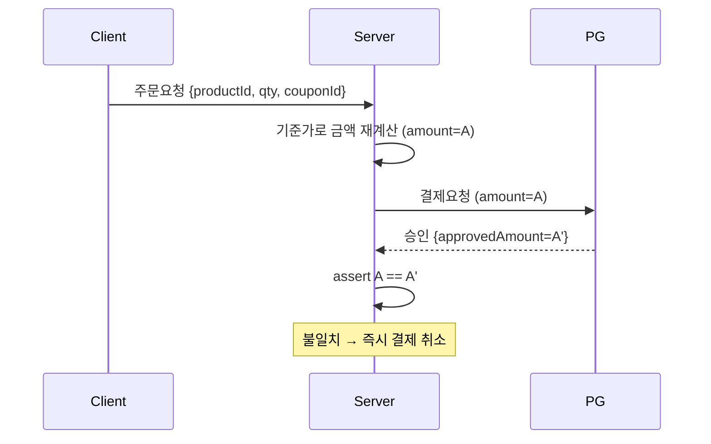

결제 검증을 손본 주가 있었다. 교훈은 한 줄로 압축된다. **클라이언트에서 온 금액은 입력값일 뿐, 사실이 아니다.** 브라우저 개발자도구나 프록시로 요청 본문을 바꾸는 건 누구나 할 수 있다. 10,000원짜리 상품의 결제 요청을 100원으로 바꿔 보내는 공격은 추상적 위협이 아니라 실제로 늘 시도된다.

## 신뢰 경계를 어디에 긋는가

보안의 핵심은 **신뢰 경계(trust boundary)**다. 클라이언트는 경계 바깥이다. 거기서 온 어떤 데이터도 검증 없이 결제·정산에 쓰면 안 된다. 금액은 특히 그렇다.

올바른 흐름은 이렇다.

1. 클라이언트는 **무엇을(상품 ID, 수량, 적용 쿠폰 ID)** 만 보낸다.
2. 서버가 **얼마인지를** DB의 기준 단가, 쿠폰 정책, 배송비 규칙으로 **직접 재계산**한다.
3. 그 서버 계산 금액으로 PG 결제를 요청한다.
4. PG 승인 콜백이 돌아오면, **승인된 금액 == 서버가 계산했던 금액**인지 다시 대조한다.

클라이언트가 보낸 금액 필드는 잘해야 UI 표시용일 뿐, 결제의 근거가 되어선 안 된다.



## 재계산과 대조 예시

```java
@Transactional
public Order placeOrder(OrderRequest req) {
    long expected = 0;
    for (OrderLine line : req.getLines()) {
        Product p = productRepo.findById(line.getProductId())
                .orElseThrow();              // 단가는 DB에서
        expected += p.getPrice() * line.getQty();
    }
    expected -= couponService.discount(req.getCouponId(), expected);
    expected += shippingPolicy.fee(req);
    // req.getClientAmount() 는 신뢰하지 않는다 — 절대 사용 금지

    PgResult pg = pgClient.approve(req.getPaymentKey(), expected);
    if (pg.getApprovedAmount() != expected) {
        pgClient.cancel(pg.getPaymentKey());   // 불일치 = 변조 의심
        throw new PaymentMismatchException(expected, pg.getApprovedAmount());
    }
    return orderRepo.save(Order.of(req, expected, pg));
}
```

## 운영 함정

**1) 쿠폰·할인을 클라이언트에서 계산하면 같은 구멍이다.** 단가만 서버에서 가져오고 할인은 프런트 값을 믿으면, 할인액을 부풀려 0원 결제를 만들 수 있다. **최종 결제 금액의 모든 구성요소가 서버 계산이어야** 한다.

**2) PG 승인 금액 대조를 생략하면 TOCTOU가 열린다.** 서버 계산과 실제 승인 사이에 가격이 바뀌거나 요청이 가로채일 수 있다. 승인 콜백에서 금액·주문번호·통화까지 대조하고, 멱등하게 처리해 중복 승인 콜백에도 안전해야 한다.

## 핵심 요약

- 클라이언트는 신뢰 경계 바깥. 금액은 항상 서버가 기준가로 재계산한다.
- 단가뿐 아니라 할인·배송비까지 전부 서버 계산.
- PG 승인 금액과 서버 계산 금액을 대조하고, 불일치 시 즉시 취소.

> Q. 프런트가 보낸 금액을 그대로 PG에 넘기면?
> A. 요청 변조로 헐값 결제가 가능하다. 서버 기준가 재계산 + PG 승인 금액 대조가 최소 방어선이다.
