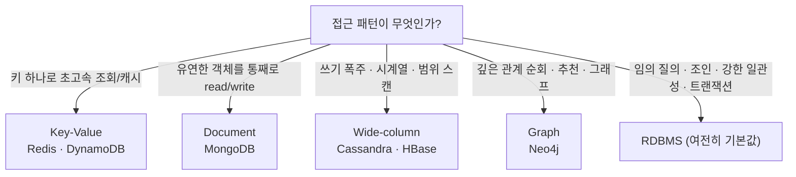

## "그냥 Mongo 쓰면 빠르다던데요?"

새 서비스를 시작하는 팀에서 흔히 나오는 말입니다. "스키마 안 짜도 되고, 샤딩도 알아서 해주고, RDB보다 빠르다던데요." 그런데 막상 몇 달 뒤 정산 화면에서 여러 컬렉션을 조인하려다 막히고, "지난주 결제 내역이 왜 아직 안 보이지?"라며 최종 일관성에 데이고, 그제서야 트레이드오프를 깨닫습니다.

NoSQL은 "관계형이 못 해서" 나온 게 아닙니다. [관계형 모델]()은 무결성·임의 질의·강한 일관성을 한 노드에서 훌륭하게 해냅니다. NoSQL은 그 능력 중 **일부를 의도적으로 포기하고, 그 대가로 다른 것**(수평 확장·유연 스키마·특정 접근 패턴 초고속)을 사는 선택입니다. 이 글은 4가지 유형의 NoSQL이 각각 **무엇을 포기하고 무엇을 얻는지**, 그 밑에 깔린 저장 엔진(LSM 트리)이 왜 다른지, 그리고 그럼에도 [RDBMS]()가 여전히 기본값인 이유를 짚습니다.

## NoSQL은 왜 등장했나 — 세 가지 압력

2000년대 후반, 구글·아마존 규모의 트래픽을 한 대의 RDBMS로 받아내려다 벽에 부딪힙니다. 세 가지 압력이 동시에 작용했습니다.

- **스케일아웃 압력**: RDBMS는 본질적으로 **scale-up**(더 큰 서버) 친화적입니다. 조인·외래키·강한 일관성·`SERIALIZABLE`은 모두 "한 노드가 전체를 본다"는 전제 위에 서 있습니다. [샤딩]()으로 수평 분할하는 순간 교차 샤드 조인·분산 트랜잭션이 고통스러워집니다. NoSQL은 **처음부터 여러 노드에 흩어지는 것을 전제**로 설계됐습니다.
- **유연 스키마 압력**: `ALTER TABLE`이 수억 행에서 락을 잡거나 길게 도는 고통. 제품 카탈로그처럼 항목마다 속성이 다른 데이터를 정규화하면 테이블이 폭발합니다. Document/KV는 스키마를 **애플리케이션으로 밀어내** 마이그레이션 없이 필드를 추가합니다.
- **접근 패턴 최적화 압력**: "특정 키로 한 건 조회"가 99%인 워크로드에 범용 옵티마이저·플래너·MVCC는 과합니다. KV 스토어는 그 한 패턴만 극단적으로 빠르게 합니다.

> **핵심 관점.** NoSQL = "No SQL"이 아니라 "**Not Only SQL**". 관계형의 보편성을 버리고 **특정 접근 패턴에 자료구조를 맞춘** 특화 도구들입니다. 범용성을 포기한 대가로 그 패턴에서 빨라지는 것 — 공짜 점심은 없습니다.

## 같은 주문 데이터, 네 가지 모델

핵심을 한눈에 보기 위해, **동일한 "주문(Order)" 데이터**를 네 모델이 어떻게 다르게 담는지 봅시다. 같은 정보지만 "무엇을 빠르게 하려는가"에 따라 모양이 전혀 달라집니다.

<svg viewBox="0 0 740 320" role="img" aria-label="같은 주문 데이터를 Key-Value, Document, Wide-column, Graph 네 가지 NoSQL 모델로 표현해 차례로 비교하는 애니메이션">
  <rect class="src" x="300" y="14" width="140" height="30" rx="4"/>
  <text class="sub" x="370" y="33" text-anchor="middle" fill="#fff">order#1001 (고객 7, 상품 A·B)</text>

  <!-- KV -->
  <text class="cap q1 kv" x="20" y="80">Key-Value</text>
  <rect class="bx q1" x="20" y="90" width="150" height="60"/>
  <text class="lbl q1" x="30" y="110">key: order:1001</text>
  <text class="sub q1" x="30" y="128">val: {불투명 BLOB}</text>
  <text class="sub q1" x="30" y="144">→ 키로만 조회</text>

  <!-- Document -->
  <text class="cap q2 doc" x="200" y="80">Document</text>
  <rect class="bx q2" x="200" y="90" width="160" height="60"/>
  <text class="lbl q2" x="210" y="110">{ _id:1001,</text>
  <text class="sub q2" x="210" y="126">  cust:{...}, items:[A,B] }</text>
  <text class="sub q2" x="210" y="144">→ 중첩 한 방에 read</text>

  <!-- Wide-column -->
  <text class="cap q3 wc" x="390" y="80">Wide-column</text>
  <rect class="bx q3" x="390" y="90" width="160" height="60"/>
  <text class="sub q3" x="400" y="110">row=cust7 | col: 1001:A</text>
  <text class="sub q3" x="400" y="126">                     1001:B</text>
  <text class="sub q3" x="400" y="144">→ 파티션키로 시계열 스캔</text>

  <!-- Graph -->
  <text class="cap q4 gr" x="580" y="80">Graph</text>
  <circle class="q4 gr" cx="600" cy="112" r="11"/><text class="sub q4" x="600" y="115" text-anchor="middle" fill="#fff">고객</text>
  <circle class="q4 gr" cx="680" cy="112" r="11"/><text class="sub q4" x="680" y="115" text-anchor="middle" fill="#fff">주문</text>
  <circle class="q4 gr" cx="640" cy="150" r="11"/><text class="sub q4" x="640" y="153" text-anchor="middle" fill="#fff">상품</text>
  <line class="q4 gr" x1="611" y1="112" x2="669" y2="112" stroke="#e03131" stroke-width="1.6"/>
  <line class="q4 gr" x1="675" y1="122" x2="648" y2="142" stroke="#e03131" stroke-width="1.6"/>
  <text class="sub q4" x="585" y="178">→ 관계를 따라 순회</text>

  <text class="sub" x="370" y="240" text-anchor="middle">같은 데이터, 다른 모양 — "무엇을 빠르게 할 것인가"가 모델을 결정한다</text>
  <text class="sub" x="370" y="262" text-anchor="middle" opacity=".5">KV=키 조회 · Document=한 덩어리 read · Wide-column=시계열 쓰기 · Graph=관계 순회</text>
</svg>

### ① Key-Value — 가장 단순하고 가장 빠른

`key → value`의 거대한 분산 해시맵입니다. value는 엔진 입장에서 **불투명한 BLOB**이라 내부로 질의할 수 없습니다. 키만 알면 어느 노드에 있는지 [일관된 해싱]()으로 곧장 찾아가 O(1)에 가깝게 읽습니다.

- **Redis**: 인메모리 KV. 세션·캐시·리더보드·레이트리밋. 자료구조(List/Set/Sorted Set/Hash)까지 제공. 자세한 캐싱 패턴은 [다음 글]()에서.
- **DynamoDB**: AWS 관리형. 파티션 키로 노드를 정하고 **무제한 수평 확장 + 한 자릿수 ms 지연**을 약속. 대신 키 설계를 잘못하면(핫 파티션) 그대로 병목.
- **함정**: 키로만 접근 가능 → "이메일로 사용자 찾기" 같은 보조 조회는 별도 인덱스/테이블을 직접 만들어야. 접근 패턴을 **먼저** 정하고 키를 설계하는, RDB와 정반대의 모델링.

### ② Document — 유연 스키마 + 집계

JSON/BSON 문서를 통째로 저장합니다. 한 문서 안에 중첩·배열을 넣어 **조인 없이 한 번의 read로 객체 전체**를 가져옵니다("결합/임베딩").

- **MongoDB**: 유연 스키마, 보조 인덱스, 풍부한 집계 파이프라인. 애그리거트(주문+라인아이템처럼 함께 읽고 쓰는 단위)를 한 문서에 담는 설계에 강함.
- **결합 vs 정규화**: 자주 함께 읽는 데이터는 **임베딩**(한 문서)이 빠르지만, 중복이 생겨 갱신이 여러 곳에 퍼집니다 — [정규화]()가 막아주던 갱신 이상이 앱 책임으로 돌아옵니다.
- **함정**: 문서 무한 성장(배열에 끝없이 append → 16MB 한계, 페이지 분할 비용), 다중 문서 트랜잭션은 가능하지만 비싸고 단일 문서 원자성이 기본 전제.

### ③ Wide-column — 쓰기·시계열의 왕

`(파티션 키) → (정렬된 컬럼들)` 구조. 행마다 컬럼이 달라도 되고, 한 파티션에 수백만 컬럼을 정렬해 담아 **범위 스캔**에 강합니다. IoT 센서·로그·시계열·피드처럼 **쓰기 폭주 + 키 기반 범위 조회** 워크로드에 최적.

- **Cassandra**: 마스터 없는(masterless) 링 구조, 튜닝 가능한 일관성(`QUORUM` 등). 쓰기를 받자마자 메모리에 적고 끝낼 수 있어 쓰기 처리량이 압도적 — 그 비결이 곧 다룰 **LSM 트리**.
- **HBase**: HDFS 위, 강한 일관성 지향. 빅데이터 생태계와 결합.
- **함정**: "**쿼리 우선** 모델링" — 어떤 조회를 할지 정하고 테이블을 그에 맞춰 비정규화. 임의 `WHERE`·조인·집계는 약하다. 잘못된 파티션 키는 핫스팟 또는 무한히 커지는 파티션을 만든다.

### ④ Graph — 관계 그 자체가 1급 시민

노드(엔티티)와 엣지(관계)를 직접 저장합니다. RDB에서 N단계 친구 추천을 하려면 자기조인을 N번 해야 하지만, 그래프 DB는 **이웃 포인터를 따라 직접 점프**(index-free adjacency)해 깊은 순회를 상수 비용에 가깝게 합니다.

- **Neo4j**: Cypher 질의로 "친구의 친구가 좋아한 상품", 사기 탐지, 권한 그래프, 지식 그래프.
- **함정**: 거대 집계·대량 스캔엔 약함. "관계 순회가 질의의 본질"일 때만 이긴다.

## LSM 트리 vs B-Tree — 저장 엔진이 갈리는 지점

NoSQL을 이해하는 진짜 열쇠는 모델이 아니라 **저장 엔진**입니다. Cassandra·RocksDB·LevelDB·HBase가 쓰기에 강한 이유, [PostgreSQL의 B-Tree]()가 읽기에 강한 이유는 같은 동전의 양면입니다.

**B-Tree(읽기 최적, in-place update)**: 데이터를 정렬된 트리에 **제자리(in-place)로 갱신**합니다. 읽기는 트리 높이만큼의 적은 I/O로 끝나 빠릅니다. 하지만 쓰기는 해당 페이지를 찾아가 **랜덤 위치를 수정**해야 합니다 — 디스크에 흩어진 랜덤 쓰기.

**LSM 트리(Log-Structured Merge, 쓰기 최적)**: 발상을 뒤집습니다. 쓰기는 무조건 **메모리(memtable)에 append**하고 즉시 반환합니다(+ 순차적 WAL로 내구성). memtable이 차면 디스크에 **정렬된 불변 파일(SSTable)로 통째 flush** — 전부 **순차 쓰기**라 빠릅니다. 대신 같은 키의 새 값이 새 SSTable에 쌓이므로, 읽기는 여러 SSTable을 뒤져야 하고(읽기 증폭), 백그라운드 **컴팩션(compaction)**이 SSTable들을 병합해 오래된 버전·삭제 마커(tombstone)를 정리합니다.

<svg viewBox="0 0 720 250" role="img" aria-label="LSM 트리에서 쓰기가 메모리 테이블에 append되고, 가득 차면 SSTable로 flush되며, 백그라운드 컴팩션이 여러 SSTable을 하나로 병합하는 과정 애니메이션">
  <text class="cap" x="20" y="30">1) 쓰기 → memtable (메모리, append만)</text>
  <rect class="bx" x="100" y="42" width="120" height="30" rx="4"/>
  <text class="sub" x="160" y="61" text-anchor="middle">memtable</text>
  <circle class="w" cy="40" r="6"/>
  <text class="sub" x="20" y="61">put(k,v)</text>

  <text class="cap" x="20" y="108">2) 가득 차면 → SSTable로 flush (순차 쓰기, 불변)</text>
  <rect class="flush" x="100" y="120" width="60" height="26" rx="3"/><text class="sub flush" x="130" y="138" text-anchor="middle" fill="#fff">SST1</text>
  <rect class="sst" x="170" y="120" width="60" height="26" rx="3"/><text class="sub sst" x="200" y="138" text-anchor="middle" fill="#fff">SST2</text>
  <rect class="sst" x="240" y="120" width="60" height="26" rx="3"/><text class="sub sst" x="270" y="138" text-anchor="middle" fill="#fff">SST3</text>
  <text class="sub" x="330" y="138">← 같은 키의 새 버전이 여러 SST에 흩어짐 (읽기 증폭)</text>

  <text class="cap" x="20" y="186">3) 컴팩션 — 병합·정렬, 옛 버전/tombstone 제거</text>
  <polygon class="arr" points="200,200 210,214 190,214"/>
  <rect class="merged" x="100" y="216" width="200" height="26" rx="3"/>
  <text class="sub merged" x="200" y="234" text-anchor="middle" fill="#fff">SST(병합·정리됨) — 읽기 다시 빨라짐</text>
</svg>

핵심 트레이드오프를 표로:

| 측면 | B-Tree (PG, MySQL InnoDB) | LSM 트리 (Cassandra, RocksDB) |
|---|---|---|
| 쓰기 | 랜덤 in-place 갱신 | **순차 append → flush** (빠름) |
| 읽기 | 트리 탐색 1번 (빠름) | 여러 SSTable 탐색 (Bloom filter로 완화) |
| 증폭 | 쓰기 증폭(페이지 분할·WAL) | **읽기 증폭 + 공간 증폭**(컴팩션 전까지 중복) |
| 공간 회수 | VACUUM/페이지 재사용 | 컴팩션이 tombstone·옛 버전 청소 |
| 강점 | 읽기·범위·임의 질의 | 쓰기 폭주·시계열·SSD |

> **현실 체크.** "NoSQL이 빠르다"는 말의 절반은 "LSM 엔진이 쓰기에 빠르다"는 뜻입니다. 그래서 MySQL의 MyRocks, MongoDB의 WiredTiger처럼 **관계형/문서 DB도 LSM 엔진을 채택**합니다. 모델과 엔진은 별개 축입니다.

## 최종 일관성 — 빠름의 진짜 대가

여러 노드에 데이터를 복제해 확장하면 [CAP]()의 벽을 만납니다. 네트워크 분할이 일어나면 **일관성(C)과 가용성(A) 중 하나**를 골라야 하고, Dynamo 계열 NoSQL은 흔히 **A를 택해 일단 쓰기를 받고**, 복제는 나중에 수렴시킵니다. 그 결과가 **최종 일관성(eventual consistency)**입니다.

- **증상**: "방금 바꾼 프로필이 새로고침하니 옛날 값으로 보임" — 읽은 복제본이 아직 갱신 전. read-your-writes가 깨집니다.
- **튜닝 가능한 일관성**: Cassandra의 `R + W > N`(읽기·쓰기 정족수 합이 복제본 수보다 크면 강한 읽기 보장). 지연을 희생해 일관성을 끌어올리는 손잡이.
- **충돌 해결**: 동시 쓰기 충돌은 last-write-wins(시계 의존, 위험), 벡터 시계, 또는 CRDT로 수렴. "최종"이 "정확"을 보장하진 않습니다.

돈·재고·정합성이 걸린 곳에 함부로 최종 일관성을 두면, 결제 중복·재고 음수 같은 사고가 납니다. 강한 일관성이 필요한 도메인은 여전히 RDBMS/NewSQL이 안전합니다.

## Polyglot persistence — 그리고 RDBMS가 기본값인 이유

현대 시스템은 "DB 하나로 통일"하지 않고 **데이터 종류·접근 패턴마다 맞는 저장소**를 씁니다(polyglot persistence). 같은 커머스 안에서도:

- 주문·결제·정합성 → **PostgreSQL**(트랜잭션·외래키·강한 일관성)
- 세션·장바구니·캐시 → **Redis**
- 상품 카탈로그(가변 속성) → **MongoDB**
- 사용자 활동 로그·시계열 → **Cassandra**
- 추천·소셜 그래프 → **Neo4j**
- 전문 검색 → 역색인([GIN/GiST 류]())이나 Elasticsearch

그럼에도 **RDBMS가 여전히 기본값**인 이유는 분명합니다. (1) **접근 패턴을 미리 다 알 수 없을 때** 임의 SQL·조인이 보험이 된다. (2) 트랜잭션·외래키·제약이 **무결성을 DB가 보장** — 앱 버그가 데이터를 깨도 막아준다. (3) 운영·인재·도구 생태계가 압도적으로 성숙. NoSQL은 **확실한 단일 패턴과 충분한 규모**가 검증됐을 때, 그 패턴에 맞춰 도입하는 게 정석입니다. "확장될지도 모르니 미리 NoSQL"은 대개 조기 최적화입니다.

## 면접/리뷰 단골 질문

- **Q. NoSQL은 RDBMS보다 빠른가?** → 워크로드에 따라 다르다. 특정 접근 패턴(키 조회, 쓰기 폭주)엔 빠르지만, 임의 질의·조인·강한 일관성은 약하다. "빠름"의 상당 부분은 LSM 엔진의 순차 쓰기와 약한 일관성을 산 대가다.
- **Q. LSM 트리와 B-Tree의 차이는?** → B-Tree는 제자리 갱신으로 읽기 최적, LSM은 append+flush+compaction으로 쓰기 최적. LSM은 읽기/공간 증폭을 Bloom filter와 컴팩션으로 완화한다.
- **Q. Wide-column DB 모델링의 원칙은?** → 쿼리 우선(query-first). 조회 패턴을 먼저 정하고 테이블을 비정규화·중복해 맞춘다. 임의 `WHERE`/조인은 못 한다고 가정.
- **Q. 최종 일관성이 문제 되는 경우는?** → read-your-writes가 깨지는 사용자 경험, 돈·재고처럼 강한 일관성이 필수인 도메인. `R+W>N` 정족수 튜닝으로 강하게 할 수 있으나 지연을 희생한다.
- **Q. 언제 NoSQL을 도입해야 하나?** → 접근 패턴이 단일하고 명확하며, 규모가 RDBMS 한계를 실제로 넘었을 때. 패턴이 불확실하면 RDBMS가 안전하다. polyglot persistence로 부분만 쪼개 쓰는 게 현실적.
- **Q. Document DB의 임베딩 vs 참조 기준은?** → 함께 읽고 함께 변하면 임베딩, 독립적으로 커지거나 공유되면 참조. 임베딩은 read를 줄이지만 중복·갱신 이상을 앱이 떠안는다.

## 정리

- NoSQL은 "관계형이 못 해서"가 아니라 **범용성을 포기하고 특정 패턴(확장·유연 스키마·접근 최적화)을 산** 트레이드오프다.
- 4유형: **KV**(키 초고속, Redis/DynamoDB), **Document**(유연·집계, MongoDB), **Wide-column**(쓰기·시계열, Cassandra/HBase), **Graph**(관계 순회, Neo4j).
- 진짜 갈림길은 **저장 엔진**: B-Tree=읽기 최적·제자리 갱신, LSM=쓰기 최적·append+컴팩션. 모델과 엔진은 별개 축.
- 수평 확장의 대가는 **최종 일관성** — `R+W>N`으로 튜닝하되, 돈·재고엔 강한 일관성을.
- 정답은 **polyglot persistence**. 그래도 패턴이 불확실하거나 무결성이 중요하면 **RDBMS가 기본값**이다.

> 다음 글: DB 앞에 캐시를 두면 생기는 일관성의 함정 — [캐싱과 일관성 — Redis를 앞에 두면 생기는 것들]()로 이어집니다.
