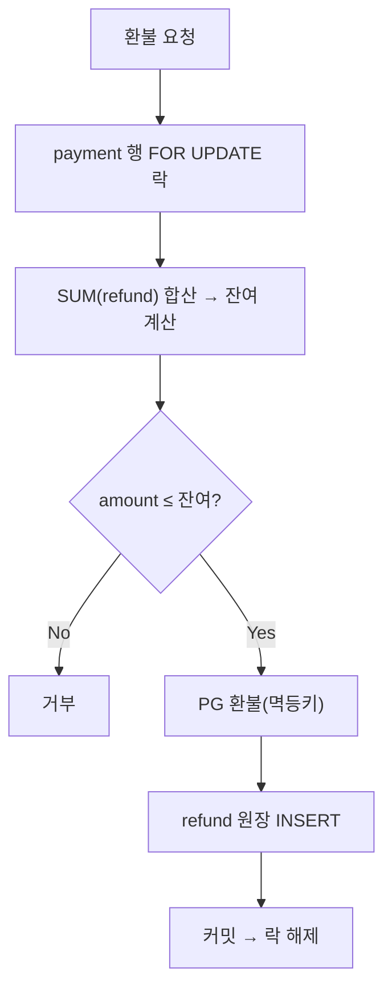

결제 취소·환불을 손본 주가 있었다. 전액 취소는 쉽다. 어려운 건 부분 취소다. 5만 원 결제에서 1만 원, 다시 2만 원을 환불하면 남은 한도는 2만 원이다. 이 누적과 잔여를 어떻게 정확히, 그리고 동시 요청에서도 안전하게 관리하느냐가 본질이다.

## 현재 잔액만 들고 있으면 안 되는 이유

가장 순진한 설계는 결제 행에 `refunded_amount` 하나를 두고 환불할 때마다 더하는 것이다. 두 가지가 무너진다.

1. **이력이 사라진다.** 언제 얼마를 누가 왜 환불했는지 복원할 수 없다. CS·정산·분쟁 대응에서 치명적이다.
2. **동시성에 약하다.** read-modify-write라 두 환불 요청이 겹치면 갱신 손실(lost update)이 난다.

그래서 **원장(ledger)** 모델을 쓴다. 환불을 "갱신"이 아니라 **append-only 거래 기록**으로 다룬다.

## 원장 기반 설계

```sql
CREATE TABLE refund (
    id           BIGINT PRIMARY KEY AUTO_INCREMENT,
    payment_id   BIGINT NOT NULL,
    amount       BIGINT NOT NULL,        -- 항상 양수
    reason       VARCHAR(200),
    created_at   DATETIME NOT NULL,
    INDEX idx_payment (payment_id)
);
```

잔여 환불 가능액은 저장하지 않고 **계산**한다.

```sql
SELECT p.amount - COALESCE(SUM(r.amount), 0) AS refundable
FROM payment p
LEFT JOIN refund r ON r.payment_id = p.id
WHERE p.id = :paymentId
GROUP BY p.id, p.amount;
```

환불 처리는 잔여 한도를 검증하고 원장에 한 줄을 추가한다.

```java
@Transactional
public Refund refund(long paymentId, long amount) {
    // 결제 행을 비관적 락으로 잠가 동시 환불을 직렬화
    Payment p = paymentRepo.findByIdForUpdate(paymentId)
            .orElseThrow();
    long alreadyRefunded = refundRepo.sumByPaymentId(paymentId);
    long refundable = p.getAmount() - alreadyRefunded;
    if (amount <= 0 || amount > refundable) {
        throw new RefundExceedsLimitException(refundable, amount);
    }
    pgClient.refund(p.getPaymentKey(), amount);   // 멱등 키 동반
    return refundRepo.save(new Refund(paymentId, amount));
}
```

## 동시 환불 경쟁 제어

핵심 위험은 **잔여 한도를 두 요청이 동시에 읽는 것**이다. 둘 다 "잔여 3만, 2만 환불 가능"이라 판단하면 합계 4만이 통과해 한도를 넘는다.

방어는 두 가지다.

- **비관적 락**: 위 예시처럼 결제 행을 `SELECT ... FOR UPDATE`로 잠그면 환불 요청이 한 번에 하나씩 직렬 처리된다.
- **DB 제약으로 최후 방어**: 애플리케이션 검증을 통과하더라도, 누적 환불 ≤ 결제액을 DB 레벨에서 강제하는 방어선을 두면 코드 버그에도 무결성이 깨지지 않는다.



## 운영 함정

**1) PG 환불 호출과 DB 기록의 순서·멱등성.** PG 환불은 성공했는데 DB 커밋 전에 죽으면, 재시도 시 이중 환불이 날 수 있다. PG에 멱등 키를 넘기고, 트랜잭션 경계와 외부 호출 순서를 신중히 둔다.

**2) 잔여를 캐싱하지 마라.** 성능을 이유로 잔여 한도를 캐시하면 동시성에서 틀어진다. 잔여는 원장 합으로 그때그때 계산하고, 느리면 인덱스로 푼다.

## 핵심 요약

- 환불은 갱신이 아니라 append-only 원장 기록. 잔여는 `결제액 - SUM(환불액)`로 계산한다.
- 동시 환불은 비관적 락으로 직렬화하고, DB 제약으로 누적 ≤ 결제액을 최후 방어한다.
- PG 외부 호출은 멱등 키로 이중 환불을 막는다.

> Q. 부분 환불에서 잔여 한도를 결제 행 한 컬럼에 누적하면 무엇이 문제인가?
> A. 이력이 사라지고, read-modify-write라 동시 환불 시 갱신 손실로 한도를 초과할 수 있다. 원장 합산 + 락이 정석이다.
