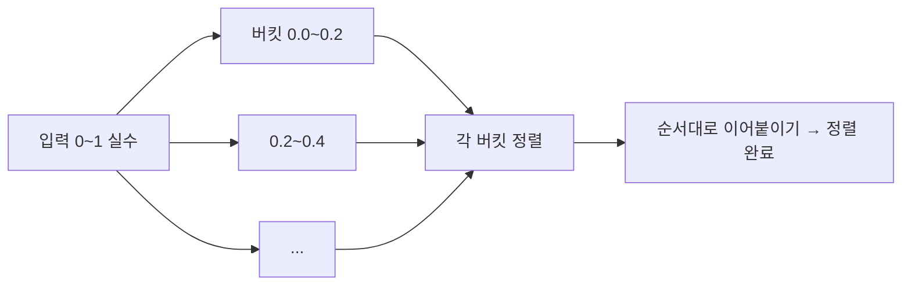
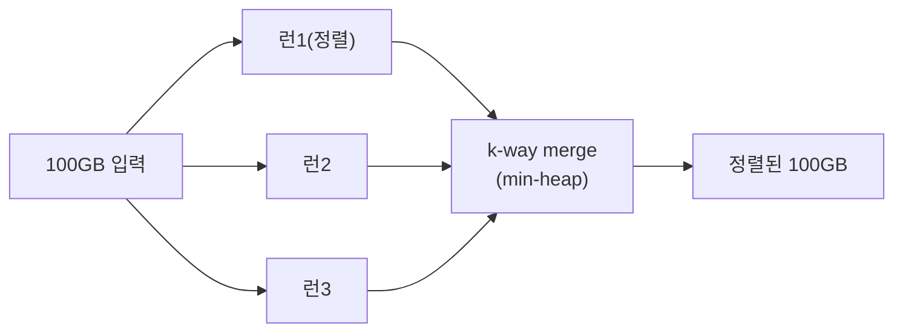

## 벽을 넘는 법: 규칙을 바꾼다

지난 글 [비교 정렬]()에서 본 **Ω(n log n)** 은 "원소를 **비교만** 한다면" 깨지지 않는 벽이었습니다. 그런데 만약 키가 "0~99 사이 정수"처럼 **구조(범위·자릿수)** 를 갖는다면? 그 구조를 직접 이용하면 비교를 한 번도 안 하고 **O(n)** 에 정렬할 수 있습니다. 게임의 규칙을 바꾸는 거죠. 이 글은 그 세 가지 — **계수·기수·버킷 정렬** — 과, 메모리에 안 들어가는 데이터를 위한 **외부 정렬**을 다룹니다.

## 계수 정렬(Counting Sort) — 세어서 자리를 정한다

키가 작은 정수 범위($0 \le key < k$)라면, 각 값이 **몇 번 나오는지 세고**, 그 누적합으로 **각 값이 들어갈 위치**를 바로 계산할 수 있습니다. 비교는 0번.

```python
def counting_sort(a, k):
    count = [0] * k
    for x in a: count[x] += 1          # 1) 도수 세기
    for i in range(1, k): count[i] += count[i-1]  # 2) 누적합 = 위치
    out = [0] * len(a)
    for x in reversed(a):              # 3) 뒤에서부터 → 안정성 보장
        count[x] -= 1
        out[count[x]] = x
    return out
```

아래는 원소들이 값별 카운트 칸에 쌓였다가, 누적합으로 계산된 제자리로 떨어지는 과정입니다.

<div class="sortl6-count" markdown="0">
<style>
.sortl6-count{margin:1.4rem 0;overflow-x:auto}
.sortl6-count svg{width:100%;max-width:620px;height:auto;display:block;margin:0 auto;font-family:inherit}
.sortl6-count .sub{fill:currentColor;font-size:10px;opacity:.65}
.sortl6-count .box{fill:none;stroke:currentColor;stroke-width:1.3;opacity:.4}
.sortl6-count .lbl{fill:#fff;font-size:12px;font-weight:700}
.sortl6-count .t{fill:currentColor;font-size:11px;font-weight:600}
.sortl6-count .e{fill:#1971c2}
.sortl6-count .d0{animation:sortl6c0 7s ease-in-out infinite}
.sortl6-count .d1{animation:sortl6c1 7s ease-in-out infinite}
.sortl6-count .d2{animation:sortl6c2 7s ease-in-out infinite}
.sortl6-count .d3{animation:sortl6c3 7s ease-in-out infinite}
@keyframes sortl6c0{0%,15%{transform:translate(0,0)}45%{transform:translate(-120px,70px)}70%{transform:translate(-120px,70px)}100%,85%{transform:translate(-60px,140px)}}
@keyframes sortl6c1{0%,15%{transform:translate(0,0)}45%,70%{transform:translate(60px,70px)}100%,85%{transform:translate(120px,140px)}}
@keyframes sortl6c2{0%,15%{transform:translate(0,0)}45%,70%{transform:translate(-120px,70px)}100%,85%{transform:translate(-120px,140px)}}
@keyframes sortl6c3{0%,15%{transform:translate(0,0)}45%,70%{transform:translate(-60px,70px)}100%,85%{transform:translate(0px,140px)}}
</style>
<svg viewBox="0 0 560 230" role="img" aria-label="원소들이 값별 카운트 칸에 쌓였다가 누적합으로 계산된 제자리로 이동해 정렬되는 계수 정렬 애니메이션">
  <text class="sub" x="20" y="16">입력</text>
  <g transform="translate(200,4)">
    <rect class="e d0" x="0"  width="40" height="34" rx="4"/><text class="lbl d0" x="20" y="23" text-anchor="middle">2</text>
    <rect class="e d1" x="48" width="40" height="34" rx="4"/><text class="lbl d1" x="68" y="23" text-anchor="middle">0</text>
    <rect class="e d2" x="96" width="40" height="34" rx="4"/><text class="lbl d2" x="116" y="23" text-anchor="middle">2</text>
    <rect class="e d3" x="144" width="40" height="34" rx="4"/><text class="lbl d3" x="164" y="23" text-anchor="middle">1</text>
  </g>
  <text class="sub" x="20" y="96">카운트 칸 (값별)</text>
  <g transform="translate(200,80)">
    <rect class="box" x="0"  width="56" height="40" rx="4"/><text class="t" x="28" y="56" text-anchor="middle">값0</text>
    <rect class="box" x="64" width="56" height="40" rx="4"/><text class="t" x="92" y="56" text-anchor="middle">값1</text>
    <rect class="box" x="128" width="56" height="40" rx="4"/><text class="t" x="156" y="56" text-anchor="middle">값2</text>
  </g>
  <text class="sub" x="20" y="172">정렬 결과</text>
  <g transform="translate(200,160)">
    <rect class="box" x="0"  width="40" height="34" rx="4"/>
    <rect class="box" x="48" width="40" height="34" rx="4"/>
    <rect class="box" x="96" width="40" height="34" rx="4"/>
    <rect class="box" x="144" width="40" height="34" rx="4"/>
    <text class="t" x="96" y="56" text-anchor="middle">0 · 1 · 2 · 2</text>
  </g>
</svg>
</div>

- 시간 **$O(n + k)$**, 공간 $O(n + k)$. `k`(값의 범위)가 `n`에 비례하거나 작을 때만 이득.
- **뒤에서부터** 배치하면 **안정 정렬**이 됩니다 — 다음의 기수 정렬이 이 성질에 전적으로 의존합니다.
- 한계: `k`가 거대하면(예: 32비트 전체) 카운트 배열이 폭발. 그래서 **자릿수로 쪼갠** 기수 정렬이 등장합니다.

## 기수 정렬(Radix Sort) — 자릿수별로 반복

큰 정수를 한 번에 못 세면, **자릿수(digit) 단위로** 나눠 정렬합니다. LSD(least significant digit) 방식은 **가장 낮은 자리부터** 계수 정렬(안정!)을 반복합니다. 안정성 덕분에 윗자리를 정렬해도 아랫자리 순서가 보존되어, $d$번 돌면 전체가 정렬됩니다.

<div class="sortl6-radix" markdown="0">
<style>
.sortl6-radix{margin:1.4rem 0;overflow-x:auto}
.sortl6-radix svg{width:100%;max-width:640px;height:auto;display:block;margin:0 auto;font-family:inherit}
.sortl6-radix .sub{fill:currentColor;font-size:10px;opacity:.65}
.sortl6-radix .lbl{fill:#fff;font-size:11px;font-weight:700}
.sortl6-radix .e{fill:#2f9e44;opacity:.9}
.sortl6-radix .hl{fill:#e8590c}
.sortl6-radix .step{animation:sortl6r 8s ease-in-out infinite}
@keyframes sortl6r{0%,18%{transform:translateY(0);opacity:1}30%,48%{transform:translateY(46px);opacity:1}60%,100%{transform:translateY(0);opacity:1}}
.sortl6-radix .ph1{animation:sortl6ph1 8s step-end infinite}
.sortl6-radix .ph2{animation:sortl6ph2 8s step-end infinite}
@keyframes sortl6ph1{0%{opacity:1}50%{opacity:0}100%{opacity:0}}
@keyframes sortl6ph2{0%{opacity:0}50%{opacity:1}100%{opacity:1}}
</style>
<svg viewBox="0 0 600 130" role="img" aria-label="기수 정렬이 1의 자리 정렬 후 10의 자리로 다시 정렬하며 두 단계로 완성되는 애니메이션">
  <text class="sub ph1" x="20" y="18">1단계: 1의 자리로 정렬 → 70, 21, 32, 53</text>
  <text class="sub ph2" x="20" y="18">2단계: 10의 자리로 정렬 → 21, 32, 53, 70 (완료)</text>
  <g transform="translate(150,40)">
    <rect class="e step" x="0"   width="64" height="40" rx="5"/><text class="lbl step" x="32" y="25" text-anchor="middle">53</text>
    <rect class="e step" x="80"  width="64" height="40" rx="5"/><text class="lbl step" x="112" y="25" text-anchor="middle">21</text>
    <rect class="e step" x="160" width="64" height="40" rx="5"/><text class="lbl step" x="192" y="25" text-anchor="middle">70</text>
    <rect class="e step" x="240" width="64" height="40" rx="5"/><text class="lbl step" x="272" y="25" text-anchor="middle">32</text>
  </g>
  <text class="sub" x="300" y="122" text-anchor="middle">낮은 자리부터 안정 정렬을 반복하면 전체가 정렬된다</text>
</svg>
</div>

- 시간 **$O(d \cdot (n+b))$** — $d$=자릿수, $b$=진법(기수). 자릿수가 상수면 사실상 **O(n)**.
- 고정폭 키(정수, 고정 길이 문자열, IPv4)에 강력. DB가 정수 키를 대량 정렬할 때 내부적으로 쓰기도 합니다.

## 버킷 정렬(Bucket Sort) — 고르게 흩뿌리고 모은다

키가 **구간에 균등 분포**한다고 기대되면, 값을 여러 버킷으로 흩뿌린 뒤 각 버킷을 (작으니) 간단히 정렬하고 이어 붙입니다. 균등 분포 가정이 맞으면 기대 **$O(n)$**, 한 버킷에 쏠리면 그 버킷 정렬 비용으로 최악 $O(n^2)$ 또는 $O(n\log n)$.



| | 계수 정렬 | 기수 정렬 | 버킷 정렬 |
|---|---|---|---|
| 가정 | 작은 정수 범위 k | 고정폭 키(d자리) | 균등 분포 |
| 시간 | O(n+k) | O(d·(n+b)) | 기대 O(n) |
| 비교? | 안 함 | 안 함 | 버킷 내부만 |
| 약점 | k 폭발 | d 큰 키 | 분포 쏠림 |

> 셋 다 비교를 버린 대가로 **키에 가정**을 둡니다. "정렬이면 무조건 O(n log n)"이라는 오해는, 키가 비교밖에 안 되는 일반 객체일 때만 참입니다.

## 외부 정렬(External Sort) — 메모리에 안 들어갈 때

데이터가 100GB인데 RAM이 8GB라면? **외부 정렬**은 (1) 메모리에 들어갈 만큼씩 읽어 정렬해 **정렬된 런(run)** 으로 디스크에 쓰고, (2) 이 런들을 **k-way 병합**합니다. 병합은 [머지 정렬]()의 병합 단계와 똑같고, 다음 런에서 어느 파일의 가장 작은 값을 뽑을지는 [힙(우선순위 큐)]()로 고릅니다.



이건 단순한 교과서 얘기가 아닙니다 — **DB의 `ORDER BY`가 메모리를 넘기면** 디스크 임시 파일로 정확히 이 외부 정렬을 하고, 빅데이터의 정렬·셔플 단계(MapReduce/Spark)도 본질은 같습니다.

## 프로덕션 함정

| 함정 | 증상 | 해법 |
|------|------|------|
| 계수 정렬 k 폭발 | 32비트 키에 카운트 배열 40억 칸 | 기수 정렬로 자릿수 분할 |
| 기수 정렬 안정성 깨짐 | 내부 정렬이 불안정 → 결과 오류 | 각 자릿수는 반드시 **안정** 정렬(계수) |
| 버킷 쏠림 | 분포 가정 틀려 한 버킷에 몰림 | 분포 확인, 폴백 정렬 보장 |
| 음수·부동소수 | 비트 순서가 정수와 달라 오정렬 | 부호/지수 비트 변환 후 기수 정렬 |
| 외부 정렬 I/O 폭주 | 런이 너무 작아 병합 패스 증가 | 메모리 버퍼 키워 런 크게, 병합 차수↑ |

## 면접/리뷰 단골 질문

- **Q. O(n) 정렬이 가능한데 왜 안 쓰나?** → 키에 가정(작은 범위·고정폭·균등분포)이 필요. 일반 비교 가능 객체엔 적용 불가, 그땐 Ω(n log n).
- **Q. 기수 정렬이 안정 정렬에 의존하는 이유?** → 낮은 자리부터 정렬할 때 윗자리 정렬이 아랫자리 순서를 보존해야 누적이 맞음. 불안정이면 깨짐.
- **Q. 계수 vs 기수 선택?** → 값 범위 k가 작으면 계수, 크면 자릿수로 쪼갠 기수.
- **Q. DB가 큰 정렬을 어떻게 하나?** → 메모리 초과 시 외부 정렬(런 생성 + k-way 병합). 우선순위 큐로 최소값 선택.
- **Q. 버킷 정렬 최악?** → 모두 한 버킷에 몰리면 그 버킷 정렬 비용. 균등 분포가 깨지면 O(n²)까지.

## 정리

- 키에 **구조(범위·자릿수·분포)** 가 있으면 비교를 버리고 **계수·기수·버킷**으로 **O(n)** 정렬이 가능 — Ω(n log n)은 비교 기반에서만 성립하는 벽.
- 기수 정렬은 각 자릿수를 **안정** 정렬(계수)로 처리하는 데 전적으로 의존한다.
- 메모리를 넘는 데이터는 **외부 정렬**(런 생성 + k-way 힙 병합) — DB `ORDER BY`·빅데이터 셔플의 실체.

> 정렬 두 편으로 "순서"를 다뤘습니다. 다음 글 [이진 탐색]()에서, 이렇게 정렬해 둔 데이터를 **O(log n)** 에 찾는 법으로 넘어갑니다.
</content>
