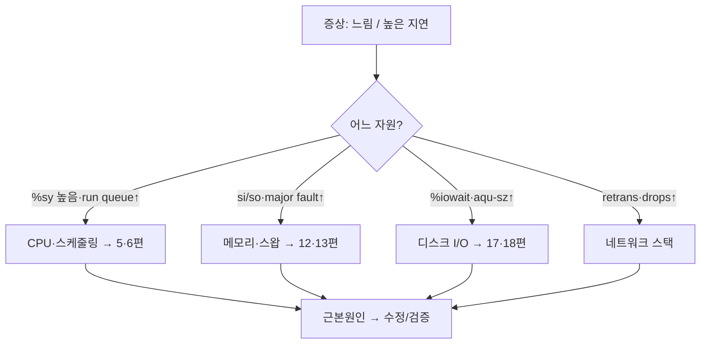

## "서버가 느려요"라는 말부터 의심하라

운영 중 가장 자주 듣고, 가장 다루기 어려운 한 문장이 "느려요"입니다. 느린 게 CPU인지 메모리인지 디스크인지 네트워크인지, 그게 커널인지 애플리케이션인지를 **말하지 않은 채** 추측이 시작됩니다. 그리고 추측은 거의 항상 틀립니다 — "CPU 늘립시다"라고 인스턴스를 키웠는데 알고 보니 디스크 `iowait`이 원인이었던 경험은 누구에게나 있습니다.

이 마지막 글은 새로운 개념이 아니라 **방법론**입니다. 지금까지 [프로세스]()·[스케줄링]()·[가상 메모리]()·[페이지 폴트]()·[I/O]()·[페이지 캐시]()를 따로따로 팠습니다. 이제 이 조각들을 **하나의 진단 체계**로 묶어, "느려요"가 들어왔을 때 **어느 자원의 어느 계층을 어떤 도구로 들여다볼지**를 정합니다. 추측을 측정으로 바꾸는 것이 이 시리즈 전체의 결론입니다.

## 추측을 막는 틀: USE 방법론

브렌던 그레그(Brendan Gregg)의 **USE 방법론**은 막막함을 없애는 체크리스트입니다. 모든 자원(CPU·메모리·디스크·네트워크·인터커넥트)에 대해 세 가지를 묻습니다.

- **Utilization(이용률)**: 그 자원이 일하는 시간의 비율. CPU 90%, 디스크 95% busy처럼.
- **Saturation(포화)**: 처리하지 못해 **대기열에 쌓인** 정도. run queue 길이, 디스크 I/O 큐, swap 발생.
- **Errors(에러)**: 실패한 작업. 패킷 드롭, 디스크 에러, ECC.

핵심 통찰은 **이용률이 100%가 아니어도 포화가 병목을 만든다**는 점입니다. CPU가 평균 60%여도 특정 순간 run queue가 길게 쌓이면(saturation) 응답은 느립니다. 그래서 utilization만 보는 모니터링은 병목을 놓칩니다. 아래 흐름도처럼 **자원마다 U→S→E를 순서대로 훑어** 가장 먼저 빨개지는 곳을 범인으로 좁힙니다.

<div class="os-use" markdown="0">
<style>
.os-use{margin:1.4rem 0;overflow-x:auto}
.os-use svg{width:100%;max-width:720px;height:auto;display:block;margin:0 auto;font-family:inherit}
.os-use .bx{fill:none;stroke:currentColor;stroke-width:1.5;opacity:.5}
.os-use .lbl{fill:currentColor;font-size:12px;font-weight:600}
.os-use .sub{fill:currentColor;font-size:10px;opacity:.6}
.os-use .scan{fill:#1971c2;opacity:0}
.os-use .s1{animation:osusescan 6s ease-in-out infinite}
.os-use .s2{animation:osusescan 6s ease-in-out infinite .6s}
.os-use .s3{animation:osusescan 6s ease-in-out infinite 1.2s}
.os-use .s4{animation:osusescan 6s ease-in-out infinite 1.8s}
@keyframes osusescan{0%{opacity:0}6%{opacity:.85}24%{opacity:.85}30%{opacity:0}100%{opacity:0}}
.os-use .hit{fill:#e03131;opacity:0;animation:osusehit 6s ease-in-out infinite}
@keyframes osusehit{0%,55%{opacity:0}62%{opacity:.9}92%{opacity:.9}100%{opacity:0}}
.os-use .hitline{stroke:#e03131;stroke-width:2;opacity:0;animation:osusehit 6s ease-in-out infinite}
.os-use .pulse{fill:#e03131;opacity:0;animation:osusepulse 6s ease-in-out infinite}
@keyframes osusepulse{0%,58%{opacity:0;transform:scale(1)}66%{opacity:.5;transform:scale(1.15)}80%{opacity:0;transform:scale(1.3)}100%{opacity:0}}
</style>
<svg viewBox="0 0 720 230" role="img" aria-label="CPU·메모리·디스크·네트워크 자원을 순서대로 점검하다 디스크가 병목으로 빨갛게 강조되는 USE 진단 흐름도 애니메이션">
  <text class="lbl" x="20" y="24">자원별 점검 (Utilization → Saturation → Errors)</text>
  <g>
    <rect class="bx" x="20" y="44" width="150" height="60" rx="8"/>
    <rect class="scan s1" x="20" y="44" width="150" height="60" rx="8"/>
    <text class="lbl" x="95" y="72" text-anchor="middle">CPU</text>
    <text class="sub" x="95" y="90" text-anchor="middle">%us %sy / run queue</text>
  </g>
  <g>
    <rect class="bx" x="190" y="44" width="150" height="60" rx="8"/>
    <rect class="scan s2" x="190" y="44" width="150" height="60" rx="8"/>
    <text class="lbl" x="265" y="72" text-anchor="middle">메모리</text>
    <text class="sub" x="265" y="90" text-anchor="middle">free / swap si·so</text>
  </g>
  <g>
    <rect class="bx" x="360" y="44" width="150" height="60" rx="8"/>
    <rect class="scan s3" x="360" y="44" width="150" height="60" rx="8"/>
    <rect class="hit" x="360" y="44" width="150" height="60" rx="8"/>
    <circle class="pulse" cx="435" cy="74" r="34" style="transform-origin:435px 74px"/>
    <text class="lbl" x="435" y="72" text-anchor="middle" fill="#fff" style="opacity:1">디스크 ★</text>
    <text class="sub" x="435" y="90" text-anchor="middle" fill="#fff" style="opacity:.95">%util 98 · 큐 포화</text>
  </g>
  <g>
    <rect class="bx" x="530" y="44" width="150" height="60" rx="8"/>
    <rect class="scan s4" x="530" y="44" width="150" height="60" rx="8"/>
    <text class="lbl" x="605" y="72" text-anchor="middle">네트워크</text>
    <text class="sub" x="605" y="90" text-anchor="middle">retrans / drops</text>
  </g>
  <text class="lbl" x="20" y="150">증상: 응답 지연</text>
  <line class="bx" x1="95" y1="160" x2="95" y2="180"/>
  <text class="sub" x="20" y="200">① 자원을 차례로 스캔(파랑) →</text>
  <text class="sub" x="300" y="200">② 가장 먼저 포화된 자원이 범인(빨강) →</text>
  <text class="sub" x="540" y="200">③ 그 계층으로 파고든다</text>
  <line class="hitline" x1="435" y1="110" x2="435" y2="190"/>
  <text class="sub" x="435" y="222" text-anchor="middle" fill="#e03131" style="opacity:1">디스크 I/O 병목 확정 → iostat·blktrace로 심화</text>
</svg>
</div>

> **현실 체크 — "평균은 거짓말을 한다."** CPU 사용률 "평균 50%"는 두 개의 코어가 각각 100%/0%일 때도, 모든 코어가 50%일 때도 같은 값입니다. p99 지연을 죽이는 건 보통 **순간 포화**와 **꼬리 지연**이지 평균이 아닙니다. 평균(utilization)에 더해 **분포와 큐(saturation)**를 같이 보세요 — `vmstat`의 `r`(run queue), `iostat`의 `aqu-sz`(평균 큐 길이)가 그 창입니다.

## 자원별 도구 지도

USE의 각 칸을 채우는 리눅스 도구를 한 장으로 정리하면 이렇습니다. 외울 건 "어디가 아픈지에 따라 어느 도구를 먼저 잡는가"입니다.

| 자원 | Utilization | Saturation | Errors |
|---|---|---|---|
| **CPU** | `top`/`mpstat`(%us·%sy) | `vmstat` r, load avg | `perf`, dmesg(MCE) |
| **메모리** | `free`, `/proc/meminfo` | `vmstat` si/so(swap), OOM | dmesg(OOM kill) |
| **디스크** | `iostat -x`(%util) | `iostat`(aqu-sz), `%iowait` | `smartctl`, dmesg |
| **네트워크** | `sar -n DEV` | `ss -ti`(retrans), drops | `ip -s link`, `ethtool -S` |



## load average를 오해하지 말 것

`uptime`의 load average는 "CPU 사용률"이 아닙니다. 리눅스에서 load는 **실행 가능(R) + 중단 불가 대기(D, 보통 디스크 I/O) 상태 태스크의 이동 평균**입니다. 그래서 CPU가 한가해도 디스크가 막히면 load가 치솟습니다.

```text
load 8.0, 코어 4개  →  run queue가 코어의 2배로 쌓임(포화). 다만 D상태(I/O)가
                       섞였다면 CPU가 아니라 디스크가 범인일 수 있다. %iowait를 함께 봐라.
```

`top`의 한 줄을 분해해 읽는 습관이 진단의 8할입니다.

```bash
# CPU 시간의 행방: us(유저)·sy(커널/시스템콜·인터럽트)·wa(I/O 대기)·id(유휴)·st(stolen, VM)
top                 # 또는 mpstat -P ALL 1 로 코어별
vmstat 1            # r(run queue)·b(blocked)·si/so(swap)·wa  — 한 화면에 USE 요약
# %sy가 비정상적으로 높다 → 시스템콜·인터럽트·컨텍스트 스위치 과다 의심
pidstat -w 1        # 프로세스별 컨텍스트 스위치 (6편)
```

`%sy`(시스템 시간)가 높다는 건 [1편]()에서 본 **모드 전환·시스템콜**이 과하다는 신호고, `%wa`가 높다는 건 [블록 I/O]() 병목이라는 신호입니다. 같은 "느림"이라도 어느 칸이 빨간지에 따라 파고들 편이 달라집니다.

## 어디서 시간을 쓰는가: 프로파일링과 flame graph

자원을 좁혔으면, 다음은 "코드의 **어느 경로**가 그 자원을 먹는가"입니다. 여기서 **샘플링 프로파일러** `perf`가 등장합니다 — 일정 주기로 콜스택을 표본 추출해, 가장 자주 잡히는 스택이 곧 hot path입니다. 이를 시각화한 것이 **flame graph**: 가로폭이 그 함수가 CPU에 잡힌 표본 비율(=시간)이고, 세로는 호출 깊이입니다. **넓은 봉우리가 범인**입니다.

<div class="os-flame" markdown="0">
<style>
.os-flame{margin:1.4rem 0;overflow-x:auto}
.os-flame svg{width:100%;max-width:680px;height:auto;display:block;margin:0 auto;font-family:inherit}
.os-flame .lbl{fill:currentColor;font-size:11px;font-weight:600}
.os-flame .sub{fill:currentColor;font-size:9.5px;opacity:.6}
.os-flame .fr{stroke:#fff;stroke-width:1;opacity:0}
.os-flame .grow{animation:osflamegrow 5s ease-out infinite}
@keyframes osflamegrow{0%{opacity:0}10%{opacity:.85}100%{opacity:.85}}
.os-flame .hot{fill:#e03131}
.os-flame .warm{fill:#f08c00}
.os-flame .cool{fill:#1971c2}
.os-flame .glow{fill:none;stroke:#e03131;stroke-width:2.5;opacity:0;animation:osflameglow 5s ease-in-out infinite}
@keyframes osflameglow{0%,55%{opacity:0}65%{opacity:.9}90%{opacity:.9}100%{opacity:0}}
</style>
<svg viewBox="0 0 680 230" role="img" aria-label="flame graph가 아래에서 위로 스택 프레임을 쌓으며 가장 넓은 hot 경로가 빨갛게 강조되는 애니메이션">
  <text class="lbl" x="20" y="22">flame graph · 가로폭 = CPU에 잡힌 시간 비율</text>
  <rect class="fr cool grow" x="40" y="180" width="600" height="26" rx="2" style="animation-delay:0s"/>
  <text class="sub" x="340" y="197" text-anchor="middle" fill="#fff" style="opacity:1">main()</text>

  <rect class="fr cool grow" x="40" y="152" width="180" height="26" rx="2" style="animation-delay:.5s"/>
  <text class="sub" x="130" y="169" text-anchor="middle" fill="#fff" style="opacity:1">parse()</text>
  <rect class="fr warm grow" x="224" y="152" width="416" height="26" rx="2" style="animation-delay:.5s"/>
  <text class="sub" x="432" y="169" text-anchor="middle" fill="#fff" style="opacity:1">handle_request()</text>

  <rect class="fr cool grow" x="224" y="124" width="120" height="26" rx="2" style="animation-delay:1s"/>
  <text class="sub" x="284" y="141" text-anchor="middle" fill="#fff" style="opacity:1">auth()</text>
  <rect class="fr hot grow" x="348" y="124" width="292" height="26" rx="2" style="animation-delay:1s"/>
  <text class="sub" x="494" y="141" text-anchor="middle" fill="#fff" style="opacity:1">serialize_json()</text>

  <rect class="fr hot grow" x="360" y="96" width="270" height="26" rx="2" style="animation-delay:1.5s"/>
  <text class="sub" x="495" y="113" text-anchor="middle" fill="#fff" style="opacity:1">memcpy() ← hot</text>

  <rect class="glow" x="356" y="92" width="284" height="62" rx="4"/>
  <text class="sub" x="495" y="78" text-anchor="middle" fill="#e03131" style="opacity:1">가장 넓은 봉우리 = 시간을 가장 많이 먹는 경로</text>
  <text class="sub" x="40" y="226">↑ 위로 갈수록 깊은 콜스택 · 좁은 프레임(parse·auth)은 무시, 넓은 hot path부터 최적화</text>
</svg>
</div>

flame graph를 읽는 규칙은 단순합니다. **좁은 프레임은 무시하고, 바닥부터 넓게 이어지는 봉우리를 찾는다.** 위 그림이라면 `serialize_json → memcpy`가 전체의 절반 가까이를 먹으므로, 직렬화 경로(불필요한 복사·할당)를 먼저 손봐야 합니다. 마이크로 최적화로 좁은 `parse()`를 갈아봐야 전체 체감은 안 바뀝니다.

```bash
# 1) 무엇이 CPU를 먹나 — 실시간 함수별 상위
sudo perf top

# 2) 30초 표본 수집 → flame graph (Brendan Gregg FlameGraph)
sudo perf record -F 99 -a -g -- sleep 30
sudo perf script | stackcollapse-perf.pl | flamegraph.pl > flame.svg

# 3) 시스템콜이 의심되면 — 횟수·소요시간 집계 (1편의 그 strace)
strace -c -f -p <pid>

# 4) eBPF로 커널까지 거의 무비용 관측 (요즘 표준)
sudo bpftrace -e 'tracepoint:syscalls:sys_enter_* { @[probe] = count(); }'  # 시스템콜 분포
sudo biolatency-bpfcc        # 블록 I/O 지연 히스토그램 (18편)
sudo offcputime-bpfcc        # 왜 CPU를 안 쓰고 멈춰있나(off-CPU) — 블로킹 분석
```

> **현실 체크 — "CPU가 안 바쁜데 느리다"의 정체.** 흔한 함정은 **off-CPU 시간**입니다. 스레드가 락 대기([8·9편]())나 디스크 I/O로 **잠들어 있으면** perf의 on-CPU 프로파일엔 안 잡힙니다. 그래서 on-CPU flame graph가 텅 비었는데도 느릴 수 있습니다. 이때는 `offcputime`으로 "어디서 블로킹돼 잠드는가"를 봐야 진짜 병목이 보입니다.

## 한 번의 진단을 끝까지: 사례

증상 하나를 USE로 끝까지 추적해 봅시다.

1. **증상**: API p99 지연이 평소 20ms → 800ms로 튐. CPU 사용률은 평균 45%로 멀쩡.
2. **자원 좁히기(USE)**: `vmstat 1` → `wa`(iowait) 35%, `b`(blocked) 다수. `r`은 낮음 → CPU 아님, **디스크 포화** 의심.
3. **계층 좁히기**: `iostat -x 1` → 특정 디바이스 `%util` 99%, `aqu-sz` 12. `pidstat -d 1` → 로그 쓰는 프로세스가 범인.
4. **근본원인**: 동기 `fsync`를 요청마다 호출([16편 저널링]())해 디스크 큐가 포화. [페이지 캐시]()의 write-back을 못 살리고 있었음.
5. **수정·검증**: 로그를 배치/비동기 flush로 전환 → `%util` 40%대, p99 25ms 복귀. **추측 없이 숫자로 닫음.**

이 흐름 — 증상 → 자원(USE) → 계층 → 근본원인 → 검증 — 이 시리즈 전체가 향한 목적지입니다.

## 면접/리뷰 단골 질문

- **Q. USE 방법론이 뭐고 왜 유용한가?** → 모든 자원에 Utilization·Saturation·Errors를 묻는 체크리스트. 막연한 "느림"을 자원 단위로 체계적으로 좁혀 누락 없이 병목을 찾게 해준다. 특히 이용률이 낮아도 포화로 느려지는 경우를 잡는다.
- **Q. load average가 높은데 CPU는 한가하다. 왜?** → 리눅스 load는 R + D(중단 불가, 주로 디스크 I/O) 태스크 평균이라, I/O가 막히면 CPU가 놀아도 치솟는다. `%iowait`/`iostat`로 디스크를 확인하라.
- **Q. %us와 %sy의 차이, %sy가 높으면?** → us는 유저 코드, sy는 커널(시스템콜·인터럽트·컨텍스트 스위치). sy가 높으면 시스템콜 과다·인터럽트 폭주·잦은 전환을 의심하고 strace -c, perf로 확인한다.
- **Q. flame graph는 어떻게 읽나?** → 가로폭이 시간 비율, 세로가 콜 깊이. 넓은 봉우리(바닥부터 이어지는)가 hot path. 좁은 프레임 최적화는 효과가 없다.
- **Q. perf로 안 보이는 느림은?** → off-CPU(락/IO 대기로 잠든) 시간. on-CPU 프로파일러엔 안 잡히므로 offcputime(eBPF)으로 블로킹 지점을 본다.

## 정리

- 성능 디버깅의 제1원칙은 **추측 금지, 측정 우선.** "느려요"를 자원·계층·근본원인으로 분해한다.
- **USE 방법론**(Utilization·Saturation·Errors)으로 자원을 빠짐없이 훑어 병목을 좁힌다 — 이용률보다 **포화**가 병목을 만든다.
- 도구 지도를 손에: CPU=`top`/`vmstat`/`mpstat`, 메모리=`free`/swap, 디스크=`iostat`, 네트워크=`ss`/`sar`. load·%us·%sy·%wa를 분해해 읽어라.
- 자원을 좁힌 뒤엔 `perf` + **flame graph**로 hot path를, 안 보이면 **off-CPU(eBPF)**로 블로킹을 찾는다.
- 이 모든 신호는 결국 시리즈의 각 편(스케줄링·페이지 폴트·I/O·캐시·동기화)으로 되돌아간다 — 진단이란 그 지식을 역방향으로 더듬는 일이다.

> 시리즈를 마치며: [1편]()에서 운영체제를 "하드웨어를 **추상화·중재·보호**하는 계층"으로 정의했습니다. 20편을 지나온 지금, 프로세스·스레드·스케줄링은 *중재*였고, 가상 메모리·페이징·격리는 *추상화와 보호*였으며, 파일시스템·I/O는 느린 장치를 *추상화*해 숨기는 일이었습니다. 그리고 이 글의 성능 분석은 그 모든 추상이 **현실의 하드웨어와 부딪히는 지점**을 보는 법이었습니다. 이 OS라는 토대 위에서, 다음 여정인 네트워크와 백엔드가 돌아갑니다.
