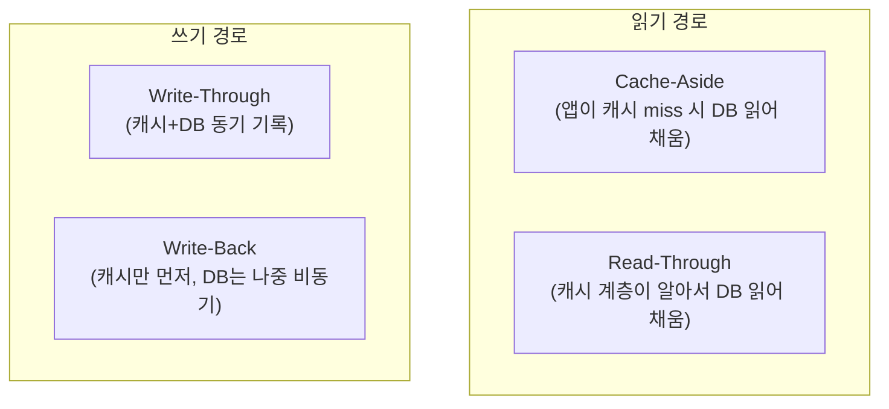
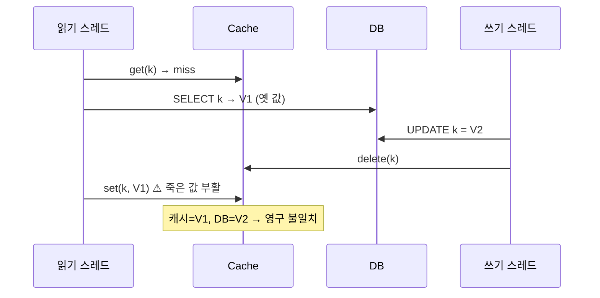
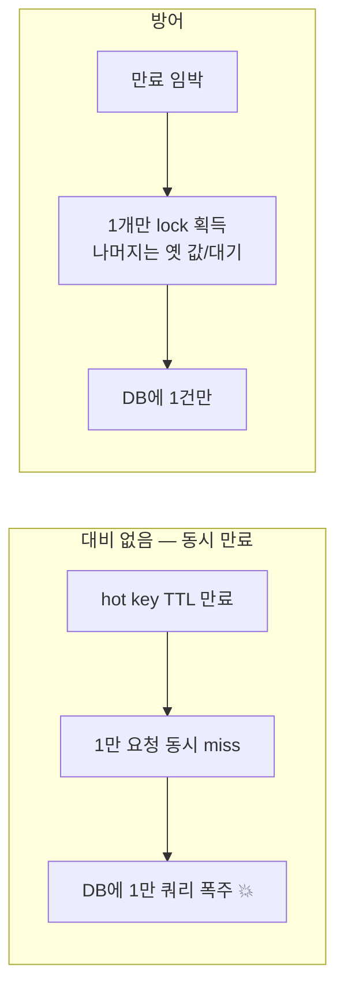

## "캐시를 깔았더니 어쩌다 옛날 값이 나와요"

DB가 버거워서 앞에 Redis를 한 대 세웁니다. CPU 그래프가 거짓말처럼 내려가고, p99 응답이 80ms에서 3ms로 떨어집니다. 영웅이 된 기분입니다. 그러다 며칠 뒤, CS팀에서 티켓이 옵니다. "프로필 이름을 바꿨는데 다른 사람한테는 옛날 이름이 보인대요." 가끔, 재현도 잘 안 됩니다. 새로고침하면 또 정상입니다.

이게 캐시의 본질입니다. **캐시는 같은 데이터를 두 군데에 두는 것**이고, 두 군데에 둔 데이터는 언젠가 어긋납니다. 컴퓨터 과학에 농담이 하나 있죠. "어려운 문제는 둘뿐이다 — 캐시 무효화, 이름 짓기, 그리고 off-by-one 에러." 캐시 무효화가 첫 번째로 꼽히는 데는 이유가 있습니다.

[앞 글]()에서 KV 저장소(Redis/DynamoDB)가 단순·초고속이라는 특성을 봤습니다. 이 글은 그 빠른 KV를 **RDBMS 앞에 캐시로 세웠을 때** 무슨 일이 벌어지는지를, "어떻게 쓰나"가 아니라 **"왜 일관성이 깨지나"**의 관점에서 끝까지 따라갑니다. 결론부터: 캐시는 정답이 아니라 트레이드오프입니다. 지연·부하를 사는 대신 **일관성과 복잡도를 지불**합니다.

> 이 시리즈에는 Redis 자체(자료구조·영속성·클러스터)를 다루는 별도 글들이 있습니다. 이 글은 그것과 겹치지 않게, **DB 앞 캐시의 패턴과 일관성**만 봅니다.
{: .prompt-info }

## 왜 캐시인가 — 두 가지 비대칭을 사는 것

캐시가 효과를 내는 이유는 두 가지 비대칭 때문입니다.

- **속도 비대칭**: RAM 접근은 수십~수백 나노초, DB 쿼리는 디스크/플래너/락을 거쳐 밀리초. 3~4자릿수 차이입니다.
- **접근 분포의 비대칭**: 실제 트래픽은 균등하지 않습니다. 상위 1%의 키가 전체 읽기의 절반을 먹는 일이 흔합니다(Zipf 분포). 그 1%만 메모리에 얹어도 DB 읽기의 대부분이 사라집니다.

즉 캐시는 "**자주 읽고 드물게 바뀌는 데이터**"에서만 이깁니다. 매번 바뀌는 데이터를 캐시하면 무효화 비용만 늘고 hit rate는 0에 수렴합니다. 캐시를 얹기 전 첫 질문은 항상 "이 데이터의 읽기:쓰기 비율과 stale 허용치는 얼마인가"여야 합니다.

## 네 가지 패턴 — 누가 캐시를 채우고, 누가 DB를 쓰나

캐시 패턴은 결국 **"읽을 때 캐시를 어떻게 채우나"**와 **"쓸 때 캐시·DB를 어떤 순서로 건드리나"**의 조합입니다.



### Cache-Aside (lazy loading) — 가장 흔하고, 가장 미묘한

애플리케이션이 캐시를 **직접** 관리합니다. 캐시는 그냥 옆에 놓인(aside) 멍청한 KV 저장소일 뿐, DB의 존재를 모릅니다.

```python
def get_user(uid):
    v = cache.get(f"user:{uid}")
    if v is not None:        # hit
        return v
    v = db.query("SELECT ... WHERE id=%s", uid)  # miss → DB
    cache.set(f"user:{uid}", v, ex=300)          # 다음을 위해 채움 (TTL 5분)
    return v

def update_user(uid, data):
    db.update("UPDATE users SET ... WHERE id=%s", uid)
    cache.delete(f"user:{uid}")   # ★ 갱신이 아니라 "삭제"
```

쓰기에서 `cache.set`(갱신)이 아니라 **`cache.delete`(무효화)**를 한다는 점이 핵심입니다. 왜 삭제일까요? 갱신하려면 "캐시에 넣을 최종 형태"를 앱이 다시 계산해야 하는데, 동시에 다른 쓰기가 끼면 어느 값이 최신인지 알 수 없습니다. 삭제는 단순합니다 — "이 키는 더 이상 못 믿겠으니 다음 읽기가 DB에서 새로 길어 와라." 이 **delete-on-write**가 cache-aside의 정석입니다.

장점: 캐시가 죽어도 DB로 폴백되어 시스템이 산다(캐시 장애 격리). 실제 읽힌 것만 캐시되어 메모리 효율이 좋다. 단점: 첫 읽기는 항상 miss(cold start), 그리고 뒤에서 볼 **race condition**과 **stampede**에 취약합니다.

### Read-Through / Write-Through — 캐시 계층이 DB를 안다

cache-aside가 앱의 책임이라면, read/write-through는 **캐시 계층(라이브러리/프록시)이 DB 접근을 대신**합니다. 앱은 캐시에게만 말을 걸고, miss면 캐시가 알아서 DB를 읽어 채웁니다(read-through). 쓰기는 캐시에 쓰면 캐시가 **동기적으로** DB에도 씁니다(write-through).

write-through의 매력은 "캐시와 DB가 항상 같다"는 것처럼 들리는 점인데, 함정이 있습니다. 두 저장소에 연달아 쓰는 것은 **원자적이지 않습니다.** 캐시 쓰기 성공 → DB 쓰기 직전 크래시면 둘이 어긋납니다. 그래서 보통 **DB를 먼저 쓰고 캐시를 갱신/삭제**합니다. 또 write-through는 "쓰는 모든 것을 캐시한다"라서, 한 번 쓰고 안 읽는 데이터까지 캐시를 더럽힙니다(그래서 보통 read-through와 짝지어 쓰거나, 쓰기 시엔 무효화만 합니다).

### Write-Back (write-behind) — 빠르지만 가장 위험한

쓰기를 **캐시에만 먼저 반영하고 즉시 응답**한 뒤, DB 반영은 배치로 모아서 비동기로 합니다. 쓰기 지연이 극적으로 줄고, 같은 키를 여러 번 쓰면 합쳐서(coalesce) DB 부하도 줄어듭니다. 사실 이건 새로운 개념이 아닙니다 — DB의 [WAL/버퍼풀]()이 더티 페이지를 모았다가 나중에 쓰는 것과 같은 아이디어죠.

대가는 명확합니다. **DB에 반영되기 전 캐시가 죽으면 그 쓰기는 증발**합니다. 즉 영속성(durability)을 지연 시간과 맞바꾼 것입니다. 카운터·조회수·좋아요처럼 "조금 잃어도 되는" 데이터에는 훌륭하지만, 결제·잔액에 쓰면 사고입니다.

| 패턴 | 누가 채우나 | 쓰기 동작 | 강점 | 약점 |
|------|------------|-----------|------|------|
| Cache-Aside | 앱 (miss 시) | DB 쓰고 캐시 **삭제** | 단순·장애 격리 | cold miss, race |
| Read-Through | 캐시 계층 | (read 전용) | 앱 단순화 | 캐시 계층 결합 |
| Write-Through | 캐시 계층 | 캐시+DB 동기 | 캐시 항상 최신 | 쓰기 지연, 비원자성 |
| Write-Back | 앱/계층 | 캐시 먼저, DB 나중 | 쓰기 초고속 | **데이터 유실 위험** |

## 읽기·쓰기·무효화 경로를 한눈에

아래 애니메이션은 cache-aside의 세 흐름을 보여줍니다 — **hit**(캐시에서 바로), **miss**(DB로 내려가 채움), 그리고 **쓰기 시 무효화**(DB 갱신 후 캐시 삭제).

<div class="cacheflow-demo" markdown="0">
<style>
.cacheflow-demo{margin:1.4rem 0;overflow-x:auto}
.cacheflow-demo svg{width:100%;max-width:760px;height:auto;display:block;margin:0 auto;font-family:inherit}
.cacheflow-demo .lbl{fill:currentColor;font-size:12px;font-weight:600}
.cacheflow-demo .sub{fill:currentColor;font-size:10px;opacity:.6}
.cacheflow-demo .bx{fill:none;stroke:currentColor;stroke-width:1.5;opacity:.55}
.cacheflow-demo .node{fill:currentColor;font-size:12px;font-weight:600}
.cacheflow-demo .hit{fill:#2f9e44;offset-path:path('M 150,70 L 360,70');animation:cacheflowHit 9s ease-in-out infinite}
.cacheflow-demo .miss1{fill:#1971c2;offset-path:path('M 150,70 L 360,70');animation:cacheflowMiss1 9s ease-in-out infinite}
.cacheflow-demo .miss2{fill:#f08c00;offset-path:path('M 410,90 L 410,150');animation:cacheflowMiss2 9s ease-in-out infinite}
.cacheflow-demo .miss3{fill:#f08c00;offset-path:path('M 360,150 L 150,90');animation:cacheflowMiss3 9s ease-in-out infinite}
.cacheflow-demo .inv{fill:#e03131;offset-path:path('M 410,150 L 410,90');animation:cacheflowInv 9s ease-in-out infinite}
.cacheflow-demo .invx{opacity:0;animation:cacheflowInvX 9s ease-in-out infinite}
.cacheflow-demo .tag-hit{fill:#2f9e44;opacity:0;animation:cacheflowTagHit 9s ease-in-out infinite}
.cacheflow-demo .tag-miss{fill:#1971c2;opacity:0;animation:cacheflowTagMiss 9s ease-in-out infinite}
.cacheflow-demo .tag-inv{fill:#e03131;opacity:0;animation:cacheflowTagInv 9s ease-in-out infinite}
@keyframes cacheflowHit{0%{offset-distance:0%;opacity:0}3%{opacity:1}25%{offset-distance:100%;opacity:1}28%,100%{offset-distance:100%;opacity:0}}
@keyframes cacheflowMiss1{30%{offset-distance:0%;opacity:0}33%{opacity:1}42%{offset-distance:100%;opacity:1}45%,100%{opacity:0}}
@keyframes cacheflowMiss2{0%,42%{offset-distance:0%;opacity:0}45%{opacity:1}54%{offset-distance:100%;opacity:1}57%,100%{opacity:0}}
@keyframes cacheflowMiss3{0%,57%{offset-distance:0%;opacity:0}60%{opacity:1}70%{offset-distance:100%;opacity:1}73%,100%{opacity:0}}
@keyframes cacheflowInv{0%,75%{offset-distance:0%;opacity:0}78%{opacity:1}90%{offset-distance:100%;opacity:1}93%,100%{opacity:0}}
@keyframes cacheflowInvX{0%,89%{opacity:0}92%,100%{opacity:.9}}
@keyframes cacheflowTagHit{0%,2%{opacity:0}5%,27%{opacity:1}30%,100%{opacity:0}}
@keyframes cacheflowTagMiss{0%,32%{opacity:0}35%,72%{opacity:1}75%,100%{opacity:0}}
@keyframes cacheflowTagInv{0%,77%{opacity:0}80%,100%{opacity:1}}
</style>
<svg viewBox="0 0 760 230" role="img" aria-label="cache-aside 패턴의 세 가지 흐름을 차례로 보여주는 애니메이션: 캐시 hit는 클라이언트가 캐시에서 바로 값을 받고, miss는 캐시를 지나 DB로 내려가 값을 읽어 캐시를 채운 뒤 반환하며, 쓰기 시에는 DB를 갱신한 뒤 캐시의 해당 키를 삭제해 무효화한다">
  <!-- nodes -->
  <rect class="bx" x="40" y="50" width="110" height="42" rx="6"/>
  <text class="node" x="95" y="76" text-anchor="middle">App</text>
  <rect class="bx" x="350" y="50" width="120" height="42" rx="6"/>
  <text class="node" x="410" y="70" text-anchor="middle">Cache</text>
  <text class="sub" x="410" y="84" text-anchor="middle">user:42</text>
  <rect class="bx" x="350" y="150" width="120" height="42" rx="6"/>
  <text class="node" x="410" y="176" text-anchor="middle">DB</text>

  <!-- moving dots -->
  <circle class="hit" r="7"/>
  <circle class="miss1" r="7"/>
  <circle class="miss2" r="7"/>
  <circle class="miss3" r="7"/>
  <circle class="inv" r="7"/>

  <!-- invalidation X mark on cache -->
  <g class="invx">
    <line x1="395" y1="56" x2="425" y2="86" stroke="#e03131" stroke-width="2.4"/>
    <line x1="425" y1="56" x2="395" y2="86" stroke="#e03131" stroke-width="2.4"/>
  </g>

  <!-- captions -->
  <text class="lbl tag-hit" x="380" y="30" text-anchor="middle">① HIT — 캐시에서 즉시 반환</text>
  <text class="lbl tag-miss" x="380" y="30" text-anchor="middle">② MISS — DB로 내려가 읽고 캐시를 채움</text>
  <text class="lbl tag-inv" x="380" y="30" text-anchor="middle">③ WRITE — DB 갱신 후 캐시 키 삭제(무효화)</text>
  <text class="sub" x="250" y="120">miss: 캐시→DB</text>
  <text class="sub" x="210" y="110">→ 채워서 반환</text>
</svg>
</div>

## 무효화가 어려운 진짜 이유

"DB 쓰고 캐시 지운다"는 한 줄짜리 규칙이 왜 그렇게 어렵다는 걸까요. 단일 요청만 보면 안 어렵습니다. **동시성**이 끼는 순간 무너집니다.

### Race condition — miss를 채우는 사이에 누가 끼어든다

cache-aside의 고전적 레이스입니다. 읽기 스레드가 miss를 만나 DB에서 **옛 값 V1**을 읽었습니다. 그런데 응답이 캐시에 도착하기 직전, 쓰기 스레드가 DB를 **V2로 갱신하고 캐시를 삭제**합니다. 그 직후 읽기 스레드가 손에 든 V1을 캐시에 `set`합니다. 결과: **DB는 V2인데 캐시는 V1을 영원히(또는 TTL이 끝날 때까지) 들고 있습니다.**



이 레이스가 무효화의 본질적 어려움입니다. **삭제와 채움의 순서를 앱이 통제할 수 없기** 때문이죠. 완화책:

- **TTL을 안전망으로**: 영구 불일치를 "최대 TTL만큼의 불일치"로 줄입니다. 그래서 어떤 캐시든 TTL은 거의 필수입니다.
- **짧은 락/CAS**: miss 채움을 직렬화하거나, Redis `SET ... XX`/Lua로 "내가 읽은 버전이 여전히 최신일 때만" 채웁니다.
- **버전/타임스탬프 태깅**: 값에 DB의 갱신 시각/버전을 함께 저장해, 더 오래된 값으로 덮어쓰지 않습니다.

### "DB 먼저 vs 캐시 먼저" — 어느 것을 먼저 지우나

쓰기에서 순서도 함정입니다. **캐시 먼저 삭제 → DB 갱신** 순서면, 삭제와 갱신 사이의 짧은 틈에 다른 읽기가 miss → 옛 DB값을 캐시에 다시 채워버립니다. 그래서 **DB 먼저, 캐시 나중** 삭제가 정석입니다. 그래도 위 레이스는 남기에, 일부 시스템은 **delete를 두 번**(갱신 직후 + 짧은 지연 뒤 한 번 더, "delayed double delete") 보내 틈을 메웁니다. 더 견고하게 가려면 무효화를 추측하지 말고 **DB의 변경 로그를 따라가게** 만듭니다 — [WAL 기반 복제]()처럼, CDC(Change Data Capture)로 커밋된 변경을 구독해 캐시를 지우면 "DB와 캐시 호출 사이의 틈"이 사라집니다.

> 정합성이 정말 중요하면, **불일치를 0으로 만들려 하기보다 "불일치 시간을 유계로 만들고(TTL) + 틀린 값을 빨리 자가치유(self-heal)"**하는 쪽이 현실적입니다. 캐시에서 강한 일관성을 공짜로 기대하지 마세요.
{: .prompt-warning }

## 캐시 스탬피드 — 인기 키가 만료되는 순간의 떼죽음

일관성 다음으로 캐시를 운영할 때 터지는 게 **스탬피드(thundering herd, dog-piling)**입니다. 시나리오: 초당 1만 건 읽히는 인기 키의 TTL이 만료됩니다. 그 순간 만 개의 요청이 **동시에 miss**를 보고, 만 개가 **동시에 같은 무거운 쿼리로 DB에 쏟아집니다.** 캐시로 보호하려던 DB가 캐시 만료 한 번에 정전됩니다. 더 나쁜 건, 그 쿼리가 1초 걸리면 그 1초 동안 들어온 요청까지 전부 miss를 보고 합류한다는 점입니다.



세 가지 방어가 표준입니다.

- **재계산 락 (single-flight)**: miss 시 키마다 락을 잡아 **딱 한 요청만 DB로 보내고**, 나머지는 그 결과를 기다리거나 직전 값을 받습니다. Go의 `singleflight`, Redis 분산 락(`SET NX`)으로 구현합니다.
- **TTL 지터(jitter)**: 모든 키에 똑같은 TTL을 주면 함께 태어난 키들이 **함께 만료**됩니다(동기화된 떼죽음). TTL에 `300s ± random(0~60s)`처럼 무작위를 섞어 만료 시점을 흩뿌립니다.
- **사전 갱신(early recomputation / probabilistic)**: TTL이 끝나기 **전에** 미리 비동기로 다시 계산해 둡니다. 확률적 조기 만료(XFetch: 만료가 가까울수록 확률적으로 한 요청만 미리 재계산)가 우아한 기법입니다. 핵심은 **만료를 절벽이 아니라 완만한 경사로** 만드는 것입니다.

아래 애니메이션이 차이를 보여줍니다 — 락 없이 다수 요청이 DB로 쏟아지는 모습 vs single-flight로 한 요청만 통과시키고 나머지는 기다리는 모습.

<div class="stampede-demo" markdown="0">
<style>
.stampede-demo{margin:1.4rem 0;overflow-x:auto}
.stampede-demo svg{width:100%;max-width:760px;height:auto;display:block;margin:0 auto;font-family:inherit}
.stampede-demo .lbl{fill:currentColor;font-size:12px;font-weight:600}
.stampede-demo .sub{fill:currentColor;font-size:10px;opacity:.6}
.stampede-demo .bx{fill:none;stroke:currentColor;stroke-width:1.5;opacity:.55}
.stampede-demo .db{fill:#e03131;opacity:.18;stroke:#e03131;stroke-width:1.5}
.stampede-demo .dbok{fill:#2f9e44;opacity:.18;stroke:#2f9e44;stroke-width:1.5}
.stampede-demo .herd{fill:#e03131}
.stampede-demo .h1{offset-path:path('M 70,55 L 320,90');animation:stampedeH 4.5s ease-in infinite}
.stampede-demo .h2{offset-path:path('M 70,85 L 320,90');animation:stampedeH 4.5s ease-in infinite .15s}
.stampede-demo .h3{offset-path:path('M 70,115 L 320,90');animation:stampedeH 4.5s ease-in infinite .3s}
.stampede-demo .h4{offset-path:path('M 70,145 L 320,90');animation:stampedeH 4.5s ease-in infinite .45s}
.stampede-demo .one{fill:#2f9e44;offset-path:path('M 470,100 L 700,100');animation:stampedeOne 4.5s ease-in-out infinite}
.stampede-demo .wait{fill:#f08c00;opacity:0}
.stampede-demo .w1{animation:stampedeWait 4.5s ease-in-out infinite}
.stampede-demo .w2{animation:stampedeWait 4.5s ease-in-out infinite .1s}
.stampede-demo .w3{animation:stampedeWait 4.5s ease-in-out infinite .2s}
@keyframes stampedeH{0%{offset-distance:0%;opacity:0}10%{opacity:1}80%{offset-distance:100%;opacity:1}90%,100%{opacity:0}}
@keyframes stampedeOne{0%{offset-distance:0%;opacity:0}10%{opacity:1}70%{offset-distance:100%;opacity:1}80%,100%{opacity:0}}
@keyframes stampedeWait{0%,12%{opacity:0}25%,70%{opacity:.9}80%,100%{opacity:0}}
</style>
<svg viewBox="0 0 760 210" role="img" aria-label="캐시 스탬피드 비교 애니메이션: 왼쪽은 락 없이 여러 요청이 동시에 만료된 키를 보고 DB로 한꺼번에 쏟아져 DB가 과부하되는 모습, 오른쪽은 single-flight 락으로 한 요청만 DB로 통과시키고 나머지 요청은 대기시켜 DB에는 한 건만 도달하는 모습">
  <text class="lbl" x="180" y="20" text-anchor="middle">방어 없음 — 떼죽음</text>
  <text class="lbl" x="585" y="20" text-anchor="middle">single-flight 락</text>
  <line x1="380" y1="35" x2="380" y2="195" stroke="currentColor" stroke-width="1" opacity=".25" stroke-dasharray="4 4"/>

  <!-- left: stampede -->
  <text class="sub" x="50" y="50" text-anchor="end">req</text>
  <rect class="bx db" x="300" y="68" width="60" height="46" rx="6"/>
  <text class="node lbl" x="330" y="96" text-anchor="middle" fill="#e03131">DB 💥</text>
  <circle class="herd h1" r="6"/>
  <circle class="herd h2" r="6"/>
  <circle class="herd h3" r="6"/>
  <circle class="herd h4" r="6"/>
  <text class="sub" x="180" y="180" text-anchor="middle">동시 miss → DB에 N 쿼리</text>

  <!-- right: single flight -->
  <rect class="bx" x="430" y="78" width="50" height="44" rx="6"/>
  <text class="sub" x="455" y="104" text-anchor="middle">lock</text>
  <rect class="bx dbok" x="660" y="78" width="60" height="44" rx="6"/>
  <text class="node lbl" x="690" y="105" text-anchor="middle" fill="#2f9e44">DB</text>
  <circle class="one" r="6"/>
  <circle class="wait w1" cx="450" cy="140" r="6"/>
  <circle class="wait w2" cx="470" cy="140" r="6"/>
  <circle class="wait w3" cx="490" cy="140" r="6"/>
  <text class="sub" x="470" y="166" text-anchor="middle">나머지는 대기</text>
  <text class="sub" x="585" y="180" text-anchor="middle">DB에는 단 1건</text>
</svg>
</div>

## Hot key와 큰 key — 캐시 안에서의 편향

스탬피드가 시간축의 편향이라면, **hot key**는 공간축의 편향입니다. Redis 클러스터에서 한 키는 **하나의 샤드(노드)**에만 존재합니다([샤딩의 핫스팟]()과 같은 문제). 어떤 키 하나가 트래픽의 절반을 받으면, 클러스터가 100대여도 그 키를 가진 한 대만 불타고 나머지는 논다 — 수평 확장이 무력화됩니다. 완화책은 **키 분산**(`hotkey` → `hotkey:{0..9}` 같은 N개 복제본에 읽기를 분산), **로컬 캐시 2단계**(앱 프로세스 내 작은 캐시로 hot key를 흡수), 또는 클라이언트 측 캐싱(Redis 6의 client-side caching)입니다.

**큰 key(big key)**는 또 다른 함정입니다. 수십만 원소의 리스트/해시 한 개를 캐시하면, 그 키 하나를 읽거나 만료/삭제하는 동안 단일 스레드 이벤트 루프가 멈춰 **다른 모든 요청이 블록**됩니다. 큰 값은 쪼개서(필드 단위 hash, 페이지 단위 분할) 캐시해야 합니다.

## 복제 읽기와 비교 — 캐시만이 답은 아니다

읽기 부하를 더는 방법이 캐시만 있는 건 아닙니다. [읽기 전용 복제본(read replica)]()으로도 읽기를 분산할 수 있습니다. 둘은 **일관성 모델이 다릅니다**:

- **복제 읽기**: 트랜잭션·SQL·인덱스가 그대로 살아 있고, 지연은 "복제 lag"으로 유계입니다(보통 수~수백 ms). 단 read-your-writes가 깨질 수 있습니다(방금 쓴 걸 replica에서 못 봄).
- **캐시**: 지연이 ns~µs로 훨씬 짧지만, 일관성은 **무효화 정책에 전적으로 의존**하고 쿼리 표현력(조인·범위)이 없습니다.

규칙: **"비싼 계산 결과나 객체 단위 조회"는 캐시, "여전히 SQL이 필요한 읽기 확장"은 복제**. 둘을 함께 쓰는 게 보통입니다(복제로 기본 읽기 확장 + 캐시로 hot path 가속).

## 면접/리뷰 단골 질문

- **Q. cache-aside에서 쓰기 시 캐시를 `set`이 아니라 `delete`하는 이유는?** → 동시 쓰기 시 어느 값이 최신인지 앱이 보장할 수 없기 때문. 삭제하면 다음 읽기가 DB에서 권위 있는 값을 새로 길어 와 채운다(delete-on-write). set은 stale 값을 덮어쓸 위험이 있다.
- **Q. "DB 먼저 vs 캐시 먼저" 무효화 순서는?** → DB 먼저 쓰고 캐시를 나중에 삭제. 캐시를 먼저 지우면 삭제~DB갱신 사이의 틈에 다른 읽기가 옛 값을 다시 채울 수 있다. 그래도 남는 레이스는 TTL·CDC·delayed double delete로 완화한다.
- **Q. 캐시 스탬피드(thundering herd)란? 어떻게 막나?** → 인기 키가 동시에 만료돼 다수 요청이 동시에 miss → DB에 폭주하는 현상. 재계산 락(single-flight)으로 한 요청만 통과, TTL 지터로 만료 분산, 확률적 사전 갱신으로 만료 절벽 제거.
- **Q. TTL을 두는 진짜 이유는?** → 단순 메모리 회수만이 아니라, **무효화 누락/레이스로 생긴 영구 불일치를 "TTL만큼의 유계 불일치"로 줄이는 안전망**. 정합성과 hit rate의 타협점이다.
- **Q. write-back은 언제 쓰고 무엇을 잃나?** → 쓰기를 캐시에만 먼저 하고 DB는 비동기로. 쓰기 지연이 극적으로 줄지만, DB 반영 전 캐시가 죽으면 그 쓰기가 유실된다(durability를 latency와 맞바꿈). 조회수·카운터엔 적합, 잔액엔 부적합.
- **Q. hot key 문제와 완화책은?** → 한 키는 한 샤드에만 있어, 특정 키에 트래픽이 몰리면 그 노드만 과부하되고 수평 확장이 무력화된다. 키 복제본 분산, 앱 로컬 2단계 캐시, 클라이언트 측 캐싱으로 완화.

## 정리

- 캐시는 **같은 데이터를 두 곳에 두는 것**이라 본질적으로 불일치가 따라온다 — 정답이 아니라 지연·부하를 사고 일관성·복잡도를 지불하는 **트레이드오프**.
- 네 패턴: cache-aside(앱이 miss 시 채우고 쓰기 시 **삭제**), read/write-through(캐시 계층이 DB 담당), write-back(캐시 먼저·DB 나중, **유실 위험**).
- 무효화가 어려운 진짜 이유는 동시성 — **miss 채움과 쓰기 무효화의 race**가 죽은 값을 부활시킨다. 순서는 "DB 먼저, 캐시 나중", 그래도 남는 틈은 TTL·CDC로 메운다.
- **스탬피드**는 인기 키 동시 만료로 인한 DB 폭주. single-flight 락·TTL 지터·사전 갱신으로 막는다. **hot key**는 한 샤드 과부하 — 분산·로컬 캐시로 완화.
- 캐시 vs 복제 읽기는 일관성 모델이 다르다. **계산 결과·객체 조회는 캐시, SQL이 필요한 읽기 확장은 복제** — 보통 함께 쓴다.

> 다음 글: 캐시·복제로도 못 가리는 DB 본체의 운영을 다룹니다 — 커넥션 풀, bloat 재구성, 슬로우 쿼리, 그리고 NewSQL·벡터·시계열 같은 현대 DB 지형까지. [운영의 기술과 현대 DB 지형]()으로 시리즈를 마무리합니다.
</content>
</invoke>
