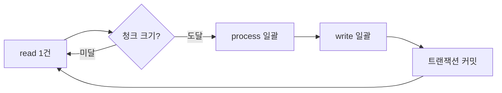

대량 적재 작업을 페이지 단위로 끊어 읽는 일은 배치의 기본이다. 그런데 "끊어 읽기"를 잘못 설계하면 페이지 경계에서 행을 빠뜨리거나, 잡이 중간에 죽었다가 재시작될 때 이미 처리한 행을 다시 읽는다. 핵심은 두 가지다. ItemReader가 페이지를 어떻게 넘기는지, 그리고 reader 쿼리 자체에 "아직 처리 안 된 것만 읽어라"는 조건을 거는 것이다.

## ItemReader는 무엇을 추상화하는가

Spring Batch의 청크 처리는 `read() → process() → write()`를 청크 크기만큼 반복하는 구조다. 이때 `ItemReader.read()`는 **한 번에 한 건**을 돌려주고, 더 읽을 게 없으면 `null`을 반환해 스텝을 끝낸다. 청크와 트랜잭션의 관계는 다음과 같다.



문제는 read()가 한 건씩 주더라도 **그 뒤에서 데이터를 어떻게 가져오느냐**다. 여기서 두 갈래로 갈린다.

- **커서 기반 reader**: DB 커넥션을 열어둔 채 `ResultSet`을 한 줄씩 스트리밍한다. 메모리는 일정하지만 커넥션을 스텝 내내 점유하고, 단일 커넥션이라 중간 결과를 본 시점의 스냅샷에 묶인다.
- **페이징 기반 reader**: `LIMIT/OFFSET`(또는 그에 준하는 쿼리)으로 한 페이지씩 따로 조회한다. 커넥션을 페이지마다 잡았다 놓으므로 오래 점유하지 않고, 청크 커밋 사이에 커넥션을 풀에 돌려줄 수 있다.

페이징 reader는 커넥션을 짧게 쓰는 대신 **페이지마다 별도 쿼리가 나간다는 사실**이 함정의 출발점이다.

## 페이지 경계와 정렬 안정성

페이징은 매 페이지가 독립된 쿼리다. 따라서 페이지 사이에 데이터가 바뀌거나 정렬 기준이 모호하면 경계가 흔들린다. 정렬 키가 유일하지 않으면(예: 생성일시만으로 정렬) DB는 동률 행의 순서를 보장하지 않는다. 1페이지 끝과 2페이지 시작에 같은 정렬값이 걸치면 어떤 행은 두 번, 어떤 행은 0번 읽힐 수 있다.

규칙은 단순하다. **정렬 키는 항상 유일성을 포함**시킨다. 보조 키로 PK를 덧붙이면 동률이 사라진다.

```java
@Bean
@StepScope
public JpaPagingItemReader<Account> accountReader() {
    return new JpaPagingItemReaderBuilder<Account>()
        .name("accountReader")
        .entityManagerFactory(emf)
        .pageSize(500)
        .queryString(
            "SELECT a FROM Account a " +
            "WHERE a.processed = false " +   // 미처리만
            "ORDER BY a.createdAt ASC, a.id ASC")  // 유일성 보장 정렬
        .build();
}
```

## 재시작 안전성 — OFFSET을 믿지 마라

여기가 핵심이다. 순진하게 `ORDER BY id LIMIT 500 OFFSET n*500`으로 읽으면서 처리할 때마다 행 상태를 바꾸면, **OFFSET이 어긋난다**. 1페이지 500건을 `processed = true`로 바꾸고 2페이지를 `OFFSET 500`으로 읽는 순간, 이미 처리된 500건이 결과 집합에서 빠지므로 진짜 2페이지가 1페이지 자리로 당겨진다. 결과적으로 절반의 행을 건너뛴다.

해결의 본질은 **reader 쿼리가 "처리 대상"만 보게 하고, OFFSET을 0에 고정**하는 것이다. `WHERE processed = false`가 걸려 있으면 이미 끝난 행은 애초에 결과에 안 들어온다. 그래서 항상 첫 페이지만 반복해서 읽으면 된다(페이징 reader의 reset offset 옵션을 켜거나, 상태 조건 자체로 자연스럽게 줄어드는 큐를 만든다).

이 설계의 부수 효과가 바로 **멱등성**이다. 잡이 3페이지에서 죽어도, 재시작하면 reader는 다시 `processed = false`인 행만 본다. 이미 1~2페이지를 커밋했다면 그 행들은 결과에서 빠져 있으니 두 번 처리되지 않는다. Spring Batch 메타데이터의 재시작 위치 복원에 의존하지 않고, **데이터 자체가 진행 상태를 들고 있게** 만드는 것이다.

상태 갱신은 write 단계와 같은 트랜잭션 안에서 일어나야 한다. 처리 결과 적재와 `processed = true` 갱신이 같은 청크 커밋에 묶이면, 둘 다 성공하거나 둘 다 롤백된다.

```java
// writer 안: 적재 + 상태 플래그를 같은 트랜잭션에서
public void write(Chunk<? extends Account> items) {
    for (Account a : items) {
        ledgerRepository.save(toLedger(a));
        a.markProcessed();   // dirty checking → 같은 커밋에 flush
    }
}
```

## 운영 함정

**함정 1 — 페이지 크기 = 청크 크기 불일치.** 페이지 500, 청크 1000이면 한 청크를 채우려고 페이지를 두 번 읽는다. 그 사이 별도 트랜잭션에서 데이터가 바뀌면 두 페이지의 스냅샷이 불일치할 수 있다. 둘을 맞추는 편이 추론하기 쉽다.

**함정 2 — 상태 플래그 인덱스 누락.** `WHERE processed = false`가 풀스캔으로 돌면 페이지마다 테이블 전체를 훑는다. 처리가 진행될수록 미처리 행은 줄지만 스캔 비용은 그대로다. `processed` 컬럼(또는 `(processed, id)` 복합)에 인덱스를 걸어 미처리 행만 빠르게 좁혀야 한다.

## 핵심 요약

- 페이징 reader는 페이지마다 독립 쿼리다. 정렬 키에 PK를 더해 **유일성**을 보장하라.
- 상태를 바꾸며 OFFSET을 증가시키면 행을 건너뛴다. **`WHERE 미처리` + OFFSET 고정**이 정답이다.
- 데이터가 진행 상태를 들고 있으면 재시작이 자동으로 멱등해진다. 메타데이터 복원에만 기대지 마라.

**면접 한 줄 Q&A**
Q. 페이징 ItemReader로 처리 중인 행의 상태를 바꾸면 왜 행을 건너뛰나?
A. OFFSET 기반 페이징은 매 페이지가 별도 쿼리인데, 처리된 행이 결과 집합에서 빠지면 뒤 페이지가 앞으로 당겨진다. reader 쿼리를 "미처리만" 보게 하고 OFFSET을 고정하면 해결된다.
