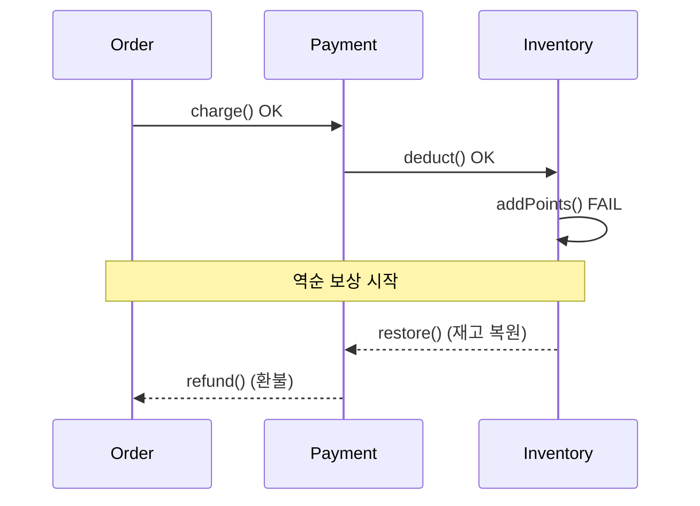

다단계 작업의 정합성을 다루다 보면 결국 한 지점에서 막힌다. DB는 롤백할 수 있어도, 이미 외부로 나간 결제·메일·재고 차감은 되돌릴 수 없다는 사실이다. 트랜잭션이 만능이라는 착각은 여기서 깨진다.

## 왜 외부 작업은 롤백되지 않는가

DB 트랜잭션의 원자성은 **undo log** 위에서 동작한다. 변경 전 이미지를 기록해 두고, 롤백 시 그 이미지로 되돌린다. 하지만 외부 시스템 호출은 이 로그 안에 들어오지 않는다. 결제 게이트웨이에 HTTP 요청을 보내 카드가 승인된 순간, 그 사실은 우리 트랜잭션 경계 밖의 세계에 새겨진다. 이후 우리 DB가 롤백되어도 카드 승인은 그대로 남는다.

게다가 흔히 저지르는 실수가 하나 더 있다. 트랜잭션 안에서 외부 호출을 하는 것이다.

```java
@Transactional
public void placeOrder(Order order) {
    orderRepository.save(order);        // 1) DB 변경
    paymentClient.charge(order);        // 2) 외부 결제 (롤백 불가)
    inventoryClient.deduct(order);      // 3) 외부 재고 (롤백 불가)
    pointService.addPoints(order);      // 4) 여기서 예외 → DB는 롤백, 2·3은 남음
}
```

4번에서 예외가 터지면 `save`는 깔끔히 롤백된다. 그러나 2번 결제와 3번 재고 차감은 외부에 이미 반영됐다. **DB는 일관적인데 외부 세계와는 불일치하는** 최악의 상태가 된다.

## 보상 트랜잭션

해법은 "취소를 새로운 정방향 작업으로 정의"하는 것이다. 결제의 보상은 환불, 재고 차감의 보상은 재고 복원이다. 실패 시 이미 성공한 단계들을 **역순으로** 보상한다.



이를 코드로 옮길 때 핵심은 **완료한 단계를 스택처럼 쌓고, 실패 지점부터 거꾸로 푸는 것**이다.

```java
public void placeOrder(Order order) {
    Deque<Runnable> compensations = new ArrayDeque<>();
    try {
        paymentClient.charge(order);
        compensations.push(() -> paymentClient.refund(order));

        inventoryClient.deduct(order);
        compensations.push(() -> inventoryClient.restore(order));

        pointService.addPoints(order);  // 실패 가능
    } catch (Exception e) {
        // 성공한 단계만 역순 보상
        compensations.forEach(Runnable::run);
        throw e;
    }
}
```

이것이 **사가(Saga)** 의 본질이다. 하나의 거대한 ACID 트랜잭션 대신, 로컬 트랜잭션의 연쇄와 각 단계의 보상으로 전체 정합성을 맞춘다. 강한 일관성을 포기하고 **최종 일관성(eventual consistency)** 을 택하는 거래다.

## 운영 함정

**보상도 실패한다.** 환불 API가 타임아웃이면 어떻게 되나. 보상은 반드시 **재시도 가능**해야 하고, 그러려면 **멱등(idempotent)** 해야 한다. 같은 환불 요청을 두 번 보내도 한 번만 환불되도록 idempotency key를 실어야 한다. 재시도해도 끝내 실패하면 그 작업은 보상 큐나 데드레터로 보내 사람이 개입하게 한다.

**외부 호출은 트랜잭션 밖으로 빼라.** 외부 호출을 `@Transactional` 안에 두면 그 호출이 끝날 때까지 DB 커넥션과 락을 붙잡는다. 결제 게이트웨이가 느려지면 커넥션 풀이 말라 장애가 전파된다. DB 작업은 짧게 커밋하고, 외부 연동은 별도 흐름으로 분리하는 것이 안전하다.

## 핵심 요약

- DB 롤백은 undo log 기반이라 외부 시스템에 반영된 변화는 되돌리지 못한다.
- 취소를 "역방향 정방향 작업(보상)"으로 정의하고, 실패 시 성공 단계를 역순으로 보상한다 — 이것이 사가다.
- 보상은 멱등하고 재시도 가능해야 하며, 외부 호출은 절대 트랜잭션 안에서 하지 않는다.
