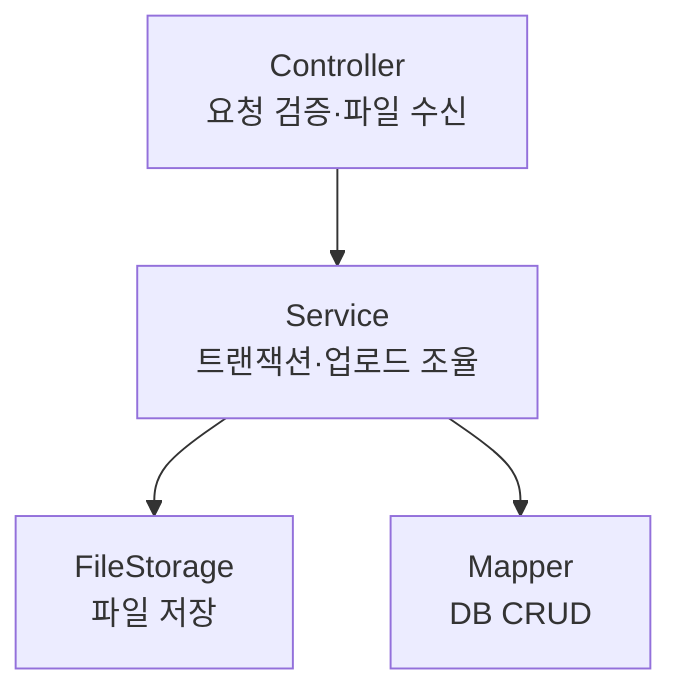

운영 관리 화면을 하나 만들면 다음 화면도 거의 같은 골격이 반복된다. 목록 / 등록 / 수정 / 삭제(CRUD)에 더해 거의 항상 따라붙는 세 가지 — **이미지 업로드, 노출 순서, 사용 여부 토글**. 이 골격을 한 번 제대로 정리해두면 새 관리 화면은 복붙에 가까워진다. generic한 `Vendor`(업체) 예시로 표준 구조를 정리한다.

## 도메인 모델 — 거의 항상 같은 필드

```java
public class Vendor {
    private Long id;
    private String name;
    private String logoUrl;       // 업로드된 이미지 경로
    private int displayOrder;     // 노출 순서 (작을수록 위)
    private boolean useFlag;      // 사용 여부 (소프트 토글)
    private LocalDateTime createdAt;
    private LocalDateTime updatedAt;
    // getters/setters
}
```

`useFlag`는 삭제 대신 "안 보이게 하기"다. 운영 데이터는 물리 삭제보다 비활성이 안전하다. 노출 순서는 관리자가 화면 순서를 직접 정하는 거의 모든 화면의 필수 컬럼이다.

## 계층별 책임



- **Controller**: HTTP 요청을 받고 입력을 검증한다. `MultipartFile`을 받아 서비스로 넘기는 것까지가 책임. 파일을 어디에 어떻게 저장할지는 모른다.
- **Service**: 트랜잭션 경계. 본문 저장과 이미지 업로드의 순서를 조율한다.
- **FileStorage**: 실제 파일 저장(로컬·오브젝트 스토리지). 저장 위치 정책을 캡슐화.
- **Mapper**: 순수 DB CRUD. SQL만 안다.

```java
@PostMapping("/vendors")
public ApiResult create(@Valid VendorForm form,
                        @RequestParam(required = false) MultipartFile logo) {
    vendorService.create(form, logo);   // 파일 처리 디테일은 서비스로
    return ApiResult.ok();
}
```

## 이미지 업로드를 본문 저장과 어떻게 엮나

여기가 진짜 함정이다. **DB 트랜잭션과 파일 저장은 서로 다른 자원**이다. DB는 롤백되지만, 디스크/스토리지에 이미 올라간 파일은 트랜잭션 롤백으로 사라지지 않는다. 순서를 잘못 잡으면 "DB엔 없는데 파일은 남은" 고아 파일, 혹은 "DB엔 경로가 있는데 파일은 없는" 깨진 링크가 생긴다.

원칙은 **DB가 진실의 원천**이고, **파일은 DB 커밋이 확정된 흐름에 맞춰 다룬다**는 것이다. 권장 순서는 이렇다.

```java
@Transactional
public void create(VendorForm form, MultipartFile logo) {
    // 1) 파일을 먼저 저장하되, 임시/확정 경로 전략으로 다룬다
    String savedPath = (logo != null && !logo.isEmpty())
            ? fileStorage.store(logo)   // 물리 저장 → 경로 반환
            : null;

    // 2) 경로를 포함해 DB INSERT
    Vendor v = form.toVendor();
    v.setLogoUrl(savedPath);
    vendorMapper.insert(v);
    // 트랜잭션 커밋 → 여기서 DB가 진실이 된다
}
```

DB INSERT가 실패하면 트랜잭션은 롤백되지만 파일은 남는다. 그래서 **저장에 실패한 파일을 정리하는 보상 로직**이나, 주기적으로 "DB에서 참조되지 않는 파일"을 청소하는 배치가 따라붙는다. 반대로 파일 저장에 실패하면 DB INSERT 자체를 진행하지 않으므로 깨진 링크는 안 생긴다.

수정 시 이미지를 교체하면 **옛 파일**도 정리 대상이 된다. 새 경로로 UPDATE가 커밋된 뒤 옛 파일을 지운다.

## 노출 순서와 사용 여부

```sql
-- 목록: 사용 중인 것만, 노출 순서대로
SELECT id, name, logo_url, display_order, use_flag
FROM vendors
WHERE use_flag = 1
ORDER BY display_order ASC, id ASC;

-- 삭제 대신 비활성 (소프트 삭제)
UPDATE vendors SET use_flag = 0, updated_at = NOW() WHERE id = #{id};
```

순서 변경은 보통 드래그 후 `[{id, order}, ...]` 배열을 받아 일괄 UPDATE한다. `ORDER BY display_order, id`로 동순위일 때 안정 정렬을 보장한다.

## 운영 함정

**함정 1 — 파일 저장과 DB를 한 트랜잭션으로 착각한다.** `@Transactional`은 DB만 롤백한다. 파일은 별도 자원이다. 고아 파일 정리 전략(보상 삭제 또는 청소 배치) 없이 가면 스토리지가 쓰레기로 찬다.

**함정 2 — 물리 삭제를 기본으로 둔다.** 운영 데이터를 `DELETE`하면 참조 무결성·이력·복구가 모두 깨진다. 기본은 `use_flag` 비활성, 진짜 삭제는 별도 정책으로.

## 핵심 요약

- 운영 CRUD는 목록/등록/수정/삭제 + 이미지 + 노출순서 + 사용여부의 반복이다 — 골격을 표준화하라.
- 컨트롤러는 검증·수신, 서비스는 트랜잭션·조율, 스토리지·매퍼는 각자 한 가지만.
- 파일은 DB 트랜잭션 밖의 자원이다. 고아 파일·깨진 링크를 막는 순서와 정리 전략이 핵심.

> **면접 한 줄**: "이미지 업로드를 DB 저장과 어떻게 묶나요?" → "DB를 진실의 원천으로 두고 트랜잭션 안에서 경로를 저장하되, 파일은 트랜잭션 밖 자원이라 롤백되지 않으므로 고아 파일 보상 삭제나 청소 배치를 함께 둡니다."
