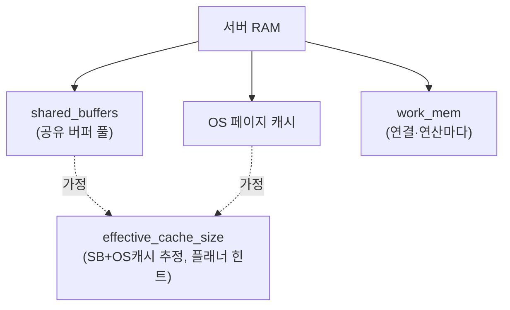
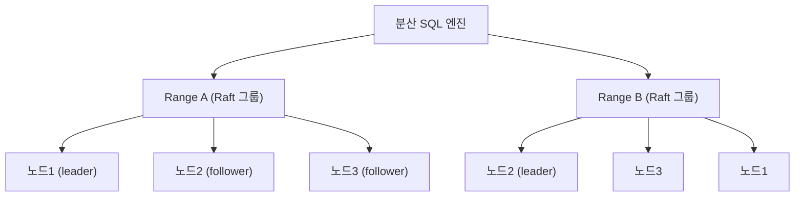

## "접속자 200명인데 DB가 죽었습니다"

평소 멀쩡하던 서비스가 트래픽이 살짝 튀자 `FATAL: sorry, too many clients already`를 토하며 죽습니다. CPU는 한가한데 응답은 안 옵니다. 다른 날엔 인덱스를 분명 걸었는데도 테이블이 하루가 다르게 부풀고, `VACUUM`을 돌려도 디스크가 안 줄어듭니다. 어떤 쿼리는 평소 5ms인데 어쩌다 한 번 3초가 걸립니다 — 그게 어느 쿼리인지조차 모릅니다.

이건 "DB가 약해서"가 아니라 **운영 지식의 공백**입니다. [앞 글]()에서 캐시로 읽기 부하를 덜어내는 법을 봤다면, 이번 마지막 글은 두 갈래로 갑니다. 먼저 **PostgreSQL을 실제로 돌리는 기술**(커넥션 풀·bloat·슬로우쿼리·파라미터·모니터링), 그다음 **2024년의 DB 지형**(NewSQL·벡터·시계열·HTAP)입니다. 지금까지 19편에서 쌓은 내부 지식이 운영의 매 결정에 어떻게 쓰이는지 확인하는 자리이기도 합니다.

---

# Part 1. 운영 실전

## 왜 PostgreSQL은 연결 하나가 비싼가

서두의 `too many clients`는 `max_connections`를 넘겼다는 뜻입니다. 그런데 왜 그 한계가 보통 100~200처럼 낮을까요? **PostgreSQL은 연결 하나당 OS 프로세스 하나를 fork**하기 때문입니다(MySQL의 스레드 모델과 다릅니다). `postmaster`가 새 접속마다 `backend` 프로세스를 띄우고, 그 프로세스는:

- 자기 몫의 메모리(`work_mem`, 캐시, catalog 캐시, 준비된 plan 등)를 들고,
- [공유 메모리]()의 버퍼·락 테이블에 슬롯을 점유하며,
- 스냅샷 계산 시 다른 모든 활성 백엔드를 훑어야 합니다([MVCC]()의 `GetSnapshotData`).

즉 연결은 단순한 소켓이 아니라 **수 MB의 상주 비용 + 동시성 제어의 참여자**입니다. 연결을 1만 개 열면 fork된 프로세스 1만 개가 컨텍스트 스위칭과 스냅샷 비용으로 서로의 발을 밟습니다. 그래서 "연결을 늘려 동시성을 높이자"는 거의 항상 틀립니다. **적은 수의 연결을 많은 클라이언트가 빠르게 빌려 쓰고 돌려주는 것**이 정답이고, 그 장치가 커넥션 풀입니다.

<div class="ops-pool" markdown="0">
<style>
.ops-pool{margin:1.4rem 0;overflow-x:auto}
.ops-pool svg{width:100%;max-width:740px;height:auto;display:block;margin:0 auto;font-family:inherit}
.ops-pool .lbl{fill:currentColor;font-size:12px;font-weight:600}
.ops-pool .sub{fill:currentColor;font-size:10px;opacity:.6}
.ops-pool .box{fill:none;stroke:currentColor;stroke-width:1.4;opacity:.55}
.ops-pool .cli{fill:currentColor;opacity:.18}
.ops-pool .pool{fill:#9c36b5;opacity:.12;stroke:#9c36b5;stroke-width:1.4}
.ops-pool .conn{fill:#2f9e44;opacity:.85}
.ops-pool .q1{fill:#1971c2;offset-path:path('M 120,70 L 360,120');animation:opspq1 4s ease-in-out infinite}
.ops-pool .q2{fill:#1971c2;offset-path:path('M 120,150 L 360,150');animation:opspq2 4s ease-in-out infinite}
.ops-pool .q3{fill:#1971c2;offset-path:path('M 120,230 L 360,180');animation:opspq3 4s ease-in-out infinite}
.ops-pool .r1{fill:#f08c00;offset-path:path('M 460,150 L 660,150');animation:opspr1 4s ease-in-out infinite}
@keyframes opspq1{0%{offset-distance:0%;opacity:0}8%{opacity:1}45%,100%{offset-distance:100%;opacity:0}}
@keyframes opspq2{0%{offset-distance:0%;opacity:0}20%{opacity:1}60%,100%{offset-distance:100%;opacity:0}}
@keyframes opspq3{0%{offset-distance:0%;opacity:0}32%{opacity:1}72%,100%{offset-distance:100%;opacity:0}}
@keyframes opspr1{0%,50%{offset-distance:0%;opacity:0}58%{opacity:1}95%,100%{offset-distance:100%;opacity:0}}
</style>
<svg viewBox="0 0 740 280" role="img" aria-label="다수의 클라이언트가 풀러를 통해 소수의 DB 연결을 공유하는 커넥션 풀 애니메이션. 쿼리가 풀로 들어와 빈 연결을 빌려 DB로 전달되고 결과가 돌아온다">
  <!-- clients -->
  <rect class="box" x="20" y="40" width="80" height="200" rx="6"/>
  <text class="sub" x="60" y="32" text-anchor="middle">클라이언트 ×수천</text>
  <rect class="cli" x="32" y="56" width="56" height="22" rx="3"/>
  <rect class="cli" x="32" y="86" width="56" height="22" rx="3"/>
  <rect class="cli" x="32" y="136" width="56" height="22" rx="3"/>
  <rect class="cli" x="32" y="186" width="56" height="22" rx="3"/>
  <rect class="cli" x="32" y="216" width="56" height="22" rx="3"/>
  <!-- pooler -->
  <rect class="pool" x="360" y="40" width="100" height="200" rx="6"/>
  <text class="sub" x="410" y="32" text-anchor="middle">PgBouncer</text>
  <text class="sub" x="410" y="148" text-anchor="middle">대기 큐</text>
  <!-- db connections (few) -->
  <rect class="box" x="620" y="40" width="100" height="200" rx="6"/>
  <text class="sub" x="670" y="32" text-anchor="middle">PostgreSQL</text>
  <rect class="conn" x="636" y="100" width="68" height="18" rx="3"/>
  <rect class="conn" x="636" y="128" width="68" height="18" rx="3"/>
  <rect class="conn" x="636" y="156" width="68" height="18" rx="3"/>
  <text class="sub" x="670" y="192" text-anchor="middle">backend ×3</text>
  <!-- moving packets -->
  <circle class="q1" r="6"/>
  <circle class="q2" r="6"/>
  <circle class="q3" r="6"/>
  <circle class="r1" r="6"/>
  <text class="lbl" x="20" y="270">수천 개의 짧은 요청이 단 몇 개의 DB 연결을 번갈아 빌려 쓴다 — 연결은 비싸고, 요청은 짧다</text>
</svg>
</div>

## PgBouncer — 연결을 빌려주는 얇은 층

PgBouncer는 수 MB로 도는 경량 프록시로, 앱에는 "DB인 척" 응답하고 뒤로는 소수의 실제 연결을 재사용합니다. 핵심은 **풀링 모드**입니다.

| 모드 | 연결을 돌려주는 시점 | 특징 |
|---|---|---|
| **session** | 클라이언트가 접속을 끊을 때 | 가장 안전. 단, 유휴 세션이 연결을 붙잡아 풀링 효과 약함 |
| **transaction** | 트랜잭션이 끝날 때(COMMIT/ROLLBACK) | 실무 표준. 트랜잭션 단위로 연결 재배정 |
| **statement** | 매 statement마다 | 멀티-statement 트랜잭션 금지. 특수 용도 |

대부분 **transaction 모드**를 씁니다. 이 모드의 함정은 분명합니다: 트랜잭션 사이에 연결이 다른 클라이언트로 넘어가므로, **세션에 상태를 거는 기능이 깨집니다.** `SET`(세션 GUC), `LISTEN/NOTIFY`, 세션 수준 advisory lock, 서버 측 prepared statement(드라이버 설정 필요), 임시 테이블 등은 transaction 모드와 충돌합니다. "로컬에선 되는데 PgBouncer 뒤에선 가끔 깨진다"의 단골 원인입니다.

```ini
[databases]
app = host=127.0.0.1 port=5432 dbname=app

[pgbouncer]
pool_mode = transaction
max_client_conn = 5000      ; 앱이 맺는 연결 수 (싸다)
default_pool_size = 20      ; DB로 실제 나가는 연결 수 (비싸다)
```

여기서 `max_client_conn`(앱→PgBouncer, 수천 개 OK)과 `default_pool_size`(PgBouncer→PG, 수십 개)를 분리하는 게 핵심입니다. 앱 인스턴스 수 × 인스턴스별 풀 크기의 합이 PG의 `max_connections`를 넘지 않도록 역산해야 합니다. 클라우드(RDS Proxy, Supabase 등)도 같은 원리의 풀러를 제공합니다.

## bloat — 부풀어 안 줄어드는 테이블

서두의 "VACUUM을 돌려도 디스크가 안 준다"는 [MVCC]()의 직접적 결과입니다. `UPDATE`/`DELETE`는 옛 튜플을 즉시 지우지 않고 `xmax`만 찍습니다. `VACUUM`은 그 죽은 튜플의 공간을 **테이블 내부에서 재사용 가능**하게 만들 뿐, 운영체제에 디스크를 돌려주지는 않습니다(파일 끝의 완전히 빈 페이지만 잘라냄). 그래서 한 번 부푼 테이블은 빈 공간을 품은 채 그 크기를 유지합니다 — 이게 **bloat**입니다.

bloat가 나쁜 이유는 단순히 디스크가 아니라 **읽기 효율**입니다. 죽은 튜플로 채워진 페이지를 읽어도 살아있는 행은 몇 개뿐이라, 같은 데이터를 보려고 더 많은 페이지를 버퍼로 올려야 합니다. 진단부터 합시다.

```sql
-- 죽은 튜플 비율과 마지막 (auto)vacuum 시각
SELECT relname,
       n_live_tup, n_dead_tup,
       round(100.0 * n_dead_tup / NULLIF(n_live_tup + n_dead_tup, 0), 1) AS dead_pct,
       last_autovacuum
FROM pg_stat_user_tables
ORDER BY n_dead_tup DESC LIMIT 10;
```

dead_pct가 높은데 `last_autovacuum`이 오래됐다면 autovacuum이 못 따라오는 것입니다. 흔한 원인은 ① 대량 UPDATE 배치 ② **오래 열린 트랜잭션/유휴 트랜잭션**입니다. 후자가 특히 무섭습니다: 가장 오래된 활성 트랜잭션이 볼 수도 있는 버전은 VACUUM이 회수하지 못하므로(`xmin horizon`), 어딘가 `idle in transaction`으로 멈춘 세션 하나가 **DB 전체의 청소를 막습니다.**

```sql
-- VACUUM을 막는 가장 오래된 트랜잭션 찾기
SELECT pid, state, age(backend_xid) AS xid_age,
       now() - xact_start AS tx_duration, query
FROM pg_stat_activity
WHERE state <> 'idle' AND backend_xid IS NOT NULL
ORDER BY xact_start LIMIT 5;
```

이미 부푼 테이블을 **물리적으로 다시 조밀하게** 만들려면 재구성이 필요합니다. `VACUUM FULL`은 테이블을 통째로 재작성하지만 **ACCESS EXCLUSIVE 락**(읽기까지 차단)을 잡아 운영 중엔 금물입니다. 대신:

```sql
-- 인덱스 bloat: 온라인으로 인덱스 재구축 (PG 12+)
REINDEX INDEX CONCURRENTLY idx_orders_user;   -- 락 최소화, 새 인덱스 만들고 교체

-- 테이블 bloat: pg_repack 확장 (락 거의 없이 테이블 재작성)
-- pg_repack -t orders -d app
```

`REINDEX CONCURRENTLY`는 새 인덱스를 백그라운드로 짓고 원자적으로 바꿔치기해 운영 중 인덱스 bloat를 해결합니다. 테이블 본체는 `pg_repack`(또는 PG 자체 기능이 부족하니 외부 도구)으로 다룹니다. **autovacuum을 테이블별로 공격적으로 튜닝**해 애초에 bloat가 안 쌓이게 하는 게 더 근본적입니다:

```sql
ALTER TABLE orders SET (
  autovacuum_vacuum_scale_factor = 0.02,   -- 기본 0.2 → 2%만 죽어도 청소
  autovacuum_vacuum_cost_limit = 2000      -- 청소 속도 상향
);
```

## 슬로우쿼리 — 어느 쿼리가 범인인가

"가끔 느린 쿼리"를 잡으려면 추측이 아니라 측정이 필요합니다. **`pg_stat_statements`** 확장은 정규화된 쿼리(상수가 `$1`로 치환된 형태)별로 누적 통계를 모읍니다.

```sql
CREATE EXTENSION pg_stat_statements;  -- shared_preload_libraries에 등록 필요

-- 총 소요시간이 큰 순서 = 시스템에 가장 부담 주는 쿼리
SELECT substr(query, 1, 70) AS query,
       calls,
       round(total_exec_time::numeric, 1) AS total_ms,
       round(mean_exec_time::numeric, 2)  AS mean_ms,
       round(100 * total_exec_time / sum(total_exec_time) OVER (), 1) AS pct
FROM pg_stat_statements
ORDER BY total_exec_time DESC LIMIT 10;
```

여기서 결정적 관점: **`mean_ms`가 아니라 `total_ms`(= mean × calls)로 정렬**합니다. 1초 걸리는 쿼리 10번보다, 5ms짜리 쿼리 100만 번이 시스템엔 더 큰 부담일 수 있습니다(N+1 쿼리의 정체). 범인을 특정했으면 [`EXPLAIN (ANALYZE, BUFFERS)`]()로 그 쿼리의 plan을 뜯어, 잘못된 [조인 알고리즘·인덱스 미사용·rows 추정 오류]()를 찾습니다. `log_min_duration_statement = 1000`(1초 넘는 쿼리를 로그로)도 함께 켜 두면 단발성 느린 쿼리까지 잡힙니다.

## 핵심 파라미터 — 메모리를 어디에 배분하나

기본값은 작은 장비에 맞춰져 있어 거의 항상 손봐야 합니다. 메모리 4개와 체크포인트가 핵심입니다.



- **`shared_buffers`**: PostgreSQL이 직접 관리하는 [공유 버퍼 풀](). 통념은 **RAM의 25%**. 100%로 키우면 안 되는 이유는 PG가 OS 페이지 캐시에도 의존하는 이중 캐시 구조라, 둘이 메모리를 나눠 가져야 하기 때문입니다.
- **`work_mem`**: 정렬·해시·집계 한 **연산 하나**가 디스크로 흘러내리기(spill) 전에 쓸 수 있는 메모리. **연결 × 연산 수만큼 곱해져 잡힙니다.** `work_mem=256MB`인데 200 연결이 각각 복잡한 쿼리를 돌리면 순식간에 수십 GB로 폭발해 OOM이 납니다. 그래서 [조인/정렬]()이 디스크로 spill 한다고 무턱대고 키우면 안 되고, 무거운 쿼리만 세션 단위로 올리는 게 안전합니다.
- **`effective_cache_size`**: 실제 메모리 할당이 **아니라**, "캐시에 얼마나 들어 있을 것 같은가"를 옵티마이저에게 알려주는 **추정값**(보통 RAM의 50~75%). 이 값이 크면 플래너가 인덱스 스캔이 캐시 hit할 거라 판단해 [인덱스 스캔을 선호]()합니다.
- **`checkpoint` 관련**: [WAL과 크래시 복구]()에서 봤듯 checkpoint는 더티 페이지를 디스크에 몰아 씁니다. `max_wal_size`를 키우고 `checkpoint_completion_target=0.9`로 두면 체크포인트가 잦지 않게, 그리고 한 번에 몰아치지 않고 완만히 퍼져 I/O 스파이크를 줄입니다.

## 모니터링 — 골든 시그널을 DB로

무엇을 봐야 하나? 구글 SRE의 **골든 시그널**(지연·트래픽·에러·포화)을 DB에 매핑합니다.

| 시그널 | DB 지표 | 출처 |
|---|---|---|
| **Latency** | 쿼리 평균/p99 실행시간 | `pg_stat_statements.mean_exec_time` |
| **Traffic** | TPS, 커밋/롤백 비율 | `pg_stat_database` (xact_commit/rollback) |
| **Errors** | 롤백률, 데드락, 에러 로그 | `pg_stat_database.deadlocks`, 로그 |
| **Saturation** | 연결 수 / max_connections, 캐시 hit율, 복제 지연, autovacuum 적체 | `pg_stat_activity`, `pg_stat_replication` |

특히 **포화**가 DB에선 결정적입니다: 활성 연결이 `max_connections`에 근접하는지, [복제 지연(replication lag)]()이 벌어지는지, 캐시 hit율이 떨어지는지를 항상 봐야 합니다. 캐시 hit율은 `blks_hit / (blks_hit + blks_read)`로 보고, OLTP라면 99% 이상이 정상입니다.

---

# Part 2. 현대 DB 지형

내부를 다 이해했으니 이제 큰 그림입니다. 단일 노드 RDBMS의 한계를 넘으려는 시도들이 어떻게 **지금까지의 원리를 재조합**하는지 봅니다.

## NewSQL — 수평 확장과 강한 일관성을 동시에

[샤딩]()은 확장을 주지만 교차 샤드 트랜잭션·강한 일관성을 포기하게 만들었습니다. NoSQL은 [최종 일관성]()으로 확장을 샀습니다. **NewSQL**(분산 SQL)은 "수평 확장 + ACID + SQL"을 한꺼번에 노리는 흐름입니다. 대표가 Google **Spanner**와 **CockroachDB**, **TiDB**, **YugabyteDB**입니다.

비결은 [17편의 합의(consensus)]()입니다. 데이터를 range(또는 tablet)로 쪼개고, 각 range를 **Raft/Paxos 그룹으로 복제**합니다. 쓰기는 과반수(quorum) 합의로 커밋되므로, 노드 하나가 죽어도 일관성을 유지한 채 살아남습니다.



핵심 난제는 **분산 환경의 일관성 있는 시각**입니다. 교차 노드 트랜잭션의 순서를 어떻게 정할까요? Spanner는 GPS·원자시계 기반의 **TrueTime** API로 시간의 불확실성 구간을 측정하고, 그 구간만큼 의도적으로 기다려(commit-wait) 외부 일관성(external consistency)을 보장합니다. CockroachDB는 전용 시계 없이 hybrid logical clock으로 비슷한 효과를 노립니다. 모두 [MVCC]()를 분산으로 확장한 것 — 단일 노드에서 배운 원리가 그대로 스케일아웃에 쓰입니다.

## 벡터 DB와 pgvector — 의미로 검색하기

지금까지의 인덱스는 **정확히 일치**(등치·범위)를 다뤘습니다. 그런데 "이 문장과 의미가 비슷한 글"을 찾으려면? 텍스트·이미지를 수백~수천 차원의 **임베딩 벡터**로 바꾸고, 질의 벡터와 **거리가 가까운** 벡터를 찾습니다. 이게 **ANN(근사 최근접 탐색, Approximate Nearest Neighbor)**입니다. 정확한 최근접은 고차원에서 사실상 전수 비교라 너무 느려서, 약간의 정확도를 내주고 속도를 사는 "근사"가 핵심입니다.

> 이 블로그의 **AI 시맨틱 검색**이 바로 이 기술입니다. 글 본문을 임베딩해 저장해 두고, 사용자의 질문을 같은 공간의 벡터로 바꿔 코사인 거리가 가까운 글을 찾습니다. "키워드가 안 겹쳐도 의미가 통하면 검색되는" 마법의 정체가 ANN입니다.

PostgreSQL에서는 **pgvector** 확장으로 RDBMS 안에서 바로 합니다.

```sql
CREATE EXTENSION vector;
ALTER TABLE posts ADD COLUMN embedding vector(1536);  -- 임베딩 차원

-- HNSW 인덱스: 그래프 기반 ANN
CREATE INDEX ON posts USING hnsw (embedding vector_cosine_ops);

-- 질문 벡터와 의미가 가장 가까운 글 5개
SELECT title FROM posts
ORDER BY embedding <=> '[0.01, -0.23, ...]'::vector   -- <=> : 코사인 거리
LIMIT 5;
```

ANN 인덱스는 [7편의 GiST/GIN]()과 결이 같습니다 — B-Tree로 안 되는 문제를 위한 특수 인덱스입니다. 대표 두 가지:

- **HNSW**(Hierarchical Navigable Small World): 다층 그래프를 타고 내려가며 가까운 이웃을 탐색. 재현율·속도가 좋아 기본 선택. 빌드 비용·메모리가 큼.
- **IVFFlat**: 벡터 공간을 클러스터로 나눠, 질의에 가까운 일부 클러스터만 탐색. 가볍지만 클러스터 경계에서 재현율이 떨어질 수 있음.

pgvector의 강점은 **벡터와 일반 컬럼을 한 트랜잭션·한 쿼리에서** 다룬다는 점입니다. "최근 30일 + 카테고리=DB + 의미 유사" 같은 메타데이터 필터와 벡터 검색을 SQL 하나로 결합할 수 있어, 별도 벡터 DB(Pinecone, Milvus, Qdrant)를 두는 운영 복잡도를 아낍니다.

## 시계열과 HTAP — 워크로드에 맞춘 변형

**시계열**(메트릭·로그·IoT)은 "시간순 append가 압도적이고, 최근 데이터를 범위로 조회"하는 뚜렷한 패턴이 있습니다. **TimescaleDB**(PG 확장)는 테이블을 시간으로 자동 [파티셔닝(하이퍼테이블)]()하고, 오래된 청크를 컬럼 지향으로 압축하며, 연속 집계(continuous aggregate)로 롤업을 유지합니다. 시간 컬럼처럼 물리 순서와 값이 정렬돼 있을 때는 [BRIN 인덱스]()가 초경량으로 맞아떨어집니다.

**HTAP**(Hybrid Transactional/Analytical Processing)은 빠른 트랜잭션(OLTP, 행 지향)과 무거운 분석(OLAP, 컬럼 지향)을 한 시스템에서 처리하려는 시도입니다. 보통 같은 데이터를 행 저장과 컬럼 저장 두 형태로 들고(TiDB의 TiFlash 등), 분석 쿼리를 OLTP에 부담 없이 돌립니다. "분석 때문에 운영 DB가 느려진다"는 고전적 문제에 대한 한 답입니다.

## 그래서 무엇을 고르나

새 기술이 많지만 결론은 18편과 같습니다: **기본은 여전히 단일 노드 PostgreSQL**입니다. 대부분의 서비스는 잘 튜닝된 PG 한 대 + [읽기 복제]() + [캐시]()로 충분하고, pgvector·TimescaleDB처럼 **PG 확장으로 흡수**되는 경우가 많습니다. NewSQL은 진짜로 단일 노드 쓰기 한계에 부딪히고 전 지구적 강한 일관성이 필요할 때, 그 운영 복잡도를 감당할 각오가 섰을 때 갑니다. 도구가 아니라 **트레이드오프**를 고르는 것 — 이 시리즈가 처음부터 끝까지 말한 한 가지입니다.

## 면접/리뷰 단골 질문

- **Q. PostgreSQL에서 연결을 많이 열면 왜 위험한가?** → 연결마다 OS 프로세스를 fork → 메모리·컨텍스트 스위칭·스냅샷 계산 비용이 연결 수에 비례. 적은 연결을 풀로 공유하는 게 정답.
- **Q. PgBouncer transaction 모드의 함정은?** → 트랜잭션 사이에 연결이 다른 클라로 넘어가, 세션 상태(SET, LISTEN/NOTIFY, 세션 advisory lock, 임시 테이블)에 의존하는 기능이 깨진다.
- **Q. VACUUM을 돌려도 디스크가 안 주는 이유와 해결?** → VACUUM은 죽은 튜플 공간을 테이블 내부 재사용 가능하게 만들 뿐 OS에 반환 안 함. 물리 축소는 `REINDEX CONCURRENTLY`(인덱스)·`pg_repack`(테이블). 근본은 autovacuum 튜닝 + 오래된 트랜잭션 제거.
- **Q. work_mem과 shared_buffers의 차이는?** → shared_buffers는 전체가 공유하는 버퍼 풀(RAM의 ~25%), work_mem은 정렬·해시 한 연산당 메모리라 연결×연산만큼 곱해져 OOM 위험. 무거운 쿼리만 세션 단위로 올린다.
- **Q. 슬로우쿼리를 mean이 아니라 total로 정렬하는 이유?** → 5ms × 100만 번이 1초 × 10번보다 시스템 부담이 클 수 있음(N+1). total_exec_time이 실제 부하 기여도.
- **Q. NewSQL은 어떻게 확장과 강한 일관성을 같이 얻나?** → 데이터를 range로 쪼개 각 range를 Raft/Paxos로 복제, 쓰기를 과반수 합의로 커밋. 분산 MVCC + (TrueTime 등) 일관된 시각으로 트랜잭션 순서를 정함.
- **Q. ANN(벡터 검색)이 "근사"인 이유?** → 고차원에서 정확한 최근접은 전수 비교라 비현실적. 약간의 재현율을 내주고 HNSW(그래프)·IVFFlat(클러스터)로 속도를 산다.

## 정리

- PostgreSQL은 **연결 하나당 프로세스** — `max_connections`를 늘리지 말고 **PgBouncer transaction 모드**로 소수 연결을 공유한다.
- **bloat는 MVCC의 그림자**. `pg_stat_user_tables`로 진단하고, autovacuum을 공격적으로 튜닝하며, 이미 부풀면 `REINDEX CONCURRENTLY`/`pg_repack`로 온라인 재구성한다.
- **`pg_stat_statements`로 total time 기준** 범인을 찾고, `EXPLAIN (ANALYZE, BUFFERS)`로 plan을 뜯는다. `shared_buffers`·`work_mem`·`effective_cache_size`·checkpoint가 메모리/I/O의 네 손잡이.
- **NewSQL**은 17편의 합의로 확장과 강한 일관성을, **pgvector**는 임베딩 ANN으로 의미 검색을(이 블로그 AI 검색이 그것), **TimescaleDB**는 시계열을, **HTAP**는 OLTP+OLAP을 한 시스템에서 노린다.
- 새 기술도 결국 **트레이드오프 선택**이다. 기본은 여전히 잘 튜닝된 단일 PostgreSQL이며, 많은 진화가 PG 확장으로 흡수된다.

---

> **시리즈를 마치며** — 우리는 [왜 파일 대신 DBMS를 쓰는가]()에서 출발해, [8KB 페이지·튜플]()로 디스크 바닥까지 내려갔고, [B-Tree]()로 다시 올라와 [트랜잭션·MVCC·락]()으로 동시성의 심장을 봤습니다. [WAL]()이 정전을 견디는 법, [EXPLAIN과 통계]()로 옵티마이저와 대화하는 법, [복제·샤딩·합의]()로 한 대를 넘는 법, 그리고 [NoSQL]()·[캐시]()·운영까지. 20편을 관통한 단 하나의 메시지는, **DB는 마법이 아니라 디스크 위의 자료구조를 안전하게 공유하기 위한 정교한 트레이드오프의 집합**이라는 것입니다. 이제 어떤 증상을 만나도, 그 아래에서 무슨 일이 벌어지는지 추측이 아니라 원리로 설명할 수 있기를 바랍니다. 긴 여정을 함께해 주셔서 고맙습니다.
