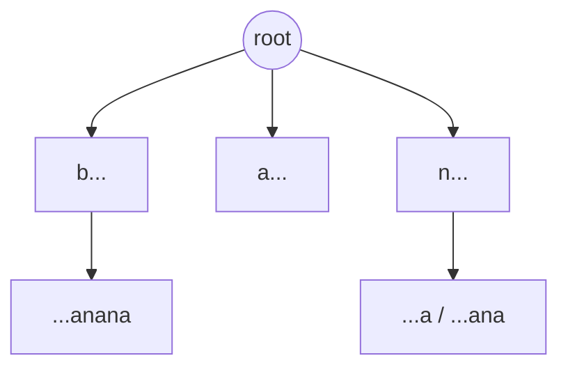

## 문자열 검색과 분류, 그 기초 자료구조들

문자열에서 패턴을 빠르게 찾거나, 텍스트를 분류하는 문제는 검색·생물정보학·NLP에서 자주 등장합니다. 이번 글에선 그 기초가 되는 **접미사 트라이/트리**와, 간단하지만 강력한 분류기 **나이브 베이즈**를 정리합니다.

## 접미사 트라이(Suffix Trie)

문자열의 **모든 접미사(suffix)** 를 트라이(trie, 접두사 트리)에 넣은 것입니다. 예를 들어 `"banana"`의 접미사는 `banana, anana, nana, ana, na, a`이고, 이를 한 트라이에 모읍니다.



- 장점: "이 패턴이 문자열에 들어 있나?"를 **패턴 길이에 비례**하는 시간으로 판정.
- 단점: 노드가 너무 많아 **공간이 O(n²)** 까지 커집니다. 그래서 실전에선 압축 버전을 씁니다.

## 접미사 트리(Suffix Tree)

접미사 트라이에서 **자식이 하나뿐인 경로를 하나로 압축**한 것이 접미사 트리입니다. 간선에 문자열(여러 글자)을 담아 노드 수를 **O(n)** 으로 줄입니다.

- 부분 문자열 검색, 최장 반복 부분 문자열, 최장 공통 부분 문자열 등을 효율적으로 해결.
- Ukkonen 알고리즘으로 **O(n)** 에 구축 가능(구현은 까다로움).
- DNA 서열 분석 같은 **생물정보학**에서 핵심 도구입니다.

> 트라이는 직관적이지만 공간이 크고, 트리는 압축해 효율적입니다. "개념 이해는 트라이로, 실전은 트리로"라고 기억하면 편합니다.
{: .prompt-tip }

## 나이브 베이즈(Naive Bayes)

분류 문제(예: 스팸 판별)에 쓰이는 확률 기반 분류기입니다. **베이즈 정리**에 기반합니다.

$$ P(\text{클래스} \mid \text{특징}) \propto P(\text{클래스}) \times \prod_i P(\text{특징}_i \mid \text{클래스}) $$

"naive(순진한)"라고 불리는 이유는, **모든 특징이 서로 독립**이라고 (실제로는 아니어도) 단순하게 가정하기 때문입니다. 그래서 각 특징의 확률을 그냥 곱할 수 있습니다.

### 스팸 분류 예

- 학습: 스팸/정상 메일에서 단어별 등장 확률을 계산.
- 분류: 새 메일의 단어들로 `P(스팸|단어들)` vs `P(정상|단어들)`를 비교해 큰 쪽으로 분류.

```text
P(스팸 | "무료", "당첨") ∝ P(스팸) · P("무료"|스팸) · P("당첨"|스팸)
```

### 실전 포인트

- **라플라스 스무딩**: 학습에 없던 단어의 확률이 0이 되어 전체 곱이 0이 되는 걸 막기 위해, 모든 빈도에 1을 더해줍니다.
- 가정이 단순한데도 **텍스트 분류에서 의외로 잘 동작**하고, 빠르고 가볍습니다.

## 정리

- **접미사 트라이**: 모든 접미사를 트라이에. 직관적이나 공간 O(n²).
- **접미사 트리**: 트라이를 압축해 O(n). 부분 문자열·생물정보학에 강력.
- **나이브 베이즈**: 특징 독립 가정 + 베이즈 정리. 단순·빠름, 텍스트 분류에 강함. 라플라스 스무딩 필수.
