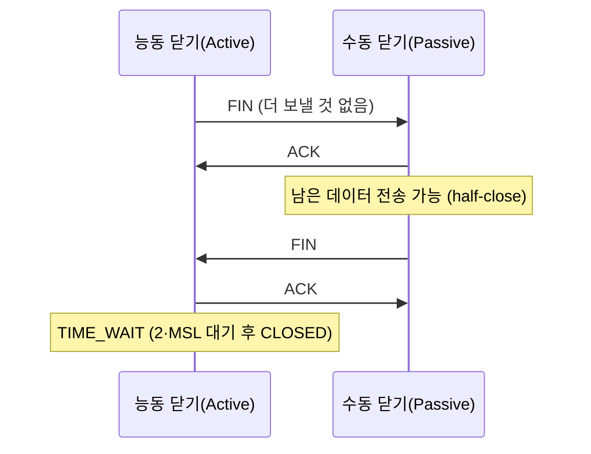

## best-effort 위에 신뢰를 얹는 일

[패킷 교환]()에서 봤듯 인터넷은 "최선을 다하지만 책임은 안 진다"는 best-effort 망입니다. 패킷은 버려질 수도, 순서가 뒤집힐 수도, 중복될 수도 있습니다. 그런데도 우리는 파일을 한 바이트도 안 틀리고 받습니다. 그 신뢰를 **끝단(end-to-end)** 에서 만들어내는 게 TCP입니다.

이 글은 "3-way handshake = SYN, SYN-ACK, ACK"를 외우는 데서 멈추지 않습니다. **왜 2번이 아니라 3번인지**, 상태가 어떻게 전이하는지, 그리고 실무에서 가장 많이 터지는 `TIME_WAIT`/`SYN flood`까지 — 헤더 필드와 커널 파라미터 레벨로 내려갑니다.

## TCP 세그먼트 헤더 — 신뢰성의 도구상자

TCP가 하는 모든 일은 이 20바이트(옵션 제외) 헤더 안에 들어 있습니다.

| 필드 | 크기 | 역할 |
|------|------|------|
| 출발지/목적지 포트 | 각 16비트 | 어느 프로세스로 (IP는 호스트까지, 포트가 프로세스까지) |
| **순서 번호(seq)** | 32비트 | 이 세그먼트 첫 바이트의 스트림 내 위치 |
| **확인 번호(ack)** | 32비트 | "여기까지 잘 받았고, **다음**엔 이 번호를 기대한다" (누적 ACK) |
| 데이터 오프셋 | 4비트 | 헤더 길이(옵션 가변) |
| **플래그** | 9비트 | `SYN`·`ACK`·`FIN`·`RST`·`PSH`·`URG` |
| 윈도우 크기 | 16비트 | 수신 버퍼 여유 = 흐름 제어([다음 글]()) |
| 체크섬 | 16비트 | 손상 검출 |

핵심은 **seq/ack가 "패킷 번호"가 아니라 "바이트 번호"** 라는 점입니다. TCP는 패킷의 모임이 아니라 **바이트 스트림**입니다. 이 추상화가 재조립·중복제거·재전송을 가능하게 합니다.

## 연결 수립: 왜 악수를 3번 하나

연결을 열 때 양쪽은 서로의 **초기 순서 번호(ISN)** 를 교환하고 확인합니다. 아래 흐름을 움직임으로 보세요 — ①SYN ②SYN-ACK ③ACK 가 순서대로 오갑니다.

<div class="tcp-hs" markdown="0">
<style>
.tcp-hs{margin:1.4rem 0;overflow-x:auto}
.tcp-hs svg{width:100%;max-width:720px;height:auto;display:block;margin:0 auto;font-family:inherit}
.tcp-hs .life{stroke:currentColor;stroke-width:1.6;opacity:.4}
.tcp-hs .lbl{fill:currentColor;font-size:12px;font-weight:600}
.tcp-hs .sub{fill:currentColor;font-size:10px;opacity:.6}
.tcp-hs .ar{stroke:currentColor;opacity:.25;stroke-width:1.3;stroke-dasharray:4 4;fill:none}
.tcp-hs .syn{fill:#1971c2;animation:tcphs1 6s ease-in-out infinite}
.tcp-hs .sak{fill:#f08c00;animation:tcphs2 6s ease-in-out infinite}
.tcp-hs .ack{fill:#2f9e44;animation:tcphs3 6s ease-in-out infinite}
@keyframes tcphs1{0%{transform:translate(0,0);opacity:0}3%{opacity:1}22%{transform:translate(430,46);opacity:1}28%{opacity:0}100%{opacity:0}}
@keyframes tcphs2{0%,30%{opacity:0}33%{transform:translate(0,0);opacity:1}52%{transform:translate(-430,46);opacity:1}58%{opacity:0}100%{opacity:0}}
@keyframes tcphs3{0%,60%{opacity:0}63%{transform:translate(0,0);opacity:1}82%{transform:translate(430,46);opacity:1}88%{opacity:0}100%{opacity:0}}
</style>
<svg viewBox="0 0 700 250" role="img" aria-label="TCP 3-way handshake에서 SYN, SYN-ACK, ACK 세그먼트가 클라이언트와 서버 사이를 순서대로 오가는 애니메이션">
  <text class="lbl" x="135" y="28" text-anchor="middle">클라이언트</text>
  <text class="lbl" x="565" y="28" text-anchor="middle">서버</text>
  <line class="life" x1="135" y1="40" x2="135" y2="235"/>
  <line class="life" x1="565" y1="40" x2="565" y2="235"/>
  <line class="ar" x1="140" y1="62" x2="560" y2="106"/>
  <line class="ar" x1="560" y1="122" x2="140" y2="166"/>
  <line class="ar" x1="140" y1="182" x2="560" y2="226"/>
  <text class="sub" x="350" y="78" text-anchor="middle">① SYN  seq=x</text>
  <text class="sub" x="350" y="140" text-anchor="middle">② SYN+ACK  seq=y, ack=x+1</text>
  <text class="sub" x="350" y="202" text-anchor="middle">③ ACK  ack=y+1</text>
  <rect class="syn" x="128" y="55" width="16" height="13" rx="2"/>
  <rect class="sak" x="552" y="115" width="16" height="13" rx="2"/>
  <rect class="ack" x="128" y="175" width="16" height="13" rx="2"/>
</svg>
</div>

> **왜 3번인가?** 2번이면 *한쪽만* 상대의 ISN을 확인받습니다. 클라이언트는 ②로 서버의 seq를 확인했지만, 서버는 자기 SYN이 도달했는지 모릅니다. ③ACK가 그걸 닫아, **양방향 ISN이 모두 합의**됩니다. 또한 2-way라면 지연됐던 옛 SYN이 살아 돌아와 **유령 연결**이 생길 수 있습니다(ISN 합의가 이를 막습니다).

ISN을 0이 아니라 **시간 기반 + 난수**로 잡는 이유도 같은 맥락입니다 — 이전 연결의 잔존 세그먼트와 섞이는 것, 그리고 공격자의 시퀀스 추측(세션 하이재킹)을 막기 위해서입니다.

## 연결 종료: 왜 4번이고, TIME_WAIT는 왜 있나

종료는 **4-way**입니다. TCP는 양방향 독립 스트림이라, 각 방향을 따로 닫습니다(`FIN` → `ACK`를 양쪽이 한 번씩).



여기서 `TIME_WAIT`가 핵심입니다. 마지막 ACK를 보낸 쪽은 곧장 닫지 않고 **2·MSL**(Max Segment Lifetime, 리눅스 기본 약 60초) 동안 기다립니다.

- **이유 1**: 내 마지막 ACK가 유실되면 상대가 FIN을 재전송합니다. 그때 응답하려면 소켓이 살아 있어야 합니다.
- **이유 2**: 같은 4-튜플(출발IP·포트, 목적IP·포트)의 새 연결에 **이전 연결의 떠돌이 세그먼트**가 섞이는 걸 막습니다.

## 상태 머신: 연결은 상태의 전이다

TCP 연결의 일생은 유한 상태 머신입니다. 아래는 능동 연결의 전형적 경로 — 상태가 순서대로 점등합니다.

<div class="tcp-sm" markdown="0">
<style>
.tcp-sm{margin:1.4rem 0;overflow-x:auto}
.tcp-sm svg{width:100%;max-width:720px;height:auto;display:block;margin:0 auto;font-family:inherit}
.tcp-sm .b{fill:none;stroke:currentColor;stroke-width:1.5;opacity:.3;rx:7}
.tcp-sm .t{fill:currentColor;font-size:11px;font-weight:600}
.tcp-sm .ar{stroke:currentColor;opacity:.3;stroke-width:1.3;fill:none}
.tcp-sm .s0{animation:tcpsm 7s ease-in-out infinite}
.tcp-sm .s1{animation:tcpsm 7s ease-in-out infinite 1s}
.tcp-sm .s2{animation:tcpsm 7s ease-in-out infinite 2s}
.tcp-sm .s3{animation:tcpsm 7s ease-in-out infinite 3s}
.tcp-sm .s4{animation:tcpsm 7s ease-in-out infinite 4s}
.tcp-sm .s5{animation:tcpsm 7s ease-in-out infinite 5s}
@keyframes tcpsm{0%,100%{stroke:currentColor;opacity:.3}10%,22%{stroke:#1971c2;opacity:1}}
</style>
<svg viewBox="0 0 720 120" role="img" aria-label="TCP 상태 머신이 CLOSED에서 SYN_SENT, ESTABLISHED, FIN_WAIT, TIME_WAIT을 거쳐 다시 CLOSED로 전이하며 순서대로 점등하는 애니메이션">
  <rect class="b s0" x="6"   y="44" width="100" height="34"/>
  <rect class="b s1" x="126" y="44" width="100" height="34"/>
  <rect class="b s2" x="246" y="44" width="120" height="34"/>
  <rect class="b s3" x="386" y="44" width="100" height="34"/>
  <rect class="b s4" x="506" y="44" width="100" height="34"/>
  <rect class="b s5" x="626" y="44" width="88"  height="34"/>
  <text class="t s0" x="56"  y="65" text-anchor="middle">CLOSED</text>
  <text class="t s1" x="176" y="65" text-anchor="middle">SYN_SENT</text>
  <text class="t s2" x="306" y="65" text-anchor="middle">ESTABLISHED</text>
  <text class="t s3" x="436" y="65" text-anchor="middle">FIN_WAIT</text>
  <text class="t s4" x="556" y="65" text-anchor="middle">TIME_WAIT</text>
  <text class="t s5" x="670" y="65" text-anchor="middle">CLOSED</text>
  <line class="ar" x1="106" y1="61" x2="126" y2="61"/>
  <line class="ar" x1="226" y1="61" x2="246" y2="61"/>
  <line class="ar" x1="366" y1="61" x2="386" y2="61"/>
  <line class="ar" x1="486" y1="61" x2="506" y2="61"/>
  <line class="ar" x1="606" y1="61" x2="626" y2="61"/>
</svg>
</div>

서버 쪽은 `LISTEN → SYN_RCVD → ESTABLISHED`로 들어오고, 수동 종료는 `CLOSE_WAIT → LAST_ACK`를 거칩니다. 이 상태 이름들은 추상 개념이 아니라 `ss`/`netstat` 출력에 **그대로 찍히는 글자**입니다.

## 신뢰성은 어떻게 만들어지나

best-effort 망의 4가지 문제를 TCP는 이렇게 막습니다.

| 문제 | TCP의 해법 |
|------|-----------|
| 손실 | 순서 번호 + 누적 ACK + **재전송**(타임아웃 또는 3 dup ACK) |
| 순서 뒤바뀜 | 수신 측이 seq로 **재정렬** 후 애플리케이션에 전달 |
| 중복 | 같은 seq 범위는 버림 |
| 손상 | 체크섬 불일치 시 폐기 → 재전송 유발 |

손실 감지·재전송의 *얼마나 빠르게·얼마나 많이*는 [혼잡 제어]()의 영역이고, 흐름 제어(수신자가 감당 못 할 만큼 보내지 않기)는 윈도우 필드로 합니다. 둘은 다른 문제입니다 — 다음 글에서 구분합니다.

## 프로덕션 함정 1: TIME_WAIT 고갈

부하 테스트나 짧은 연결을 대량으로 맺는 클라이언트(또는 keep-alive 안 쓰는 리버스 프록시 → 업스트림)에서 흔합니다. **능동 종료한 쪽**에 `TIME_WAIT` 소켓이 수만 개 쌓여 로컬 포트(ephemeral port)가 고갈됩니다.

```bash
# TIME_WAIT 개수 확인
ss -tan state time-wait | wc -l
# ephemeral 포트 범위
cat /proc/sys/net/ipv4/ip_local_port_range   # 보통 32768 60999
```

- **해법(클라이언트/아웃바운드)**: `net.ipv4.tcp_tw_reuse=1` — `TIME_WAIT` 소켓을 새 *아웃바운드* 연결에 재사용(타임스탬프 옵션 필요, 안전). 포트 범위 확대.
- ⚠️ **하지 말 것**: `tcp_tw_recycle`. NAT 뒤 클라이언트들의 연결을 깨뜨려 리눅스 4.12에서 **제거**됐습니다. 옛날 블로그가 추천해도 쓰면 안 됩니다.
- **근본 해법**: keep-alive로 연결 재사용 → 그러면 종료 자체가 드물어집니다.

## 프로덕션 함정 2: SYN flood

3-way handshake에서 서버는 SYN을 받으면 `SYN_RCVD` 상태로 **반쯤 열린 연결(half-open)** 을 큐(`backlog`)에 쌓고 ACK를 기다립니다. 공격자가 출발지 IP를 위조해 SYN만 퍼부으면 이 큐가 차서 정상 연결을 못 받습니다.

```bash
# accept 큐 넘침 카운터
netstat -s | grep -i "SYNs to LISTEN"
ss -tl                                  # Recv-Q/Send-Q로 백로그 포화 확인
```

- **해법**: `net.ipv4.tcp_syncookies=1`. 큐가 차면 서버 상태를 저장하지 않고, 쿠키를 SYN-ACK의 seq에 인코딩해 보냅니다. 정상 클라이언트의 ACK엔 그 쿠키가 돌아오므로 검증만으로 연결을 복원합니다 — **상태 없이 SYN flood 무력화.**

## 디버깅 도구

```bash
# 연결을 상태별로 집계 (운영 첫 진단)
ss -tan | awk 'NR>1{c[$1]++} END{for(s in c)print s,c[s]}'

# 특정 상태만
ss -tan state established '( dport = :443 )'

# 핸드셰이크를 눈으로 (절대 seq 표시)
sudo tcpdump -n -S 'tcp port 443 and (tcp[tcpflags] & (tcp-syn|tcp-fin) != 0)'
```

`tcpdump`에서 `Flags [S]`(SYN) → `[S.]`(SYN-ACK) → `[.]`(ACK) 3줄이 보이면 정상 핸드셰이크입니다. `[R]`(RST)가 보이면 상대가 연결을 거부/강제 종료한 것입니다(닫힌 포트, 방화벽, 앱 크래시).

## 면접/리뷰 단골 질문

- **Q. 왜 3-way인가, 2-way는 왜 안 되나?** → 양방향 ISN을 모두 확인받기 위해. 2-way는 서버가 자기 SYN 도달을 모르고, 지연된 옛 SYN이 유령 연결을 만들 수 있다.
- **Q. TIME_WAIT는 왜 있고 누구에게 생기나?** → 마지막 ACK 유실 대비 + 떠돌이 세그먼트 차단. **능동 종료(먼저 FIN 보낸) 쪽**에 2·MSL 동안 생긴다.
- **Q. 서버에 CLOSE_WAIT가 잔뜩 쌓였다, 원인은?** → 상대가 FIN을 보냈는데 **내 애플리케이션이 `close()`를 안 호출**해서. 소켓 누수 — 코드 버그다(커널 튜닝으로 못 고친다).
- **Q. SYN flood 방어는?** → `tcp_syncookies`. 백로그가 차면 상태를 저장하지 않고 쿠키로 핸드셰이크를 무상태 처리한다.

## 정리

- TCP는 best-effort 위에 **바이트 스트림**의 신뢰성을 끝단에서 만든다 — seq/ack는 바이트 번호다.
- 3-way handshake는 **양방향 ISN 합의**가 목적(그래서 3번). 종료는 양방향 독립이라 4-way, 능동 쪽에 `TIME_WAIT`.
- 실무 사고의 대부분은 상태 머신 이해로 풀린다: `TIME_WAIT` 고갈(→ keep-alive, `tcp_tw_reuse`), `CLOSE_WAIT` 누적(→ 앱이 close 안 함), `SYN flood`(→ syncookies).
- 추측 말고 `ss`/`tcpdump`로 **상태를 직접 보라.**

> 다음 글: 얼마나 빠르게 보낼지를 정하는 [TCP 흐름 제어와 혼잡 제어](). 그리고 TCP의 한계를 넘으려는 시도가 [UDP와 QUIC]()입니다.
