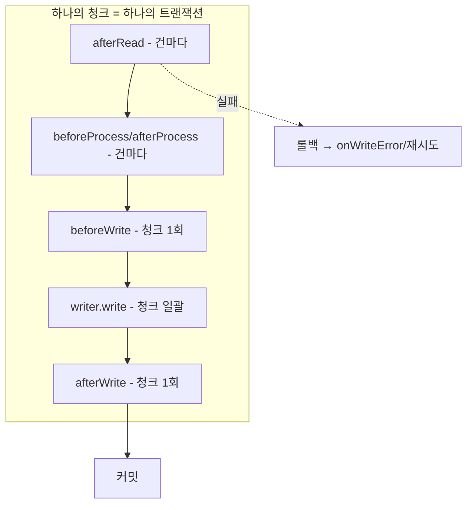
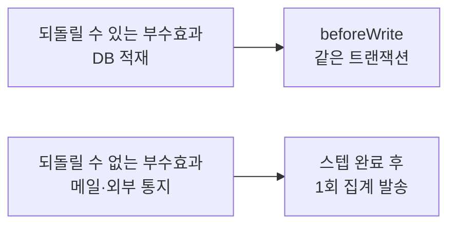

건마다 처리하던 부수 작업을 청크 쓰기 직전 리스너 훅으로 옮기는 일은 자주 마주친다. 그런데 같은 부수효과(파생 데이터 적재, 외부 통지 등)를 writer 본체에 두느냐, `beforeWrite` 훅에 두느냐, `afterRead`에 두느냐에 따라 트랜잭션 경계·중복 실행·재시작 동작이 전부 달라진다. 핵심은 **각 훅이 청크와 트랜잭션의 어디에서 호출되는지**를 정확히 아는 것이다.

## 청크 생명주기와 훅의 위치

Spring Batch 청크 처리는 청크 크기만큼 read를 반복해 버퍼를 채운 뒤, process와 write를 일괄 수행하고 트랜잭션을 커밋한다. 리스너 훅은 이 흐름의 정해진 지점에 꽂힌다.



여기서 두 가지 사실이 결정적이다.

1. **`afterRead`는 건마다 호출되고, 읽은 직후라 아직 process도 write도 안 됐다.** 트랜잭션 안이긴 하지만 이 시점의 작업은 "그 건이 실제로 쓰일지" 모른다. process에서 필터링되어 null로 떨어지거나, 뒤에서 write가 롤백될 수 있다.
2. **`beforeWrite`는 청크당 한 번, write 직전에 `List<Item>` 전체를 받아 호출된다.** 이 시점엔 어떤 항목이 실제로 쓰일지 확정됐고, write와 **같은 트랜잭션** 안이다.

## 부수효과를 beforeWrite에 둬야 하는 이유

파생 데이터 적재처럼 "본 데이터가 저장될 때 함께 저장돼야 하는" 부수효과를 생각해보자. 이걸 어디에 두느냐가 안전성을 가른다.

**`afterRead`에 두면**: 읽기마다 실행되므로, process에서 걸러진 항목에 대해서도 부수효과가 발생한다. 게다가 write가 롤백되어도 afterRead에서 한 작업(같은 트랜잭션 안 DB 작업이라면)은 함께 롤백되긴 하지만, 외부 호출 같은 트랜잭션 밖 작업이면 롤백이 안 돼 **유령 부수효과**가 남는다. 청크 단위로 묶이지도 않는다.

**writer 본체에 두면**: 동작은 맞다. 같은 트랜잭션, 같은 청크 경계. 다만 writer가 "본 데이터 쓰기 + 파생 데이터 쓰기" 두 책임을 갖게 되어 관심사가 섞인다.

**`beforeWrite`에 두면**: writer가 쓸 바로 그 목록을 받아 같은 트랜잭션에서 실행된다. 청크 단위로 묶이고, write가 롤백되면 함께 롤백된다. 책임도 분리된다. 이것이 부수효과의 기본 자리다.

```java
public class DerivedDataListener implements ItemWriteListener<Order> {

    private final DerivedRepository derivedRepo;

    @Override
    public void beforeWrite(Chunk<? extends Order> items) {
        // writer가 쓸 바로 그 청크 목록 — 같은 트랜잭션 안
        List<Derived> derived = items.getItems().stream()
                .map(Derived::from)
                .toList();
        derivedRepo.saveAll(derived);   // write와 함께 커밋되거나 함께 롤백
    }

    @Override
    public void onWriteError(Exception ex, Chunk<? extends Order> items) {
        log.warn("청크 write 실패 — beforeWrite 작업도 롤백됨", ex);
    }
}
```

## 재시작·재시도에서의 함정

청크가 롤백되면 Spring Batch는 그 청크를 다시 시도한다(스킵/재시도 정책에 따라). 이때 **`beforeWrite`는 다시 호출된다.** 따라서 beforeWrite의 부수효과는 **재실행에 멱등**해야 한다. 같은 청크를 두 번 처리해도 파생 데이터가 두 번 쌓이지 않으려면, upsert(있으면 갱신)나 유니크 제약으로 중복을 막아야 한다.

특히 위험한 건 **트랜잭션 밖 부수효과를 beforeWrite에 두는 것**이다. 메일 발송이나 외부 통지를 beforeWrite에서 하면, write가 롤백되어도 통지는 이미 나갔다. 게다가 재시도로 beforeWrite가 다시 불리면 통지가 중복된다. 트랜잭션으로 되돌릴 수 없는 부수효과는 청크 처리 훅이 아니라 **잡이 성공적으로 끝난 뒤**(예: 스텝 완료 후)에 한 번 모아서 보내는 편이 안전하다.



## 운영 함정

**함정 1 — afterWrite는 커밋 전이다.** 이름 때문에 "커밋 후"로 오해하기 쉽지만 `afterWrite`도 트랜잭션 커밋 **이전**에 호출된다. 커밋이 확정된 뒤 무언가를 하려면 청크 리스너로는 부족하고, 트랜잭션 동기화(`afterCommit` 콜백) 같은 별도 메커니즘이 필요하다.

**함정 2 — 스킵 정책과 리스너 호출 횟수.** 스킵이 켜진 상태에서 청크 안 한 건이 실패하면, Spring Batch는 청크를 롤백하고 **한 건씩 재처리(scan)** 하며 문제 행을 찾는다. 이 과정에서 beforeWrite가 여러 번 불릴 수 있다. 횟수를 세는 부수효과(카운터 증가 등)는 이때 부풀려진다.

## 핵심 요약

- 훅의 위치를 트랜잭션·청크 경계로 이해하라. **afterRead는 건마다·미확정, beforeWrite는 청크당·확정·같은 트랜잭션.**
- 되돌릴 수 있는 DB 부수효과는 **beforeWrite**에 둬 write와 운명을 같이하게 한다.
- 되돌릴 수 없는 외부 부수효과는 청크 훅에 두지 말고 **잡/스텝 완료 후 1회**로. 청크 훅은 재시도로 다시 불린다.

**면접 한 줄 Q&A**
Q. 파생 데이터 적재를 afterRead가 아니라 beforeWrite에 두는 이유는?
A. afterRead는 건마다 호출되어 필터링·롤백될 항목에도 실행되지만, beforeWrite는 실제로 쓸 청크 목록을 write와 같은 트랜잭션에서 받으므로 묶음 경계가 맞고 롤백 시 함께 되돌아간다.
